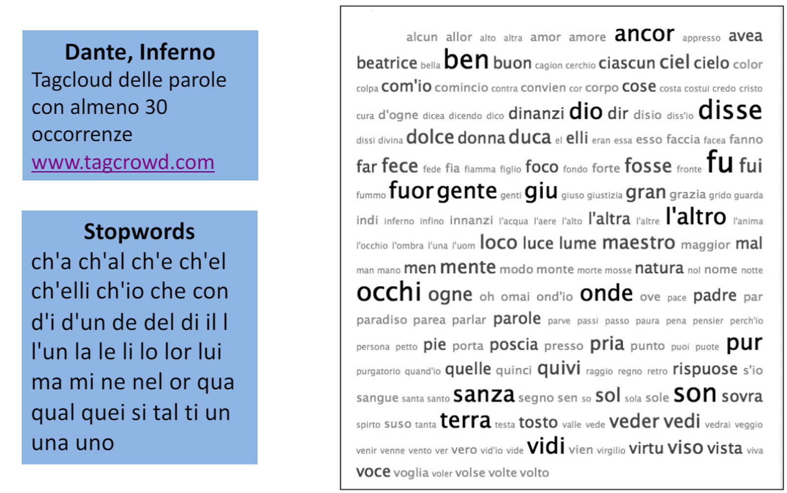

# 2 Maggio

Argomenti: Heymann, Maximal Marginal Relevance, Tag Mancanti
.: Yes

## Tag Mancanti

L’individuazione automatica di un set di `tag` per item che non hanno tag manuali è particolarmente importante per migliorare la `tag-search` o suggerire i `tag` all’utente. Nel caso di item testuali è possibile dedurre tag sulla base solo della rappresentazione testuale dell’item, ad esempio è possibile calcolare il peso di ogni termine e scegliere $k$ termini con il peso più alto, tramite `tf-idf`. Altre misure prevedono di basarsi sulla struttura del documento, ad esempio termini che appaiono nel titolo, nell’anchor text e in grassetto.

## Ricerca tag tramite tf-idf

$$
weight(w)=log\left(f_{w,D}+1\right)\cdot\left(\dfrac{N}{df_w}\right)
$$

Suggerisce `tag` con un alto peso nell’item, funziona solo per item testuali tramite la seguente formula

Dove $f_{w,D}$ è il numero di occorrenze del termine $w$ nell’item testuale $D$, $N$ è il numero totale di item della collezione e $df_w$ è il numero di item della collezione in cui è presente il termine $w$

## Ricerca tag tramite classificazione

Il processo di individuazione dei tag mancanti lo si può vedere come un problema di classificazione dove l’obiettivo è addestrare un classificatore binario per ciascun tag; ciascun classificatore prende in input un item e predice se il tag associato dovrebbe essere applicato o meno all’item. Tale approccio richiede l’addestramento di un classificatore per ogni tag, il problema è che questo approccio è molto pesante ed è necessario avere un training data molto grande.

- `heymann` e altre tecniche usano classificatori `SVM` per predire i tag di pagine web. I classificatori `SVM` si basano su principi geometrici e hanno come obiettivo quello di individuare la superficie di separazione ottimale, ovvero quella che generalizza meglio e fornisce meglio al classificatore la capacità di classificare in maniera corretta anche gli item più complessi.

Gli approcci `tf-idf` e `classificazione` presentano il problema che tutti i tag sono sottomessi all’analisi, anche se ridondanti o simili tra di loro o stem della stessa parola.

---

## Maximal Marginal Relevance - MMR

L’idea della `MMR` è tenere conto della `novelty`, ovvero quanto è innovativo un tag rispetto a quello già presenti e cerca anche di diminuire la ridondanza. La `MMR` considera tutti i tag in maniera indipendente e iterativa cioè ogni volta che aggiunge un tag fa una verifica con quelli già presenti

$$
MMR(t;T_i)=\left(\lambda\cdot Sim_{item}(t,i)-(1-\lambda)\cdot \max_{t\in T_i}Sim_{tag}(t_i,t)\right)
$$

La formula mostrata sopra calcola la `MMR` di un tag $t$ relativo a un item $i$, indicando con $T_i$ l’insieme di tutti i tag assegnati all’item $i$. I 2 termini sono descritti di seguito:

- il primo rappresenta la `relevance`, ovvero quanto è simile il tag all’item $i$
- il secondo rappresenta la `novelty` che tiene conto di quanto il tag $t$ è simile all’intero insieme di tag già assegnati alla risorsa $i$.

Il fattore $\lambda$ rappresenta un trade-off che stabilisce un compromesso tra relevance e novelty

---

## Tag cloud

La `tag cloud` è una rappresentazione visiva dei tag usati e vengono rappresentati con una dimensione proporzionale alla loro importanza
