# 2 Maggio

Tags: Apache Ambari, Apache Atlas, Apache Kafka
.: No

## Data Processing

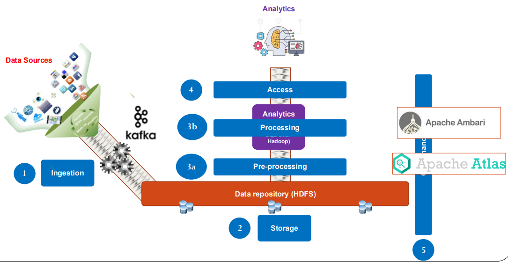

In questa figura vengono mostrati alcune soluzioni che supportano la data ingestion e data governance e sono:

- `apache kafka`
- `apache ambari`
- `apache atlas`

## Apache Kafka

Apache kafka nasce come un sistema di messaggistica pensato per essere veloce e scalabile. Può essere visto come uno strumento che assorbe e ridistribuisce flussi di dati, disaccoppiando la velocità tra chi li produce e chi li consuma.

In realtà kafka ha 3 capacità e sono: `memorizzare`(store) flussi di record, `processare`(process) stream di record man mano che arrivano e la più nota è quella del `publish-and-subscribe` a stream di records. L’ultima capacità permette di pubblicare dei dati che si producono su dei sistemi, cosicché altre entità (player) possono sottoscrivere ai dati che sono stati pubblicati dentro questi sistemi.

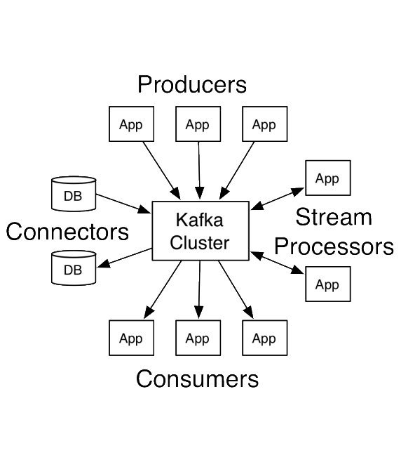

(viene introdotto il concetto di `topics`, vedere il paragrafo successivo)

Kafka ha 4 tipi di API:

- `producer-API`: permette a una applicazione di pubblicare flussi di record a uno o più kafka `topics`
- `consumer-API`: permette a una applicazione di iscriversi a uno o più `topics` e processare flussi di record che sono prodotti da questi
- `streams-API`: consentono di fare elaborazione di stream
- `connector-API`: consentono di far parlare kafka con altre applicazioni come per esempio sistemi di storage esterni

## Apache Kafka - Publish/Subscrive messaging system

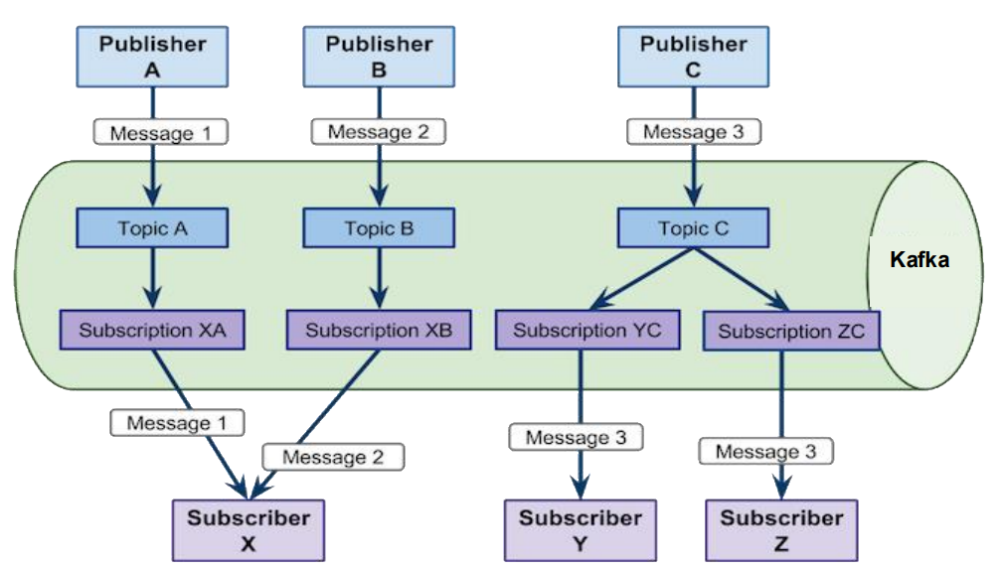

In questa immagine viene mostrato il sistema di messaggistica publish/subscribe dove gli stream di record vengono organizzati in `topic` per classificare i vari tipi di stream.

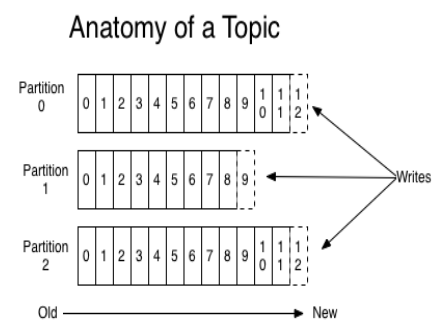

All’interno, un `topic` è partizionato e queste partizioni sono distribuite.

## Producers

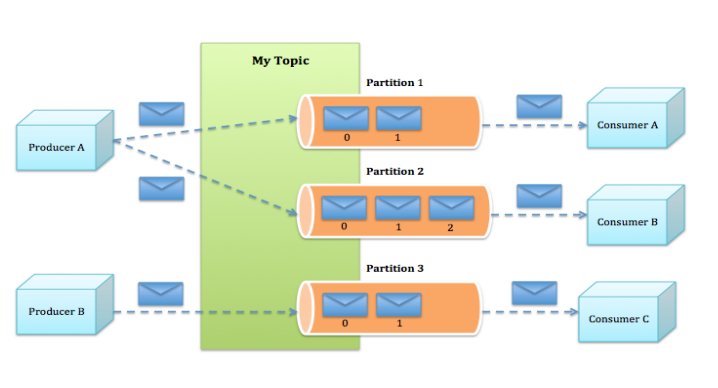

Il `producer` quindi produce questi record che vengono partizionati all’interno di un certo topic. 

I consumatori poi prendono i dati da queste partizioni.

Il meccanismo più semplice di partizionamento dei dati prodotti da un produttore è detto `round-robin` cioè si distribuiscono uniformemente i record sulle varie partizioni. E’ anche possibile fare una classificazione basata sulla tipologia di record, per esempio se il produttore produce record di tipo diverso può decidere di memorizzare i record su partizioni diverse.

## Consumer

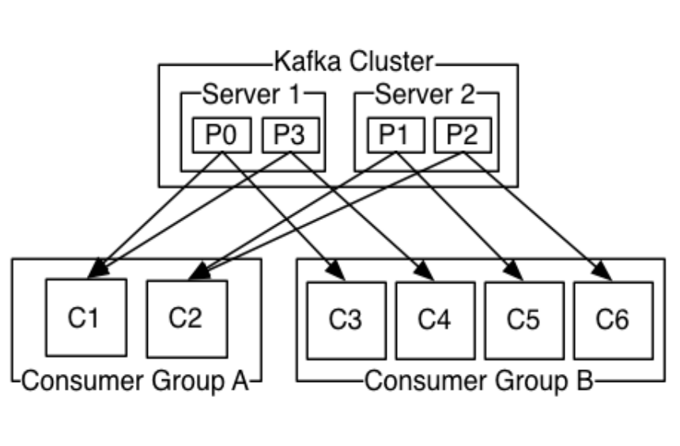

Anche i `consumer` possono essere raggruppati in gruppi e c’è una regola che dice che ciascun record pubblicato è assegnato a un solo partecipante di un gruppo. Si fa questo perché si vuole gestire con kafka 2 modalità: sistema di bilanciamento di code tra vari consumatori, l’altro approccio è quando si fanno gruppi fatti da un solo consumatore e questo funziona come il meccanismo publish-subscribe.

## Kafka cluster

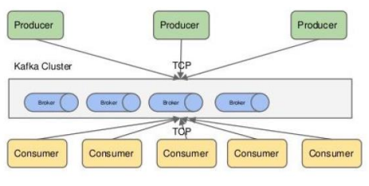

Tipicamente la comunicazione dell’ambiente distribuito avviene tramite protocollo TCP

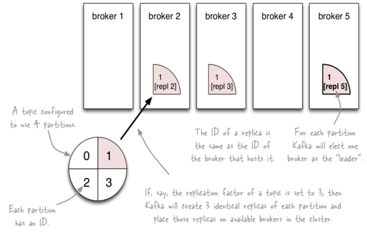

La distribuzione è fatta in maniera simile a quello che succede a HDFS, cioè la sequenza di record viene spezzata in varie partizioni e ogni partizione viene replicata.

Ogni partizione ha un server che si comporta come `leader` e zero o più servers si comportano da `followers`. Quindi chi consuma accede al leader e se questo viene a cadere viene sostituito da un follower diventando il nuovo leader. Ogni server si comporta da leader per alcune partizioni e i follower per altri quindi il carico è molto bilanciato all’interno del cluster.

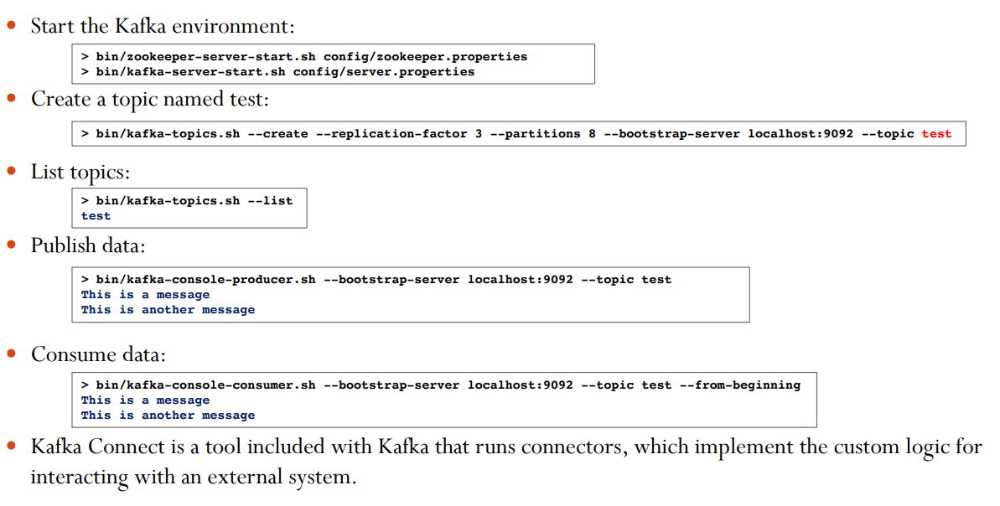

In questa immagine vengono mostrati alcuni comandi per poter utilizzare apache-kafka

## Apache Ambari

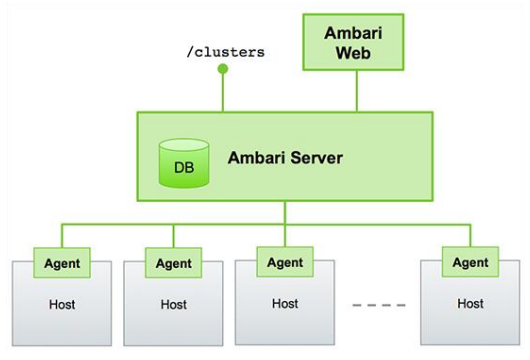

Serve alla installazione, gestione e monitoraggio di `hadoop-cluster`. Il monitoraggio avviene tramite interfaccia web, l’architettura è mostrata in questa immagine

Ha bisogno di un DB di dimensioni relativamente contenute perché sono meta-informazioni.

## Apache Atlas

Atlas ha come obiettivo la creazione di un catalogo di risorse dati, permettendo di classificare, governare e collaborare su queste risorse. È pensato per supportare data scientist, analisti e il team di data governance nella gestione efficace dei dati.

Supporta tipi predefiniti di metadati sia per ambienti Hadoop che non hadoop, permette di definire nuovi tipi personalizzati di metadati, per adattarsi a specifiche esigenze aziendali.

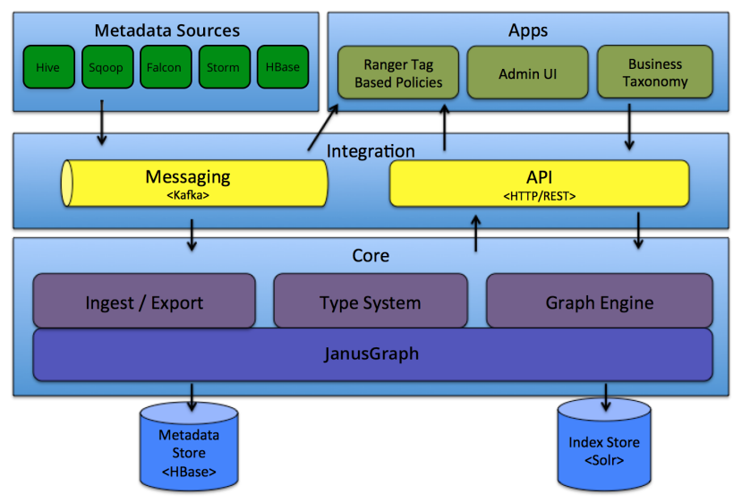

Apache Atlas permette agli utenti di definire un modello per rappresentare gli oggetti di metadati che vogliono gestire.

In questa immagine viene mostrata l’architettura di Atlas.

Apache Atlas, internamente, memorizza gli oggetti di metadati che gestisce utilizzando un modello a grafo. Questo significa che le entità (oggetti) e le loro relazioni sono rappresentate come nodi e archi in un grafo.

### **Vantaggi di questo approccio:**

- Maggiore flessibilità nella rappresentazione dei dati.
- Permette di gestire in modo efficiente relazioni complesse tra gli oggetti di metadati (es. una tabella collegata a un database, che è collegato a un processo ETL, ecc.).

Gli utenti possono gestire i metadati in Atlas in 2 modi principali: API REST e messagistica (Apache Kafka).