# 2 Novembre

Argomenti: BGP peering, Border Gateway Protocol
.: Yes

## Border Gateway Protocol

Quando si fa routing in internet si fa routing `interdominio` (interdomain)

In internet ogni organizzazione o provider è una collezione di router e di LAN che sono sotto il controllo di una singola entità amministrativa dove all’interno di questa entità si usano specifici protocolli di routing. 

Ma internet contiene tante unità amministrative

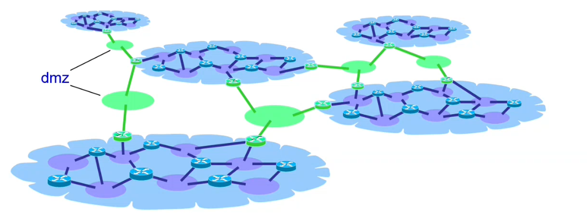

Quando si ha una rete fatta da diverse unità amministrative si devono avere a disposizione dei link che li facciano dialogare. Questi link saranno poi collegati alle `DMZ` cioè zone di demarcazione.

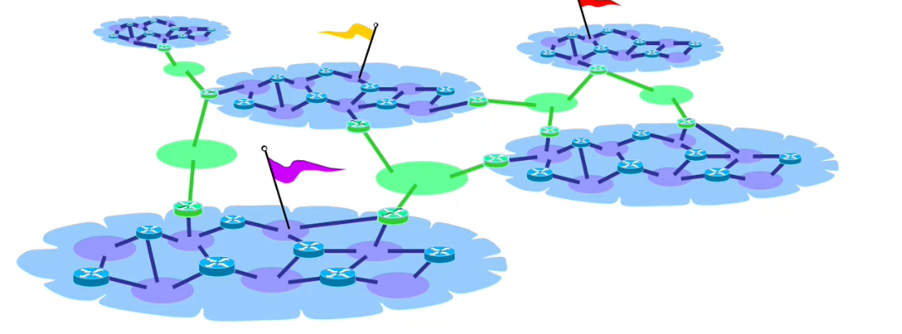

Per avere connettività globale ogni router deve avere una riga che match-a la destinazione di qualunque pacchetto debba essere inoltrato, e questo deve essere vero sia per pacchetti che devono essere mandati localmente e sia a quelli a LAN remoti

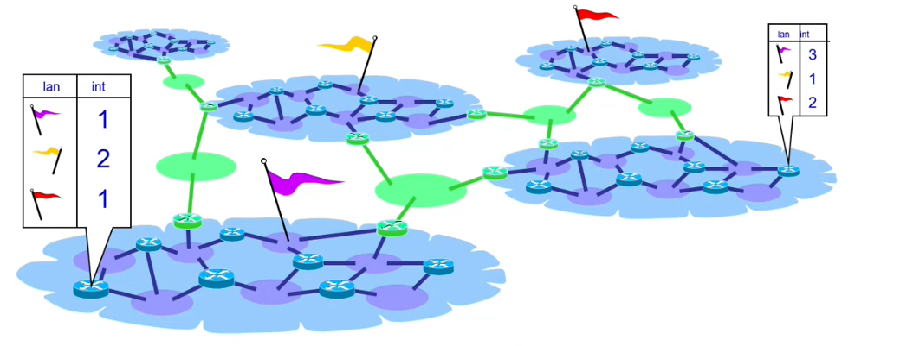

Affinché si abbia connettività globale ci deve essere scritto per qualsiasi router come raggiungere qualunque prefisso

Quindi per fare routing fra diverse entità amministrative si hanno almeno 3 opzioni:

- fare uso di un singolo algoritmo di routing con tutte le organizzazioni adiacenti
- si possono fare le tabelle di routing con i router di frontiera aggiungendo rotte statiche
- oppure si combinano i protocolli interni con un protocollo esterno che ha l’obbiettivo di fare questo lavoro

## Opzione 1 - Algoritmo di routing

Questa scelta è stata fatta all’inizio di internet, in pratica si trasforma tutto in una singola rete. Il problema è la lentezza perché su internet ci sono molti dispositivi e che tutte le organizzazioni sono obbligati ad utilizzare lo stesso algoritmo di routing.

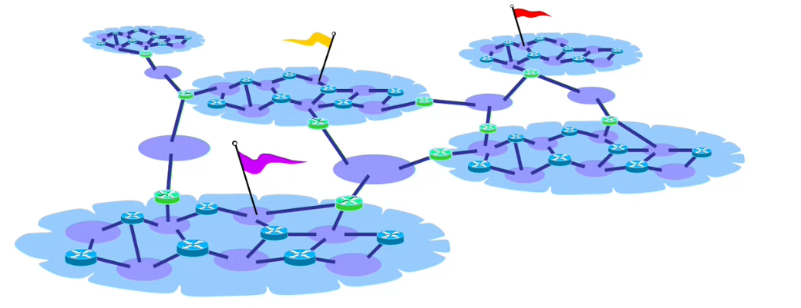

Ci sono 2 tipologie di problemi:

- `tecniche`: su internet ci sono molti dispositivi, le organizzazioni sono obbligate ad utilizzare lo stesso algoritmo di routing
- `politiche`: l’obbiettivo del routing è quello di minimizzare l’utilizzo globale delle risorse della rete, non tiene in conto le “proprietà” dei links

## Opzione 2 - Uso di rotte statiche

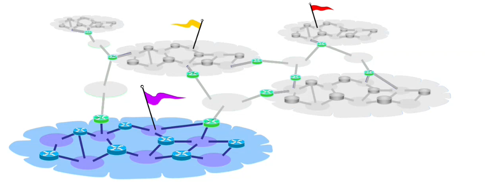

L’approccio è quello di trascurare le zone di demarcazione e la struttura interna dei provider diversi da quello personale

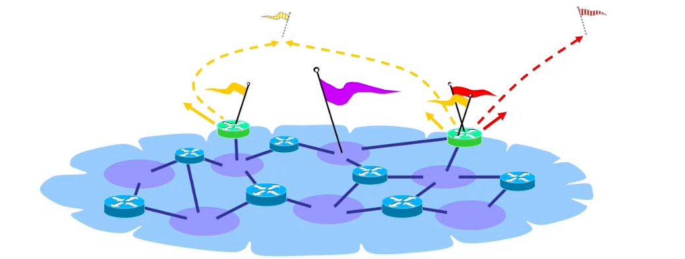

Si sa solamente che i provider sono in quella posizione allora si aggiungono delle rotte statiche ai router di frontiera che dicono quali sono le interfacce giuste per raggiungere il prefisso “giallo” e il prefisso “rosso”

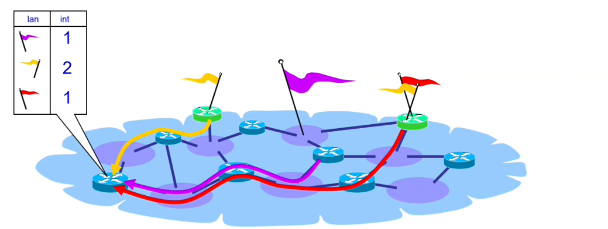

Il protocollo `IGP` che viene utilizzato all’interno del provider distribuirà queste rotte (aggiunte staticamente ai router di frontiera) all’interno della struttura affinché tutti i router interni sappiano come si raggiungono tutte le destinazioni.

Ci sono sempre problemi:

- `tecniche`: le rotte statiche non possono essere gestite in modo dinamico, i fault non possono essere gestite
- `politiche`: non si è certi che il cammino che faranno i pacchetti siano politicamente consistenti

## Opzione 3 - Exterior Gateway Protocol

Si usa un protocollo addizionale che si aggiunge a quelli che già si conoscono. Si può pensare che questo protocollo è quello che si utilizza nelle zone verdi, che si parla nelle relazioni tra provider

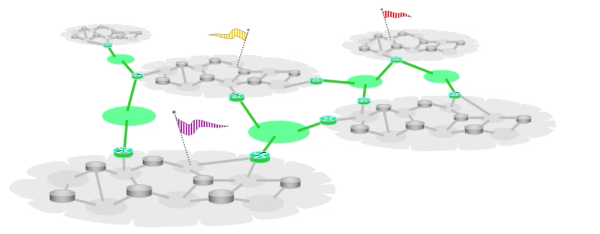

L’approccio è quello di nascondere la visibilità della parte interna delle organizzazioni 

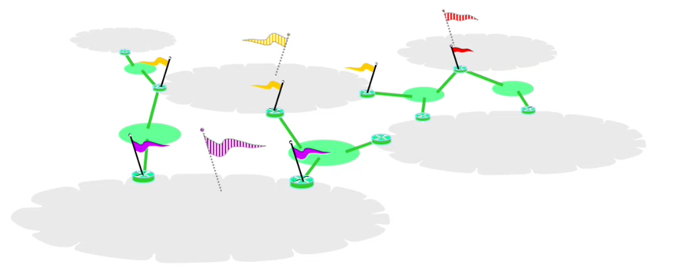

I router di frontiera di una organizzazione rappresentano i propri prefissi interni come se fossero prefissi locali.

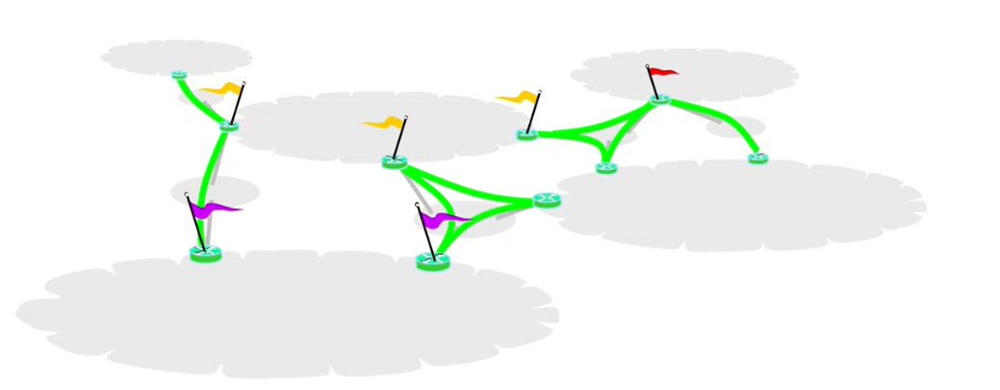

Adesso l’enorme grafo, viene semplificato in termini solo di raggiungibilità fra vicini

I collegamenti sono gestiti attraverso connessioni `TCP`, oppure vengono chiamati `peerings`.

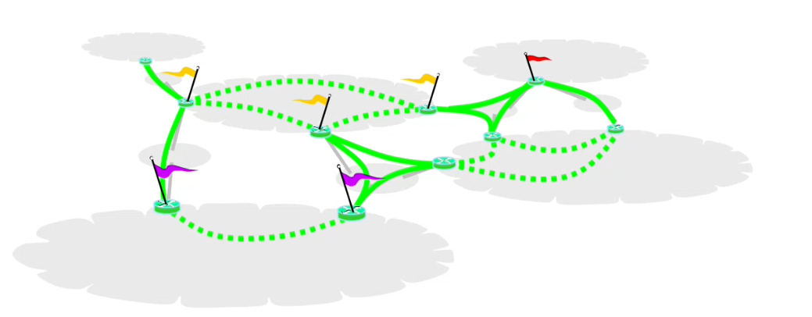

Visto che un provider può avere più router di frontiera è bene che questi router si parlino.

Esiste un altro grafo che rappresenta il dialogo tra i router di frontiera della stessa organizzazione.

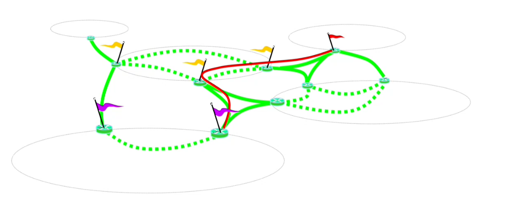

Per esempio se il provider in basso a sinistra apprende come raggiungere il prefisso rosso, si può fare perché i router del dominio giallo passano le informazioni

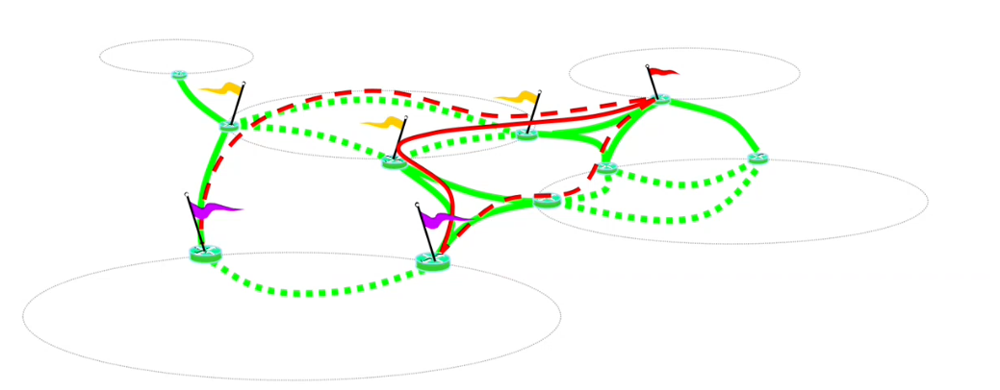

Questo risolve anche problemi politici perché il provider in basso a sinistra potrà scegliere quale strada ritiene più opportuna per raggiungere il prefisso rosso

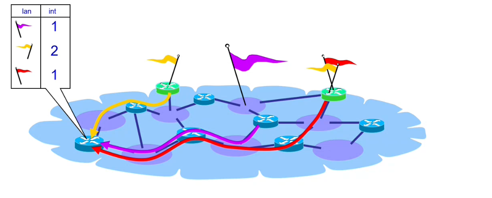

Quindi le rotte vengono iniettate alle rotte interne al provider.

## BGP Peering

Due router che stanno sulla frontiera per scambiare informazioni `BGP` mettono in piedi un `peering`, cioè una connessione `tcp` su una porta specifica (179).

I 2 provider hanno 2 router; mettono su un collegamento tra questi 2 router.

Ci sono 2 tipi di `BGP`:

- `e-BGP`: external BGP, utilizzato da router `BGP` che parlano da diversi provider (qui i router dovrebbero essere connessi direttamente).
- `i-BGP`: internal BGP, parlato da router di frontiera che stanno all’interno dello stesso provider. I router che parlano non è richiesto che siano direttamente connessi.

## BGP router general operation

- Un router BGP apprende delle rotte da altri BGP speaker
- Tra le rotte seleziona quella migliore e la installa nella forwarding table applicando eventualmente delle policy.
- Fatto questo manda a tutti i BGP speaker a quale è collegato la rotta scelta.