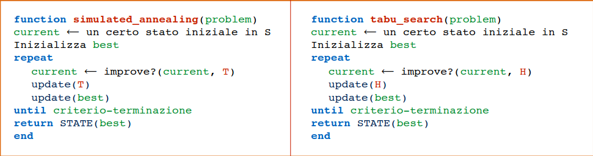

# 2 Novembre

Argomenti: Tabu Search
.: Yes

## Tabu Search

Uno dei metodi più citati per problemi di ottimizzazione.

Molto simile al simulated annealing come struttura. Ad alto livello di astrazione i due algoritmi possono infatti essere scritti allo stesso modo. 



In Tabu Search `improve?(current, H)` restituisce uno stato “accettabile” dal neighborhood di current che non è necessariamente migliore di current, ma la sua accettazione è basata sulla storia **H** della ricerca.

### Idea di base

L’idea alla base del Tabu Search è molto semplice:

- Una “memoria” forza l’algoritmo ad esplorare nuove aree dello spazio di ricerca → gli stati esaminati (tabu) vengono memorizzati e poi evitati.
- Accettazione **deterministica** di soluzioni “peggiori” per sfuggire da ottimi locali. Di solito Tabu Search fa mosse verso stati “peggiori” solo quando è bloccato in un ottimo locale per uscirne.

### Tabu Search - Versione 1

```jsx
function tabu_search(problem)
		Definizione tabu tenure   //massimo numero di iterazioni in cui un valore tabu
		Inizializza la tabu list M
		current ⟵ un certo stato iniziale in S
		Inizializza best
		repeat
				Calcolo del neighborhood N di current
				current ⟵ migliore stato ∈ non_tabu_N
				update(M)
				best ⟵ migliore(current, best)
		until condizione-terminazione
return STATE(best)
```

Questo approccio potrebbe però essere troppo restrittivo: uno degli stati tabu potrebbe avere una valutazione particolarmente alta, anche migliore del best corrente e di tutti gli stati non-tabu. In questi casi potrebbe essere conveniente derogare dalla regola del tabu ed accettare come stato successore lo stato con questa valutazione alta (**override** della classificazione tabu)

→ **aspiration criterion**

### Tabu Search - Aspiration Criterion

```jsx

function tabu_search(problem)
Definizione tabu tenure   //massimo numero di iterazioni in cui un valore tabu
Inizializza la tabu list M
current ⟵ un certo stato iniziale in S
Inizializza best
repeat
	Calcolo del neighborhood N di current
	Calcolo di A
	current ⟵ migliore stato ∈ {non_tabu_N U A}
	update(M)
	best ⟵ migliore(current, best)
until condizione-terminazione
return STATE(best)
```

Dove *A* è l’insieme degli stati tabu che soddisfano il criterio.

### Altri possibili criteri

- E’ possibile scegliere lo stato successivo con un approccio `probabilistico`, con il quale gli stati del neighborhood con valutazione migliore hanno una probabilità maggiore di essere selezionati.
- E’ possibile cambiare il `tabu tenure` durante la search
- E’ possibile collegare il tabu tenure alla dimensione del problema

### Uso della frequency-based memory

Altra opzione interessante. La memoria *M* discussa finora può essere definita come `recency-based memory`. A questa aggiungiamo la `frequency-based memory`.