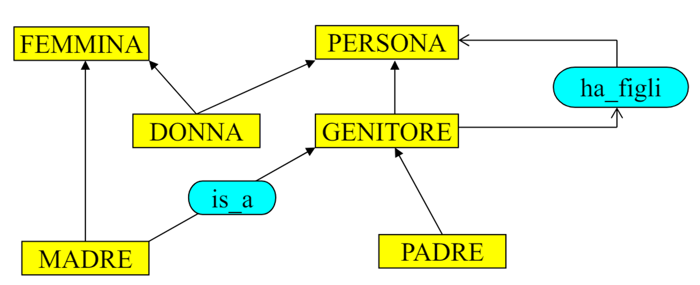

# 30 Aprile

Argomenti: Manual Indexing, Manual Tagging, Social Search, Tag Search
.: Yes

## Social Search

La `social-search` sfrutta tutte le informazioni che l’utente rivela attraverso le sue interazioni con il web, in particolare il ruolo attivo degli utenti nelle applicazioni di social search è in forte contrasto con i paradigmi e i modelli della search standard, perchè trattano ciascun utente nello stesso modo e ne limitano le interazioni alla sola sottomissione della query.

## Tag utenti e indicizzazione manuale

Molti siti web di social media consentono agli utenti di assegnare tag ad item, questi tag non classificano l’item con regole ben precise ma riflettono il punto di vista di chi definisce l’item.

Si deve fare la distinzione di 2 parole:

- `tassonomia`:  vocabolario + struttura
- `ontologia`:  tassonomia + (relazioni, vincoli e regole)

Per ontologia si intenge quindi una rete semantica di concetti in un dominio e descrizione delle relazioni che intercorrono fra di essi

L’ideale sarebbe poter indicizzare in questo modo tutte le informazioni a disposizione; data l’impraticabilità di effettuare tale indicizzazione manualmente, i motori di ricerca si avvalgono di tecniche di `automatic-indexing`. 

Queste tecniche consistono nell’assegnare identificatori ai documenti durante la costruzione degli indici, però visto che questo processo è automatico la qualità e l’accuratezza della indicizzazione possono risultare assai minori di quelle del manual indexing. I vantaggi dell’indexing automatico è che ogni parola nel documento è indicizzata senza tralasciare nulla e non si hanno errori di indicizzazione.

Quello che si fa quindi per complementare le 2 forme di `indicizzazione` manuale e automatica è lasciare agli utenti l’opportunità di taggare manualmente gli item.

Ci sono molte differenze tra `manual-indexing` e `manual-tagging`:

- I tag sono scelti non sempre per scopi di ricerca
- i tag sono generati da utenti non necessariamente esperti
- non c’è quasi nessun controllo di qualità sui tag assegnati dagli utenti
- i tag sono intrinsicamente noisy e inesatti
- Tag scelti da *folksonomie,* classificazioni dinamiche e influenzati dalla comunità. Frutto di uno sforzo creativo da parte dell’utente, tengono conto dei cambiamenti dell’ambiene, perciò responsive rispetto al contesto.

## Tagging

I `tag` non sono una tassonomia, ma riflettono il punto di vista di chi li associa a una risorsa, che può essere sia chi carica il contenuto sia chi poi vi accede. 

I tag di un utente possono essere di diversi tipi, di seguito sono elencate i vari tipi:

- `content-based`: descrivono il contenuto di un item
- `context-based`: descrivono il contesto di un item
- `attribute`: descrivono attributi impliciti di un item
- `subjective`: descrivono un item in maniera soggettiva
- `organizational`: aiutano a organizzare gli item

Con il tempo il `social-tagging` fa emergere la visione della comunità

## Tag search

Il vantaggio dei `tag` è che in alcuni contenuti non testuali si aggiunge una dimensione testuale, questo può risultare molto utili nel searching. Cercare in una collezione di item taggati in maniera collaborativa è tuttavia complicato perchè i tag sono rappresentazioni sparse di item complessi.

I metodi classici di information retrieval falliscono se usati in maniera `naive` o restituiscono prestazioni basse. Occorre quindi risolvere il `vocabolary mismatch problem` fra query e tag, ovvero parole che non coincidono ma possiedono lo stesso significato

Con l’espansione dei tag, la tag search rimane un’operazione comunque complessa. I tag sono intrinsicamente noisy e inesatti, essendo creati da utenti possono essere *junk-tag*. Molti item possono non essere taggati, il che li rende invisibili a qualsiasi sistema di ricerca text-based, per tali item sarebbe utile individuare automaticamente i tag mancanti e usarli per migliorare la recall della search.
