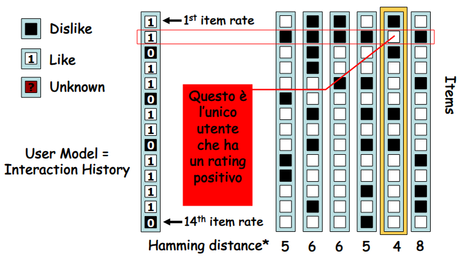
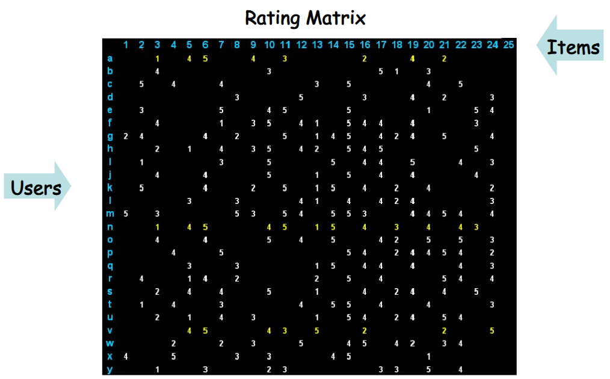
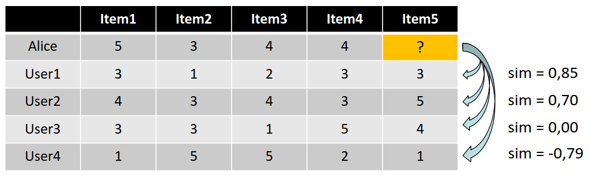

# 30 Maggio

Argomenti: Collaborative Filtering, Pure CF, User Similarity, User-Based Nearest-Neighbor CF
.: Yes
Description: Collaborative Filtering

## Collaborative Filtering

L’idea principale degli approcci di `collaborative-recommendation` è sfruttare informazioni riguardanti il comportamento passato o le opinioni di una comunità di utenti per predire quali item potranno piacere a loro oppure all’utente attuale.

L’approccio di questo metodo è usare la `wisdom-of-crowds` cioè si sfruttano le risposte di un vasto gruppo eterogeneo di persone; si assume però che gli utenti diano i loro rating per ogni item nel catagolo, si assume anche che i clienti che avevano gusti simili in passato avranno gusti simili anche nel futuro.

## Pure CF Approach

Il `pure-cf` non richiede alcuna conoscenza riguardante gli item; in input prende una `rating-matrix` di rating user-item, in output restituisce 2 elementi: il primo è un numero che indica quanto un item piacerà all’utente attuale il secondo è una lista dei migliori $N$ item raccomandanti. Naturalmente la lista non dovrebbe contenere item che l’utente attuale ha già visionato o acquistato.

## User-Based Nearest-Neighbor CF Approach

L’idea è che dati in input la `rating-matrix` e l’`ID` dell’utente attuale, si identificano altri utenti (`peer user`) che hanno avuto in passato preferenze simili a quelle dell’utente attuale per calcolare per ogni item $p$ del catagolo che l’utente attuale $u$ non ha ancora visionato, una predizione sulla base dei rating per $p$ item espressi dai `peer-user` di $u$. Una volta fatto questo si raccomandano i `best-rated`.

In questa immagine viene mostrato come vengono confrontati 2 utenti data la loro cronologia di interazioni cioè gli item che sono piaciuti

In generale si ha questo tipo di `rating-matrix` 

Le domande da porsi sono il come misurare la `similarità fra utenti`, quanti neighbor si devono `considerare` e come si può generare una `predizione` a partire dai rating dei neighbor.

Quest tecnica funziona bene se ci sono almeno 50 co-rated item, funziona bene anche quando il database di rating è più sparso.

## User Similarity - Similarità fra utenti

Per misurare la similarità fra utenti si usa la `Pearson-Correlation-Coefficient`:

$$
sim(a,b)=\dfrac{\sum_{p\in P}\left(r_{a,p}-\overline{r}_a\right)\left(r_{b,p}-\overline{r}_b\right)}{\sqrt{\sum_{p\in P}\left(r_{a,p}-\overline{r}_a\right)^2}\cdot \sqrt{\sum_{p\in P}\left(r_{a,b}-\overline{r}_b\right)^2}}
$$

Quello che fa è calcolare la similarità di 2 utenti $a$ e $b$, sfrutta poi i seguenti dati:

- $r_{a,p}$: rating dell’utente $a$ per l’item $p$
- $P$: set di item valutati sia da $a$ sia da $b$
- $\overline{r}_a$: rating medio dell’utente $a$

Il coefficiente di correlazione di Pearson può assumere valori fra $-1$ (strong negative correlation) e $+1$ (strong positive correlation).

Se si vuole determinare se ad Alice piacera o non piacerà l’item 5, che lei non ha ancora valutato o visionato si usa il coefficiente di correlazione di pearson

## Pearson Correlation - Neighbor che si considerano

Si devono fare alcune osservazioni, cioè che alcuni utenti tendono ad assegnare solo rating alti, mentre altri non assegnano mai un rating massimo ad alcuni item, il `coefficiente` tiene conto del fatto che gli utenti interpretano la scala di rating in maniera differente sottraendo le medie di rating degli utenti nel calcolo al fine di rendere gli utenti comparabili fra loro.

## Predizioni - Generazione di una predizione

Per fare una predizione per l’item di interesse, occorre decidere quali dei rating dei neighbor considerare e con che grado valutare le loro opinioni.

Una possibile formula per calcolare una predizione per il rating dell’utente $a$ per l’item $p$ che consideri anche la `proximity` degli $N$ neighbor più vicini e il rating medio $\overline{r}_a$ dell’utente $a$ è la seguente:

$$
pred(a,p)=\overline{r}_a+\dfrac{\sum_{b\in N}sim(a,b)\cdot(r_{b,p}-\overline{r}_b)}{\sum_{b\in N}sim(a,b)}
$$

Nelle applicazioni real-world di norma si hanno le seguenti problematiche:

- i database di rating sono molto più ampi e possono comprendere molti user e item
- la rating matrix è solitamente sparsa in quanto ogni utente di norma valuta solo un sottoinsieme molto piccolo di item
- si ha il problema della `cold-start`, cioè non si sa cosa raccomandare ai nuovi utenti perche non si hanno feedback o non si sa come trattare nuovi item per i quali non esistono i rating

## Migliorare le Metriche di Predizione

Non tutti i rating dei neighbor possono essere considerati ugualmente validi, il problema è che è più informativo l’informazione su item che in comune non piacciono. Sono state proposte 2 soluzioni:

- si applica una funzione di trasformazione, detta `inverse-user-frequency`, ai rating deli item la quale riduca l’importanza relativa dell’accordo sugli item che piacciono universalmente.
- si usa il `variance-weighting-factor` il quale consente di incrementare l’influenza degli item che hanno un alto valore di varianza nei rating, cioè item sui quali esistono opinioni controverse
- un altro modo è fare `fine-tuning` dei pesi di predizione, cioè si da più peso ai neighbor simili cioè quelli che hanno valore di similarità vicino a $1$ e $-1$, questo può essere ottenuto moltiplicando il valore dei pesi dei neighbor per un fattore costante $\rho$

Non sempre si hanno i neighbor che hanno una correlazione positiva con l’utente attuale, se si è nel caso di correlazione negativa allora si ha un peggioramento delle prestazioni in termini di efficienza e peggioramento dell’accuratezza delle raccomandazioni. Quindi quello che si fa per ridurre la dimensione del neighborhood è o definire un valore minimo specifico di soglia per la similarità fra utenti oppure limitare la dimensione a un numero fisso $k$ e considerare solo i $k$ nearest neighbor.

- per il valore di soglia di similarità ci sono potenziali problematiche:
    - se è troppo alta la dimensione del neighborhood può essere molto piccola per molti utenti
    - se è troppo bassa le dimensioni del neighborhood possono non essere ridotte in maniera significativa
- per il valore scelto per $k$ ci sono i seguenti problemi:
    - se è troppo alto, troppi neighbor con simlarità limitata possono apportare rumore nelle predizioni
    - se $k$ è troppo piccolo la qualità delle predizioni può risentirne negativamente

---

## Approcci Memory-Based e Model-Based

Le tecniche di raccomandazione collaborativa sono classificate in `memory-based` e `model-based`. La tecnica tradizionale `user-based` è detta `memory-based` poichè il database di rating originale è conservato tutto in memoria e usato direttamente per generare le raccomandazioni.

Negli approcci `model-based` i dati grezzi sono prima processati offline o impiegati per apprendere un modello; per fare predizioni sono utilizzati solo i dati processati o il modello appreso.

Il problema è che i `memory-based` sono teoricamente più precisi perche sono disponibili i dati completi per generare le raccomandazioni ma hanno problemi di scalabilità.