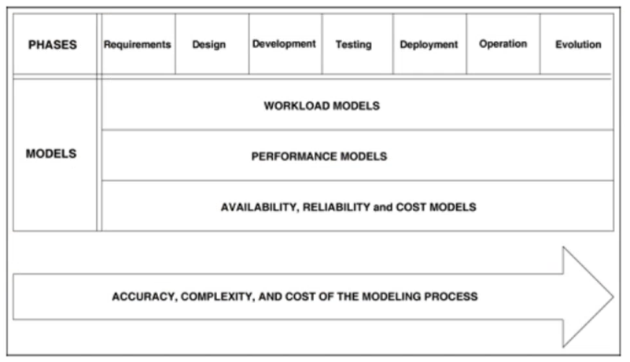
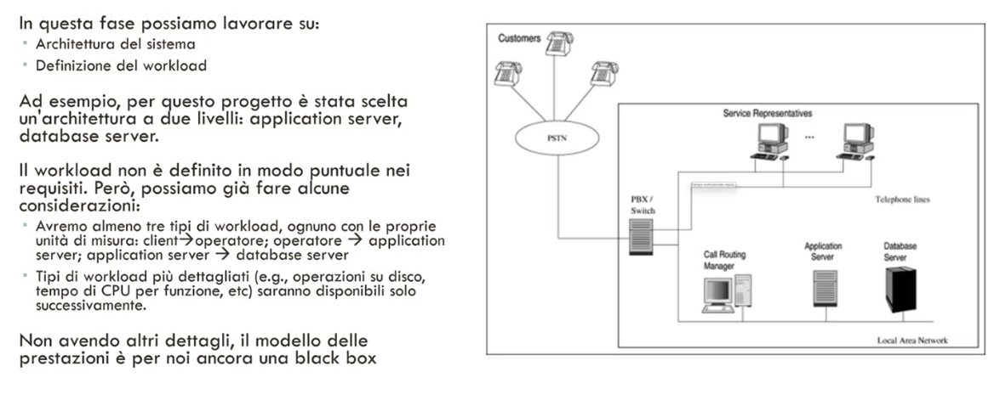
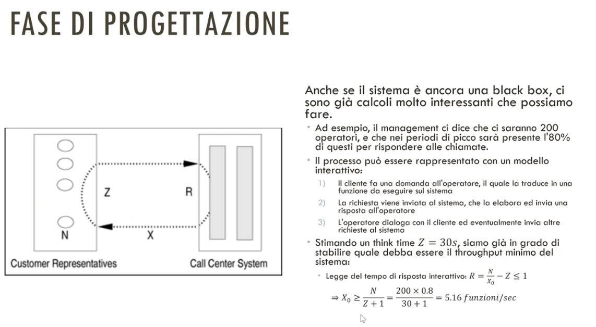
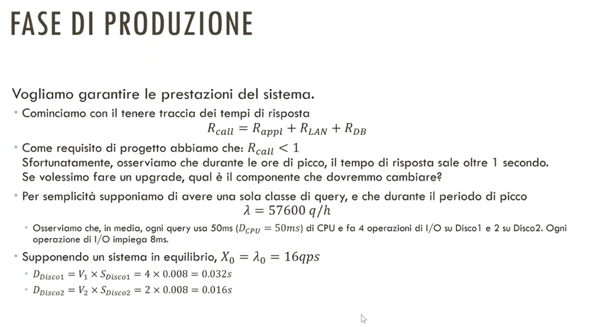
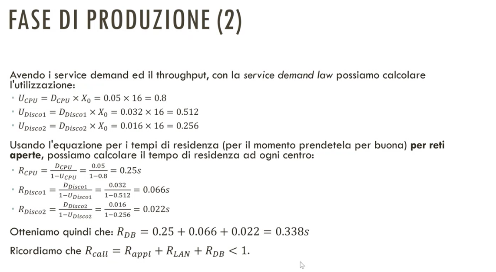
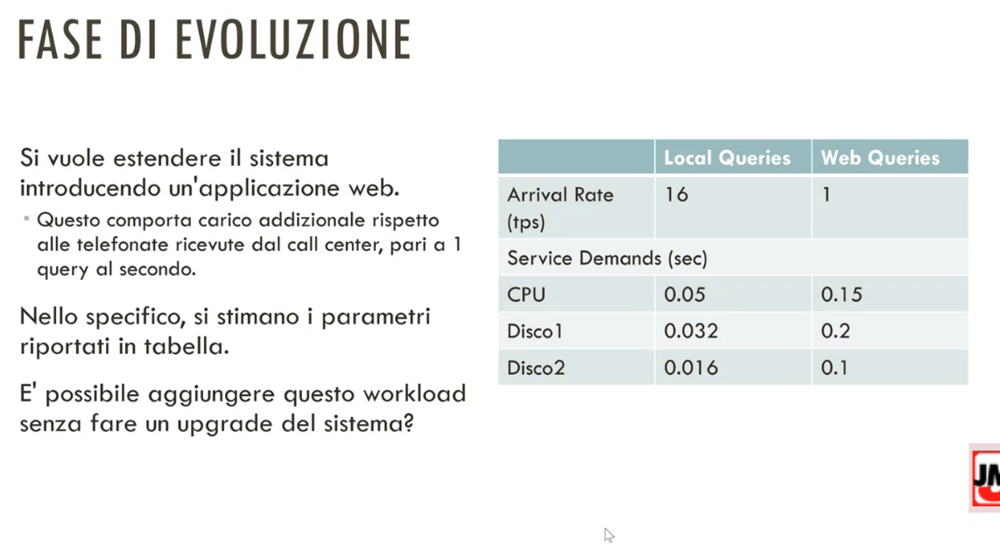

# 30 Maggio 2025

Text: Ingegneria delle prestazioni

## Ingegnerizzazione delle prestazioni

L’ingegneria delle prestazioni si occupa, in ogni fase del ciclo di vita di un sistema di sviluppare strategie pratiche aiutino nella predizione delle prestazioni che un sistema può raggiungere si occupa anche nel fornire raccomandazioni per raggiungere il livello di prestazione ottimale

Per fare questo si fanno delle misurazioni sulle metriche di sistema e si cerca di capire quale è il workload al quale il sistema è soggetto. Dopodichè si fa lo sviluppo e validazione di un modello di workload che catturi le caratteristiche del workload reale e un modello analitico e/o simulativo che possa predire accuratamente le prestazioni del sistema.

In questa immagine è mostrato le fasi del processo di modellamento

In questa immagine viene mostrato la fase di analisi dei requisiti

Per la `fase di sviluppo` ogni funzione invocata dall’operatore esegue in media 2.2 query sul database, questo vuol dire che il troughput minimo del DB dovrà essere pari a:

$$
X_{DB}=V_{DB}\times X_0=2.2\times5.16=11.35\text{ tps}
$$

