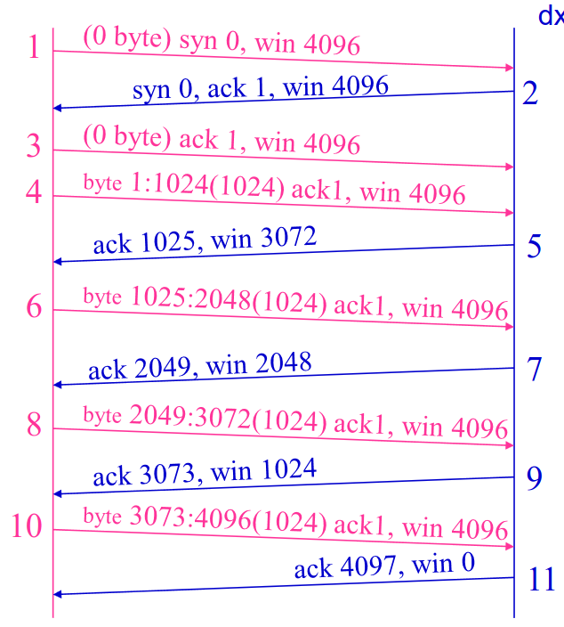
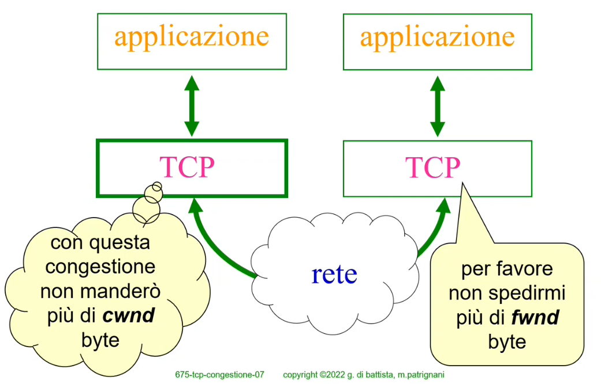

# 30 Novembre

Argomenti: Algoritmo di Clarke, Algoritmo di Nagle, Controllo di Congestione, Richiami su TCP, Silly Window
.: No

## Strategie di TCP per aumentare l’efficienza

- ridurre il numero di pacchetti `inviati`, a parità di dati si riduce l’overhead cercando di cumulare il contenuto di un piccolo segment in un segment più grande oppure ridurre il numero di acknowledgment oppure ridurre le notifiche per le variazioni delle finestre
- ridurre il numero di pacchetti `perduti`, per evitare la formazione di congestioni

## Gradi di libertà di TCP

Il TCP mittente può aspettare che i dati si accumulino prima di inviarli mentre il TCP destinatario può aspettare che i dati si accumulino prima di riscontrarli ma la politica di trasmissione adottata può influenzare in modo significativo le prestazioni di TCP.

## Richiamo su TCP - la finestra di controllo di flusso

L’uso del campo windows nell’intestazione del segment TCP specifica il numero di byte a partire dal byte indicato nell’ack che il ricevente è disponibile ad accettare

Questo campo è di 16 bit quindi la finestra massima è di 65535 byte

## TCP per servizi interattivi

I servizi interattivi prevedono scambi frequenti di piccole quantità di dati, chiaramente l’efficienza della rete diminuisce perchè si aumenta l’overhead, un tipo servizio interattivo è per esempio telnet (ssh) su un terminale remoto

## TCP per servizi interattivi - tecnica dei riscontri ritardati

Gli ack e le notifiche di variazione della finestra di controllo di flusso sono ritardati di circa 200-500 ms in questa maniera molti byte possono essere cumulati, in parole più semplici si accumulano diversi byte riscontradoli tutti insieme e poi notificare la variazione di finestra di controllo di flusso una volta sola.

## Algoritmo di Nagle

- `scopo`: ridurre il numero di pacchetti che viaggiano dal produttore al consumatore del flusso nel caso in cui i produttore produca pochi byte alla volta
- `funzionamento`: si trasmette il primo troncone di dati quando arrivano (senza aspettare) e si lasciano accumulare gli altri byte nel buffer di uscita, il segment successivo è inviato solo quando una di queste condizioni è verificata:
    - il precedente è stato riscontrato
    - è stata raggiunta nella coda di spedizione la dimensione massima di un segment

## Sindrome silly window

Lo scenario di silly window consiste nell’avere un’applicazione `mittente` che produce molti dati e un’applicazione `ricevente` che usa i dati che arrivano un byte alla volta.

Il problema è che il buffer di ingresso del ricevente è pieno; quando l’applicazione ricevente legge un byte il TCP ricevente notifica la variazione della finestra di controllo di flusso

## Algoritmo di Clark

Per risolvere la sindrome di silly window si usa l’algoritmo di Clark, in pratica le variazioni di finestra vanno notificate al mittente solo quando la finestra raggiunge metà dell’ampiezza massima o la massima dimensione del segment negoziata all’inizio della connessione

- I problemi affrontati da Nagle e Clark sono complementari:
    - `Nagle`: l’applicazione mittente invia un byte alla volta, quindi TCP ha il buffer di uscita vuoto
    - `Clark`: l’applicazione ricevente legge un byte alla volta, quindi TCP ha il buffer di ingresso pieno

---

## Controllo di congestione

Quando ai router arrivano troppi pacchetti i router sono costretti a scartarne alcuni, inoltre i pacchetti sono soggetti a delay eccessivo, perchè devono rimanere molto tempo nelle code.

`TCP` contribuisce attivamente al controllo della congestione della rete con apposite politiche di trasmissione. La prima cosa che deve fare TCP per partecipare alle politiche di controllo di congestione è quella di accorgersi che la rete è congestionata tramite la perdita di pacchetti, in pratica se tra i pacchetti che spedisce per alcuni non arrivano riscontri prima del timeout allora si può pensare che sia congestione.

Per la congestione `TCP` usa una seconda finestra per il controllo della congestione, quindi gestisce 2 finestre:

- `fwnd`: finestra di controllo di flusso, sarebbe il campo window nei pacchetti `TCP`
- `cwnd`: finestra di controllo di congestione, serve ad auto-limitare il mittente, quindi quando la rete è congestionata TCP diminuisce l’ampiezza di questa finestra quando invece non è congestionata allora TCP aumenta l’ampiezza di questa finestra.