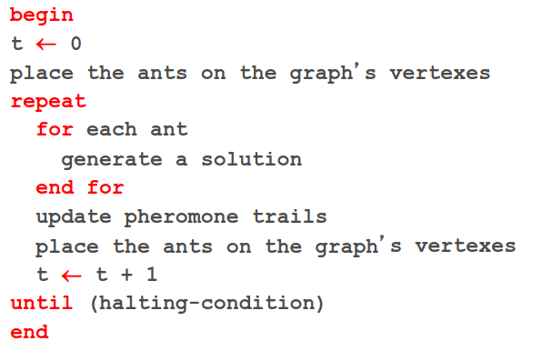

# 30 Novembre

Argomenti: Ant Colony Optimization
.: Yes

## Ant Colony Optimization (ACO)

- Una popolazione di Ant artificiali cooperano per trovare la soluzioni migliore ad un problema scambiandosi informazioni con uno schema simile a quello delle formiche reali.
- Algoritmo iterativo basato su $N$ agenti (o `Ant`) e a ogni iterazione:
    - ogni Ant costruisce una soluzione visitando i vertici del grafo
    - la scelta di un vertice è basata su un approccio stocastico funzione della quantità di ferormone rilasciata nelle passate esplorazioni.
    - alla fine di una iterazione, il ferormone viene aggionato sulla base della qualità della soluzione trovata dallal popolazione di Ant in modo da privilegiare nelle successive esplorazioni i percorsi giudicati migliori.

Pseudocodice dell’algoritmo

## Generazione di una soluzione

Per generare una soluzione, ovvero una sequenza di vertici, ogni Ant costruisce un percorso tra tutti quelli possibili. Considerando un generico vertice $i$, la probabilità che una Ant segua l’arco $i$ a $j$ al ciclo $t$ è pari a:

$$
p_{ij}(t)=\dfrac{\tau_{ij}(t)^\alpha \eta_{ij}(t)^\beta}{\sum_{n}\tau_{in}(t)^\alpha\eta_{in}(t)^\beta}
$$

- $\Sigma$ si estende a tutti i vertici raggiungibili da $i$
- $\tau_{ij}$ è la quantità di ferormone accumulata sull’arco $\left\langle i,j \right\rangle$
- $\eta$ è una eventuale funzione che può essere impiegata per scenari specifici
- $\alpha$ e $\beta$ sono 2 costanti.

## La funzione euristica e i parametri $\alpha$ e $\beta$

Nel caso del problema del commesso la funzione $\eta$ viaggiatore può essere definita nel seguente modo:

$$
\eta_{ij}=\dfrac{1}{d_{ij}}
$$

Dove $d_{ij}$ è la distanza tra le 2 citta $i$ e $j$. L’euristica stima il percorso per raggiungere lo stato ottimale unicamente in funzione della successiva città da esplorare, perciò considerando solo informazioni sulla frontiera

I valori $\alpha$ e $\beta$ modulano i 2 contributi, rispettivamente della informazione ricavate dalle passate esplorazioni $\tau(\cdot)$ e dal criterio usato come euristica per raggiungere lo stato ottimale $\eta(\cdot)$ pesando maggiormente l’uno o l’altro.

## Aggionamento del ferormone

Al termine di un ciclo si aggiornano le tracce di ferormone in funzione della qualità delle soluzioni trovate dalle Ant. La traccia di ferormone da $i$ a $j$ nell’istante $t+1$ viene aggiornata nel seguente modo:

$$
\tau_{ij}(t+1)=(1-\rho)\tau_{ij}(t)+\sum_{k}\Delta\tau_{ij,k}
$$

dove $\rho<1$ è il `tasso di evaporazione` e la sommatoria $\Sigma_k$ si estentde a tutte le Ant. L’evaporazione evita l’accumularsi indefinito di ferormone, sopratutto nei casi di variazioni positive dovute alla presenza di massimi locali che possono generare soluzioni non ottimali.