# 30 Ottobre

Argomenti: 802.1s, SDN
.: Yes

## IEEE 802.1s - Multiple Spanning Tree Protocol

Avere `MSTP` permette di avere più scelte per il calcolo dello spanning tree cosi da ottimizzare e bilanciare le risorse, risolve anche problemi di disconnesione delle VLAN.

Detto in parole formali prevede la presenza contemporanea di più istanze di spanning tree sulla stessa LAN.

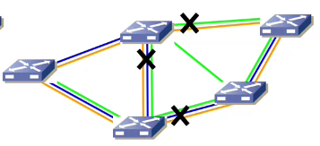

In questo caso quelli della LAN-blu di sinistra non possono comunicare con quelli di destra, questo è un motivo pratico per cui si hanno bisogno di multipli spanning tree

Questo significa anche che per  `trunk-1q` completi non implica la scelta ottimale dello spanning tree corrente.

### Calcolo dello spanning tree:

- elezione del root bridge di ogni istanza
- le `bpdu` sono inviate a tutte le `LAN` senza essere influenzate dalle altre `bpdu` delle altre istanze
- una porta può essere in blocco per una instanza e in forwarding per un altra.

### Topologia stellare

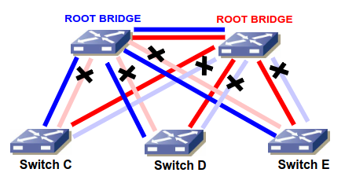

- gli switch superiori sono quelli di backbone
- gli switch inferiori sono quelli di distribuzione

Con questa tipologia si può fare il bilanciamento di carico sui link e sui root bridge.

### Topologia ad anello

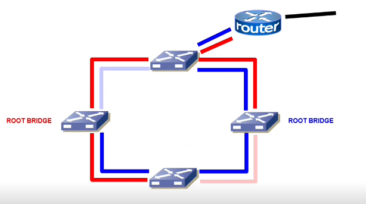

Si possono trovare su data centers per servizi specifici, come per esempio la distribuzione di servizio relativo alla sicurezza.

---

## Software Defined Networking - SDN

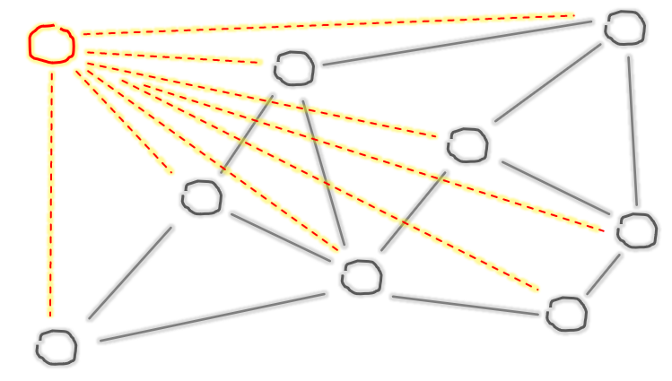

Si ricorda che nel routing `centralizzato` si ha un routing-control-center che elabora la tabella di instradamento. Il problema è che si ha molto traffico intorno al control-center.

Questo protocollo divide fisicamente il `control plane` dal `data-plane`. In pratica le funzioni del `control-plane` sono centralizzate in un server che determina per ogni flusso di rete la sua tabella di instradamento.

Utilizzando SDN il routing è calcolato da un software eseguito sul server, al contrario del routing tradizionale dove gli apparati, distribuiti nella rete sono configurati

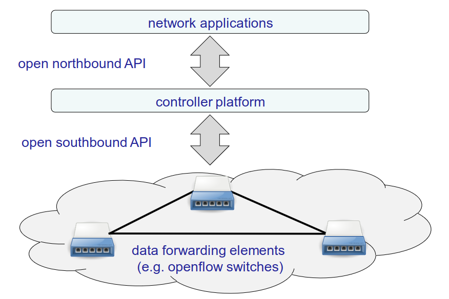

 Architettura per SDN

---

## OpenFlow

Protocollo che implementa il paradigma SDN ed è basato sull’idea di flusso, ci si ricorda che SDN ha 2 componenti principali:

- `controller`: esegue il software di control plane
- `datapath`(switch): fa solo forwarding del traffico

La comunicazione tra controller e datapath viene fatta dallo standard OpenFlow

In questo esempio viene mostrata una tabella di flussi dove la prima riga dice:

- sourceIP 10.10.10.4 - Drop, questo vuol dire che quando si fa il matching di un pacchetto in `arrivo` e l’indirizzo IP del mittente è 10.10.10.4 allora questo deve essere buttato

mentre la seconda riga dice:

- se l’indirizzo IP di `destinazione` è 10.10.10.54 allora bisogna fare il forward alla port 2

OpenFlow dice che se il pacchetto non ha fatto matching con nessuna delle righe nella tabella di flussi allora bisogna chiedere al `controller` affinché lui possa prendere una decisione e mandare allo switch una nuova entry nella tabella di flussi per dire cosa bisogna fare per quel pacchetto

viene quindi installata, nella tabella di flussi, la riga che dice che se il sourceIP è 10.10.10.1 allora bisogna mandarlo alla port 2

- Gli attori in `OpenFlow` sono gli switch e il controller

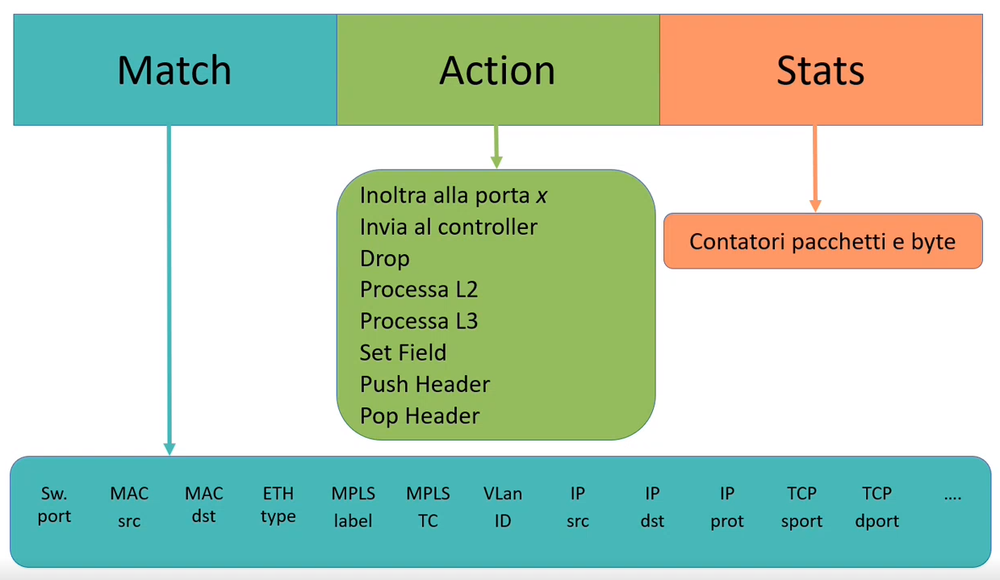

Questo disegno mostra tutti i tipi di match e di action

- una `flow table` è composta da `flow entries`:
    - flow entry: <match,action,stats> → <`port 1`,forward to `port 2`, 184bytes-14packets>
    - se il pacchetto si riceve alla `port 1` allora si fa forward alla `port 2`, (stats dovrebbe rappresentare le caratteristiche del traffico che fino a quell’istante ha fatto match la flow entry)
    

## Timeout delle entry

Ogni `entry` della `flow-table` ha 2 timeout:

- `idle-timeout`: la entry scade dopo un tempo `t` di inattività
- `hard-timeout`: la entry scade dopo un tempo `t`, in questo caso può anche scadere anche se un flusso la sta usando

## Controller in OpenFlow

Un `controller` è un’entita software che:

- conosce l’intera topologia della rete
- produce `flow-entries` da distribuire agli switch per il forwarding del traffico

I tipi di messaggi principali di routing che il controller scambia con gli switch sono di 3 categorie:

- `PacketIn`: (switch→controller), usato dallo switch per notificare al controller il fatto che non sa gestire il flusso di traffico che gli sta arrivando; se questo succede allora ci sono 2 casi:
    - lo switch invia al controller tutto il pacchetto che non sa come gestire
    - lo switch invia al controller solo una porzione dell’header
- `PacketOut`: (controller→ switch), quando è in risposta ad un `PacketIn`, il PacketOut istruisce lo switch sull’invio di un singolo pacchetto, visto che per il `PacketIn` ci sono 2 modalità di consegna allora anche in questo caso ci sono 2 modalità di risposta.
    - se lo switch ha inviato l’intero pacchetto allora il `PacketOut` contiene il pacchetto assieme all’azione da eseguire.
    - se lo switch ha inviato solo una porzione dell’header, assieme all’azione è specificato l’id del buffer nel quale lo switch ha dichiarato di conservare il pacchetto.
    
    Nel caso in cui non fosse in risposta ad un `PacketIn` allora contiene un pacchetto `ad-hoc` creato dal controller per essere usato per esempio per la ricostruzione della topologia.
    
- `FlowMod`: (controller→ switch), usato dal controller per installare, modificare o rimuovere una regola in uno switch. Questo può essere causato da un PacketIn oppure da un comportamento pro-active del controller. I tipi di azione specificabili sono gli stessi di PacketOut.
    
    In questo messaggio è anche contenuta la specifica dei timeout per la flow entry.
    
    Se ci sono 2 regole per la gestione di un flusso prevale quella a priorità più alta.
    

### Rilevazione della topologia

Visto che si sta utilizzando un routing centralizzato il controller deve conoscere la topologia della rete, per fare questo usa un protocollo di livello 2 chiamato `LLDP` che sta per `Link Layer Discovery Protocol`, in cui i pacchetti vengono mandati periodicamente per esplorare la topologia.

- Il controller fa handshake con tutti gli switch:
    - lo switch invia il primo pacchetto di handshake al controller, (perchè all’inizio si conosce solo il controller nella configurazione)
    - lo switch, nel momento in cui fa handshaking, dichiara al controller l’elenco delle proprie interfacce
- il controller manda un pacchetto `FlowMod` a tutti gli switch su come trattare pacchetti `LLDP`.

### Ricostruzione della topologia

Il controller invia a ciascun switch `s1` e per ciascuna sua porta `p1` un pacchetto `LLDP` in un messaggio `PacketOut`.

- il `PacketOut` specifica nella `action` che appunto il pacchetto deve essere inviato sulla porta `p1`.
- se si guarda un altro switch `s2` che riceve un pacchetto `LLDP` inviato da `s1` sulla porta `p2` lo spedisce al controller in un pacchetto `PacketIn`
- In questo modo il controller determina che la porta `p1` dello switch `s1` è connessa alla porta `p2` dello switch `s2`, questo perché nel `PacketIn` è specificata la porta di ricezione.

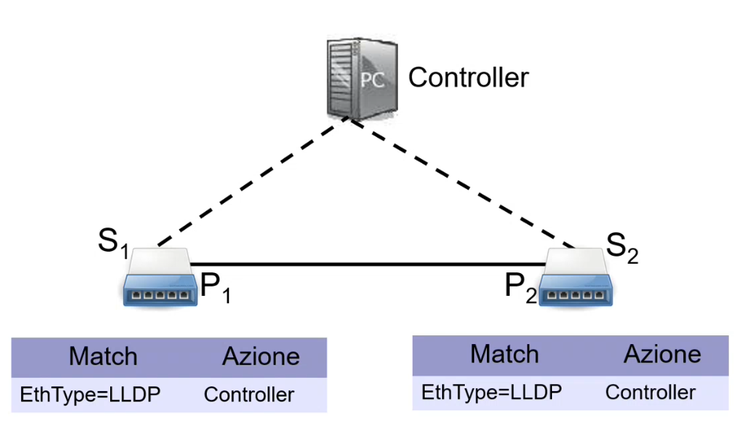

Se il campo `EthType` è di tipo `LLDP` allora mandalo al controller.

Nel disegno è mostrato che il controller non sa che lo switch `S1` è collegato con `S2` tramite le porte `P1`-`P2`. Il controller vuole scoprire la topologia cioè scoprire tutti e solo i link perchè i nodi gli sono noti perchè gli switch si sono presentati.

In pratica il controller vede un grafo senza archi e vuole scoprire quali sono gli archi che collegano i nodi.

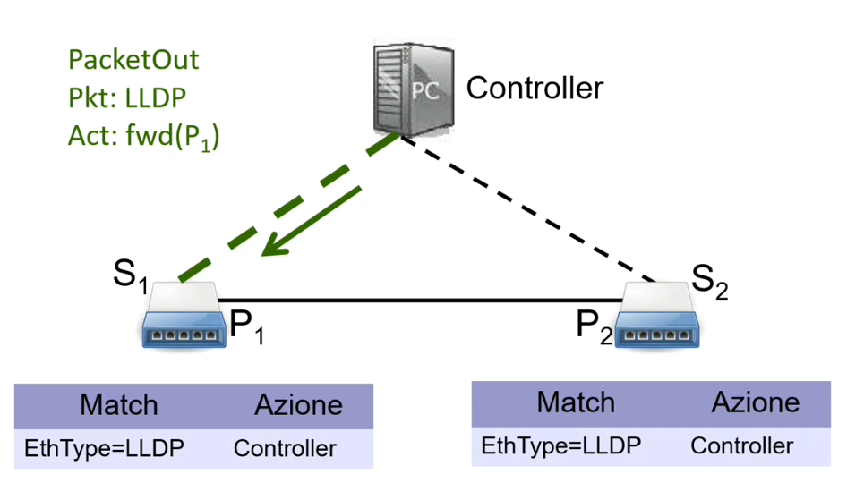

Per la scoperta della topologia il controller manda un `PacketOut` sulla porta `P1`.

Il controller conosce `P1` di `S1` perchè si è presentato all’inizio e conosce tutte le sue porte perchè sono state date come elenco all’inizio

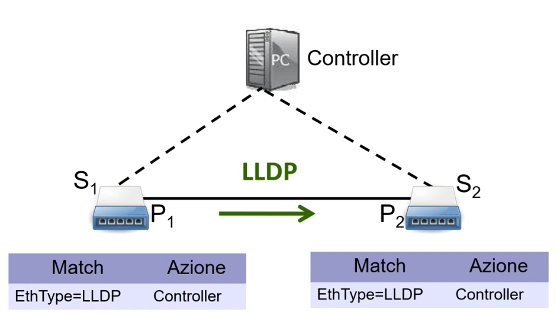

Seguendo le istruzioni del `PacketOut` lo switch `S1` manda un pacchetto `LLDP` con la porta `P1`.

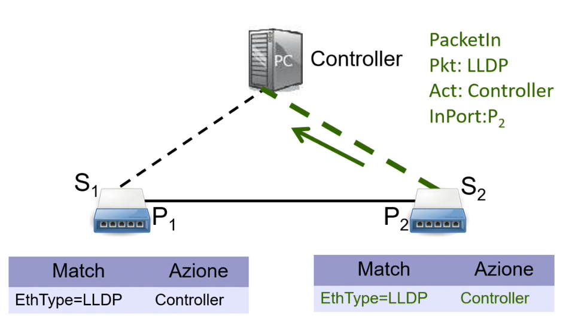

Facendo match con la flow table, viene eseguita l’azione mandando il pacchetto al controller.

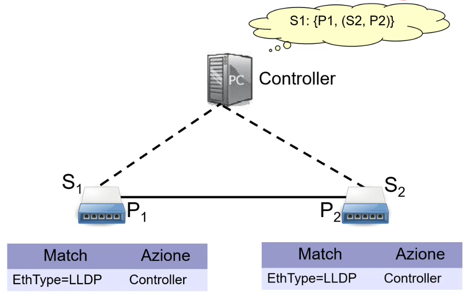

A questo punto il controller capisce che ci sta un collegamento tra `S1` ed `S2` e tra le rispettive porte `P1` e `P2`.

Per fare la verifica si manda il pacchetto al contrario.

## Possibili problemi in SDN

Un problema di SDN è che ogni rete ha un solo controller:

- `scalabilita`: per affrontare il problema di scalabilità si può fare una specie di gerarchia, cioè si collega ciascun switch a un controller, cosicchè si partiziona il controller.
- `affidabilita`: Il problema è che un fault di un controller compromette il funzionamento della rete, quindi un modo per gestire l’affidabilità è per esempio collegare il controller ad un altro controller di backup. Questi 2 controller devono essere sincronizzati.

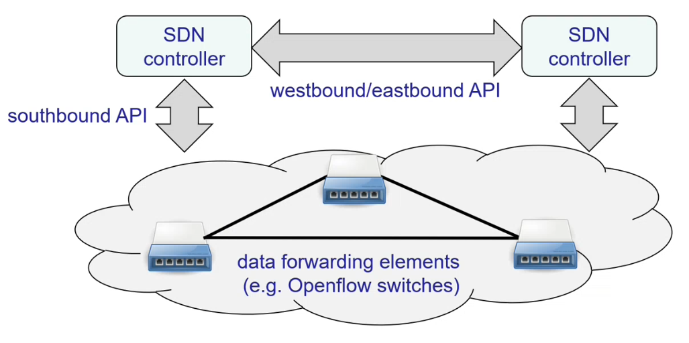

le API `westbound/eastbound` si utilizzano per fare comunicazione tra controller.