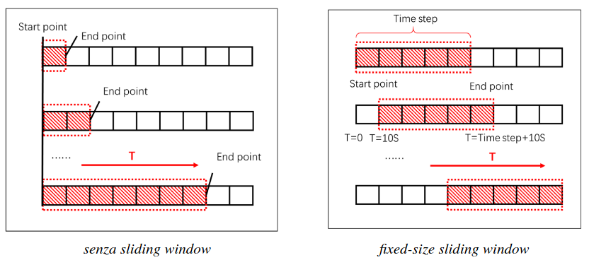

# 31 Maggio

Argomenti: Approccio Recurrent Sliding Window, Approccio Sliding Window, Approccio Wrapper, Features di una time series, Sequential Models
.: No

## Sequential Models

I `sequential-models` sono modelli adatti per dati sequenziali, cioè dati in cui l’ordine degli elementi in ingresso è rilevante e dove i campioni in sequenza dipendono l’un l’altro. 

Sono progettati specificamente per elaborare dati che non sono di questo tipo:

- `indipendente`: il valore di una istanza non influenza i valori di altre istanze
- `identicamente distribuiti`: la distribuzione di probabilità di ogni istanza è la stessa per ogni istanza

L’idea è che se si ha una sequenza di coppie di valori $(\bold x,y)$ è probabile che i valori $(\bold x',y')$ vicini siano correlati tra di loro.

Ci sono 3 approcci principali per i `sequential-models` e sono: l’apprendimento sequenziale supervisionato, la previsione delle time series e la classificazione delle sequenze.

## Apprendimento sequenziale supervisionato

$$
\bold x_i=\left\langle
x_{i,1},x_{i,2},...,x_{i,T}
\right\rangle
\\
\bold y_i=\left\langle
y_{i,1},y_{i,2},...,y_{i,T}
\right\rangle
$$

Si ha $\bold x_i$ e $y_i$

L’obiettivo è costruire un classificatore supervisionato $h$ che sia in grado di prevedere correttamente una nuova sequenza di etichette $\bold y=h(\bold x)$ data una sequenza di input $\bold x$.

## Previsione delle time series

Questo approccio è strettamente correlato con l’`apprendimento sequenziale supervisionato`, il compito è quello di prevedere il $t+1$-esimo elemento di una sequenza di lunghezza $t$. Si hanno 2 approcci:

- il primo è cercare di prevedere simultaneamente un intero insieme di serie temporali parallele cioè prevedere $y_{t+1}$ dato $\left\langle y_1,y_2,...,y_t\right\rangle$
- oppure si suppone che si hanno delle caratteristiche che sono generate in input, quindi si ha in input $\left\langle \bold x_1,\bold x_2,...,\bold x_t,\bold x_{t+1}\right\rangle$.

Nell’analisi delle `serie-temporali` si dispongono dei veri valori $y$ osservati fino al tempo $t$ mentre nell’apprendimento sequenziale supervisionato non viene fornito alcun valore $y$, quindi bisogna prevederli tutti.

## Classificazione delle sequenze

In questo caso si dispone di una sequenza che deve essere caratterizzata, ovvero ogni esempio di addestramento consiste in una coppia $(\bold x_i,y_i)$ dove $\bold x_i$ è una sequenza $\left\langle x_1, x_2,...,x_t, x_{t+1}\right\rangle$ e ogni $y_i$ è una label di classe

---

## Funzione di Loss

Il problema è che bisogna generare una sequenza di $y$ e non un singolo valore, qualsiasi errore in questa sequenza conta come errore per l’intera sequenza. La `loss` può dipendere dal momento in cui un certo evento avviene.

## Feature Selection e Long-Distance Interactions

Bisogna capire quale è il sottoinsieme di informazioni rilevanti per fare previsioni accurate, per questo ci sono 4 strategie adatte per `time-series`:

- approccio wrapper
- considerare tutte le features impiegando una misure di penalty per ridurre il peso delle features poco rilevanti
- misura di feature relevance
- addestrare un modello di feature selection semplificato per identificare quali features sono più rilevanti per poi addestrare un modello più sofisticato

## Approccio wrapper

Quello che l’`approccio-wrapper` fa è generare vari sottoinsiemi di features che verranno valutati eseguendo l’algoritmo di apprendimento, per poi misurare l’accuratezza del classificatore risultante per ogni sottoinsieme.

I sottoinsiemi di features sono tipicamente generati mediante `forward-selection` o `backward-elimination`.

Le prime 2 strategie non risolvono il problema dato il numero elevato di potenziali features da considerare, dunque una ricerca diretta di possibili sottoinsiemi è intrattabile. Le altre strategie risolvono questo problema ma per sequenze molto lunghe si rischia l’`overfitting`.

## Approccio a Sliding Window

Si considera una finestra di features e addestrare il classificatore su questa finestra. Quello che si fa è costruire un `windows-classifier` $h_w$ che mappa una finestra di dati in ingresso di lunghezza $w$ in un singolo valore di uscita $y$.

In questa immagine viene mostrato che con l’impiego della `sliding-window`, l’output sarà correlato solo con i valori che vengono estratti dalla finestra temporale

Questo approccio è vantaggioso perché si può usare qualsiasi algoritmo di apprendimento, lo svantaggio è che vengono ignorate le correlazioni tra valori vicini di $y_t$, a meno che tali correlazioni non siano catturate dai valori $\bold x$ considerati nelle vicinanze di $y_t$

## Approccio Recurrent Sliding Window

Questo approccio è una variante della `sliding-windows` normale, in questo caso il valore previsto è inserito come input per supportare la previsione. In particolare con una finestra di metà larghezza $d$, le ultime $d$ previsioni $\left\langle \overline{y}_{i,t-d},\overline{y}_{i,t-d+1},...,\overline{y}_{i,t-1} \right\rangle$ sono utilizzate come input insieme alla finestra scorrevole $\left\langle
\bold x_{i,t-d},\bold x_{i,t-d+1},...,\bold x_{i,t},...,\bold x_{i,t+d-1},\bold x_{i,t+d} 
\right\rangle$ per predire $y_{i,t}$

La `ricorrenza` cattura informazioni predittive che non venivano catturate dalla sliding window. Ci sono diversi approcci da usare durante l’addestramento del `window-classifier`:

- si addestra prima un classificatore non ricorrente e poi si utilizzano le sue previsioni come ingressi
- si utilizzano le etichette corrette $y_{i,t}$ come input. Il vantaggio è che l’addestramento può essere eseguito con gli algoritmi standard di apprendimento supervisionato, poiché ogni esempio di addestramento può essere costruito in modo indipendente.

---

## Features di una time series

Esistono 4 categorie di caratteristiche principali che si possono considerare per rappresentare time series, oltre ai valori dei singoli campioni e sono: `data-ora`, `lag-features`, `windows-features`, `time-until-next/last-event`.

In particolare la `lag-feature` è l’organizzazione dei dati impiegata nella previsione delle `time-series` mediante un classificatore, dove si utilizzano un insieme di valori passati come variabili di input e i valori successi come output.