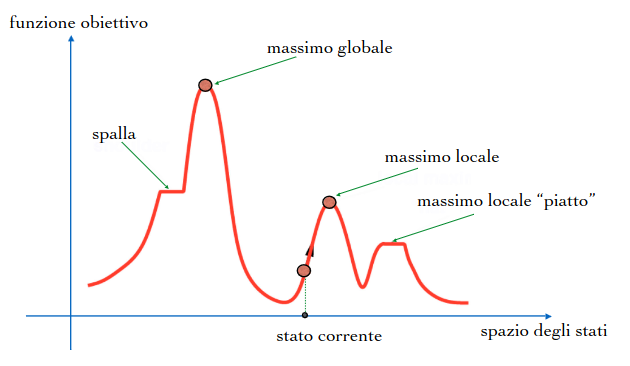

# 31 Ottobre

Argomenti: Algoritmi di ricerca Locale, Hill Climbing Random Restart, Hill-Climbing Steepest Ascent, Simulated Annealing, Stochastic-Hill-Climbing
.: Yes

## Algoritmi di ricerca locale

Nei problemi visti fino ad ora, quando l’algoritmo risolutivo raggiunge uno stato obiettivo, il cammino verso quello stato costituisce una soluzione al problema. Ci sono però problemi in cui lo stato obiettivo contiene tutte le informazioni rilevanti per la soluzione.



L’idea è quella di immaginare tuti gli stati collocati sulla superficie di un territorio e l’altezza di ogni stato corrisponde al valore della funzione di valutazione. Si tiene traccia solo dello stato corrente e si considerano solo gli stati vicini.

Gli incovenienti che si possono incontrare sono:

- Massimi locali → soluzioni non ottimali
- Plateaux → zone tendenzialmente piatte dove si avrà un percorso casuale

## Hill-climbing : Steepest Ascent

Si tratta di un semplice ciclo che si muove continuamente verso l’alto cioè nella direzione dei valori crescenti, e termina quando raggiunge un picco che non ha vicini di valore più alto.

```jsx
function HILL-CLIMBING(problem) returns uno stato che è massimo locale
		inputs: problem, un problema
		local variables: current, un nodo 
		                 next, un nodo
		
		current ⟵ MAKE-NODE(INITIAL-STATE(problem))
		loop do
				next ⟵ successore di current di valore più alto
				if VALUE(next) < VALUE(current) then return STATE(current)
				current ⟵ next
end
```

## Hill-climbing : Random Restart

Questo algoritmo è un Hill-Climbing con `riavvio casuale`, cioè conduce una serie di ricerche partendo da stati iniziali generati casualmente.

L’algoritmo è completo, con probabilità tendente a 1, per la banale ragione che prima o poi dovrà generare, come stato iniziale, proprio un obiettivo.

```jsx
function RANDOM-RESTART-HILL-CLIMBING(problem) returns uno stato soluzione
		inputs: problem, un problema
		local variables: current, next, best: nodi; local: booleana
		t ⟵ 0
		Inizializza best
		repeat
				local ⟵ false
				seleziona un punto iniziale current random
				repeat
						next ⟵ successore di current con VALUE più alto
						if VALUE(next) > VALUE(current)
							then current ⟵ next
							else local ⟵ true
				until local
				t ⟵ t + 1
				if VALUE(current) > VALUE(best) then best ⟵ current
		until t = MAX
		return STATE(best)
end
```

## Stochastic Hill-climbing

Si ottiene modificando la procedura precedente come segue:

- si seleziona casualmente un solo punto `next` invece di valutare tutti i vicini a current.
- si accetta next con una probabilità che dipende dalla differenza di valutazione tra i due punti:
    
    $\Delta E=VALUE(current) - VALUE(next)$
    

```jsx
function STOCHASTIC-HILL-CLIMBING(problem) returns uno stato soluzione
		inputs: problem, un problema
		local variables: current, next, best: nodi
		t ⟵ 0
		seleziona un punto iniziale current random
		Inizializza best
		repeat
				next ⟵ seleziona successore di current random
				seleziona next come nodo corrente con probabilità p = 1/(1 + e^(∆E/T))
				se selezionato next come nuovo current:
					if VALUE(current) > VALUE(best) then best ⟵ current
        t ⟵ t + 1
    until t = MAX
		return STATE(best)
end
```

$OSSERVAZIONI$

- L’ algoritmo ha un solo ciclo
- Il nuovo punto selezionato è accettato con probabilità `p`
- Può quindi essere accettato un nuovo punto “peggiore” di quello corrente
- La probabilità dipende dalla differenza tra le valutazioni dei due punti del parametro `T`
- Il parametro `T` rimane costante durante l’esecuzione dell’algoritmo

## Simulated Annealing

E’ un algoritmo con `miglioramenti iterativi` che consente di sfuggire da ottimi locali.

A differenza dello stochastic hill-climber, il simulated annealing modifica il parametro `T` durante l’esecuzione: comincia con valori alti comportandosi in modo simile ad una pura *random search* per poi decrementare gradualmente il valore del parametro, fino ad arrivare a valori molto piccoli di T che portano ad un comportamento simile ad un normale *hill-climber*.

Inoltre l’algoritmo accetta sempre nuovi punti se essi hanno una `valutazione migliore` del punto corrente.

```jsx
function SIMULATED-ANNEALING(problem) returns uno stato soluzione
		inputs: problem, un problema
		local variables: current, next: nodi;
		t ⟵ 0
		Inizializza T
		seleziona un punto iniziale current random
		Inizializza best
		repeat
				repeat
						next ⟵ successore di current scelto random
						if VALUE(next) > VALUE(current)
							then current ⟵ next
								if VALUE(current) > VALUE(best) then best ⟵ current
							else if random[0, 1) < e^(-∆E/T) then current ⟵ next
				until (termination-condition)
				T = g(T, t)
				t ⟵ t + 1
		until (halting-criterion)
		return STATE(best)
end
```

Come per gli altri algoritmi di ricerca di questo tipo, il simulated annealing richiede che si determinino le risposte ai seguenti quesiti relativi allo specifico problema:

- come definiamo una soluzione al problema?
- quali sono i “vicini immediati” di una soluzione?
- qual è il costo della soluzione?
- come determiniamo la “soluzione iniziale”?

Le risposte a queste domande consentono di produrre la struttura dello `spazio di ricerca`, di definire il `"vicinato"`, la `funzione di valutazione` e il `punto di partenza`.

Inoltre il simulated annealing richiede che si determinino i seguenti parametri addizionali:

- “temperatura” iniziale t
- rapporto di raffreddamento g(T,t)
- condizione di terminazione
- criterio di arresto (halting-criterion)

Molte implementazioni seguono questi semplici passi:

**STEP 1**: $T ← T_{max}$

              select current at random

**STEP 2**: pick a point next from the neighborhood of current
               if VALUE(next) is better than VALUE(current) then select it (current ← next)
               else select it with probability $e^{-∆E/T}$
               repeat this step kT times

**STEP 3**: set $T ← r T$
               if $T ≥ T_{min}$ then goto STEP 2
               else goto STEP 1