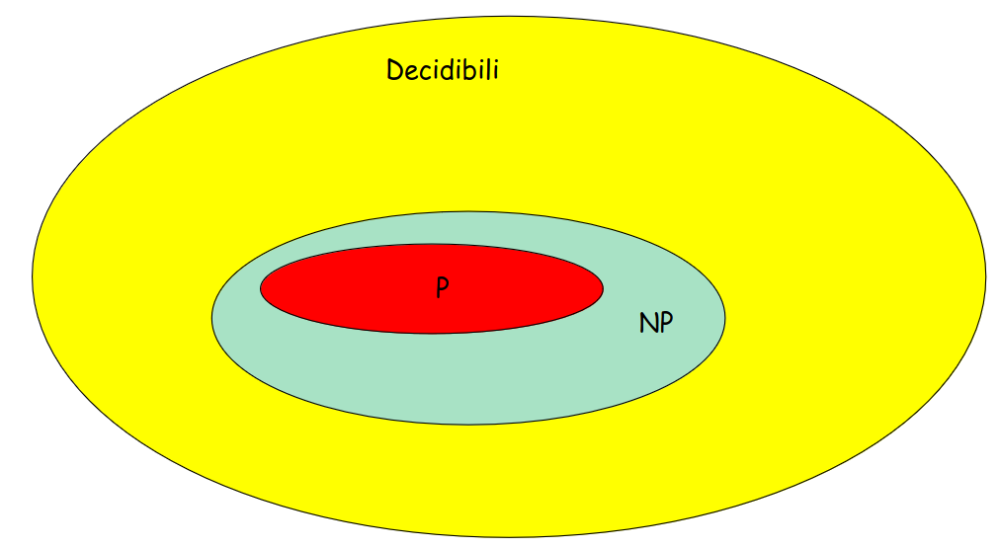
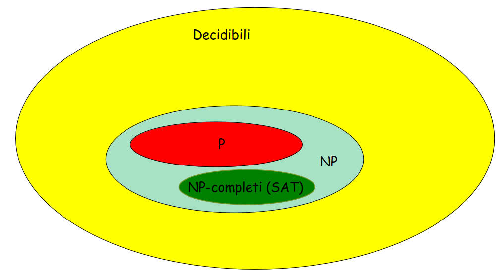

# 31 Ottobre

Argomenti: Complessità computazionale
.: No

## Introduzione alla complessità computazionale

In modo informale si usa dire che un problema è `facile` se si riesce a risolverlo in modo efficiente, viceversa un problema è `difficile` se non si riesce a risolverlo in modo efficiente.

Per stimare la complessità di un algoritmo, bisogna quindi prima di tutto stabilire un `modello di calcolo` di riferimento su cui esso viene eseguito, per cui si introduce una `macchina astratta` che definisce l’insieme delle operazioni ammissibili ed eseguibili durante una computazione, e ne specifica i relativi costi in termini di tempo e spazio utilizzato.

Si misurano le risorse di calcolo usate da un algoritmo in funzione della dimensione dell’istanza in input, si usa tipicamente rappresentare la dimensione dell’input con il numero $n$ dei suoi elementi.

## La classe P

Un problema di decisione $A$ appartiene alla classe $P$ se esiste un algoritmo di soluzione la cui complessità è polinomiale, ovvero se può essere risolto in tempo polinomiale, quindi la complessità dell’algoritmo è polinomiale nelle dimensioni dell’input

## La classe NP

Un problema di decisione $A$ appartiene alla classe $NP$ se data un’istanza affermativa di tale problema è possibile verificare in tempo polinomiale che l’istanza è affermativa. La classe *P* è inclusa nella classe *NP*

## La classe co-NP

Come la classe *NP* ma simmetrica, quindi, un problema di decisione A appartiene alla classe Np se, data un’istanza negativa del problema è possibile verificare in tempo polinomiale che tale istanza è negativa.

## Gerarchia delle classi

All’interno dei problemi decidibili si hanno i problemi appartenenti alla classe $NP$ e all’interno di questi si hanno i problemi appartenenti alla classe $P$

## Riduzione tra problemi

Un problema di decisione $A$ si riduce polinomialmente a un problema di decisione $B$ se, data un’istanza $a$ di $A$, è possibile costruire in tempo polinomiale un’istanza $b$ del problema $B$ tale che $a$ è affermativa se e solo se $b$ è affermativa.

## Problemi NP-completi

Un problema si dice `NP-completo` se $A\in NP$ e preso qualunque problema $B\in NP$si ha che $B$ si riduce polinomialmente ad $A$.

Se un problema risulta `NP-completo`, vuol dire che esso è almeno altrettanto difficile quanto qualunque altro problrma in *NP*. Dunque i problemi `Np-completi` rappresentano i più difficili problemi in *NP*