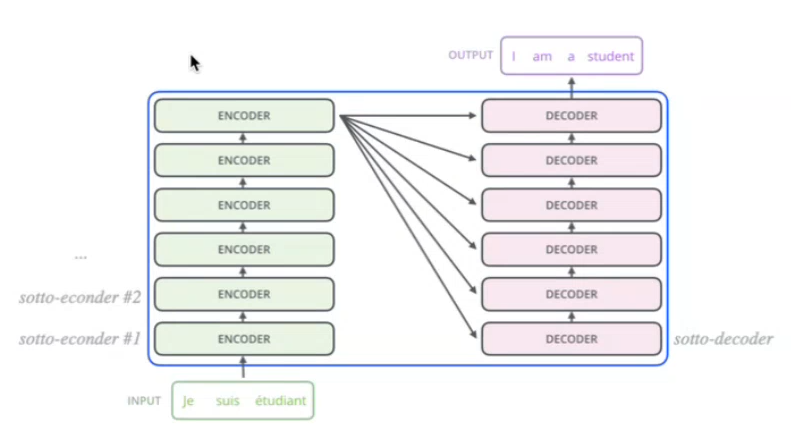
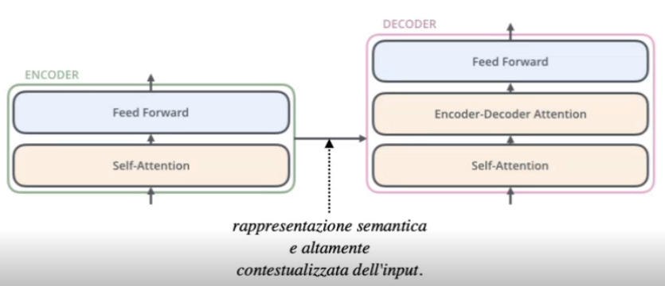
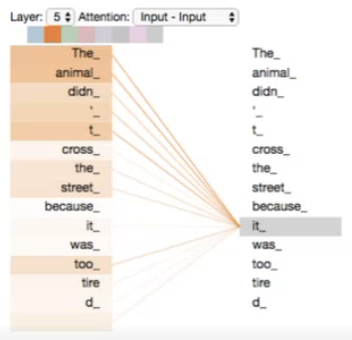

# 3 Dicembre

Tags: Multi-headed self-attention mechanism, Self-attention layer, Self-attention mechanism, Transformers
.: No

## Transformers

I modelli basati su `transformers` consentono di riconoscere e memorizzare relazioni salienti in grandi insiemi di dati, anche provenienti da più surgenti. Possono estrarre contesti utili per implementare sistemi di question-answering e in generale della comprensione del testo.

Questa architettura sfrutta una combinazione di `attention-mechanism`, `embeddings`, `normalizzazioni` e `layer-lineari` ed è adatto a esecuzioni parallele.

$$
y_t=c + \left(\sum_{i=1}^{p}\phi_i\cdot y_{t-i}\right)+\epsilon_t
$$

Sono modelli `auto-regressive`, cioè l’output dipende linearmente da una variabile che corrisponde ai valori prodotti dal modello in precedenza e da un termine stocastico.

Nella linear-regression l’output dipende da più variabili indipendenti, si richiede che i dati siano `stazionari`, cioè con proprietà statistiche (media, varianza e autocorrelazione) costanti nel tempo.

## Architettura Transformers

L’architettura è ancora basata su uno schema `encoder-decoders`, dove sia encoder e decoder consistono in uno stack di sotto-encoders/decoders dove entrambi non sono più basati su celle ricorrenti.

Il suggerimento è che bisogna usare 6 livelli di stack per ciascuno dove ogni sotto-componente si ripete con la stessa architettura, ed ogni livello ha il proprio set di parametri indipendente dagli altri.



Ogni blocco (encoder o decoder) ha la propria architettura interna ripetuta, ma i **parametri appresi nei vari livelli non sono condivisi**. Ad esempio, il primo encoder avrà un set di pesi differente rispetto al secondo encoder.

Le frecce che partono da ogni livello dell'encoder verso ogni livello del decoder mostrano che **l'output finale dell'encoder** viene utilizzato da **tutti i livelli del decoder**. In sintesi, queste frecce rappresentano il flusso di informazioni dall'encoder al decoder per il processo di cross-attention, che permette al decoder di generare l'output basandosi sia sull'input originale sia sul contesto costruito durante la decodifica.



In questa immagine è mostrata una rappresentazione semantica e altamente contestualizzata dell’input.

- ogni `sotto-encoder` è composto da 2 layers:
    - `self-attention` layer: durante la codifica di una parola in una specifica posizione, permette di determinare relazioni con altre parole della frase in ingresso. L’output di questo layer è inviato alla rete `feed-forward`.
    - rete `feed-forward`: riceve l’output del layer `self-attention`
- ogni `sotto-decoder` condivide la stessa architettura, con un `attention-layer` aggiuntivo per identificare le parti più salienti dell’input durante la generazione di ciascun output.

> Tramite gli `embedding` si può dare in input ai trasformer dati trasformati in forma vettoriale o matriciale. In sostanza si estraggono degli elementi di un vocabolario o insieme e associarli a vettori.
> 

## Self-attention layer

Il meccanismo di attenzione assegna dei pesi a ogni parola di una frase in base alla relativa importanza valutata sul task. Per calcolare l’output del modello viene utilizzata la somma pesata di questi pesi, bisogna dire però che l’attenzione non è una semplice somma ma prende in considerazione il contesto e le dipendenze tra i token.

```jsx
THe animal didn't cross the street because it was too tired
```



Si suppone di avere questa frase; si vuole capire a cosa si riferisce il pronome `it`.

In sostanza si vogliono avere degli score tale che data una parola di ricerca, si possa capire quale tra le altre parole la parola di ricerca è “collegata”.

Il `self-attention` layer supporta la codifica esplorando gli altri token nella sequenza determinando l’importanza di tali termini nella codifica di un termine.

## Attention e key/value/query

Il `self-attention` è solitamente considerato insieme al paradigma `key/value/query` che introduce dei parametri addizionali per rappresentare meglio il contesto.

Il meccanismo di `self-attention` utilizza tre componenti principali:

- `Query`: $Q$, è una rappresentazione di ciò che si sta cercando, associata a un token specifico della sequenza. (termine di ricerca)
- `Key`: $K$, fornisce informazioni contestuali per ogni token, permettendo di stabilire relazioni con la query. (campi su cui viene eseguita la ricerca)
- `Value`:  $V$, sarebbero gli embeddings di ogni token della frase, che sono indipendenti dalla particolare frase. (risultati da filtrare e restituire in base alla rilevanza)

$$
att(q,k,v)=\sum_{i}sim(q, k_i)\cdot v_i
$$

La query e la key sono moltiplicate per produrre gli score di attenzione che sono poi utilizzati per calcolare la somma pesata dei value. La formula mostra come calcolare l’attention.

## Self-attention mechanism

Il calcolo del `self-attention` implementa questo paradigma, su una sequenza di token rappresentata come una matrice di embedding $X$ dove ogni riga corrisponde a un token.

$$
Q=X\cdot W_Q \\
K=X\cdot W_K \\
V=X\cdot W_V \\
$$

Ogni embedding di token $x_i$ è moltiplicato con 3 matrici di peso ($W_Q$, $W_K$, $W_V$) addestrabili. Da queste moltiplicazioni si ottengono 3 vettori $q_i$, $k_i$ e $v_i$ rispettivamente per `query`, `key` e `value`.

Ogni query $q_i$ è confrontata con tutte le keys $k_j$ tramite un prodotto scalare, si fa questo per poter misurare quanto ogni token $j$ è rilevante rispetto al token $i$. 

$$
Score(q_i, k_j)=\dfrac{q_i\cdot k_j}{\sqrt{d_k}}
$$

Gli score sono normalizzati per evitare gradienti instabili, si divide per la radice quadrata di $d_k$ cioè la dimensione dei vectory key.

$$
a_{ij}=softmax(Score(q_i, k_j))
$$

Gli score sono trasformati in una distribuzione di probabilità tramite la funzione softmax. Questo assegna un peso normalizzato a ogni key, indicando la sua importanza relativa rispetto alla query.

$$
z_i=\sum_{j}a_{ij}\cdot v_j
$$

ogni value $v_j$ è moltiplicato per il suo peso $a_{ij}$ e sommato. Questo genera un nuovo vettore $z_i$ che rappresenta il token arricchito dal contesto.

L’output del `self-attention` è una matrice $Z$ dove ogni riga $z_i$ rappresenta un token della sequenza, arricchito con il cotesto degli altri token. Questo output viene passato al livello successivo del modello.

## Multi-headed self-attention mechanism

Il `self-attention` raggruppa i diversi contributi, perdendo l’informazione posizionale. Per superare questo limite, i `transformers` utilizzano il meccanismo di `multi-head attention`.

Quello che si fa è creare più proiezioni (head) dei vettori $Q$, $K$ e $V$; ogni `head` calcola l’attenzione in un sottospazio distinto per poi moltiplicare per una matrice $W_o$ la concatenazione dell’output di queste `head`. 

Consideriamo la frase: *"The animal didn't cross the street because it was too tired"*

Con una singola head, potrebbe risultare difficile stabilire che *"it"* si riferisce sia a *"animal"* (soggetto) sia a *"tired"* (stato). Con 8 head, invece, diverse interpretazioni possono essere catturate:

- Una head potrebbe evidenziare la relazione tra *"it"* e *"animal"*.
- Un'altra head potrebbe connettere *"it"* a *"tired"*.
- Le altre head potrebbero esplorare relazioni meno ovvie ma comunque utili.