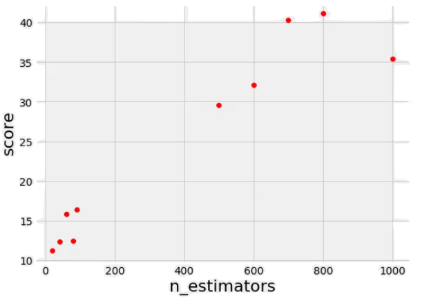
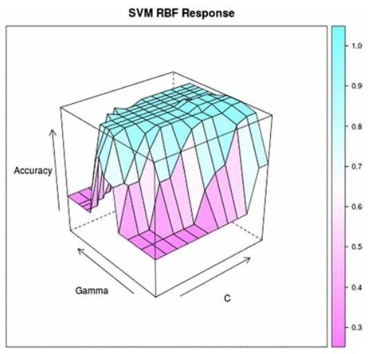
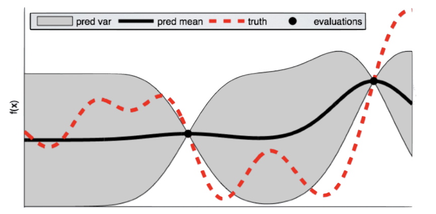
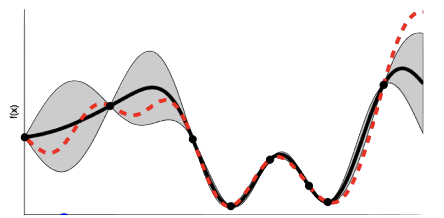

# 3 Giugno

Argomenti: Bayesian Optimization, Expected Improvement, Grid Search, Hyperparameter Tuning, Random Search, Sequential Model-Based Optimization, Tree-structured Parzen Estimator
.: No

## Hyperparameter tuning

Prima di iniziare con l’addestramento si deve decidere, dato un modello, una configurazione di `iperparametri`; quello che si fa nel `hyperparameter-tuning` è sperimentare diversi set di parametri in modo manuale o automatico e selezionare quale tra queste configurazioni è la più adatta. Questo processo però è computazionalmente oneroso.

## Categorie di iperparametri

- `model-hyperparameters`: sono coinvolti nella struttura del modello e definiscono il costrutto di un modello stesso
- `optimizer-hyperparameters`: utilizzati nel processo di ottimizzazione, ottimizzano le prestazioni del modello dettando il modo in cui il modello apprende i modelli nei dati.
- `data-hyperparameters`: riguardano i dati da utilizzare per l’addestramento, le tecniche che vengono utilizzate sono lo splitting, data sampling e data augmentation.

## Hyperparameter Optimization

$$
x^*=\underset{x\in \mathscr{X}}{argmin}\left(f(x)\right)
$$

L’ottimizzazione degli `iperparametri` la si può formalizzare in questo modo

Dove $f(x)$ rappresenta la funzione obiettivo cioè la funzione costo, valutata sul `validation-set`,

Ogni volta che si prova una configurazione di iperparametri si è costretti ad `addestrare` un modello sul training set, fare `previsioni` sui dati di validazione e calcolare la `metrica` di validazione. Il problema è che se si hanno un gran numero di iperparametri e modelli complessi è impossibile implementare tale processo manualmente

Ci sono 3 approcci principali per risolvere questo problema e sono:

- `grid-search`: dato un elenco di iperparametri e una metrica di valutazione, si cerca di trovare quale fra tutte le combinazioni di iperparametri è la migliore. Questo tipo di ricerca funziona bene ma visto che viene fatto su ogni elemento dell’elenco è computazionalmente oneroso.
- `random-search`: simile alla grid-search, seleziona gruppi di iperparametri in modo casuale a ogni iterazione. Questo tipo di ricerca funziona bene quando un numero piccolo di iperparametri determina i risultati del modello
- `bayesian-optimization`: basata sul teorema di bayes, quello che fa è descrivere la probabilità che un evento si verifichi in relazione alle conoscenze acquisite. L’algoritmo costruisce un modello probabilistico da un insieme di iperparametri che mira ad ottimizzare una metrica predefinita

## Grid Search e Random Search

Entrambi specificano `configurazioni` di `iperparametri` del modello da ottimizzare ed eseguono automaticamente il ciclo



La scelta degli iperparametri da valutare nello step successivo non si basa sulla cronologia di esperimento fatti, per tale motivo sono giudicate poco efficienti.

Quello che si può dire però è che è possibile scegliere quale configurazione utilizzare in base all’obiettivo cioè se massimizzare o minimizzare lo score

## Grid Search

Si definisce una griglia di valori, che corrisponde allo spazio degli iperparametri $\mathscr{X}$. L’algoritmo esplora esaustivamente lo spazio in modo sequenziale e addestra un modello per ogni possibile combinazione di valori di iperparametri.

```json
{
	"C": [0.1, 1, 10, 100, 1000],
	"gamma": [0.1, 0.01, 0.001, 0.0001],
	"kernel": ["rbf", "linear"]
}
```

Per esempio se si vuole addestrare un modello `SVM`, si definisce la griglia di iperparametri in base alle dimensioni



Quello che fa quindi la `grid-search` è costruire tutte le sperimentazioni dati i valori di `C` e `gamma`.

Il numero di modelli da addestrare cresce esponenzialmente all’aumentare del numero di iperparametri da considerare nello spazio, il che rende la ricerca poco efficiente sia in termini di potenza di calcolo che di tempo

Questa tecnica ha i seguenti svantaggi:

- `esplorazione esaustiva`: l’esplorazione di ogni possibile combinazione definita all’interno della griglia garantisce che tutte quante verranno valutate però può portare a un numero molto elevato di combinazioni da testare, soprattutto quando ci sono molti iperparametri o quando ciascun iperparametro può assumere valori diversi
- `costo computazionale`: il numero di combinazioni può crescere esponenzialmente con il numero di iperparametri, rendendo il processo computazionalmente molto costoso e lento

## Random Search

Quello che fa la `random-search` invece è prendere in input una distribuzione statistica per ogni iperparametro da cui sono campionati i valori in modo stocastico

```json
{
	"C": loguniform(1e-1, 1e-3),
	"gamma": loguniform(1e-4, 1e-1),
	"kernel": ["rbf", "linear"]
}
```

Sempre prendendo un modello `SVM`, si definiscono gli iperparametri come distribuzioni in cui i valori in un intervallo $[a,b]$ sono campionati con medesima probabilità tra $log(a)$ e $log(b)$.

Molto utile quando gli intervalli coprono diversi ordini di grandezza. Altre distribuzioni comuni sono l’esponenziale, normale, log-normal, uniforme e casuale. A differenza della `grid-search`, che esplora esaustivamente una griglia predefinita di combinazioni di iperparametri, la `random-search` non fornisce un insieme esplicito di valori possibili, ma utilizza una distribuzione statistica per ciascun iper-parametro dalla quale vengono campionati i valori in modo stocastico. Di conseguenza questa tecnica non è realmente random ma segue una metodologia basata su distribuzioni probabilistiche.

Questa tecnica ha i seguenti svantaggi:

- `selezione casuale`: la selezione casuale può spesso portare a trovare configurazioni ottimali più rapidamente rispetto alla grid search ma non garantisce che tutte le regioni dello spazio degli iperparametri vengano esplorate in modo uniforme
- `potenziale inefficienza`: c’è il rischio di selezionare molte combinazioni subottimali, specialmente se lo spazio degli iperparametri è vasto e complesso

## Bayesian Optimization

Si basa sul principio alla base dell’inferenza bayesiana cioè che più informazioni ci sono più la stima è corretta. In questo caso si tiene traccia dei risultati delle valutazioni passate per stimare un modello `probabilistico`

Questo tipo di ottimizzazione si differenzia dalle 2 precedenti perché utilizza informazioni dai risultati degli esperimenti precedenti per guidare la ricerca delle combinazioni successive. Questo perché la mancanza di un approccio basato sulla cronologia degli esperimenti può portare a ripetere prove su configurazioni di iperparametri subottimali, aumentando inutilmente il tempo di calcolo e le risorse computazionali necessarie.

$$
P(score\space|\space hyperparameters )
$$

Il modello è chiamato `surrogato` e mette in relazione i valori degli iperparametri con le performance ottenute dalla funzione obiettivo mostrata qui accanto

Questa ottimizzazione mira a trovare il successivo set di iperparametri da valutare rispetto alla funzione obiettivo originale, cercandoli attraverso la funzione `surrogata`, cosi da evitare di dover valutare l’intero modello da ottimizzare.

Generalmente questo approccio è più efficiente poiché la scelta degli iperparametri da testare è informata.




Supponendo di utilizzare questo modello `surrogato` (in nero), si ha una zona in grigio che rappresenta una zona di incertezza cioè dove si è più confidenti o meno

Quindi da come mostrato in questa immagine non si ha una buona approssimazione della funzione obiettivo reale (in rosso) 



Dopo qualche iterazione il modello `surrogato` corrisponde quasi esattamente alla funzione obiettivo

Se l’algoritmo seleziona gli iperparametri che massimizzano il surrogato, probabilmente otterrà ottimi risultati sulla funzione di valutazione.

## Sequential Model-Based Optimization

La `sequential model-based optimization` è una formalizzazione della ottimizzazione bayesiana, dove il `sequenziale` si riferisce all’esecuzione iterativa, provando ogni volta iperparametri migliori ricavati seguendo l’approccio bayesiano e aggiornando il modello surrogato di conseguenza.

L’approccio è basato sui seguenti aspetti: spazio di `iperparametri`, funzione `obiettivo` del modello originale, modello `surrogato` e una `cronologia` di coppie di score e iperparametri che l’algoritmo impiega per aggiornare il modello surrogato.

Ci sono diverse varianti di `SMBO`, si differenziano tutte per il modo in cui costruiscono un surrogato della funzione obiettivo e per i criteri utilizzati per selezionare gli iperparametri successivi. Per la selezione di quale iperparametro si va ad esplorare successivamente si impiega spesso l’`Expected Improvement`.

## Selection function - Expected Improvement

La funzione di selezione codifica il criterio in base al quale viene scelto il successivo insieme di iperparametri della funzione surrogata

$$
El_{y^*}(x)=\int_{-\infty}^{y^*}\left(\left(y^*-y\right)\cdot p\left(y|x\right)\right)dy
$$

Nel caso più noto la `funzione di selezione` corrisponde alla `expected-improvement`, che tiene traccia di quanto ci aspettiamo di migliorare

Nella formula $y^*$ è un valore soglia della funzione obiettivo, $x$ è l’insieme candidato di iperparametri, $y$ è il valore effettivo della funzione obiettivo utilizzando gli iperparametri $x$ mentre $p(y|x)$ è il modello surrogato. ($y$ lo si può immaginare come lo score)

L’obiettivo è massimizzare $El_{y^*}$ scegliendo il candidato $x$ migliore. Se $p(y|x)$ è zero ovunque, quindi quando $y<y^*$, significa che gli iperparametri $x$ non hanno prodotto alcun miglioramento. Se invece $El_{y^*}$ è maggiore di 0 allora alcuni iperparametri $x$ potrebbero dare un risultato migliore rispetto al valore soglia $y^{*}$.

## Tree-structured Parzen Estimator

$$
p(y|x)=\dfrac{p(x|y)\cdot p(y)}{p(x)}
$$

Invece di impiegare un modello basato su un processo gaussiano, costruisce il modello per mezzo della regola di bayes, cioè si rappresenta $p(y|x)$  utilizzando la regola di bayes

$$
p(x|y)=\begin{cases}
\mathcal{l}(x),\space\space y<y^*\\
g(x),\space\space y\ge y^*
\end{cases}
$$

dove $p(x|y)$ a sua volta è espressa come mostrato, e $y<y^*$ rappresenta un valore della funzione obiettivo inferiore alla soglia

I valori assunti da $p(x|y)$ sono distribuzioni in 2 casi, una quando lo score è inferiore alla soglia avendo $l(x)$ mentre l’altra quando il valore della funzione obiettivo è maggiore alla soglia avendo $g(x)$. In sostanza si sta dividendo la distribuzione “buona” da quella “cattiva”

Per massimizzare $El_{y^*}$ bisogna generare iperparametri che sono più probabili sotto la distribuzione $l(x)$ rispetto a $g(x)$. Lo stimatore di `parzen` estrae iperparametri campionando $l(x)$ e li valuta in termini di $\frac{l(x)}{g(x)}$ restituendo l’insieme che produce il valore più alto di tale rapporto.

Bisogna tenere conto che il `surrogato` è una stima della funzione obiettivo quindi gli iperparametri selezionati potrebbero non produrre un miglioramento al momento della valutazione e il modello `surrogato` dovrà essere aggiornato. L’aggiornamento viene effettuato in base al modello surrogato corrente e alla storia delle valutazioni della funzione obiettivo.