# 4 Aprile

Argomenti: Algoritmo Gradient Descent per il feed-forward, Algoritmo Gradient Descent per il feed-forward multistrato, Backpropagation per output, Introduzione alle reti neurali, Processo di retropropagazione, Reti feed-forward, Reti feed-forward multistrato, Strutture di rete, backpropagation per hidden
.: No

## Introduzione alle reti neurali

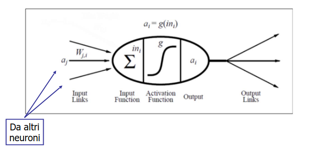

Rappresentazione di un neurone nella rete neurale

$$
in_i=\sum_{j=1}^{n}W_{j,i}\cdot a_j
$$

Ogni unità $i$ calcola per prima cosa una somma pesata dei propri input

$$
a_i=g(in_i)
$$

Successivamente si applica una `funzione di attivazione` $g$ alla somma per derivare l’output

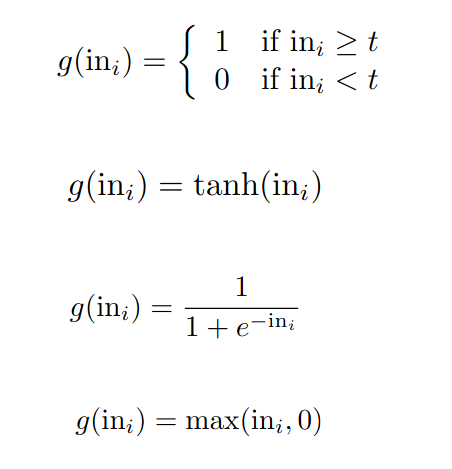

Usando funzioni diverse di $g$ si possono ottenere modelli differenti, ad esempio come mostrato nella figura si possono ottenere, elencati in ordine:

- funzione a gradino
- tangente iperbolica
- sigmoide
- ReLU

## Funzione gradino

Questa funzione ha una soglia $t$ tale che il risultato è 1 quando l’ingresso supera questa soglia. La motivazione biologica è che un 1 rappresenta l’emissione di un impulso lungo l’assone mentre uno 0 rappresenta l’assenza di una tale emissione

## Strutture di rete

Ci sono 2 categorie principali di strutture di reti neurali:

- `feed-forward`: dette anche acicliche, la loro caratteristica è i dati si propagano dallo strato di input allo strato di output.
- `ricorrenti`: dette anche cicliche

In questa immagine è rappresentata una rete neurale di tipo `feed-forward`. Quindi come mostrato si ha che l’output dell’intera rete $a_5$ è funzione dei suoi input $a$

## Reti feed-forward a strato singolo

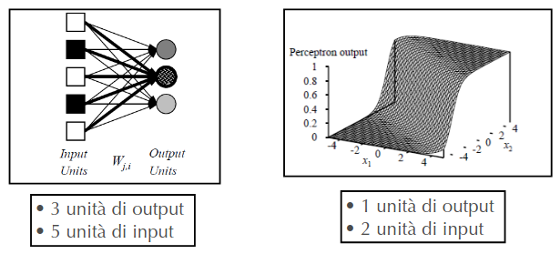

Si tratta di una rete `feed-forward` in cui tutti gli input sono collegati direttamente a tutti gli output

## Lavorare con i percettroni

Per esempio se si volesse rappresentare la funzione di maggioranza, il quale restituisce 1 se e solo se più della metà dei suoi $n$ input binari vale 1 basta porre il peso $W_j=1$ per ogni input mettere la soglia $W_0=n/2$

$$
g\left(\sum_{i=1}^{n} w_ix_i-w_0\right)\Rightarrow g\left(\sum_{i=1}^{n}x_i-\frac{n}{2}\right)
$$

Da cui si ottiene che $g>0$ solo quando $\sum_{i=1}^{n}x_i>\frac{n}{2}$

La disequazione mostrata in precedenza può essere riassunta come $\bold W^T\cdot \bold x>0$, il quale definisce un `iperpiano` nello spazio degli input, restituendo 1 se si trova da una parte specifica rispetto a tale iperpiano. Per questo il percettore a soglia è chiamato anche `separatore lineare`.

## Limite del percettrone

Nonostante la loro funzionalità limitata, esiste un semplice algoritmo di apprendimento capace di adattare un percettrone a soglia a qualsiasi insieme di addestramento linearmente separabile.

L’idea di base è quella di calcolare i pesi della rete in modo tale da minimizzare una determinata funzione di costo sull’insieme di training, in questo modo è come se si stesse facendo una ricerca di ottimizzazione dello spazio dei pesi.

## Apprendimento del percettrone

$$
E=\frac{1}{2}Err^2=\frac{1}{2}\left(y-f_w(\bold x)\right)^2
$$

La funzione di costo sull’insieme di training che viene usata tradizionalmente è la somma dei quadrati degli errori. 

## Metodo della discesa del gradiente

$$
\begin{align*}
 \dfrac{\partial E}{\partial W_j} &= Err\cdot\dfrac{\partial Err}{\partial W_j}\\
  &= Err\cdot\dfrac{\partial}{\partial W_j}\left(y-g\left(\sum_{j=0}^{n}W_jx_j\right)\right)\\
  &= -Err\cdot g'\left(in\right)\cdot x_j
\end{align*}
$$

Si può usare questo algoritmo per ridurre il quadrato dell’errore calcolando la derivata parziale di $E$ rispetto ad ogni peso.

Dove $g'$ è la derivata della funzione di attivazione, per la sigmoide si ha che $g'=g(1-g)$

$$
W_j\gets W_j+\Delta W_j
$$

Il peso deve essere aggiornato in questo modo

$$
\Delta W_j=-\alpha\cdot\dfrac{\partial E}{\partial W_j}
$$

L’idea è quella di modificare il peso proporzionalmente al negativo della derivata dell’errore $E$ vista in precedenza

$$
W_j\gets W_j+\alpha\cdot Err\cdot g'(in)\cdot x_j
$$

L’aggiornamento del peso è pertanto il seguente, dove $\alpha$ è detto step size

- Gli esempi di addestramento vengono fatti passare attraverso la rete uno per volta, modificando leggermente i pesi a ogni iterazione per ridurre l’errore.
- Ogni ciclo attraverso tutti gli esempi prende il nome di `epoca`.

## Reti feed-forward multistrato

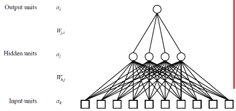

Si tratta di reti con unità nascoste, in cui esiste un verso di propagazione del segnale dall’input all’output, ciascun nodo dello strato. Il vantaggio di aggiungere questi strati nascosti è quello di ampliare lo spazio delle ipotesi rappresentabili in dalla rete.

## Apprendimento nelle reti multistrato feed-forward

$$
E=\frac{1}{2}\sum_{i}^{}\left(y_i-a_i\right)^2
$$

L’idea base rimane la stessa che è quella di calcolare i pesi della rete in modo da minimizzare la somma dei quadrati degli errori che per un singolo esempio è definita in questo modo

L’$a_i$ che si vede nella formula è relativa agli strati di output, perché si fa la somma degli errori che si ottengono nell’output

$$
\bold y-\bold f_w(\bold x)
$$

Dato un certo esempio il vettore di errore in output è come mostrato

$$
Err_i
$$

Si indica in questo modo l’i-esimo componente del suddetto vettore

$$
\Delta_i=Err_i\cdot g'(in_i)
$$

Inoltre è utile definire un errore modificato per l’i-esimo componente. Utile solo per i passaggi matematici che verranno mostrati di seguito

## Back-propagation: strato di output

$$
W_{j,i}\gets W_{j,i}+\Delta W_{j,i}
$$

Per lo strato di output, il peso deve essere aggiornato in questo modo

$$
\begin{align*}
 \Delta W_{j,i} &= -\alpha\cdot\dfrac{\partial E}{\partial W_{j,i}}\\
  &= -\alpha\left(-a_j\cdot \Delta_i\right)\\
\end{align*}
$$

L’idea è quella di modificare il peso proporzionalmente al negativo della derivata dell’errore $E$

$$
W_{j,i}\gets W_{j,i}+\alpha\cdot a_j\cdot \Delta_i
$$

L’aggiornamento dei pesi è pertanto mostrato in questa formula

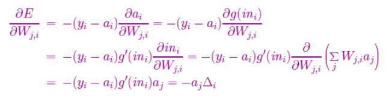

## Back-propagation: strato nascosto (intuitiva)

$$
W_{k,j}\gets W_{k,j}+\Delta W_{k,j}
$$

Anche per lo strato nascosto il generico peso deve essere aggiornato in questo modo

Il problema è definire una quantità analoga all’errore per i nodi di output, per questo si introduce il concetto di `retropropagazione`.

L’idea è che il nodo nascosto $j$ sia responsabile in parte dell’errore $\Delta_i$ in ognuno dei nodi di output ai quali è collegato. In questo modo i valori $\Delta$ sono suddivisi in base alla forza delle connessioni tra nodo nascosto e nodo di output e passati all’indietro per fornire i valori $\Delta_j$ allo strato nascosto.

$$
\Delta_j=g'(in_j)\sum_{i}W_{j,i}\Delta_i
$$

La regola di `propagazione` per i valori $\Delta$ è definita in questo modo

$$
W_{k,j}\gets W_{k,j}+\alpha\cdot a_k\cdot \Delta_j
$$

L’aggiornamento del peso è pertanto come mostrato, identica a quella che riguarda lo strato di output.

## Back-propagation: strato nascosto (formale)

$$
\begin{align*}
 \Delta W_{k,j} &= -\alpha\cdot\dfrac{\partial E}{\partial W_{k,j}}\\
  &= -\alpha\left(-a_k\cdot \Delta_j\right)\\
\end{align*}
$$

Formalmente quello che si fa è modificare il peso proporzionalmente al negativo della derivata dell’errore $E$

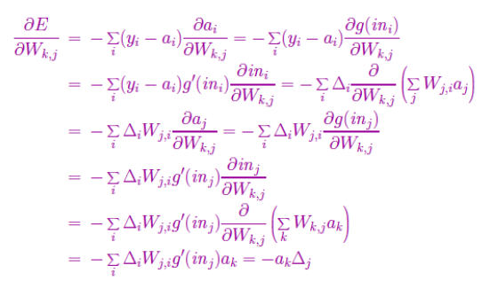

## Processo di retropropagazione

In sintesi, il processo di retropropagazione può essere descritto come segue:

- si calcolano i valori di $\Delta$ per le unità di output usando l’errore osservato
- cominciando dallo strato di output, si ripete quanto segue per ogni strato della rete fino a raggiungere l’ultimo strato nascosto
    - si propagano all’indietro i valori $\Delta$ verso lo strato precedente
    - si aggiornano i pesi tra i 2 strati

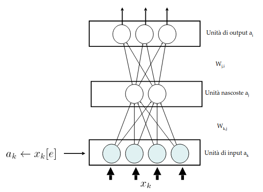

Si presenta un pattern di ingresso $x_k$ da cui si ottiene $a_k$

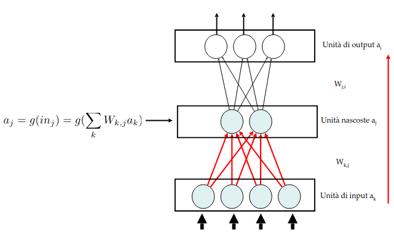

Se si hanno gli $a_k$, questi segnali vanno in input alle unità nascoste, da cui è possibile calcolare $a_j$

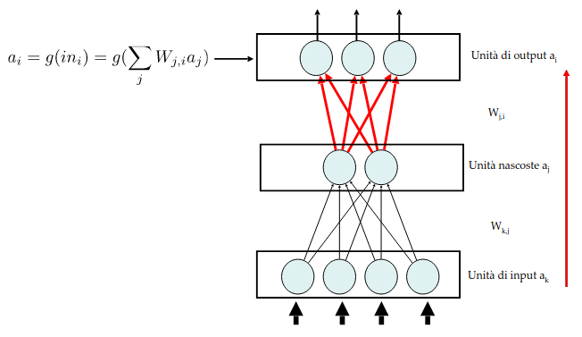

Calcolato $a_j$ si danno in input alle unita di output $a_i$, da cui si otterranno i valori di $a_i$

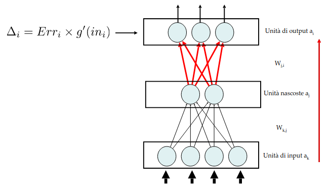

Adesso la rete da un risultato (per un solo esempio in questo caso).

Ci si calcola l’errore $\Delta_i$

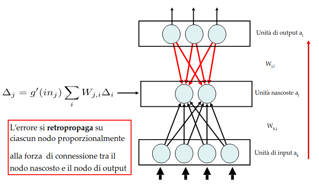

Si retropropaga calcolando $\Delta_j$

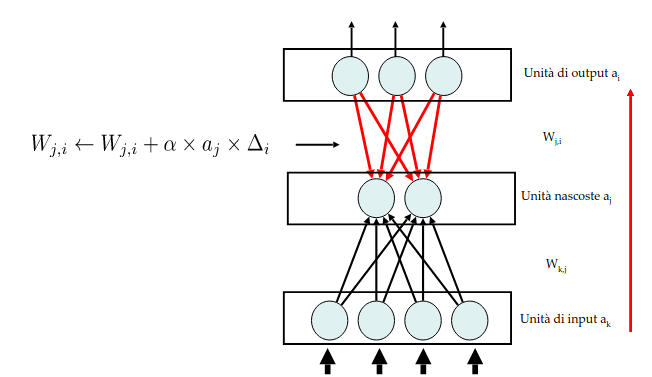

Si aggiornano i pesi $W_{j,i}$

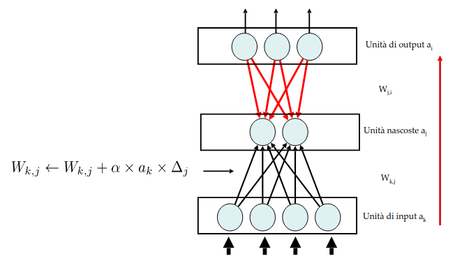

Come ulteriore passo visto che non ci stanno più unità nascoste si aggiornano i pesi $W_{k,j}$