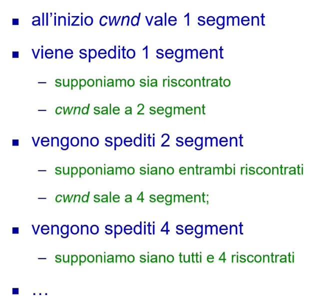
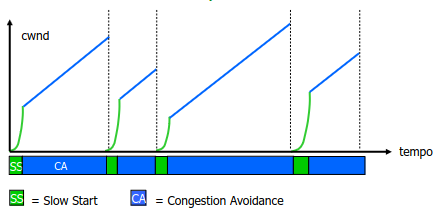
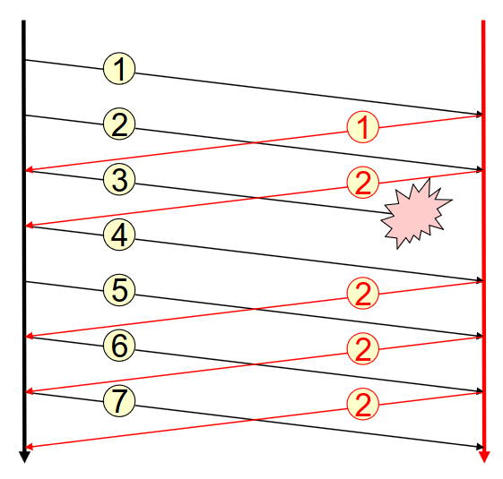
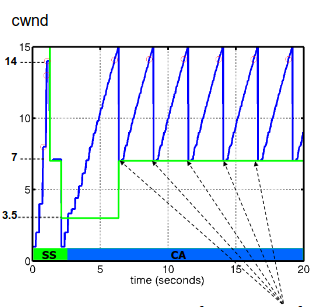

# 4 Dicembre

Argomenti: Algoritmo di Jacobson, Algoritmo di Karn, Algoritmo slow-start, Congestion avoidance, Fast Recovery, Fast Retransmit
.: No

## Algoritmo slow-start

- Quando si instaura una connessione (dopo il three-way handshake) la finestra di congestione `cwnd` è inizializzata alla dimensione del più grande segment utilizzabile quindi basandosi su `mss` che sta per maximum segment size
- Ogni segment riscontrato prima del timeout fa aumentare la finestra di congestione di un `mss`
- Se un segment viene perso (quindi che non arriva un riscontro prima del timeout) allora `cwnd` viene riportata al valore iniziale.

Se la trasmissione procede senza perdita di segment la finestra `cwnd` cresce esponenzialmente nel tempo

Quindi: 

- 1 → 2
- 2 → 4
- 4 → 8
- 8 → 16

L’obbiettivo è quello di stimare nel più breve tempo possibile la banda effettivamente disponibile per la connessione.

## Congestion avoidance

Oltre a `cwnd`, la finestra di controllo di congestione è gestita usando un ulteriore parametro: `ssthresh` che sta per slow start threshold

L’algoritmo di slow start con l’aggiunta di congestion avoidance funziona in questo modo:

- inizializzazione di `cwnd` a un `mss`
- quando un segment è riscontrato `cwnd` cresce
    - se `cwnd` $\le$ `ssthresh` allora `cwnd` aumenta di un `mss`
    - se `cwnd` $\gt$ `ssthresh` allora `cwnd` aumenta di $\frac{\text{mss}^2}{\text{cwnd}}$(crescita lineare)
- se si rileva una congestione (timeout) allora:
    - `ssthresh` è portata alla meta del minimo tra la finestra di controllo di flusso e la `cwnd` (ma deve valere almeno 2 `mss`)
    - `cwnd` è postata a `mss`

L’effetto dell’algoritmo è quello di far crescere la finestra di controllo di congestione esponenzialmente fino alla soglia e linearmente dalla soglia in poi, più congestioni ci sono più la soglia tende ad abbassarsi.

---

## Timeout e ritrasmissione

A ciascun segment è associato un timer di ritrasmissione che viene fatto partire quando il segment viene spedito e se il segment non è riscontrato entro il tempo in cui il timer di ritrasmissione raggiunge il timeout allora il segment viene ritrasmesso. Da questo si capisce che se il timeout è troppo breve si rischia di congestionare inultimente la rete mentre se è troppo lungo si perde di efficienza. 

La scelta del timeout di trasporto è più difficile di quello del datalink perche:

- `su un singolo link`: il tempo di arrivo di un ack è facilmente predicibile
- `sull’intera rete`: la varianza del tempo di ack è molto maggiore, la varianza e valore atteso del tempo di ack cambiano nel tempo e di conseguenza il timeout di tcp viene modificato continuamente.

## Algoritmo di Jacobson - misura del ritardo di roundtrip

Questo algoritmo si usa per misurare il ritardo del roundtrip:

- per ogni connessione viene gestita la variabile `rtt` (round trip time), che sarebbe la stima corrente del tempo per ricevere l’ack dal destinatario
- quando un segment viene riscontrato in tempo si dispone del suo tempo `M` di roundtrip
- `rtt` viene aggiornato con $\text{rtt}=\alpha\cdot \text{rtt}+(1-\alpha)M$ dove $\alpha$ misura quanto rapidamente bisogna tenere conto delle variazioni (normalmente è $7/8$). La variabile `rtt` può essere calcolata solo con addizioni, sottrazioni e shift.

Una volta calcolato `rtt` si ha $\text{timeout}=\beta\cdot\text{rtt}$. Nelle prime implementazioni di tcp si sceglieva $\beta=2$, poi si è osservato che $\beta$ dovrebbe dipendere dalla deviazione standard della distribuzione dei tempi di ack.

Varie implementazioni tcp usano $\text{timeout}=\text{rtt}+4D$ dove $D$ è detta deviazione media ed è una stima velocemente calcolabile della deviazione standard:

$$
D=\alpha\cdot D
+(1-\alpha)|\text{rtt}-M|
$$

## Algoritmo di Karn

Quando un segment è ritrasmesso non è chiaro a quale istanza di tramissione si riferisca il suo ack e questo influisce il calcolo di `rtt`. Con l’algoritmo di Karn il calcolo di `rtt` non considera i segment ritrasmessi introducendo anche un exponential backoff. 

---

## Fast Recovery e Fast Retransmit

In questo grafico ciò che è fortemente insoddisfacente è il ritorno della `cwnd` ogni volta al valore minimo.

Proprio per questo sono state messe a punto 2 tecniche chiamate `fast recovery` e fast `retransmit` basate sugli ack `duplicati`.

- RFC dice che il protocollo `TCP` quando arriva un segment fuori sequenza (contenente byte successivi a quelli attesi) viene generato immediatamente un ack (ack duplicato). La ricezione di vari ack duplicati con lo stesso numero è una forte evidenza del fatto che un segment si è perso.

In questa figura viene mostrato che se il pacchetto 3 non arriva al destinatario questo continua a chiedere l’invio del pacchetto numero 3

(nel disegno gli ultimi 2 sono in realtà dei 3)

- algoritmo `fast retransmit`: il segment che sembra essersi perso viene ritrasmesso immediatamente, senza attendere che scada il timeout
- algoritmo `fast recovery`: in questo caso non si porta al minimo `cwnd` ma si esegue `congestion avoidance`, perchè si suppone che si sia perso un solo segment e che quindi, visto che i dati continunano a fluire, sia una misura troppo drastica far ripartire slow start

Quindi i 2 algoritmi vengono implementati insieme:

- quando si riceve il terzo ack duplicato:
    - si modifica `ssthresh` come per `congestion avoidance`
    - si ritrasmette il segment mancante
    - si pone `cwnd` a `ssthresh`
    - si fa crescere `cwnd` in modo lineare

(Le freccie indicano fast retransmission e fast recovery)