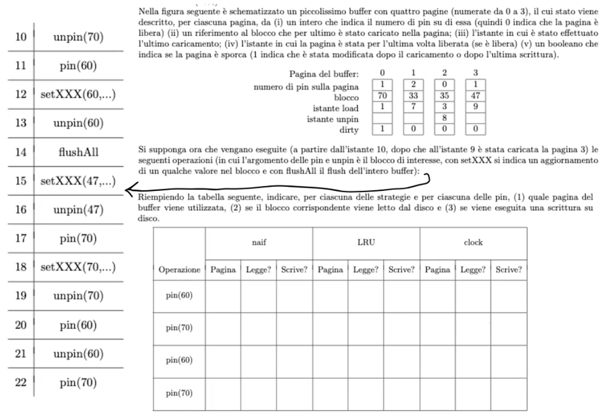

# 4 Marzo

Argomenti: Buffer Management, File system, Memoria principale e secondaria, Unità a stato solido
.: Yes

## Memoria principale e secondaria

I programmi possono fare riferimento solo a dati in memoria principale, le basi di dati devono essere in memoria secondaria per motivi di `dimensione` e `persistenza`.

I dispositivi di memoria secondaria sono organizzati in `blocchi` di lunghezza di solito fissa; una `pagina` è un’area di memoria centrale della stessa dimensione di un blocco e il sistema operativo assegna un numero ad ogni blocco del disco, in sostanza ogni blocco ha un indirizzo univoco nel sistema di elaborazione

- il costo di un accesso a memoria secondaria è $4$ o più ordini di grandezza di quello per operazioni in memoria centrale
- nelle applicazioni `I/O bound` (cioè con molti accessi a memoria secondaria e relativamente poche operazioni) il costo dipende quasi esclusivamente dal numero di accessi a memoria secondaria
- la lettura di un bit o di un intero blocco ha lo stesso costo
- accessi a blocchi vicini costano meno, in particolare se il disco legge e memorizza in una propria cache intere tracce

## Unità a stato solido

Le caratteristiche principali sono:

- permettono l’accesso diretto a costo uniforme perché non hanno parti meccaniche
- hanno prestazioni in scrittura che peggiorano nel tempo, perché il numero di operazioni di riscrittura è limitato e si usano tecniche che fanno scrivere in posizioni diverse

## File system

Il `file system` è il componente del sistema operativo che gestisce la memoria secondaria, di solito a 2 livelli:

- a livello `basso`: con primitive che agiscono sui singoli `blocchi`,
- a livello `alto`: con primitive che agiscono sui `file`,

## DBMS e file system

Le funzionalità che possono essere utilizzate dai `DBMS` sono:

- a livello di `blocchi`: è possibile avere un controllo completo su come i blocchi sono utilizzati e dove sono posizionati ma i dischi devono essere a completa disposizione del `DBMS` e l’amministrazione deve essere più sofisticata
- a livello di `file`: è più facile da realizzare ma con meno efficienza

Quello che fanno di solito è utilizzare una soluzione intermedia, cioè normalmente creano ed eliminano file di grandi dimensioni e poi utilizzano lo spazio all’interno di questi grandi file come se fosse il disco proprio per gestire l’allocazione e il contenuto dei blocchi

## Buffer management

Il `buffer` è un area di memoria centrale gestita dal `DBMS`. Lo scopo è quello di ridurre il numero di accessi alla memoria secondaria.

C’è una tavola che per ogni pagina mantiene un insieme di informazioni utili, per esempio:

- un identificatore fisico del blocco
- 2 variabili di stato: un contatore che indica quanti programmi utilizzano la pagina e un booleano che indica se la pagina è stata modificata.

Il `buffer manager` riceve le richieste di lettura e scrittura e le esegue accedendo alla memoria secondaria solo quando indispensabile e utilizzando invece il buffer quando possibile; esegue le seguenti primitive:

- `fix`/`pin`: richiesta di un blocco da parte di un programma
    - restituisce il numero della pagina in cui è presente il blocco
    - esegue una lettura fisica se il blocco non è nel buffer
    - incrementa il contatore associato al blocco stesso
- `unfix`/`unpin`: indica che il programma ha concluso l’utilizzo della pagina
    - decrementa il contatore associato alla pagina
- `setDirty`: comunica al buffer manager che la pagina è stata modificata e non ancora salvata in memoria secondaria
    - tiene traccia dell’informazione
- `force`/`flush`: trasferisce in modo sincrono una pagina in memoria secondaria
    - scrive su disco

## Strategia di rimpiazzo

Si ha l’esigenza di scegliere quale pagina libera associare al blocco necessario all’utilizzo. Se si suppone strategia `no-steal` si hanno:

- `naif`: si utilizza per il rimpiazzo la pagina libera
- `FIFO`: utilizza per il rimpiazzo la pagina che si trova nel buffer da più tempo
- `LRU`: utilizza per il rimpiazzo la pagina libera che è stata usata meno di recente
- `clock`: fa una scansione come in naif, ma inizia dalla pagina successiva a quella del rimpiazzo precedente

---

## Esercizio

Esercizio di una prova intermedia di cui si hanno:

- buffer con 4 pagine
- operazioni negli istanti $10-22$

[Metodo NAIF](Metodo_NAIF_36d05f3a3bd74dda94ac58777045aa00.md)

[Metodo LRU](Metodo_LRU_c3efce49dea34f43b62fdc570828b256.md)

Per la clock basta che ci si ricorda l’ultima pagina nel buffer che è stata utilizzata per utilizzare il ciclo dalla pagina dopo.