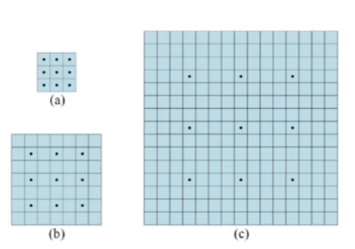
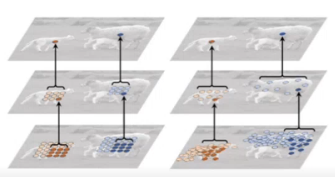
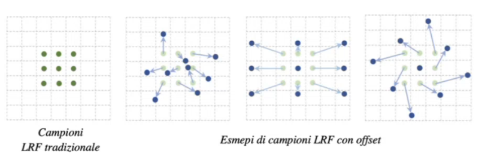
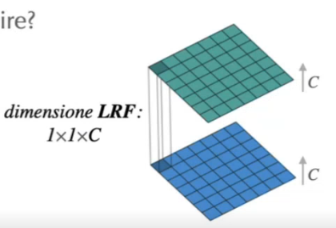
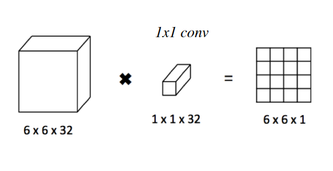
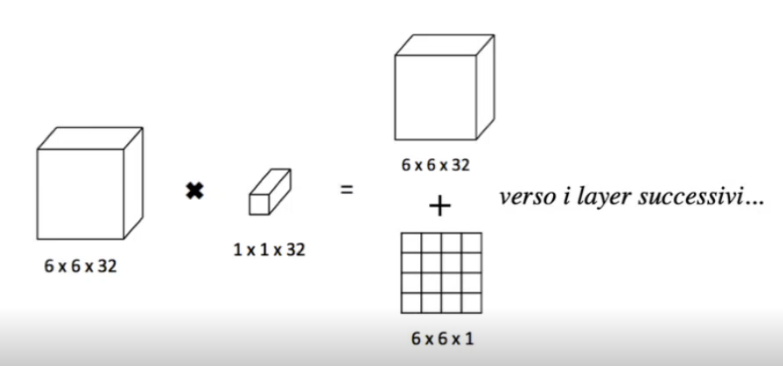

# 4 Ottobre

Tags: Deformable convolutions, Dilated convolution kernels, Pointwise convolution
.: Yes

## Identificare caratteristiche: LRF vs numero layer

Nelle `MLP` un nodo poteva accedere all’intero input, e specializzarsi su specifici pattern. Con le `LRF` si limitano le informazioni analizzate contemporaneamente, questo significa che nei primi layer non si avranno tante informazioni per estrarre le feature; quello che si fa quindi è avere molti layer per poter analizzare più dati in input.

In altri casi aumentare la profondità della rete, cioè estrarre più precisamente le feature, non è l’unica soluzione. Si desidera solo che un nodo nei primi layer possa comunque analizzare dati grezzi su porzioni spaziali estese

## Dilated convolution kernels

Le `dilated-convolution-kernels` vengono in aiuto in questi casi, estendono i `LRF` mantenendo limitato il numero di parametri.

Cioè si ignorano alcuni elementi della feature-map in input, si introduce quindi l’iperparametro `dilatation-factor` $l$ tale che $l-1$ elementi consecutivi saranno ignorati nella feature map in ingresso.

In questo esempio vengono mostrati 3 esempi di kernel, dove i punti sono i valori che si vanno ad analizzare durante la convoluzione

$(a)$ 3x3 kernel

$(b)$ 2-dilated 7x7 kernel

$(c)$ 4-dilated kernel

In questi 3 filtri i campioni sono sempre gli stessi, ma si pescano elementi spazialmente più distanti. Ci sono certi casi quando questi tipi di filtri danno buonissime prestazioni, il motivo è che si riducono i campioni da analizzare; il pooling per quanto bene lavora considera tutti gli elementi della matrice.

(Da non confondere stride con dilated factor)

## Deformable convolutions (filtri deformabili)

Fino ad adesso sono stati visti filtri con geometria `fissa`, il problema è che non sono in grado di riconoscere caratteristiche associate a trasformazione geometriche.

Nelle `deformable convolutional networks` la rete stima un valore di `offset` rispetto ai campioni della feature map interessati dal `LRF`. In sostanza questo valore di offset dice di quanto ci si può spostare per andare a vedere se c’è qualcos’altro da considerare mantenendo però il numero di elementi.

Questi offset nel dominio 2D sono piccoli spostamenti che i campioni subiscono prima di essere presi per il calcolo convolutivo. Quindi anche questi valori di offset sono da stimare.

Lo stesso procedimento può essere applicato ad un layer di pooling ottenendo un `deformable RoI pooling`. (RoI: region of interest)

## 1x1 convolution (pointwise convolution)

La `1x1` convolution è un filtro di dimensione $1\times 1\times C$ e perciò si applica ad input di qualsiasi dimensione e profondità $C$.

Serve quando si hanno più canali, cioè se in input si ha una feature-maps con profondità $C$, ogni mappa rappresenterà l’importanza di una diversa caratteristica in una certa posizione.

Quindi quello che si fa è raccogliere le informazioni di $C$ features diverse, valutate per determinare un singolo output

Questo tipo di convoluzione effettua un `feature-pooling`, combinando linearmente caratteristiche legate tra loro da un certo legame spaziale. Questa cosa funziona bene quando si hanno tante feature-maps.

Il pooling tradizionale aggrega più caratteristiche spazialmente vicine ma si limita ad una `feature-map` alla volta. In ambito di data fusion la si può pensare come `feature-level-fusion`.

Il vantaggio di questo approccio è che crea nuove proiezioni lineari a partire dalle feature map correnti.

I layer successivi poi possono sfruttare sia l’output delle feature maps originale con le mappe create dalla 1x1 conv.

## Caratteristiche salienti

- `connesioni locali`: ogni nodo non è più collegato con tutti i nodi dello strato precedente, ma solo ad una regione limitata, in modo da ridurre i parametri e accelerare la convergenza
- `condivisione dei pesi`: un gruppo di connessioni può condividere gli stessi pesi, riducendo ulteriormente i parametri
- `dowsampling`: lo strato di pooling sfrutta il principio della correlazione locale dell’immagine, riducendo la quantità di dati ma conservando le informazioni utili. Inoltre può ridurre caratteristiche non significative e affrontare fenomeni di overfitting nei casi in cui i canali sono numerosi.