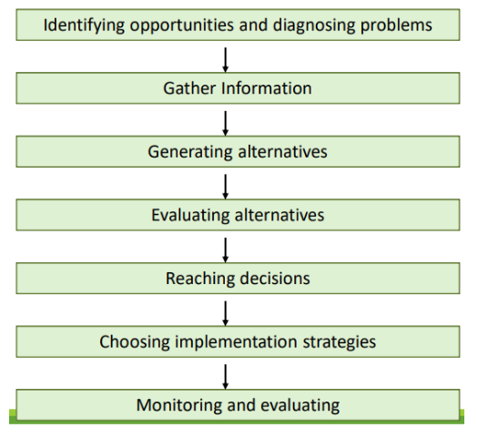

# 4 Ottobre

Argomenti: Decision Making
.: Yes

## Decision Making

Il processo decisionale risulta un’operazione cruciale per ogni tipologia di contesto aziendale e, proprio in quest’ambito, la matematica e la computer science sono evolute al fine di perfezionare le tecniche per la previsione dei possibili risultati utili allo svolgimento di questa operazione. Il `Decision Making` permette di ottimizzare il processo decisionale utilizzando dei `metodi quantitativi` per una efficace gestione e analisi delle informazioni pertinenti e appropriate che permettono di effettuare la scelta migliore fra le varie alternative. L’elevata quantità di dati, prelevati da diverse fonti, sono fondamentali all’interno del processo decisionale e il processo di organizzazione e esame delle informazioni viene definito `processo di modellazione`.

Di seguito verranno mostrati diversi modi per classificare le tipologie di decisioni.

## Tassonomia delle decisioni

Esistono diverse tipologie di `Decision Making` in relazione a quello che è il livello gerarchico in cui viene intrapresa la decisione e dalla sua rilevanza in tutto il contesto aziendale. Esistono varie tipologie di decisioni:

- decisioni `non-strutturate`: Il decisore deve fornire una valutazione del problema senza potersi ricondurre ad una procedura già nota, in quanto tale decisione non è mai stata presa.
- decisioni `strutturate`: Il decisore per garantire l’efficienza nel processo decisionale può seguire delle procedure già stabilite, in quanto tali problemi risultano ripetitivi e di routine.
- decisioni `semi-strutturate`: Combinazione delle precedenti in cui alcune parti del problema possono essere ricondotte a procedure ben stabilite, altre no.

## Tipologia delle decisioni

Esistono 3 tipi di decisioni:

- decisioni `strategiche`: sono decisioni a lungo termine e tendono ad un alto rischio di fallimento o problematiche. In generale riguardano la policy del business, acquisizioni di aziende, investimenti; sono necessari informazioni riguardanti previsioni di mercato, tendenze politiche e sociali.
- decisioni `tattiche`: sono decisioni che si basano sul risultato di quelle `strategiche`, il risultato di queste decisioni è molto prevedibile e quindi hanno un rischio minore. In generale riguardano la preparazione del budget come bilanci e capacità di produzione; sono necessari informazioni su costi, vendite e budget a disposizione.
- decisioni `operative`: sono decisioni a breve termine e quindi di routine. Hanno un rischio molto contenuto e sono in generale usate per esempio in production scheduling o re-ordering

## Decisioni programmate e non-programmate

I managers hanno tempo limitato e devono usare il loro tempo in modo efficiente, per questo è importante per loro distinguere le decisioni in 2 categorie:

- decisioni `programmate`: decisioni che si sanno in anticipo di dover fare. Solitamente seguono una struttura o una routine (strutturate) e sono dei processi ripetitivi nell’ambito aziendale, come ad esempio ordini di materie prime per la produzione.
- decisioni `non-programmate`: sono decisioni nuove, inattese che richiedono molta attenzione, solitamente associate a decisioni non strutturate. Rappresentano dei processi decisionali per cui non si hanno informazioni complete a disposizione, per cui viene lasciato spazio al pensiero creativo. Ad esempio sono scelte per adottare o meno una nuova tecnologia, prevede di raccogliere in anticipo delle informazioni aggiuntive per effettuare la decisione corretta.

La `qualità` della decisione scelta dipende dall’importanza e dalla qualità delle informazioni che si hanno a disposizione durante il processo decisionale. Non sempre avere una quantità alta di informazioni aumenta la possibilità di eseguire una buona decisione, quello che si può dire per certo è che la possibilità di aumentare la qualità della decisione dipende dal numero di informazioni di diversa tipologia attualmente in possesso. 

Quindi per migliorare il processo di scelta bisogna aumentare la qualità della `information collection` e il processo di `analisi`.

## Processo decisionale

- `identificazione del problema`: per prima cosa si procede a identificare il problema e gli obiettivi, successivamente quali sono i risultati che ci si aspetta
- `raccolta delle informazioni`: una volta identificato il problema, si raccolgono delle informazioni pertinenti al problema. Una cosa molto importante è capire quali sono le informazioni necessarie e da quali fonti ottenerle, questa raccolta può avvenire da fonti interne o esterne all’azienda.
- `generare alternative`: si valutano le diverse soluzioni proposte in funzione del trade-off e obiettivi da soddisfare.
- `valutazione delle alternative`: si valutano le varie alternative proposte in funzione delle scelte effettuate da altre aziende, dall’analisi delle scelte del passato e dai possibili punti di fallimento.
- `decisione`: si sceglie l’alternativa migliore tra quelle proposte, non sempre però la soluzione è chiara
- `attuare la decisione`: si sviluppa un piano al fine di implementare le scelte effettuate
- `valutazione e monitoring`: si analizza l’impatto che tale decisione ha portato in relazioni ai vari obiettivi prefissati, cercando eventualmente di correggere le scelte che non sono andate a buon fine.