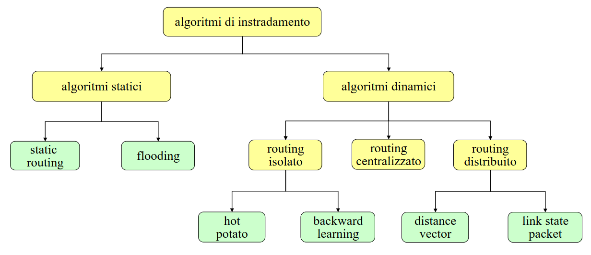
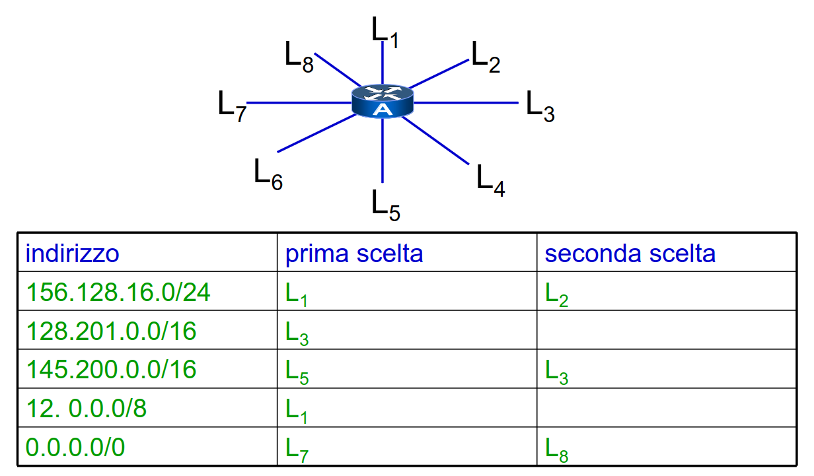

# 4 Ottobre

Argomenti: Algoritmi Dinamici, Algoritmi Statici, Qualita degli Algoritmi di instradamento, Routing Centralizzato, Routing Distributo, Routing Isolato
.: Yes

## Qualità degli algoritmi di instradamento

- `Efficienza`: per evitare che il calcolo dei cammini verso le destinazioni abbia un peso eccessivo rispetto all’instradamento dei pacchetti.
- `Ottimalità nella scelta dei cammini`: bisogna trovare un qualche criterio con cui si misura il peso del cammino. Normalmente si usa il numero di hop o il costo delle linee. Bisogna avere anche criteri che tengono in considerazione il carico corrente della rete che sono difficili da considerare.
- `Robustezza e Adattabilità`: la topologia di rete è molto variabile e si possono creare guasti alle linee e/o ai router.
- `Stabilità`: subito dopo la variazione della rete bisogna trovare velocemente un nuovo instradamento stabile.
- `Equità`: nessun nodo della rete deve essere privilegiato o danneggiato.
- `Economicità`: i costi di configurazione e manutenzione dei protocolli di routing sono ridotti.

## Algoritmi di instradamento

La scelta di un algoritmo è molto difficile, l’obbiettivo è quello di minimizzare il ritardo di pacchetti e massimizzare l’utilizzo delle linee. Gli algoritmi complessi possono comportare configurazioni difficili.

Ci sono 2 tipi di algoritmi di instradamento:

- algoritmi `statici`: i criteri di instradamento sono fissi e quindi non dipendono dalla topologia della rete.
- algoritmi `dinamici`: gli algoritmi di instradamento si comportano diversamente in base alla topologia di rete e/o al carico.

---

## Algoritmi Statici

## Static routing

Su ogni nodo c’è una tabella che contiene, per ogni nodo da raggiungere, la linea da usare e la tabella è compilata dall’amministratore di sistema

- variante `quasi-statica`: l’amministratore di sistema fornisce più alternative in ordine di priorità, che vengono scelte in funzione dello stato della rete
    
    
    

## Flooding

Ogni pacchetto viene ritrasmesso su tutte le linee, salvo quella da cui è arrivato.

- variante `quasi-statica`: si ritrasmette solo su un insieme di linee selezionato, i pacchetti vengono scartati se sono troppo vecchi oppure se passano per la seconda volta su un nodo.

Queste varianti hanno bisogno di memorie estese e di identificatori di pacchetto

## Algoritmi Dinamici

# Routing Isolato

Ogni `is` calcola in modo indipendente le proprie tabelle, senza consultare gli altri `is`.

- `hot potato routing`: il pacchetto viene inviato sulla linea con coda più breve
- `backward learning`: la linea di uscita del pacchetto viene inferita in base agli indirizzi mittente dei pacchetti in ingresso.
    - Questo metodo viene `raffinato` aggiungendo un campo nei pacchetti che specifica il costo, incrementato ad ogni attraversamento di `is`, in questo modo si possono mantenere in ogni is più alternative ordinate per costo, lo svantaggio è che si imparano solo le migliorie e non i peggioramenti perché non si stanno considerando il tempo di scadenza degli entry
    - Quando la destinazione è ignota si fa `flooding`
    - Può generare `cicli`, quindi si accoppia di solito con il calcolo di uno spanning tree.

---

# Routing Centralizzato

Presuppone l’esistenza di un routing control center `rcc` che conosce la topologia della rete, il che non è quasi mai soddisfatto. Il `rcc` riceve da tutti i nodi informazioni sulla topologia, calcola le tabelle di instradamento e le distribuisce. Usando questo metodo si ha un alto traffico intorno al `rcc` perché girano sia le informazioni che riceve dai nodi e le tabelle di instradamento che sta distribuendo ai vari nodi.

---

# Routing Distribuito

Non esiste un `rcc`, ma le sue funzionalità sono svolte da tutti gli `is`. Esistono 2 principali paradigmi e sono `distance vector`(si dice ai vicini tutto ciò che si sa del mondo) e `link state packet`(dico a tutto il mondo ciò che si sa dei vicini).