# 5 Aprile

Argomenti: Algoritmo k-NN, KD-trees
.: No

## Document Retrieval

Nel document retrieval è necessario trovare un modo per misurare la similarità tra un corpus di documenti, per effettuare le ricerche si utilizza l’approccio del nearest neighbor. Di seguito sono mostrati 2 algoritmi che utilizzano l’approccio nearest neighbor.

## Algoritmo 1-NN

Si da in input un documento $\bold x_q$ per la query e documenti $\bold x_i$ con $i\in[1,n]$, in output viene dato il documento $\bold x_i$ più vicino a $\bold x_q$

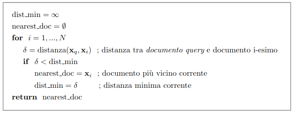

## Algoritmo k-NN

Si da in input un documento $\bold x_q$ per la query e documenti $\bold x_i$ con $i\in[1,n]$, in output viene dato una lista dei $k$ documenti più vicini a $\bold x_q$

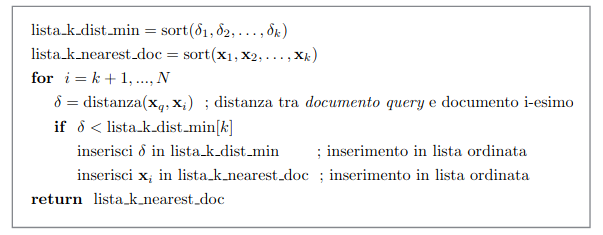

## Criticità della NN search

Per effettuare una ricerca dei nearest neighbors occorre risolvere i seguenti problemi:

- rappresentazione degli item coinvolti
- valutazione della distanza tra gli item, quindi definire una metrica che consenta di calcolare la similarità tra i vari item

## Rappresentazione dei documenti

Ci sono 2 possibili metodi per la rappresentazione dei documenti non strutturati e sono la `bag-of-words` e `tf-idf`.

## Metriche

$$
sim(\bold x_i,\bold x_q)=\dfrac{\bold x_i^T\cdot \bold x_q}{||\bold x_i||\cdot ||\bold x_q||}
$$

Una metrica largamente utilizzata per quantificare la similarità tra 2 documenti $\bold x_i$ e $\bold x_q$ è la cosine similarity che si avvale della rappresentazione vettoriale dei documenti

## Complessità della ricerca

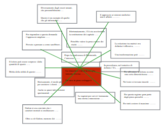

Il calcolo delle distanze tra documenti può essere computazionalmente pesante quando $N$ è molto elevato.

Dato un query point il costo della scansione su tutti i punti è:

- $O(N)$ per una query per $1-NN$
- $O(N\cdot log(k))$ per una query per $k-NN$

## KD-trees

Per rendere più efficiente la ricerca è possibile utilizzare questa struttura dati che permette un’organizzazione strutturata degli item partizionando ricorsivamente i data point in `axis-aligned-boxes`. 

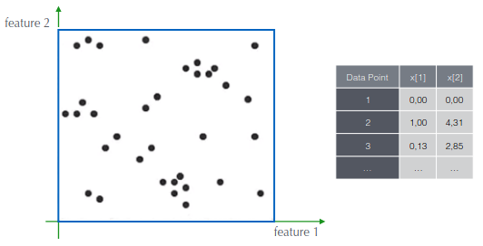

Si suppone di avere questi data point, 

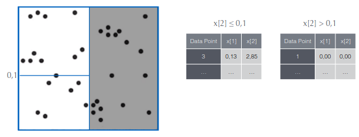

Si fa poi una suddivisione sulle 2 feature

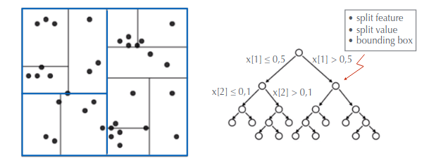

Si procede in tal modo fino a completare l’albero

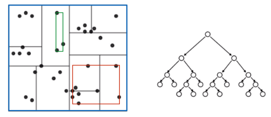

Il bounding box è il più piccolo rettangolo che contiene tutti i punti

Quando si deve decidere la scelta della feature dove fare lo split si considerano le seguenti euristiche

- scelta della dimensione
- valore della feature a cui effettuare lo split
- condizione di terminazione, ad esempio il numero di punti contenuti dai rettangolini se il loro numero sta sotto una determinata soglia

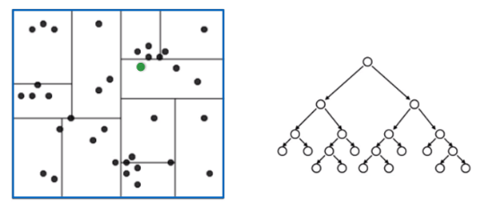

Dato un query point, si attraversa l’albero alla ricerca del nearest neighbor

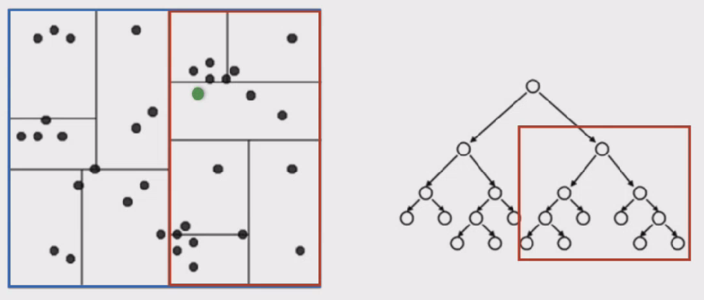

Naturalmente avendo le coordinate si può navigare nell’albero

e cosi via

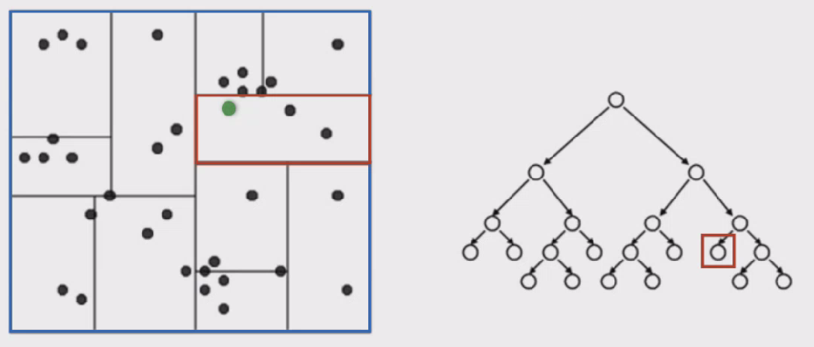

fino ad arrivare alla foglia che contiene il query point

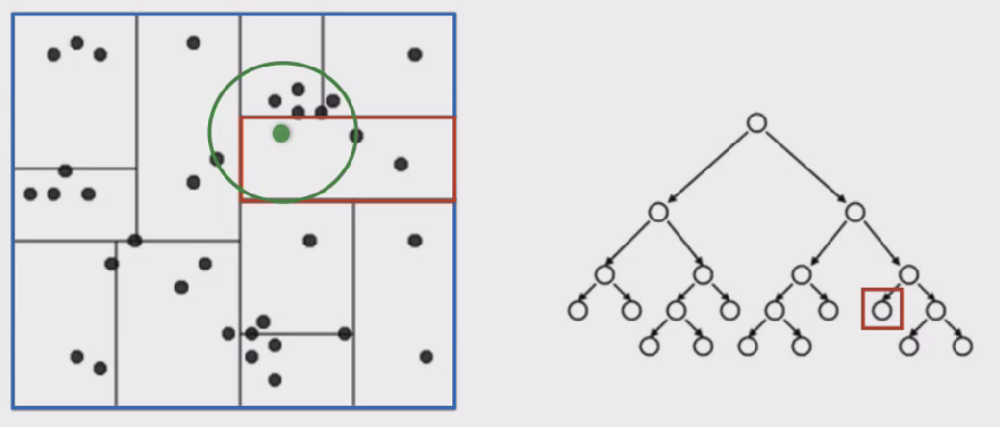

A questo punto si calcolano le distanze del query point con gli altri punti che si trovano all’interno del rettangolo rosso

Si ottiene che la distanza minima è la distanza che collega il punto con il punto più vicino; da cui si traccia un cerchio

Si fa backtrack e si provano gli altri rami per ogni nodo visitato, per vedere se ci sono punti più vicini

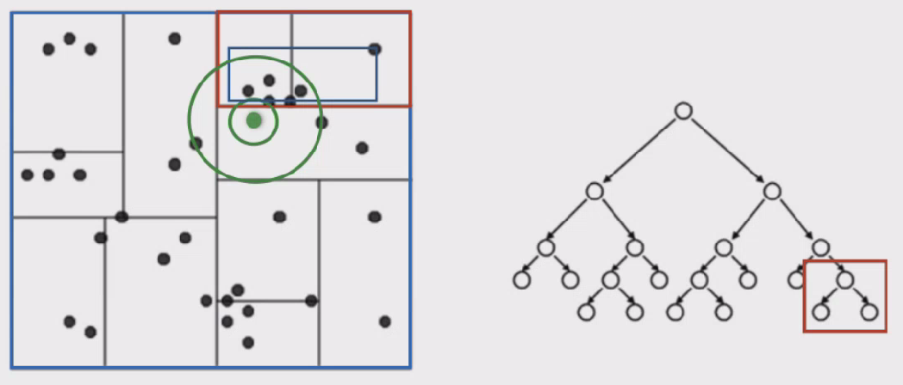

Quello che si fa è calcolare la distanza del query point dal bounding box degli altri rami.

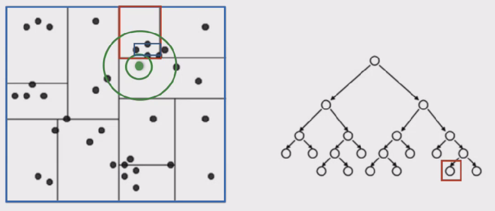

La distanza è minore di quella corrente, perciò si visitano i sottoalberi

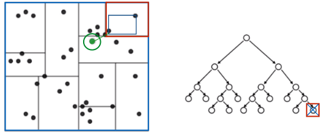

Visto che la distanza dal bounding box di questo nodo è superiore alla minima viene potato

(Il professore qui non è stato chiaro ma la nuova distanza corrente diventa quella mostrata in questa immagini, in teoria vuole dire che data quella distanza si hanno i documenti più simili possibili)

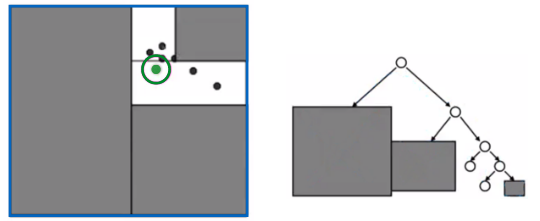

Si fa backtrack e si provano altri rami per ogni nodo visitato ottenendo come mostrato in figura il pruning complessivo

Si ottengono alla fine i punti più vicini