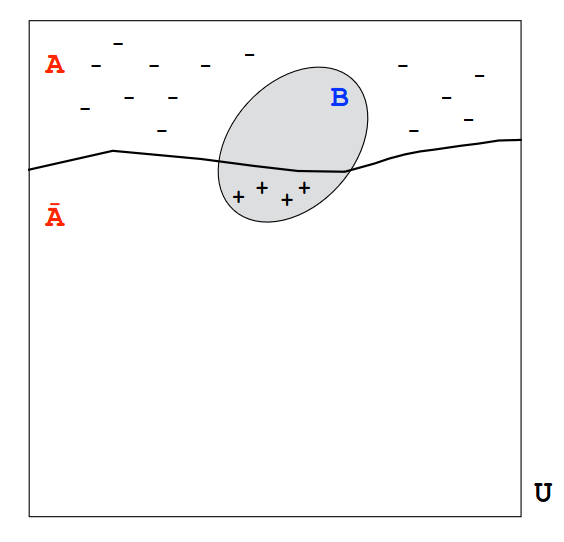
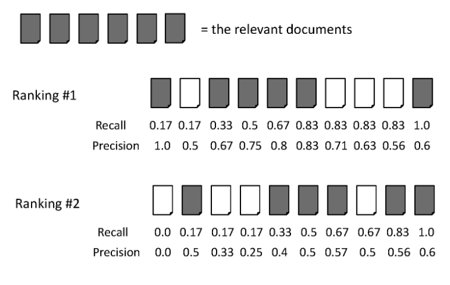
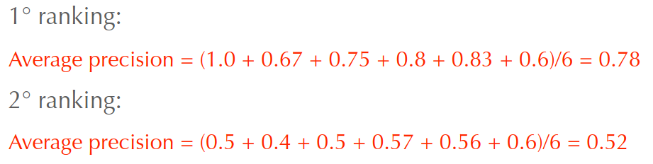
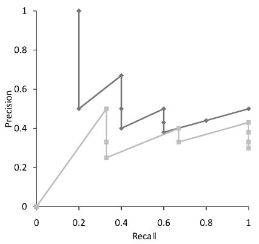
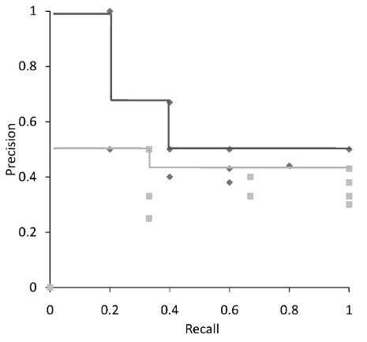
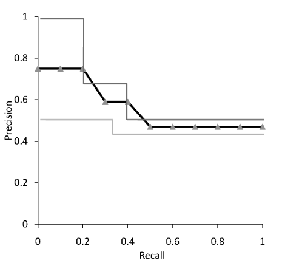
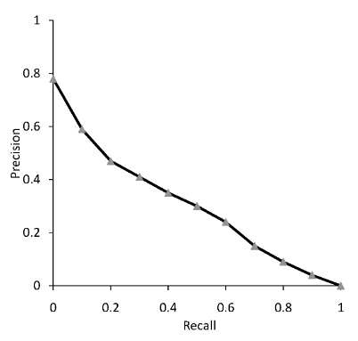

# 5 Dicembre

Argomenti: Average Recall-Precision Graph, Discounted Cumulative Gain, F-Measure, Fallout, Mean Average Precision, Precision, Ranking, Recall, Reciprocal Rank, Sintetizzazione di un Ranking
.: Yes

## La valutazione

L’`efficacia`,l’`efficienza` e il `costo` sono correlati, ad esempio se si vuole ottenere un particolare livello di efficacia e di efficienza, questa scelta determinerà il costo della configurazione del sistema.

Per gli esperimenti si usano le `evaluation corps`, che sono una collezione di test consistente in documenti, queries e giudizi di rilevanza.

## Misure di Efficacia

Le due metriche più comuni per la valutazione dell’efficacia dei sistemi di `IR` sono la

 `precision` e la `Recall`.

- `precision`: misura la capacità di rifiutare documenti non rilevanti
- `recall`: misura la capacità di un sistema di IR di recuperare il maggior numero possibile di documenti rilevanti per una query.

La definizione di queste misure da per scontato che, con una query vengono recuperati un insieme di oggetti mentre il restante non viene recuperato.

## Errori di Classificazione

Ci sono due tipi di errori che possono essere commessi in un processo di retrieval:

- `falsi positivi`: si verifica quando è recuperato un documento non rilevante, questi sono classificati come errori di tipo 1
- `falsi negativi`: si verifica quando un documento rilevante non viene recuperato, questi sono classificati come errori di tipo 2

Nel disegno i $+$ stanno per `falsi positivi` mentre i $-$ stanno per `falsi negativi`.

Mentre $A$ è l’insieme dei documenti rilevanti e $B$ è l’insieme dei documenti recuperati

$$
Recall=\frac{|A\cap B|}{|A|}
$$

$$
Precision=\frac{|A\cap B|}{|B|}
$$

Recall è di tipo 1, Precision è di tipo 2

## Fallout

Questa metrica è correlata con l’errore di tipo 1 ed è definita come:

$$
Fallout=\frac{|\overline{A}\space\cap B|}{|\overline{A}|}
$$

In pratica rappresenta la porzione di documenti non rilevanti che vengono recuperati

## F-Measure

Questa metrica è la `media armonica` della recall e precision:

$$
F=\frac{1}{\frac{1}{2}(\frac{1}{R}+\frac{1}{P})}=\frac{2RP}{(R+P)}
$$

Il suo risultato indica con un solo numero l’efficacia di un sistema di search. Si usa la media armonica perchè enfatizza l’importanza dei piccoli valori

## Efficacia del Ranking

I modelli di retrieval studiati in precedenza producono un `ranked output`. 

Supponiamo di avere 2 algoritmi di information retrieval, bisogna trovare un modo per confrontarli. Si utilizzano vari metodi per misurare l’effiacia.

Nell’immagine viene mostrato che per ogni ranking si ha il risultato di un algoritmo; a destra vengono mostrati i documenti recuperati con i relativi valori di recall e precision.

In base a questi valori di recall e precision è possibile determinare quali dei 2 algoritmi è migliore in base a vari criteri.

## Sintetizzazione di un Ranking

Quando si hanno un numero elevato di documenti rilevanti, la lista di valori precision-recall per ogni posizione è molto lunga e difficile da usare, sono state quindi definite tecniche per riassumere l’efficacia di un algoritmo di ranking:

- `precision at rank p` ($P@p$): consiste nel calcolare i valori di precision-recall per un piccolo numero di posizioni `p` nel ranking predefinite. Questa misura è tipicamente usata per confrontare i risultati di una serach al top del ranking ottenuto. I valori più comuni sono $P@10$ e $P@20$
- un altro metodo consiste nel calcolare la precision per valori standard di livelli di recall da 0.0 a 1.0 con incrementi di 0.1, quindi si ottiene che ogni ranking è rappresentato usando 11 numeri. Però risulta chiaro che i valori di precision per i vari livello standard non sono sempre disponibili e che quindi occorre interpolare.
- `average precision`: consiste nel riassumere il ranking facendo la media aritmetica dei valori di precision in corrispondenza dei documenti rilevanti (dove la recall si incrementa).
    
    
    

- Di solito vengono mostrate le tecniche di averaging su più query
(Averaging Across Queries)

## Mean Average Precision (MAP)

Questa misura di efficacia rappresenta la media aritmetica delle average precision dei vari rank:

$$
MAP=\frac{1}{n}\cdot \sum_{i=1}^{n}Average\_Precision(i)
$$

Questa misura è usata spesso in articoli di ricerca per la valutazione di sistemi di IR

## Grafici Recall-Precision

La `MAP` fornisce una descrizione sintetica dell’efficacia di un algoritmo di ranking applicato su molte query, però si perde molta informazione in questo processo perciò si usano i `grafici recall-precision` che forniscono maggiori dettagli sull’efficacia degli algoritmi ai vari livelli di recall. I grafici per le singole query sono in genere molto diversi tra di loro quindi per generare un grafico che riassuma l’efficacia sulle varie query occorre mediare i valori di recall-precision.

Visto che i valori standard di recall vanno a 0.1 a 1.0 con incrementi 0.1 con la media aritmetica dei valori di precision per tutte le query si ottengono dei valori diversi da quelli standard, occorre quindi interpolare:

$$
P(R)=max\{P':R'\ge R \wedge (R',P')\in S \}
$$

dove $S$ è l’insieme di punti $(R,P)$ osservati. Questa formula produce una `step function`.

In queste 2 immagini sono mostrate i grafici recall-precision senza e con interpolazione.

## Average Recall-Precision Graph

Nella prima figura viene mostrata la media del grafico `recall-precision`. Nella seconda figura viene mostrata sempre una `average recall-precision` graph ma con 50 query ottenendo un grafo più arrotondato

## Reciprocal Rank e MRR

- La `reciprocal rank` è stata usata per applicazioni in cui c’è in genere un solo documento rilevante ed è definita come il reciproco del rank in cui è stato posto il documento rilevante recuperato
- La `MRR` è la media dei valori del `reciprocal rank` per un certo numero di query

## Discounted Cumulative Gain

Questa metrica è popolare per la valutazione della web search ed è basata sulle seguenti assunzioni:

- i documenti altamente rilevanti sono più utili dei documenti marginalmente rilevanti
- più e bassa la posizione nel ranking di un documento rilevante, meno utile è tale documento per l’utente

Queste 2 assunzioni portano ad una valutazione che usa una “rilevanza graduata” come `gain`. Questo `gain` è accumulato partendo dalla prima posizione del ranking, e può essere ridotto (`discounted`) via via che ci si allontana verso le posizioni più basse. Un tipico valore del discount è $\frac{1}{log(rank)}$, se si sceglie come base il valore 2 allora il discount al rank 4 è di 1/2 al rank 8 è di 1/3 e cosi via.

$$
DCG_p=rel_1+\sum_{i=2}^{p}\dfrac{rel_i}{log_2(i)}
$$

Il gain totale accumulato ad un particolare rank $p$ è mostrato a sinistra, dove $rel_i$ è il livello di rilevanza graduata del documento recuperato al rank $i$.

Per facilitare il calcolo della media su differenti query con differenti numeri di documenti rilevanti, i valori possono essere normalizzati con il DCG ad ogni rank con il DCG del perfect ranking di ogni query.