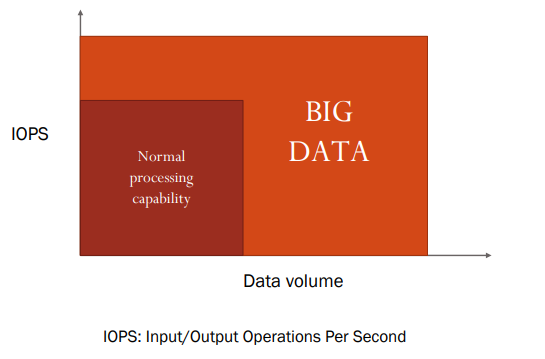
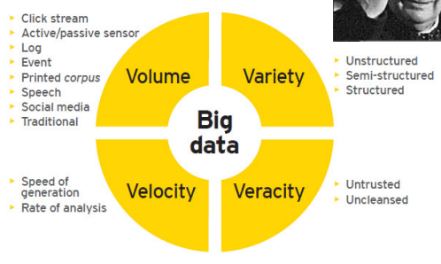

# 5 Marzo

Tags: Introduzione
.: Yes

Il concetto `big` è legato al volume perciò bisogna fare conto anche dell’efficienza, quindi numero di operazioni che vengono eseguite al secondo.

In questa immagine viene caratterizzato il mondo del `big-data`

Insieme a questi 4 concetti bisogna aggiungere il concetto di `value` perché è possibile generare molta informazione per avere vantaggi di competizione nel mercato, quindi genera valore.