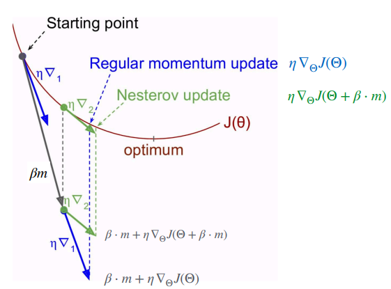
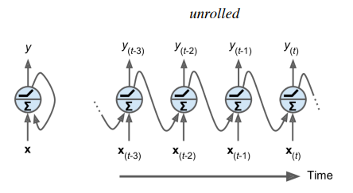
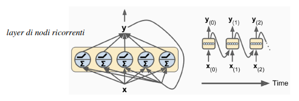
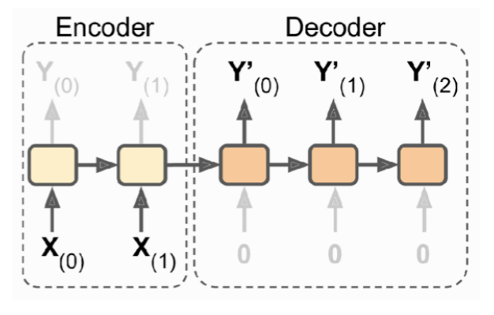

# 5 Novembre

Tags: Algoritmo AdaGrad, Algoritmo RMSProp, Architetture RNN, Learning rate schedule, Memory Cells, Nesterov Accelerated Gradient, Nodi Ricorrenti, RNN
.: Yes

## Nesterov Accelerated Gradient (NAG)

Si considera la variazione del momentum dove il gradiente non è valutato nella posizione corrente ma nella direzione del momentum cioè nel punto $\Theta+\beta\cdot m$. 

$$
m\gets \beta\cdot m+\eta\cdot \nabla_{\Theta}J(\Theta+\beta\cdot m)\\
\Theta\gets\Theta-m
$$

Quindi la formula dell’aggiornamento dei pesi diventa questo:

Tipicamente rende l’apprendimento più rapido rispetto al momentum.

Nella figura viene mostrata come il `NAG`, valutando la direzione del momentum riesca a ridurre l’accelerazione eccessiva del momentum stesso.

## Algoritmo AdaGrad

Questo algoritmo rende il `learning-rate` adattivo, dove ogni parametro ha un proprio tasso di apprendimento. Quando si hanno dati sparsi i parametri $\Theta$ associati alle caratteristiche poco frequenti non avranno quasi mai degli aggiornamenti significativi, questo fenomeno è chiamato `sparsità-sui-gradienti`.

Per fare in modo che ogni parametro abbia un proprio tasso di apprendimento si associa al `learning-rate` $\eta$ al numero di volte $s(i,t)$ che una caratteristica $i$ è comparsa durante il training, fino al tempo $t$. 

$$
\eta=\dfrac{\eta_0}{\sqrt{s(i,t)+\epsilon}}
$$

Il learning rate come si può vedere è inversamente proporzionale a $s(i,t)$

Una volta introdotta la formula di learning rate adattivo si considera un vettore $s$ che memorizza gli update per ogni parametro:

$$
\begin{cases}
s\gets s+\nabla_{\Theta}J(\Theta)\otimes\nabla_{\Theta}J(\Theta)\\
\Theta\gets \Theta-\eta\cdot\nabla_{\Theta}J(\Theta)\oslash\sqrt{s+\epsilon}
\end{cases}
$$

- La prima espressione accumula in $s$ i quadrati dei gradienti rispetto ai parametri $\Theta$ fino all’istante attuale.
- La seconda equazione è simile alla discesa del gradiente, ma il vettore dei gradienti è scalato del fattore $\sqrt{s+\epsilon}$, dove $\epsilon$ è il solito parametro di `smoothing` necessario per evitare divisioni per $0$

## Algoritmo RMSProp

Sarebbe una variazione dell’algoritmo `AdaGrad` dove il vettore accumulatore $s$ considera maggiormente gli ultimi gradienti.

$$
\begin{cases}
s\gets \beta s+(1-\beta)\nabla_{\Theta}J(\Theta)\otimes\nabla_{\Theta}J(\Theta)\\
\Theta\gets \Theta-\eta\cdot\nabla_{\Theta}J(\Theta)\oslash\sqrt{s+\epsilon}
\end{cases}
$$

Si introduce un fattore di `decay` $\beta$, solitamente con valori intorno allo 0.9 si ottiene un buon comportamento.

## Learning rate schedule

Si può mettere mano sul learning-rate esplicitamente con degli `schedule`, cioè per ogni epoca o tot iterazioni si modifica il tasso di apprendimento. Ce ne sono di diversi tipi:

- `predetermined-piecewise constant lr`: ogni $n$ epoche si decrementa il rate di un valore predeterminato
- `performance-scheduling`: ogni $n$ steps si misurano le performance e si riduce il tasso di apprendimento di un fattore predefinito quando le performance non migliorano
- `exponential-scheduling`: il rate si riduce di $1/10$ dopo $r$ steps
- `power-scheduling`: simile allo scheduling esponenziale ma il rate decresce più lentamente.

---

## Recurrent Neural Networks (RNN)

Questo tipo di architettura è adatto per analizzare le `time-series`, cioè dati indicizzati con un ordine temporale. Rispetto alle `CNN` possono elaborare dati in ingresso con lunghezza arbitraria non prefissata.

La possibilità di analizzare `time-series` senza usare una RNN è possibile, per frammenti di sequenze allora vanno bene anche le fully-connected, invece per sequenze molto lunghe bisogna usare filtri convoluzionali di dimensioni opportune.

## Nodi ricorrenti

Le `RNN` sono simili alle feedforward ma fanno uso anche di nodi ricorrenti, cioè hanno connessioni anche verso i layer precedenti creando un processamento ciclico. In sostanza dato l’input $x$ si produce l’output $y$ e lo stesso output sarà riproposto in input ad un prossimo layer.

In questa figura si hanno 2 rappresentazioni del nodo ricorrente.

Si può dire che un nodo ha una `memoria-interna` di ciò che ha elaborato in passato, quindi l’output viene generato in funzione dell’input e della memoria interna.

$$
y_{(t)}=\sigma(w_x^Tx_{(t)}+w_y^Ty_{(t-1)}+b)
$$

L’output di un singolo nodo si ricava in questo modo; $w_x$ e $w_y$ servono per far coincidere dimensionalmente $x_{(t)}$ e $y_{(t-1)}$

Si può definire un layer di nodi ricorrenti ed i parametri saranno perciò rappresentati da 2 matrici $W_x$ e $W_y$

$$
y_{(t)}=\sigma(x_{(t)}W_x+y_{(t-1)}W_y+b)
$$

- $y_{(t)}$ è una matrice $m\times n_{nodi}$, che contiene gli output del layer costituito da $n_{nodi}$ nodi ricorrenti, per ognuna delle $m$ istanze all’interno del mini-batch
- $x_{(t)}$ è una matrice $m\times n_{inputs}$ dove $n_{inputs}$ sono il numero di caratteristiche.
- $W_x$: matrice dei pesi delle connessioni per le istanze in input ($n_{inputs}\times n_{nodi}$)
- $W_y$: matrice dei pesi delle connessioni per i valori in output ottenuti nello step precedente ($n_{nodi}\times n_{nodi}$)

Una `RNN` si può interpretare come una rete feedforward dove i parametri di ogni layer sono condivisi lungo i time steps.

## Memory Cells

Una `memory-cell` è una rete neurale in grado di tenere traccia degli stati in cui si è trovata in passato. Per esempio un nodo ricorrente o un layer di nodi ricorrenti è una cella di memoria elementare in grado di riconoscere piccoli patterns, tipicamente non più lunghi di 10 steps.

$$
h_{(t)}=f(h_{(t-1)},x_{(t)})
$$

Si indica lo `stato` di una cella all’istante $t$ con $h(t)$, e questa è in funzione dell’input corrente e dello stato precedente.

Una cella è addestrata per generare un certo output in base alla sequenza di input analizzata fino ad un certo punto. Perciò lo stato $h(t)$ rappresenterà:

- le caratteristiche della specifica sequenza analizzata fino all’istante $t$ (short-term-memory)
- la conoscenza acquisita precedentemente, analizzando le sequenze contenute nel training-set (long-term-memory)

## Architetture RNN

Ci sono varie tipologie di architetture `RNN`, a seconda del task che si intende risolvere. Si può combinare una rete sequence-to-vector che si comporta come `encoder` con una vector-to-sequence che si comporta come `decoder` ottenendo una rete `encoder-decoder`.

Nello stato $h$ viene codificata la rappresentazione dell’input. Si ha quindi una rappresentazione latente dell’input di tipo time-series.