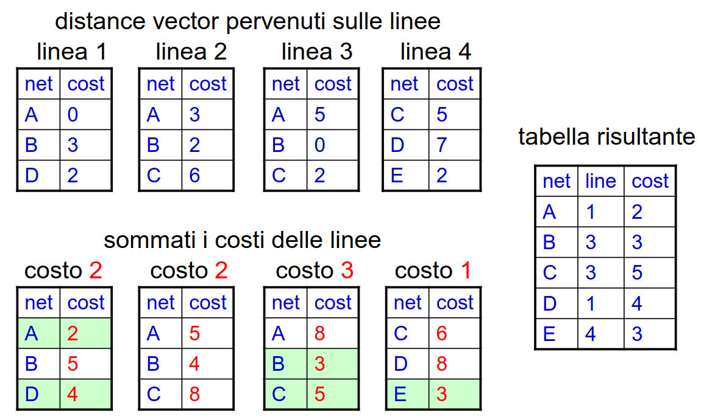
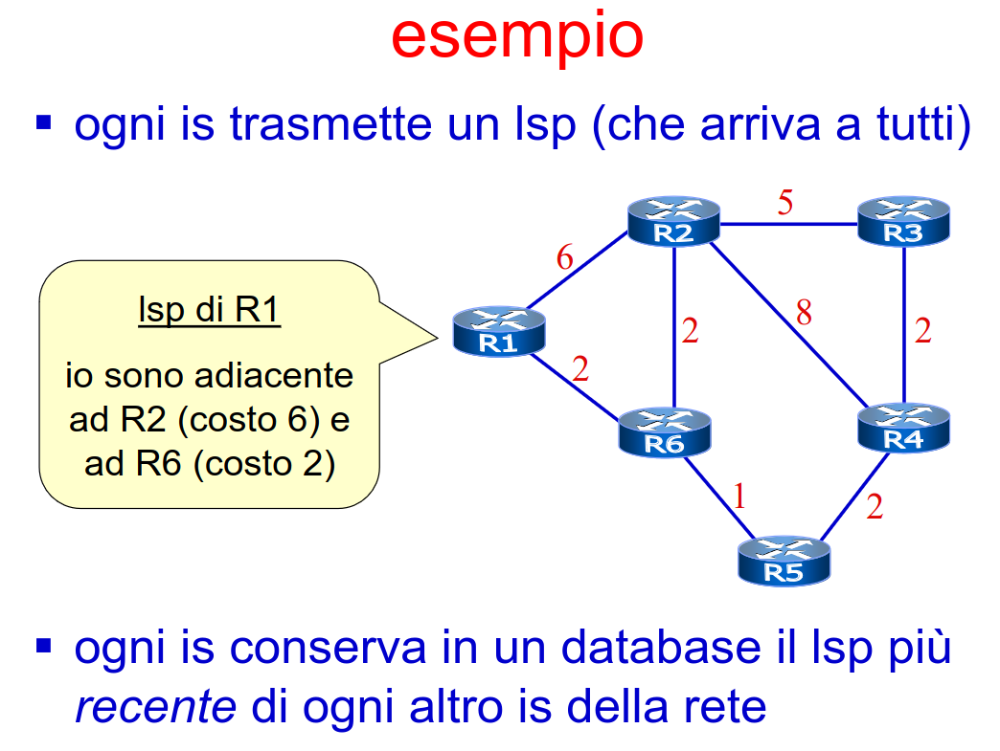
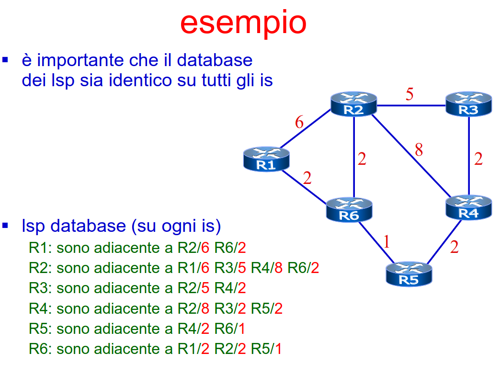
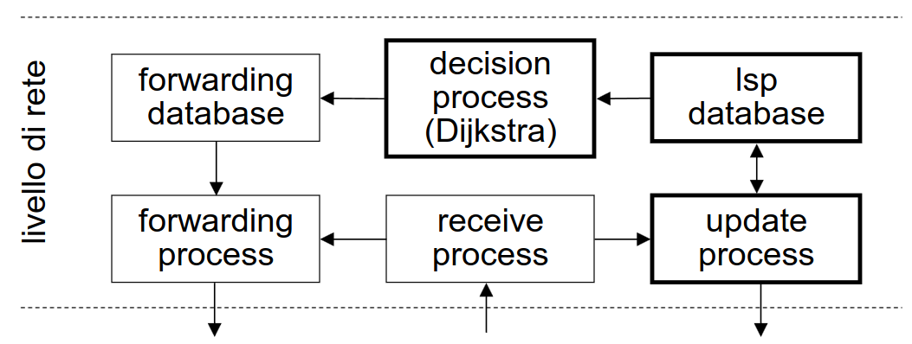

# 5 Ottobre

Argomenti: Algoritmi Distance Vector, Algoritmi Link state packet, Problema cout-to-infinity, Protocolli di routing, Qualita degli Algoritmi di instradamento
.: Yes

## Algoritmi distance vector

- Principio di funzionamento: dico ai miei vicini tutto ciò che so del mondo
- Ogni `is` invia una tabella, detta `distance vector` ad ogni `is` adiacente.
- Il `distance vector` contiene la parte essenziale della tabella di instradamento dell’`is` (non sono compresi i dettagli locali come i nomi delle interfacce ,ecc.)
- Gli `is` ricalcolano le tabelle di instradamento integrando le indicazioni presenti nei vari distance vector ricevuti
- Le destinazioni vengono apprese tramite un processo di passa-parola:
    - inizialmente un `is` conosce solo le destinazioni ad esso direttamente connesse
    - nel ricevere un distance vector l’`is` somma al costo di ogni destinazione contenuta nel distance vector il costo della linea di ingresso (simile ai programmi di programmazione funzionale)
    - ogni destinazione della tabella di instradamento è ottenuto dal costo del cammino dall’`is` alla destinazione stessa.
- Un esempio di proprietà nelle metriche sui cammini:
    - prima si considera il costo, a parità di costo il numero di hop
    - a parità di costo e di hop si fa una scelta random.

## Problema del count-to-infinity

- Una buona notizia arriva a distanza `k` in `k` passi
- Le cattive notizie si propagano in un tempo che è funzione del valore convenzionalmente attributo ad infinito
- per questo motivo si attribuisce normalmente ad infinito il valore della lunghezza del cammino più 1

Se la rete viene `disconnessa` si incorre nel problema del count-to-infinity, quindi occorre definire un valore convenzionale di infinito.

Se la rete rimane `connessa` è possibile dimostrare (modello di Bellman e Ford) che l’algoritmo converge sempre ad una soluzione ottima.

## Efficienza

- `numero di passi`: si suppone che nella rete ci siano `n` nodi ed `m` link e che la metrica sia relativa solo al numero di hop. Tra i nodi più lontani ci sono al massimo $n-1$ link (lunghezza massima del cammino più lungo) allora una buona notizia si propaga su tutta la rete in al più $n-1$ passi e se si attribuisce a infinito il valore `n` allora una cattiva notizia si propaga su tutta la rete in al più $n-1$ passi.
- `lavoro svolto dai router`: in ciascuno dei passi ogni router scandisce al massimo `m` distance vector, infatti `m` è anche il numero massimo di linee intorno a un router. Ogni tabella ha al più $O(n)$ entries, in ciascuno dei passi ogni router spende tempo $O(nm)$, dato che la convergenza richiede nel caso peggiore $O(n)$ passi, ogni router calcola per un tempo $O(n^2m)$

---

## Algoritmi link state packet

- Principio di funzionamento: dico a tutto il mondo ciò che so dei miei vicini.
- Ogni `is` ha una mappa completa della rete e calcola sulla propria mappa l’instradamento ottimale verso ogni destinazione ottenendo i cammini di costo minimo con l’algoritmo di Dijkstra
- La tabella di instradamento di un `is` si ottiene considerando il primo hop dei cammini minimi
- La mappa della rete viene costruita usando pacchetti speciali, chiamati `link state packet`(lsp), e ogni pacchetto contiene informazioni sui nodi e sui link adiacenti ad uno specifico `is`. Questi pacchetti sono trasmessi in `selective flooding` da ogni is a tutti gli altri is della rete.

In pratica quando ogni `is` ha il proprio link state database, ovvero una mappa completa della rete, si calcolano il cammino più breve per raggiungere tutte le destinazioni e per farlo usano l’algoritmo di `dijkstra`. In generale gli spanning tree calcolati sono diversi.

Di seguito è mostrato l’architettura di un router `lsp`:

Quando il `receive process` riceve un pacchetto:

- se è un normale pacchetto in transito allora questo viene mandato al `forwarding process` che attinge al `forwarding database`(cioè alla tabella di instradamento) e sulla base dei contenuti della tabella di instradamento si decide in quale interfaccia mandare il pacchetto
- se il pacchetto è un `lsp` viene mandato all’`update process` che si interfaccia con l’`lsp database`; si può eventualmente far partire l’algoritmo di `dijkstra` se la topologia è cambiata oppure se ne vale la pena e alla fine aggiorna il `forwarding database`.

## LSP e selective flooding

- Ogni pacchetto `lsp` contiene un numero di `versione`
- Quando un `is` riceve un `lsp`:
    - se ha la stessa versione di quello posseduto: non compie nessuna azione
    - se ha una versione più recente: aggiorna il suo database e ritrasmette il pacchetto in flooding su tutte le linee escluse quelle di ricezione.
    - se ha una versione precedente: trasmette quello posseduto al mittente per un rapido allineamento dei database

### Differenze tra i 2 algoritmi

| Algoritmi distance vector | Algoritmi link state packet |
| --- | --- |
| La collaborazione tra is ha l’obiettivo di calcolare direttamente le tabelle di instradamento | La collaborazione tra is ha l’obiettivo di mantenere aggiornata la mappa della rete |
| non possono gestire reti con molti nodi | Possono gestire reti anche con 10000 nodi |
| Convergono lentamente | Convergono rapidamente |

---