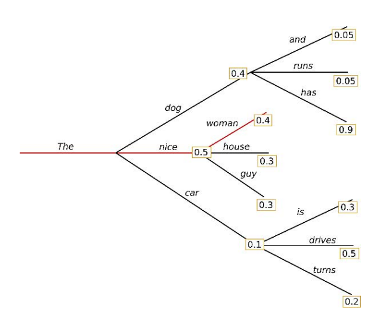
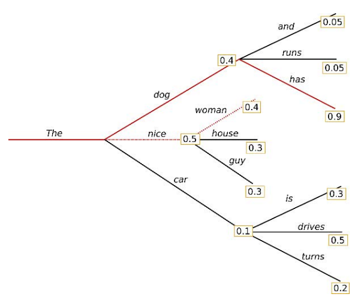
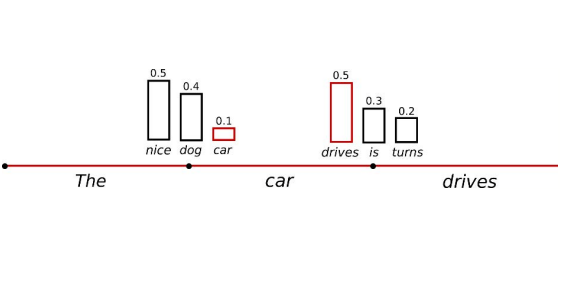
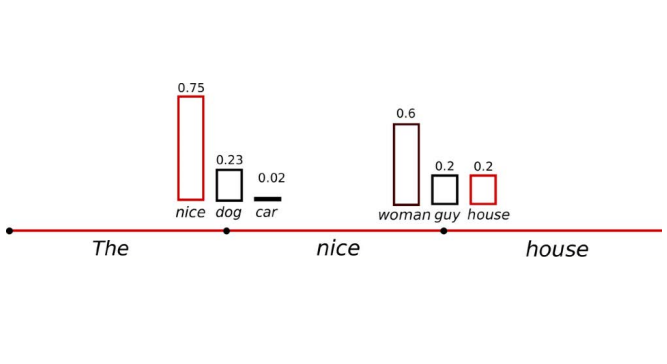
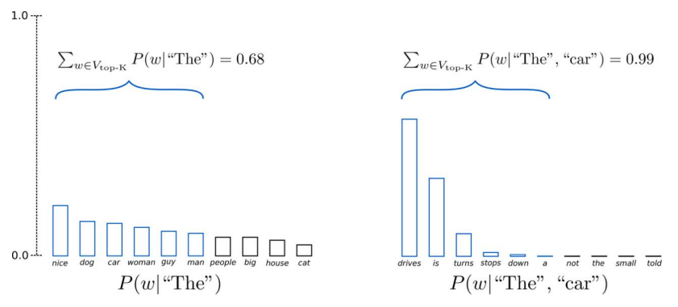
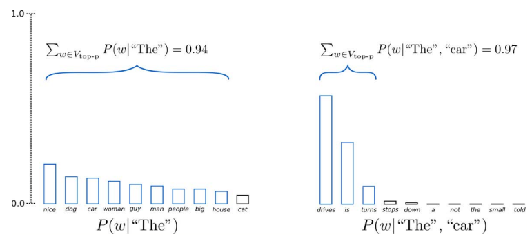
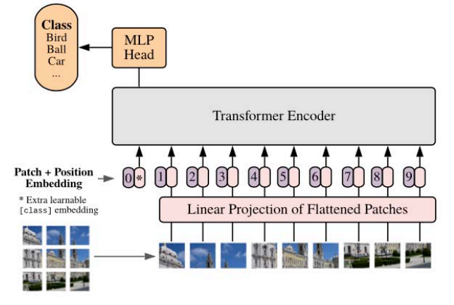

# 6 Dicembre

Tags: RNN vs Transformers, Top-K sampling, Top-P sampling, Transformers e generazione del testo, Vision Transformers
.: No

## RNN vs Transformers

- La memoria delle celle ricorrenti è sostituita con relazioni individuate dagli `attention-mechanism`
- Il modulo `multi-head self attention` codifica relazioni tra un token con il resto dei token nella frase, evidenziando le più rilevanti
    - il `masked multi-head self attention` si comporta in modo simile, ma si limita a considerare i token generati finora
    - il `multi-head attention` del decoder evidenzia i token più rilevanti in input nella fase di generazione dell’output

---

## Generative Pre-training Transformer (GPT)

- `Generative`: è stato seguito l’approccio generativo
- `Pre-training`: il modello è stato sottoposto a un addestramento su un vasto dataset per poter apprendere relazioni generali valide su più domini. Durante questa fase il modello acquisisce conoscenze sulle regole del linguaggio e sulla formazione delle frasi.
- `Transformer`: descrive l’architettura impiegata che permette di eseguire task linguistici complessi concentrandosi su parti diverse dell’input quando generano un output.

## Transformers e generazione del testo

La `auto-regressive language generation` è un meccanismo in cui la probabilità di una sequenza viene calcolata considerando ogni parola (o token) come dipendente dalle precedenti. Questo processo genera il testo un token alla volta, basandosi sul contesto già prodotto.

$$
P(w_{1:T}|W_0)=\prod_{t=1}^{T}P(w_t|w_{1:t-1},W_0)
$$

L’obiettivo è stimare la probabilità di una sequenza di token. Questa sequenza viene scomposto utilizzando la regola della catena

Questo significa che per generare un token successivo, il modello considera i token già generati. La generazione termina quando viene prodotto un token speciale chiamato `EOS`, che segnala la fine della sequenza.

Esistono tre strategie principali per decidere quale token generare ad ogni passo $t$ e sono: `greedy-search`, `beam-search` e `sampling`.

## Strategia Greedy search

$$
w_t=\underset{w}{argmax}(P(w|w_{1:t-1}))
$$

Come token successivo si prende iterativamente quello con probabilità associata alla più alta

In questa immagine se si usa la `greedy-search` allora verrà scelto sempre il token con probabilità più alta.

Lo svantaggio di questo approccio è che il testo inizia presto a ripetersi, ignora token con alta probabilità che appaiono successivamente a token con bassa probabilità.

## Strategia Beam search

Questa strategia riduce il rischio di perdere sequenze di token “nascosti” dietro altri token con alta probabilità, mantenendo ad ogni passo temporale più ipotesi (beam) con alta probabilità e al termine scegliendo l’ipotesi con probabilità complessiva più elevata.

Troverà sempre una sequenza in output con una probabilità maggiore rispetto alla `greedy`, ma non da garanzie di trovare l’uscita più probabile.

Anche con questa strategia il risultato è più “fluente”, ma contiene ancora ripetizioni di sotto-sequenze. Se si considerano però gli `n-grams` e si definisce la `n-gram penalty`, che garantisce probabilità 0 quando si stanno considerando ipotesi che portano a ripetere n-grammi nella stessa sequenza allora le ripetizioni spariscono.

La `beam-search` funziona bene nei task in cui la lunghezza desiderata è più o meno prevedibile come nella traduzione automatica o nella summarization. Trovare un compromesso tra le ripetizioni e lasciare il modello senza limiti di ripetizione è un lavoro arduo.

## Strategia Sampling

$$
w_t\sim P(w|w_{1:t-1})
$$

Nello schema più semplice, il token è scelto in base ad una distribuzione di una probabilità condizionata.

In questo esempio la parola `car` è campionata dalla distribuzione $P(w|\text{The})$, mentre `drives` da $P(w|\text{car})$.

Il problema è il testo generato non è coerente e non sembra scritto da una persona.

Si modifica $P(w|w_{1:t-1})$ cioè si aumenta la verosomiglianza delle parole più probabili a scapito di quelle poco probabili.

Con questa modifica la frase in output è più coerente. 

Si può controllare un parametro `temperatura` che può rendere la distribuzione meno random, se la si azzera allora si torna al caso `greedy`.

## Top-K sampling

Le $K$ parole successive più probabili sono filtrate e la probabilità sarà redistribuita tra le $K$ parole scelte, normalizzandola sempre ad $1$ e il campionamento sarà basato su tale nuova distribuzione.

L’obiettivo è limitare il numero di scelte ai soli $k$ token più probabili per evitare che vengano scelti token molto improbabili.

Questo approccio però non adatta dinamicamente il numero di parole che saranno filtrate in base ai valori di probabilità. 

Limitare il pool di token a una dimensione fissata $K$ può aumentare il rischio di generare parole poco coerenti in caso di distribuzioni molto sbilanciate e, al contrario, ridurre la creatività del modello quando le probabilità sono distribuite in modo uniforme.

## Top-p (nucleus) sampling

Invece di campionare le $K$ parole più probabili, si sceglie dal più piccolo insieme possibile di parole, la cui probabilità cumulativa supera una certa probabilità $p$. La probabilità complessiva sarà quindi re-distribuita sull’insieme; la dimensione di questo insieme di parole può aumentare e diminuire dinamicamente in base alla distribuzione di probabilità della parola successiva.

Impostando $p=0.92$, si sceglie il numero minimo di parole che eccede del $92\%$ la probabilità cumulata.

---

## Vision Transformers

Questa architettura è stata proposta con l’obiettivo di processare e comprendere immagini. Viene introdotto un nuovo modo di analizzare le immagini dividendole in patch più piccole e sfruttando gli autoencoders. Questo permette al modello di catturare sia le relazioni locali che globali all’interno delle immagini.

Si può dire che le architetture CNN complesse possono essere sostituite da transformers applicati direttamente a sequenze di patch, ottenendo comunque ottimi risultati nella classificazione. Questa architettura richiede meno risorse computazionali per l’addestramento rispetto alle CNN.

Di seguito sono elencate le differenze sostanziali tra una `ViT` e la `CNN`:

- `rappresentazione dell'input`: La CNN elabora direttamente i valori raw dei pixel invece ViT divide l’immagine di ingresso in patch e li trasforma in token.
- `processing`: gli strati convoluzionali seguiti da pooling per catturare gerarchicamente le caratteristiche su diverse scale spaziali sono sostituite da meccanismi di self-attention per valutare la relazione tra tutti i patch
- `global-context`: attraverso il self-attention si cattura il contesto globale, le CNN si affidano a strati di aggregazione per ottenere informazioni più astratte e grossolane.
- `efficienza`: ViT può trarre vantaggio dal pre-training su grandi insiemi di dati e dal successivo fine-tuning su task specifici invece di raccogliere grandi quantià di dati etichettati per l’addestramento.

## ViT - architettura

- `Patch-embedding`: L’immagine in ingresso è suddivisa in patch quadrate di dimensione fisse. Ogni patch viene poi moltiplicata per una matrice di peso $W$ ottenendo l’embedding dei patch. Si ottiene così una sequenza di `patch-embeddings`, che rappresentano i token di ingresso per gli strati successivi.
- `Positional-embedding`: è un meccanismo utilizzato nei modelli basati sui Transformer per incorporare informazioni sulla posizione di ogni elemento in una sequenza. Questo è fondamentale perché i Transformer, a differenza delle reti ricorrenti (RNN), non processano i dati in un ordine specifico, quindi non hanno un concetto "intrinseco" della posizione.
- `Encoding-layers`: Il nucleo è costituito da più livelli di codifica, ciascun dei quali contiene due sottolayer primari e sono:
    - `multi-head self-attention`: cattura la relazione tra le diverse patch nella sequenza di input, questo meccanismo consente al modello di concentrarsi sulle patch importanti tenendo conto del contesto locale e globale.
    - `feedforward neural networks`: l’output dell’`attention-mechanism` di ogni patch passa attraverso una rete neurale feedforward che consiste tipicamente in uno strato completamente connesso seguito da una funzione di attivazione ReLU. Lo scopo è di introdurre non linearità e consentire al modello di apprendere relazioni complesse tra patch.
- `Layer Normalization e Residual Connections`: Sia l’`attention-mechanism` sia le uscite della rete `feedforward` sono seguite da layer normalization e residual connection. La prima stabilizza e velocizza l’addestramento, normalizzando gli ingressi di ciascun sottolayer. Le connessioni residue aggiungono gli embeddings originali all’uscita di ciascun sotto layer, aiutando i flussi dei gradienti durante l’addestramento e prevenendo il problema del vanishing gradient.

In un ViT, invece di usare una rete completamente connessa per classificare l'immagine, si usa un `classification-token` che "sintetizza" le informazioni dell'immagine attraverso l'encoder Transformer. Non viene usato un decoder perché il compito è discriminativo (classificazione) e non generativo (non stiamo generando dati).