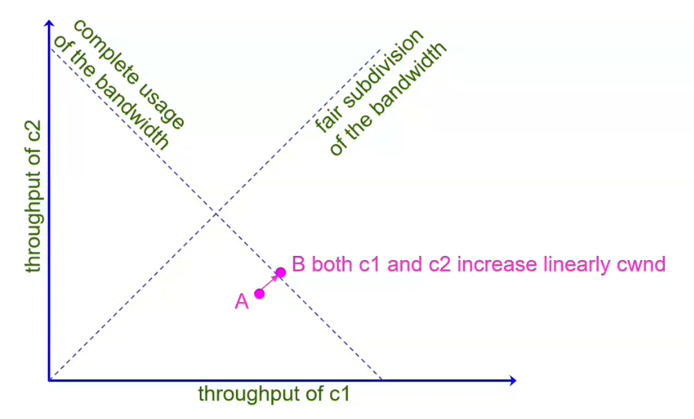
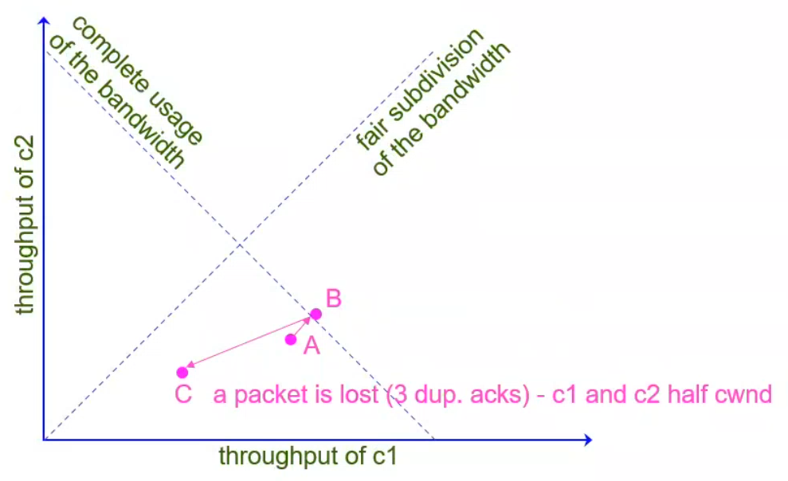
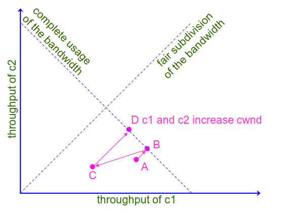
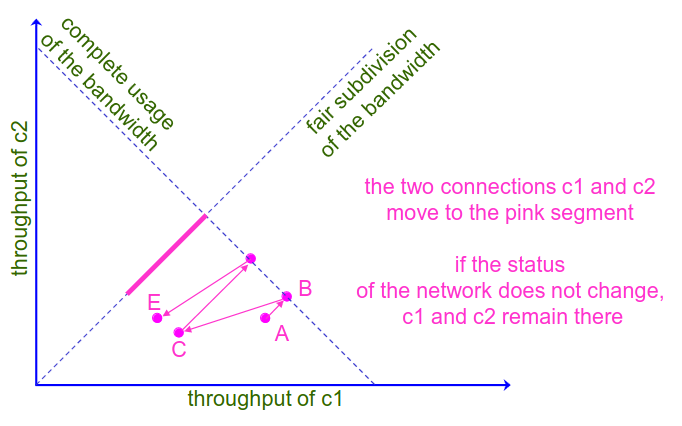
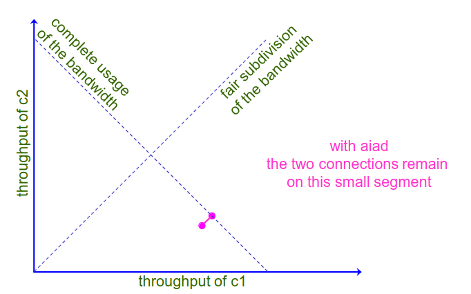
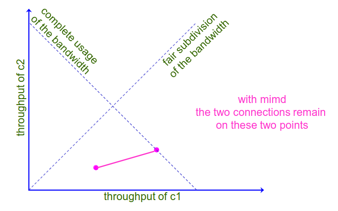
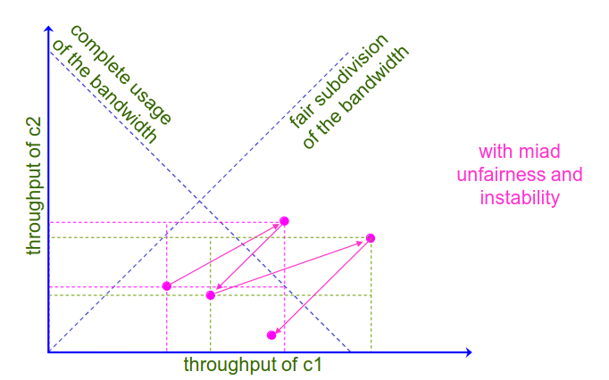
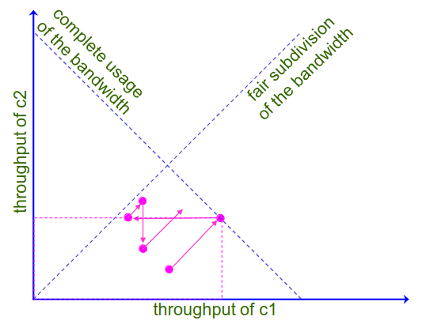
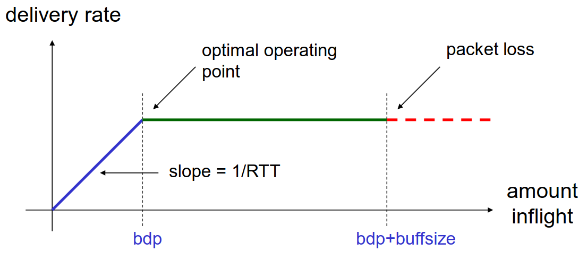

# 6 Dicembre

Argomenti: BBR TCP, TCP fairness, aimd
.: No

## aimd e TCP fairness

A regime TCP ha il comportamento a dente di sega chiamato `aimd` (additive increase multiplicative decrease). Adesso si studia questo comportamento dal punto di vista della `fairness` in pratica si confronta il comportamento in presenza di altre macchine.

Si analizzano quindi 2 connessioni TCP indipendenti $c_1$ e $c_2$ entrambi nella fase `aimd`, quindi $c_1$ e $c_2$ eseguono congestion avoidance e fast recovery/fast retransmit. Queste 2 connessioni condividono una porzione della rete e competono per la banda in quella porzione di rete, si assume che queste 2 connessioni hanno lo stesso valore di `mss` e `rtt` e che quando un pacchetto viene smarrito, la connessione TCP percepisce immediatamente questa perdita.

Si studia il tutto nel piano `aimd`, nell’asse delle ascisse e delle ordinate sono rappresentate rispettivamente il throughput di $c_1$ e $c_2$. (throughput → quanti pacchetti al secondo riesce a spedire $c_i$)

In questo istante di tempo é mostrato quanta banda è usata dalle 2 connessioni

- tutti i punti che si trovano sulla bisettrice rappresentano tutti gli istanti in cui le 2 connessioni usano la stessa di banda
- si suppone che la banda disponibile sia $100\space mbit/s$ e che $c_1$ ne usi $90$ mentre $c_2$ ne usi 10, sicuramente questo punto si troverà nell’altra retta che rappresenta l’utilizzo completo della banda, non si possono avere quindi dei punti che superino questa retta.

Visto che l’incremento della finestra  di $c_1$ e $c_2$ è lineare lo spostamento è parallelo alla bisettrice del primo quadrante.

Si incrementerà la `cwnd` fino a quando tutta la banda utilizzata supera la banda massima disponibile; a questo punto si suppone che entrambi perdono un pacchetto e fanno `aimd` facendo scendere la finestra di controllo di congestione. Lo spostamento di questa riduzione si muove verso l’origine

Una volta dimezzato si ricomincia ad incrementare la finestra di $c_1$ e $c_2$

Continuando a incrementare e poi rilevare la perdita di pacchetti si arriverà in un momento in cui il troughput di $c_1$ e $c_2$ si muoverà sulla retta di fair subdivision

Il punto più efficiente si trova nell’incrocio tra la fair subdision e l’utilizzo massimo della banda

## Alternative a aimd

Se invece si facesse `aiad` (additive-increase additive-decrease) allora il vantaggio lo ha chi già da prima utilizzava la porzione di banda maggiore

Se si facesse `mimd` (multiplicative-increase multiplicative-decrease) ci si muove sempre sulla stessa linea come in `aiad`

Se si facesse `miad` (multiplicative-increase additive-decrease) c’è unfairness e instabilità

## Caso reale di aimd

Nel caso reale non è detto che tutte e 2 le connessioni perdano entrambi i propri pacchetti, se è $c_1$ che perde i pacchetti allora lo spostamento del punto è orizzontale mentre se è $c_2$ lo spostamento è verticale.

---

## BBR TCP

L’idea è quella di sviluppare un TCP molto veloce, sfruttando informazioni aggiuntive quindi di fare un controllo di congestione che non è basata solo sulla perdita di un pacchetto.

- `lato positivo`: nella fase a denti di sega la quantità di byte inviati ma non ancora confermati aumenta linearmente con il numero di `RTT` quindi aumenta anche la velocità in modo lineare
- `lato negativo`: quando il ritardo di larghezza di banda ottimale viene raggiunto il pacchetto non è scartato immediatamente, prima di questo il buffer della bottleneck viene riempito di pacchetti fino a quando non è pieno. Quando il collo di bottiglia è pieno di pacchetti la velocità di consegna non aumenta e la rete è inutilmente congestionata e per un lungo intervallo di tempo la connessione non lavora nel punto ottimale.

In pratica `BBR` (Bottleneck Bandwidth and Round-trip) monitora costantemente la `RTT`, cerca anche di stimare la capacità effettiva della larghezza di banda disponibile sulla connesione. Utilizzando queste 2 informazioni `BBR` regola dinamicamente la velocità di trasmissione di dati: se la larghezza di banda sembra aumentare, allora si aumenterà gradualmente la velocità di trasmissione dei dati. Al contrario, se rileva segni di congestione o limitazioni, BBR ridurrà la velocità di trasmissione per evitare la congestione della rete.

Il test della capacità della banda avviene periodicamente, in pratica consiste nell’aumentare il tasso di invio per un breve intervallo: se `RTT` e il test dello stato precedente sono uguali, significa che c’è larghezza di banda aggiuntiva che può essere sfruttata. Se invece `RTT` aumenta allora il buffer è pieno.