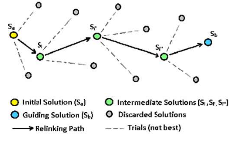

# 6 Dicembre

Argomenti: Ant Colony Optimization, Decision Support System, MATHeuristics, Particle Swarm Optimization, Path Relinking, Scatter Search
.: Yes

## Scatter search

Questo metodo appartiene alla categoria di approccio evolutivo cioè combina vettori di soluzioni. La sua metodologia si basa sull'idea di combinare e ricombinare soluzioni di alta qualità per generare nuove soluzioni migliori nel corso delle iterazioni.

- genera una popolazione iniziale di soluzioni
- migliora le soluzioni con un’euristica di scambio
- seleziona il `reference set` $R=B \cup D$ dove $B$ contiene le migliori soluzioni trovate e $D$ contiene le soluzioni che sono più lontane le une dalle altre e da B
- per ogni coppia di soluzioni $(x,y)\in B \times (B\cup D)$, ricombina $x$ e $y$ generando $z$ che verrà migliorata utilizzando un’euristica di scambio
- quando $R$ rimane invariato si ferma l’algoritmo scatter search.

## Path relinking

Si applica ovunque sia disponibile una popolazione di soluzioni. In pratica date 2 buone soluzioni è probabile che in mezzo ci sia una soluzione migliore rispetto alle 2. Quello che si fa è prendere le buone caratteristiche delle 2 soluzioni e combinarle.

I percorsi esplorati in questo modo collegano buone soluzioni intensificando la ricerca e sono in generale diversi da quelli esplorati in precedenza dall’euristica ausiliaria.

## Ant Colony Optimization

Si basa sul concetto di `stigmergia`, imitando il comportamento delle colonie di formiche

- Le formiche quando si muovono rilasciano sul terreno il ferormone
- Nella ricerca del cibo tendono a seguire percorsi con maggior quantità di ferormone
- Avendo trovato cibo, quando rientrano al nido rilasciano una quantità maggiore di ferormone
- Il ferormone evapora

## Particle Swarm Optimization

Si ispira al comportamento degli stormi di uccelli, banchi di pesci, sciami di insetti, ecc.

Il comportamento di uno stormo è molto complesso. Il coordinamento senza leader ha delle ripercussioni nella comunicazione e imitazione. Un modello semplice usa le seguenti regole:

- `separazione`: per evitare collisione con i vicini
- `coesione`: per puntare verso la posizione media dei vicini
- `allineamento`: per puntare verso la posizione media dello stormo

Questo approccio ottimizza un problema utilizzando una popolazione di soluzioni candidate dette `particle`, che si spostano nello spazio di ricerca sulla base di semplici formule che tengono in considerazione la loro velocità di spostamento corrente, le loro conoscenze dello spazio di fitness e la conoscenza condivisa.

L’algoritmo consente di pesare queste 3 caratteristiche per minimizzare la possibilità di intrappolamento in minimi locali.

---

## MATHeuristics

Una `matheuristic` è un ibrido fra la programmazione matematica e le metaeuristiche; costituiscono un quadro concettuale per la progettazione di euristiche matematicamente valide.

La progettazione di euristiche per problemi di ottimizzazione difficili è essa stessa un processo che spesso comporta i seguenti passi principali:

- dopo un’attenta analisi del problema si cerca di impostare un efficace modello di programmazione matematica e di risolverlo con un software di uso generale. A causa del miglioramento dei solutori questo approccio può risolvere le istanze di interesse all’ottimo senza sforzo ulteriore.
- se non è il caso, si può insistere sull’approccio di programmazione matematica e si cerca di ottenere risultati sempre migliori migliorando il modello. Oppure ci si dimentica della programmazione matematica e ricorrere a euristiche non basate sulla programmazione matematica.
- è possibile un terzo approccio che consiste nell’utilizzare il solutore di programmazione matematica come strumento di base all’interno di un contesto euristico. Questa ibridazione porta all’approccio `matheuristico`, dove l’euristica è costruita intorno al modello di programmazione matematica.

## Local Branching

Questa euristica è una delle prime che usa un solutore MIP black-box; data una soluzione di riferimento $x$ del solutore si mira a trovare una soluzione migliore che non sia troppo lontana da $x$. Il vicinato viene esplorato attraverso un solutore di programmazione matematica black-box.

## Relaxation-Induced Neighborhood Search

L’euristica `RINS` utilizza anch’essa un solutore MIP black-box per esplorare un vicinato di una data soluzione $\overline{x}$ ed è stata originariamente progettata per essere integrata in uno schema di soluzione branch-and-bound.

## Polishing

Implementa un’euristica evolutiva MIP che viene richiamata in alcuni nodi selezionati di un albero branch-and-bound e include tutti gli ingredienti classici della computazione genetica: popolazione, combinazioni, mutazione e selezione.

## Proximity Search

Sarebbe una versione duale del `local branching` che cerca di superare i problemi relativi alla scelta del raggio $k$ del vicinato. Invece di fissare il raggio si fissa il miglioramento minimo del valore della soluzione e si cambia la funzione obiettivo per favorire la ricerca di soluzioni a distanza di Hamming piccola rispetto alla soluzione di riferimento.