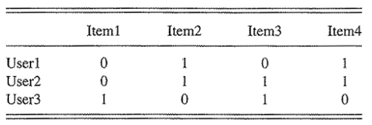
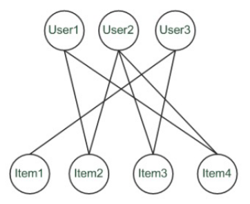
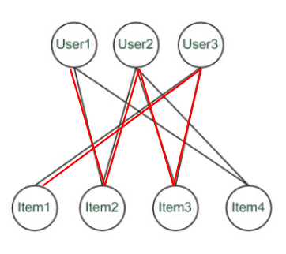

# 6 Giugno

Argomenti: Data Sparsity Problem, Rating Espliciti, Rating Impliciti
.: Yes
Description: Collaborative Filtering

## Rating Espliciti

Richiedere gli `item-rating-espliciti` è probabilmente il modo più preciso per raccogliere le opinioni degli utenti. Si chiede però da parte dell’utente di fornire rating cosicchè i recommender system possano lavorare bene.

## Rating Impliciti

Questi tipi di rating sono raccolti tramite l’applicazione in cui è incorportato il recommender system. Il sistema può anche monitorare il `browsing-behavior` dell’utente, i rating impliciti quindi possono essere raccolti continuamente e non richiedono sforzi aggiuntivi da parte dell’utente

Il problema è che non si può essere sicuri che il browsing-behavior dell’utente possa essere interpretato correttamente, un altro problema è che un utente potrebbe non piacere tutta la roba che ha acquistato oppure che abbia comprato prodotti per conto di qualcun’altro.

## Data Sparsity Problem

Nelle applicazioni `real-world` le matrici di rating tendono a essere assai sparse poichè i clienti di solito forniscono rating solo per una piccola frazione degli item in catagolo, di conseguenza il problema è generare buone predizioni anche quando esistono relativamente pochi rating disponibili. 

Un aprroccio per affrontare questo problema è sfruttare informazioni aggiuntive riguardo gli utenti.

Il set di utenti simili è quindi basato non solo sull’analisi dei rating espliciti e impliciti, ma anche su informazioni esterne alla matrice di rating. Il problema è che i sistemi di questo tipo non sono più `collaborativi`.

## Metodi Graph-Based - Spreading Activation

Il metodo `spreading-activation` sfrutta la proprietà di `transitivity` dei gusti degli utenti e cosi estende la matrice con informazioni addizionali, viene utilizzato per analizzare il grafo bipartito in maniera efficiente.

Si considera la `rating-matrix` binaria dalla quale può essere generato lo `user-item relationship graph` bipartito 

Questo è il grafo bipartito generato, come si può vedere sono stati creati 2 sottografi dove gli elementi di un sottografo non hanno  un arco che li collega altri altri nodi dello stesso sottografo

Se si volesse cercare una raccomandazione per lo `User1` e si impiegasse un approccio standard `CF`, lo `User2` sarà considerato un `peer` per lo `User1` poichè entrambi hanno gradito gli `item2` e `item4`. In questo modo l’`item3` sarà raccomandato allo `User1` poichè anche il suo nearest neighbor `User2` lo ha gradito.

In un approccio standard `CF` User-based o Item-based sono considerati i percorsi di lunghezza 3 come spiegato nell’esempio precedente. Il problema è che 3 è ridotto nei rating database sparsi quindi si considerano anche percorsi più lunghi per calcolare le raccomandazioni.

In questa immagine viene mostrato che se si considera la lunghezza a 3 si raccomanda l’item 3 allo user1, mentre se si considera la lunghezza a 5 anche l’item1 è raccomandabile allo user1.

## Default Voting

Un’altra tecnica per affrontare il problema di database di rating sparsi è il `default-voting`; quando il numero di item co-rated (cioè item per i quali sia l’utente target sia l’utente da comparare hanno espresso rating) è piccolo il rating stesso può influenzare la misura di similarità in maniera eccessiva.

L’idea è quindi assegnare valori di `default` a item che solo uno dei 2 utenti ha valutato al fine di migliorare la qualità delle predizioni nel caso di database di rating sparsi. Questi voti artificiali di default agiscono come una sorta di meccanismo di `smorzamento` che riduce gli effetti di similarità dovuti a rating individuali e fortuiti

## Cold-Start Problem

Il `cold-start` problem può essere visto come un caso speciale del data sparsity problem, le problematiche sono le seguenti:

- raccomandazioni a nuovi utenti che non hanno ancora espresso alcun rating
- come trattare nuovi item che non sono ancora stati valutati o acquistati.

I 2 problemi sono possono essere affrontati con l’ausilio di approcci ibridi; si potrebbe chiedere agli utenti un numero minimo di rating prima che possano avvalersi del servizio per esempio, in queste situazioni il sistema potrebbe chiedere in maniera intelligente rating per item che dal punto di vista della teoria della informazione apportano il maggior contributo informativo.