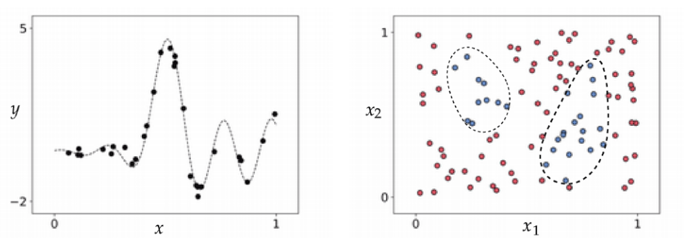
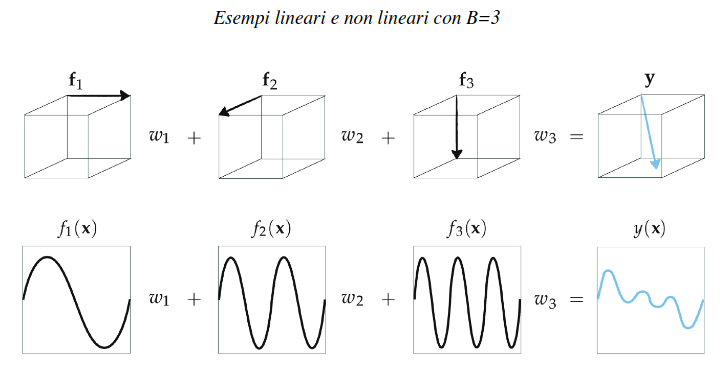
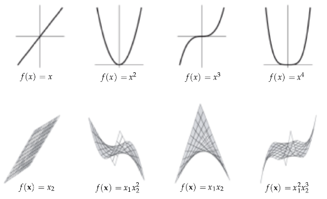
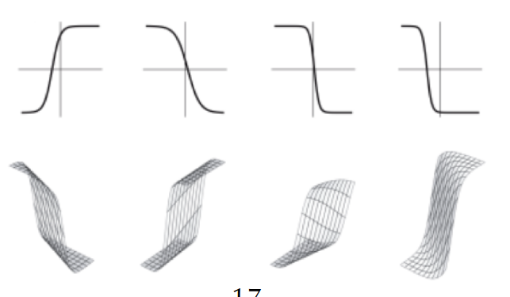
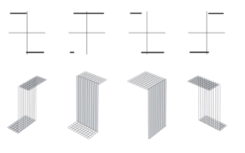
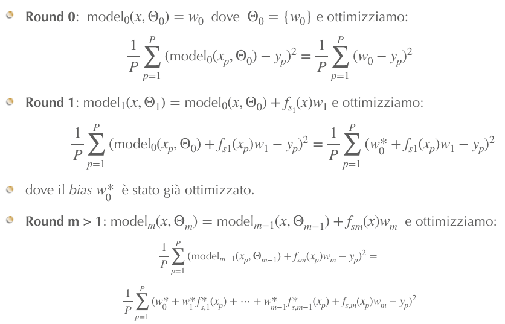
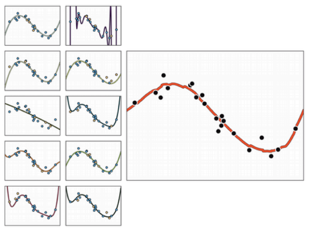
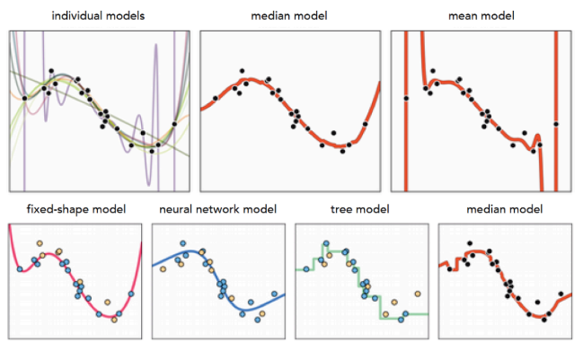

# 6 Maggio

Argomenti: Approssimatori Universali, Bagging, Cross validation via boosting, Early Stopping, Feature Learning, Fixed-shape, NN-approximator, Naive cross-validation, Regolarizzatori, Residuals, Tree-approximator
.: No

## Feature Learning

$$
model(x,\Theta)=w_0+\sum_{i=1}^{B}f_i(x)\cdot w_i
$$

Dato un dataset con non linearità è possibile ottenere un modello attraverso l’uso di funzioni non lineari (`feature-transformations`), dove $f_1,..,f_B$ sono funzioni o features, i pesi costituiscono l’insieme $\Theta$.

L’obiettivo è apprendere le features citate in modo automatizzato a partire dai dati senza passare per il `feature-engineering`, ovvero senza crearle a mano. Quindi in sostanza la domanda da porsi è quali sono le $f_1,..,f_B$ da usare, il numero $B$ e come impostare i pesi $w$. 

## Principi di Feature Learning

Le caratteristiche, dal nostro punto di vista, generano un insieme di dati il quale permette un apprendimento ottimale (usando una Loss); la qualità di queste caratteristiche dipende dal livello di `conoscenza` del fenomeno che si sta studiando.

Quindi più si capisce il processo che genera l’insieme di dati, più facilmente verranno progettate le funzioni.

Le linee tratteggiate indicano il modello non lineare che genera i dati

## Approssimatori universali - introduzione

Supponendo di conoscere completamente il fenomeno che genera i dati, le caratteristiche esatte sono apprese combinando elementi da un insieme di trasformazioni base delle caratteristiche, queste sono chiamate `universal approximator`. Sostanzialmente gli approssimatori sono delle $f$ che approssimano un certo modello.

## Formalizzazione - Spanning set

Un dataset ideale per un problema di regressione è caratterizzato da una funzione continua mentre per la classificazione una funzione che definisce la regione di decisione. L’obiettivo è capire come concepire una formula per rappresentare adeguatamente un dataset ideale.

Si suppone di avere un insieme di $B$ vettori $\left\{ \bold f \right\}$ di lunghezza $N$ che viene chiamato `spanning-set`; uno `span` (intervallo) è l’insieme di tutte le possibili combinazioni lineari di un insieme di vettori. 

$$
f_1w_1+f_2w_2+...+f_Bw_B=y
$$

Perciò lo span di $\left\{\bold f\right\}$ lo si ottiene cosi: (combinazioni di vettori pesati che danno un certo output)

## Formalizzazione - Combinazioni lineari

Impiegando funzioni non lineari si ottiene una formalizzazione simile:

$$
y(\bold x)=w_0+\sum_{i=1}^{B}f_i(\bold x)\cdot w_i
$$

Con la presenza del fattore bias $w_0$ che ha lo scopo di traslare la combinazione lineare di funzioni in verticale.

## Formalizzazione - Rank

$$
y\approx\sum_{i=1}^{B}f_i\cdot w_i
$$

Il problema è trovare pesi $\bold w$ tali che questa condizione sia verificata, cioè trovare una combinazione lineare che approssimi la funzione $y$

La qualità dell’approssimazione vettoriale dipende dai seguenti punti:

- `diversità`: tra i vettori di spanning ci deve essere l’indipendenza lineare
- `numero`: è preferibile che siano molti vettori di spanning
- `minimizzazione della loss`: la capacità di approssimare $\bold w$ per mezzo della minimizzazione della loss ha un impatto importante $\left(||f_1w_1+...+f_Bw_B-y||_2^2\right)$

Il `rank` in geometria è il numero di vettori indipendenti fra loro quindi di quanto uno spazio è rappresentabile, questo concetto può essere associato alla capacità del modello. Nello spanning set il rank corrisponde al numero di vettori indipendenti.

## Parametrizzazione

A volte le funzioni di spanning sono `parametrizzate`, cioè sono definite per mezzo di parametri, mentre una funzione di spanning non parametrizzata è simile ad un vettore. Una funzione parametrizzata può assumere varie forme quindi può avere una capacità elevata.

## Approssimatore universale

Se si prendono $B\ge N$ vettori per definire lo spanning set, e se almeno $N$ di essi sono linearmente indipendenti, allora si possono approssimare qualsiasi vettori $N$ dimensionali scegliendo una combinazione opportuna di pesi. Tale spanning set forma uno spazio vettoriale, con base costituita dagli $N$ vettori che prende il nome di `universal-approximator`.

Gli approssimatori sono raggruppati in 3 categorie principali: `fixed-shape`, `reti neurali` e `alberi`.

## Universal approximator - (fixed-shape)

$$
f_1(x)=x\\
f_2(x)=x^2\\
f_3(x)=x^3\\
...
$$

Questi tipi di approssimatori sono funzioni non lineari prive di parametri interni, un esempio sono i `polinomi`

Un esempio è mostrato qui accanto

Con un polinomio di grado $D$ si indicano la combinazione dei primi $D$ polinomi, fino al grado $D$

Non avendo parametri interi, assumono forme “fisse”

## Universal approximator - (reti neurali)

Questo tipo di approssimatore è costituito da `funzioni parametrizzate`, che consente loro di assumere forme diverse. (chiamato anche `NN-approximator`)

$$
f_b(x)=tanh(w_{b,0}+w_{b,1}\cdot x)
$$

Per esempio questa è una funzione parametrizzata perché all’interno della stessa funzione ci sono altri parametri

In base ai parametri $\bold w$ della specifica funzione $b$, la tangente iperbolica crea una diversa forma. Estendendo l’esempio per una generica dimensione si ha:

$$
f_b(x)=tanh\left(w_{b,0}+\sum_{i=1}^{N}w_{b,i}x_i\right)
$$

## Universal approximator - alberi

$$
f_b(x)=
\begin{cases}
v_1\space\space\space if\space x\le s\\
v_2\space\space\space if\space x>s
\end{cases}
$$

Il sotto-tipo più semplice di elementi da impiegare per definire un `tree-approximator`, sono funzioni a gradino discrete

Dove $s$ è chiamato punto di `split`.

In questa figura viene mostrato sopra la dimensione del vettore in input a 1 mentre sotto a 2

---

## Naive Cross-Validation

L’errore di convalida può confrontare l’efficacia di più modelli addestrati su vari livelli di complessità, questo confronto di modelli è chiamato `naive cross-validation` ed è alla base del `feature-learning`.

$$
\left\{ model_m\left(\bold x,\Theta_m\right)\right\}_{m=1}^M
$$

Scelto un approssimatore ci si costruisce un insieme di modelli 

In sostanza nella `naive cross-validation` si creano una gamma di modelli di capacità crescente e si cerca il modello che minimizza l’errore di validazione, mantenendo il processo di ottimizzazione “completo”.

Sebbene sia di semplice implementazione è costoso dal punto di vista computazionale poiché ogni modello deve essere addestrato da zero.

## Cross-validation via boosting

Esiste un approccio più efficiente quando si vanno a confrontare più modelli nella `naive cross-validation`, quello che si fa è pensare di aggiungere una unità di approsimatore e addestrare il relativo modello, mantenendo costanti i parametri ottimizzati negli step futuri.

$$
\left[model_m\right]_{m=1}^M
$$

Si ottiene una sequenza di $M$ modelli addestrati, con complessità crescente, che si denota in questo modo

Visto che viene ottimizzata una sola unità alla volta, il `boosting` tende a fornire una forma computazionalmente efficiente di ricerca del modello a fine risoluzione

In questa immagine è mostrato l’andamento di questo cross validation, si può pensare che dato un certo round $i$ quello che si deve ottimizzare è la differenza di 2 termini, gli altri termini con * sono già state ottimizzati

---

## Residuals

Si può interpretare il `boosting` nel contesto della regressione:

$$
g\left(\Theta_m\right)=\dfrac{1}{P}\sum_{p=1}^{P}(\text{model}_m\left(x_p,\Theta_p\right)-y_p)^2
$$

Si considera la seguente funzione di costo espressa con $\text{model}_m$

poi si esprime il modello boosted nel seguente modo

$$
\text{model}_m(x_p,\Theta_m)=\text{model}_{m-1}(x_p,\Theta_{m-1})+f_m(x_p)w_m
$$

dove gli m-1 parametri e modelli sono già ottimizzati, perciò si può riscrivere la prima equazione in questo modo

$$
g\left(\Theta_m\right)=\dfrac{1}{P}\sum_{p=1}^{P}(f_m(x_p)w_m-(y_p-\text{model}_{m-1}(x_p)))^2
$$

$$
f_m(x_p)w_m\approx y_p-\text{model}_{m-1}(x_p)
$$

minimizzando l’espressione precedente si cerca di stimare i parametri di una singola unità aggiuntiva in modo che questa espressione sia soddisfatta

Si fa questo in modo tale che l’unità corrente approssimi l’output originale $\bold y_p$ sottratto dal contributo del modello precedente. Questo valore è il `residuo` cioè quello che rimane da rappresentare dopo aver sottratto ciò che è stato già appreso dal $(m-1)$-esimo modello.

## Early Stopping

Questa tecnica torna utile in tanti addestramenti di modelli, cioè ci si ferma prima quando l’errore di validazione inizia a crescere questo però porta a considerare un valore minimo di errore di validazione.

Quello che si fa è che alla fine di ogni epoca si calcolano le valutazioni sul validation set, si tiene traccia dell’ultima volta in cui il modello ha migliorato le prestazioni e se dopo un certo numero di epoche $\epsilon$ non ci sono stati miglioramenti significativi si interrompe l’addestramento e si restituisce il modello che si è dimostrato migliore.

## Regolarizzatori

$$
g(\Theta)+\lambda\cdot h(\Theta)
$$

Sono funzioni che sono aggiunte alla loss, se si esprime con $g$ la loss si ottiene il loss regolarizzato in questo modo

La funzione $h$ può essere una $l_1$ o $l_2$ regularization, che corrispondono rispettivamente alle tecniche `lasso` e `ridge`.

---

## Scelta del miglior approximator

Non è possibile determinare in modo formale l’approximator migliore, solitamente si eseguono sperimentazioni con cross-validation e si scelgono i migliori.

- Per dati tabellari, strutturati o categorici gli approssimatori ad `albero` forniscono risultati migliori
- Per intervalli continui gli approssimatori `fixed-shape` e a `reti neurali` sono i migliori.

## Bagging cross-validated models

La suddivisione dei dati in training e validazione porta al problema della creazione di porzioni che non rappresentano adeguatamente il fenomeno che si sta studiando. Di seguito sono elencati i problemi che influenzano negativamente la generalizzazione del modello:

- `bias del campione`: se le porzioni di addestramento e convalida non sono rappresentative dell’intera popolazione di dati, il modello può imparare pattern che non generalizzano bene su dati non visti.
- `overfitting o underfitting`: se la suddivisione di dati non è bilanciata, il modello può soffrire di overfitting, cioè imparare troppo bene i dettagli del set di addestramento ma fallire su dati nuovi, oppure di underfitting non riuscendo a catturare i pattern fondamentali del fenomeno
- `mancanza di generalizzazione`: se il set di addestramento contiene solo un sottoinsieme specifico del fenomeno, il modello potrebbe non riuscire a prevedere correttamente casi che non rientrano in altre parti del fenomeno non coperte dall’addestramento
- `valutazione inaccurata delle prestazioni`: se il set di convalida non è rappresentativo, la valutazione delle prestazioni del modello può essere fuorviante. Un modello può sembrare performante su un set di convalida non rappresentativo, ma fallire quando applicato a dati reali o nuovi.

Una soluzione pratica è creare diverse suddivisioni di training-validazione, determinare un modello appropriato su ciascuna suddivisione e poi fare una media dei modelli incrociati ottenuti.

In questo esempio di problema di regressione viene mostrato come il bagging ottiene una media dei modelli incrociati.

E’ possibile anche fare bagging su modelli basati su diverse famiglie di approssimatori

La mediana di questi 3 modelli è mostrata in basso a destra