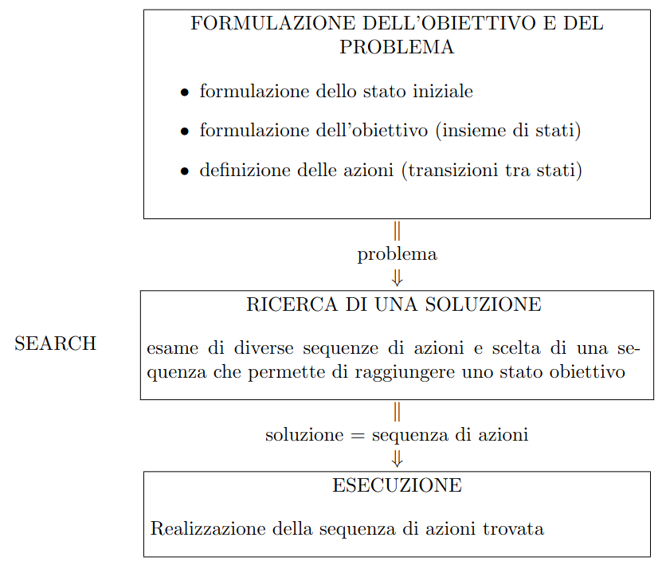

# 6 Ottobre

Argomenti: Problem Solving e Search, Tree Search
.: Yes



Un agente risolutore di problemi è basato su `obiettivi`. Tali agenti decidono cosa fare trovando `sequenze di azioni` che conducono a stati desiderabili.

## Definizione di problema

Un problema può essere definito formalmente da 4 componenti:

- Lo `stato iniziale` in cui si trova l’agente
- Una descrizione delle `azioni` possibili dell’agente. Una formulazione possibile è quella che usa una `funzione successore`. Lo `spazio degli stati` è definito dallo stato iniziale e la funzione successore.
- Il `test obiettivo` che determina se un particolare stato è uno stato obiettivo.
- La funzione `costo di cammino`, che assegna un costo numerico ad ogni cammino

## Ricerca di una soluzione

Una soluzione al problema è una sequenza di azioni ottenute usando gli algoritmi di ricerca. A partire dallo stato iniziale le possibili sequenze generate da questi algoritmi di ricerca formano un `albero di ricerca`.

## Processo di ricerca

Il processo di ricerca comporta i seguenti passi:

- scegliere tra le foglie dell’albero un nodo da espandere, secondo una data `strategia`.
- controllare se il nodo scelto è un nodo obiettivo
- se non è il nodo obiettivo allora lo si espande generando i suoi figli e andando ad applicare l’algoritmo scelto ai figli generati.

## Tree-Search

```jsx
function TREE-SEARCH(problem) returns a solution or failure

fringe <- MAKE-QUEUE(MAKE-NODE(INITIAL-STATE[problem]))
loop do
		if EMPTY?(fringe) then return failure
		node <- REMOVE-FRONT(fringe)
		if GOAL-TEST(problem, STATE[node]) then return SOLUTION(node)
    // aggiunta di nodi generale alla lista (non necessariamente in coda)
    fringe <- QUEUING-FN(fringe, EXPAND(node, OPERATORS(problem)))
end  
```