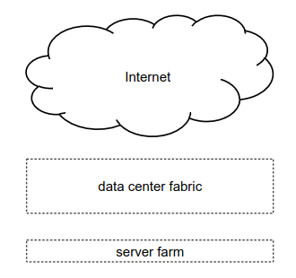
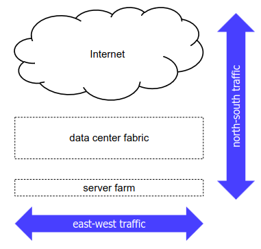
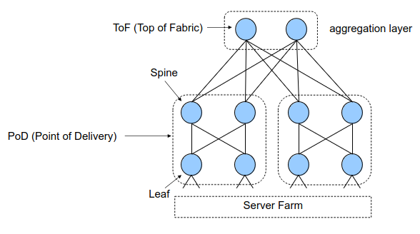
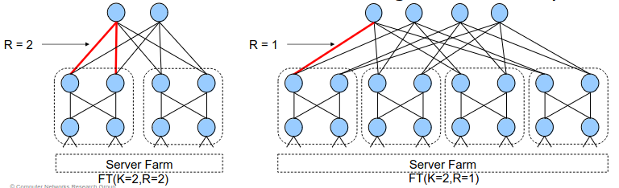
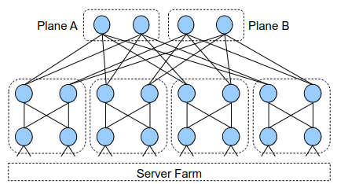
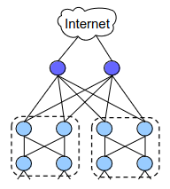
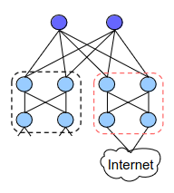

# 7 Dicembre

Argomenti: Architettura Fabric, ECMP, Fat-Tree, Multi-Path
.: Yes

## Multi-Path

All’interno dei Data centers si usa molto il `multi-path`, cioè la capacità di poter passare su diverse strade per raggiungere una destinazione da una sorgente. Nel mondo `BGP` o anche nei `IGP` nella tabella di instradamento la rotta è solo una, nel `multi-path` implica che ci siano molte strade; si hanno 2 motivi per cui usare questa tecnica:

- si può aumentare la banda dei link: cioè dati 2 link a 100 gbit, se si riescono ad aggregare si riesce a trasmettere a 200 gbit
- si ha una `fault-tolerance`: cioè si ha la capacità di rimanere sempre online anche quando si rompe un link

A livello pratico fare `multi-path` significa che all’interno del `FIB` (Forwarding Information Base), quindi nella vera tabella di instradamento del kernel, ci sono più di una rotta e più di un next-hop per una specifica destinazione

I pacchetti dello stesso `flusso` dovrebbero usare la stessa rotta, perchè riordinare i pacchetti è computazionalemente più pesante.

## Equal-Cost Multi-Path (ECMP)

Nei data centers si usa `ECMP`, in pratica è uno specifico approccio al MP in cui tutti i percorsi hanno lo stesso costo, in modo tale da poter scegliere in maniera arbitraria su quali percorsi bisogna mandare i propri pacchetti. Spesso utilizzato nei `Fat-Tree` data centers.

Visto che si hanno link dello stesso costo, ci pensa il kernel a scegliere il next-hop usando una funzione di hashing, per esempio per vari livelli si possono avere hashing di diverso tipo:

- `layer-3` hash: (src IP, dst IP)
- `layer-4` hash: (src IP, dst IP, src port, dst port, protocol)

Si fa notare che la politica `round-robin` è sconsigliata utilizzarla perchè i pacchetti dovrebbero passare per lo stesso flusso.

## Hyper-scale Data Centers

Questa architettura ad alto livello è fatta da 3 moduli principali:

- `connessioni internet`
- `fabric`: è la parte dove effettivamente si instrada il traffico, cioè il layer che ha lo scopo di trasportare i pacchetti quindi composto da switch, router e altri elementi di networking.
- `server farm`: ospita le applicazioni e i servizi

## Architettura fabric

Ci sono 3 modelli di data centers:

- `on-premise`: sono costruiti e posseduti dalla stessa società
- `colocation`: sono data centers dove danno solo la fabric e internet ma non danno la server farm, saranno i clienti a configurare al server farm perchè le altre 2 sono offerte dai fornitori.
- `cloud`: sono gestiti dalla società che li possiede ma sono usati dagli utenti, in pratica si paga un servizio e non si ha interesse su come viene erogato.

## Flussi all’interno di un data center

Ci sono 2 tipologie di flussi:

- `north-south`: sarebbe il traffico che entra o esce dai data centers, quindi dati che vengono mandati o ricevuti via internet
- `east-west`: sarebbero le comunicazioni tra server, principalmente supporta microservizi e architetture distribuite

Quando si va a sviluppare un architettura di rete si devono tenere conto di 3 cose:

- bisogna avere tantissima banda perchè solitamente satura prima la banda dei CPU dei server, il che significa che per servire più gente si ha bisogno di molta banda e non più CPU.
- si vuole una scalabilità, cioè si vuole continuare ad aggiungere macchine senza dover fare cambiamenti drastici all’architettura.
- si vuole una resilienza, cioè le applicazioni del data center sono progettate per funzionare in presenza di guasti

## Requisiti delle componenti di rete dei data centers

I nodi dei data center possono essere collegati utilizzando due tipi di componenti di rete:

- la prima tipologia è quella dove si progetta l’hardware dedicato per il data center, questa soluzione è molto costosa
- la seconda topologia è quella dove si utlizza dei commodity switches and routers quindi delle normalissime componenti hardware, questa soluzione è la meno costosa. L’unico problema è creare una architettura adeguata

## Requisiti di topologia

Si hanno 2 necessità:

- `scalabilità`: deve essere possibile espandere il data center quindi acquistare e distribuire hardware simili a quello che si sta utilizzando
- `banda`: due server devono poter comunicare tra di loro con la piena velocità delle loro `NICs` cioè le loro schede di rete

## Topologia Clos

Questa architettura è stata creata per lo switch telefonico, cioè si cerca di consentire N connessioni contemporanee da N linee di ingresso a N linee di uscita senza utilizzare un unico switch enorme.

## Topologia Fat-Tree

Questa è un caso particolare della topologia `Clos`, e consiste in 3 livelli di nodi, di alta ridondanza e di una `bisection` costante della banda disponibile (cioè presi due host qualunche all’interno della rete, questi riescono a lavorare con la piena banda delle loro interfaccie). I nodi di questa topologia sono tutti della stessa caratteristica per facilitare le riparazioni.

Il `Fat-Tree` è denotato da 2 parametri $K$ e $R$, dove $K$ rappresenta la metà del numero di porte di uno switch mentre $R$ è il fattore di ridondanza

In questo esempio $FT(K=2,R=2)$

Il numero minimo di connessioni tra un nodo `ToF` e un `PoD` è $1$ e massimo $K$

Il fattore di ridondanza $R$ ha lo scopo di connettere più `PoD`

Quando $K \ne R$ la `Fat-Tree` è chiamata `multi-plane`.

I nodi `ToF` sono divisi in piani, in pratica il piano A è connesso a tutti i primi nodi dei pod mentre il piano B è connesso a tutti i secondi nodi dei pod

Ci sono due strategie per connettere la `Fat-Tree` a internet:

Si potrebbe attaccare internet ai nodi del `ToF` ma è stato detto che se $K$ rappresenta il numero di porte di uno switch in questo esempio se $K=2$ allora tutte le porte sono occupate perche tutte e 4 sono collegate con i pod

Quindi questo implica che devono avere porte extra e implica che devono essere apparati diversi rispetto a quelli nei `PoD`

Un altro metodo è prendere un altro pod dove non ci si attaccano i server ma ci si attacca internet.

In questo modo si è costretti a togliere un server per avere il collegamento a internet.

Ognuna di queste strategie ha dei pro e dei contro.