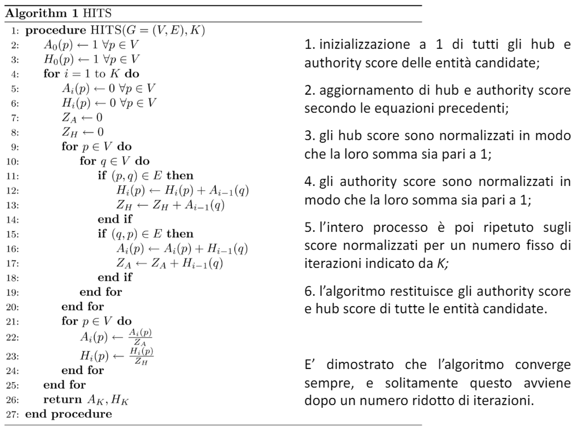

# 7 Maggio

Argomenti: Algoritmo HITS
.: Yes

## HITS vs Pagerank

L’algoritmo `pagerank` è più efficiente per l’utilizzo su web, in quanto `query-indipendent`, `HITS` risulta invece più efficiente in termini di metadati poichè lavora solo su una determinata comunità selezionata inizialmente. Il problema è che se HITS funziona sulla base di query e il motore è sottoposto ad un alto tasso di query si ha lo svantaggio di avere troppe richieste da elaborare, questo porta a un rallentamento delle operazioni degli algoritmi.

## Algoritmo HITS

L’algoritmo è basato su un insieme circolare di assunzioni:

- buoni `hub` puntano a buone `authority`, ovvero buoni nodi in grado di distinguere nodi più autorevoli puntano a nodi più autorevoli
- buone `authority` sono puntate da buoni `hub`, ovvero i nodi più autorevoli sono puntati da buoni `hub`.

Dato un grafo di entità, occorre prima identificare un sottoinsieme di entità tale che potrebbero essere membri della stessa comunità, queste sono chiamate `entità candidate`. Date queste `entità-candidate` l’algoritmo `HITS` può essere usato per trovare il `core` della comunità quindi le autorità più autorevoli del sottoinsieme.

- HITS prende in input un grafo $G$ con un set di nodi $V$ e set di archi $E$
- per ogni entità candidata $p$ nel grafo, quindi per ogni nodo si calcola un `authority-score` $A(p)$ e un `hub-score` $H(p)$.
- Si suppone che buoni `hub` siano quelli che puntano a buone `authority` e che buone `authority` siano quelle che sono puntate da buoni `hub`, questo sta a significare una interdipendenza tra i valori di authority e hub
- dato un set di `authority-score` e `hub-score`, HITS aggiorna gli score secondo le seguenti equazioni:
    
    Dove $p\to q$ indica che esiste un arco (interazione) fra l’entita $p$ (sorgente) e l’entità $q$ (destinazione)
    

$$
A(p)=\sum_{q\rightarrow p}H(q)
$$

$$
H(p)=\sum_{p\rightarrow q}A(q)
$$

$*A(p)*$ è la somma degli *hub score* delle entità che puntano a $*p*$, $*H(p)*$ è la somma degli *authority score* delle entità che sono puntate da $*p*$. Ne consegue che per essere una buona *authority*, una entità deve avere molti archi entranti, tutti con relativamente alti *hub score*, o avere relativamente pochi link entranti che hanno però alti *hub score*.

In alternativa al fissare a priori il numero K di iterazioni, si può fissare una quantità $\varepsilon$ prestabilita e imporre la seguente condizione: la convergenza è ottenuta quando gli authority score e gli hub score di tutte le entità candidate variano, fra un’iterazione e la successiva, di un valore inferiore alla quantità $\varepsilon$ prestabilita. Una volta che gli authority e gli hub score sono stati calcolati, le entità possono essere classificate secondo i loro authority score. Tale lista conterrà le entità più *authoritative* all’interno della comunità, tali entità sono probabilmente i *leader* o formano il core della comunità, sulla base delle loro interazioni con gli altri membri della comunità.

Ad esempio, se si applicasse HITS al grafo delle citazioni dei ricercatori in computer Science per trovare la comunità di ricerca in IR, gli autori più *authoritative* sarebbero quelli citati molte volte dagli autori più prolifici; questi sarebbero probabilmente i luminari nel campo, cioè gli autori che costituiscono il core della comunità.
