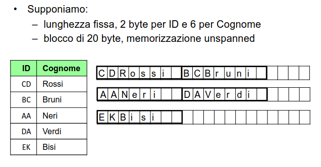

# 7 Marzo

Argomenti: Composizione fisica e logica di un file, Fattore di blocco, Strutture Sequenziali, Strutture fisiche
.: Yes

## Composizione di un file

- Un file è `logicamente` composto di record: la tipica operazione su un file è l’accesso ai record
- Un file è `fisicamente` organizzato in blocchi: l’operazione eseguita su disco è l’accesso ad un blocco

I blocchi e i record hanno dimensioni diverse dove la dimensione del blocco dipende dal `file system` e la dimensione del record dipende dalle esigenze dell’applicazione.

### Dettagli di un record

I record possono essere a:

- `lunghezza fissa`: semplifica le operazioni, ma può causare spreco di spazio
- `lunghezza variabile`
- `unspanned`: i record di un file si trovano tutti all’interno di un blocco
- `spanned`: i record di un file si trovano tutti in più blocchi

$$
\left\lfloor \dfrac{L_B}{L_R} \right\rfloor\simeq \dfrac{L_B}{L_R}
$$

Il `fattore di blocco` rappresenta il numero di record in un blocco dove $L_R$ è la dimensione di un record e $L_B$ è la dimensione di un blocco.

## Strutture fisiche

Nella organizzazione di file in un database ci sono 2 aspetti che si tengono in considerazione per migliorare le performance di un DBMS:

- `strutture primarie`: modalità di organizzazione dei record in un file
- `strutture secondarie`: elementi che permettono un accesso efficiente ai record di un file

Di seguito sono elencati alcuni tipi di strutture fisiche:

- `sequenziali`: sono prevalentemente primarie
- `hash`: sono primarie e talvolta secondarie
- `albero`: di solito usati come indici, molto usate come secondarie ma possono essere anche primarie

Esiste un ordinamento fra le ennuple, che può essere rilevante ai fini della gestione:

- `seriale`: (anche detta disordinata)ordinamento fisico ma non logico
- `ordinata`: ordinamento fisico coerente con quello di un campo

Qui viene mostrato un esempio della memorizzazione di una relazione

## Struttura disordinata (seriale) - Sequenziali

Gli inserimenti vengono effettuati in coda (con riorganizzazioni periodiche) oppure al posto di record cancellati. Le eliminazioni vengono fatte lasciando i “vuoti”, questi però possono essere rimossi con le riorganizzazioni periodiche.

## Struttura ordinata - Sequenziali

Ogni ennupla ha una posizione basata sul valore di un campo. La difficoltà di questo approccio sono gli inserimenti a causa dell’ordinamento e che i campi sono a lunghezza variabile, quindi quello che si fa è inserire normalmente la ennupla e poi riordinare periodicamente oppure usare altre soluzioni anche combinate.

Permettono `ricerche binarie` ma bisogna memorizzare la metà della metà e cosi via, a meno che non si abbia un albero per la memorizzazione l’operazione richiede troppa memoria

---

## Esercizio

- Considerare una tabella $R$ appena creata quindi vuota, con le seguenti ipotesi:
    - $R$ è definita su 2 campi, $A$ di lunghezza 6 byte e $B$ di lunghezza di 12 byte
    - la struttura fisica utilizzata per $R$ è heap, senza indici, con una memorizzazione a lunghezza fisica (in cui supponiamo che oltre ai byte necessari per i campi ne servano 2 ulteriori per la memorizzazione)
    - Il sistema utilizza blocchi di dimensione 2 Kbyte approssimabili a 2000

In tale contesto supporre che vengano eseguite le seguenti operazioni:

- inserimento di $N=100000$ ennuple
- eliminazione di $N/2=50000$ ennuple
- dopo la conclusione e la chiusura della scansione precedente inserimento di altre $N$ ennuple
- riorganizzazione del file con ricompattazione dei blocchi
1. Fattore di blocco $f$ per la relazione $R$ → $f=\frac{D}{a+b+2}=\frac{2000}{20}=100$
2. numero dei blocchi occupati dopo la prima serie di inserimenti → $\frac{N}{f}=\frac{100000}{100}=1000$
3. numero dei blocchi occupati dopo la eliminazione → sempre 1000 perchè non si è ancora fatto la riorganizzazione
4. numero dei blocchi occupati dopo la seconda serie di inserimenti → $2000$
5. numero dei blocchi occupati dopo la ricompattazione → $1500$