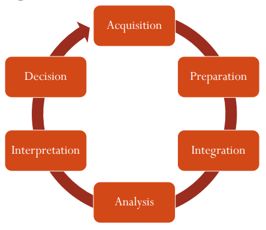
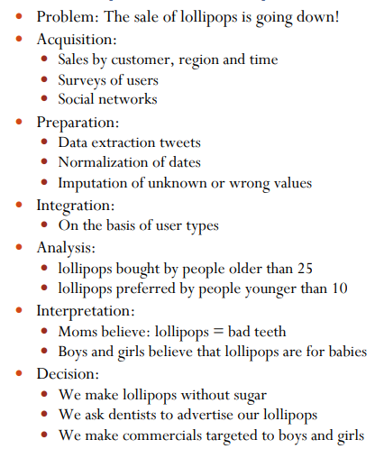
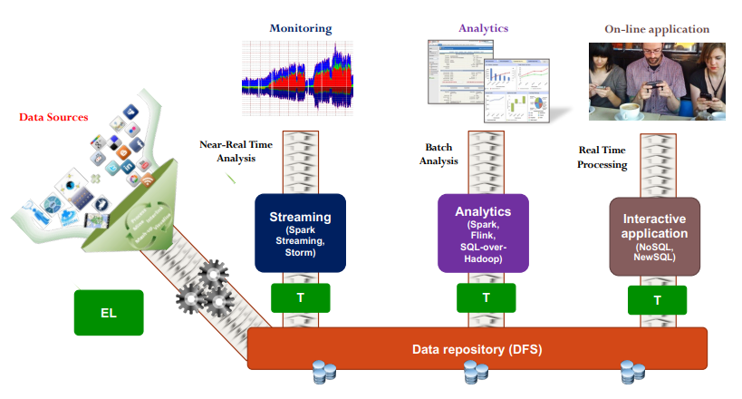
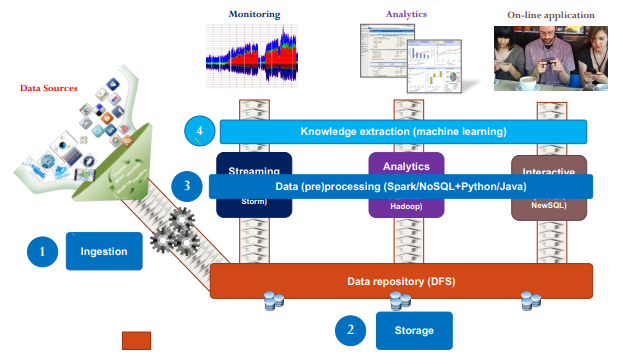

# 7 Marzo

Tags: Big Data Process
.: Yes

## Big Data Process

L’obiettivo è quello di effettuare una strategia di decisioni efficiente sfruttando la disponibilità del big data

| `Acquisition` | `Preparation` | `Integration` | `Analysis` | `Interpretation` | `Decision` |
| --- | --- | --- | --- | --- | --- |
| Selection | Transformation | Standardization | Exploration | Knowledge of the domain | Managerial skills |
| Filtering | Normalization | Conflict Management | Data Mining | Knowledge of the provenance | Continuos improvement of the process |
| Metadata generation | Cleaning | Reconciliation | Machine learning | Identification of patterns of interest |  |
| Managing Provenance | Aggregation | Mapping definition | Visualization | Flexibility of the process |  |
|  | Error handling |  |  |  |  |

Qui viene mostrato un esempio di un processo di `big-data`

I rischi e le sfide sono la `performance`, `efficienza`, `eterogeneità`, `riservatezza`, `problemi etici` e i `costi`.

L’infrastruttura necessaria per gestire il big data è un cluster di computer, quindi un’architettura distribuita che ha un meccanismo di gestione degli errori (`fault-tolerance`). L’aggiunta del processamento distribuito è molto utile per velocizzare le operazioni.

---

Ci sono 3 scenari:

- `analytics`: si ottengono molte informazioni che verranno utilizzati per addestrare per esempio il modello di ML. I dati sono append-only
- `streaming`
- `interactive`

Si può pensare di fare `extraction` e `loading` prima del `DFS`, e fare `transformation` nelle pipeline dei vari filtri.

Software stack for data analytics.