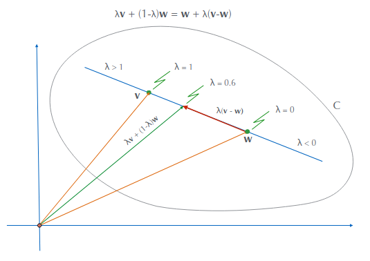
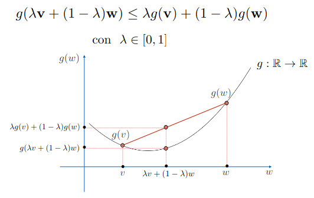
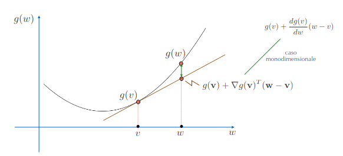
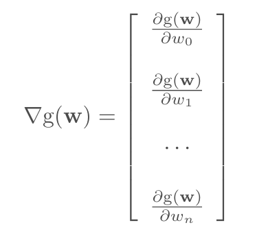
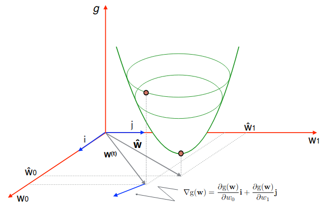
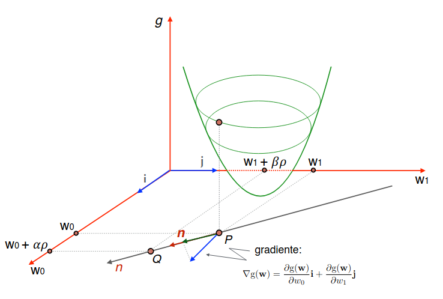
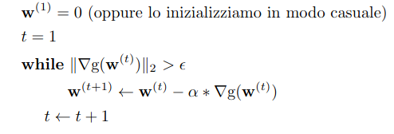
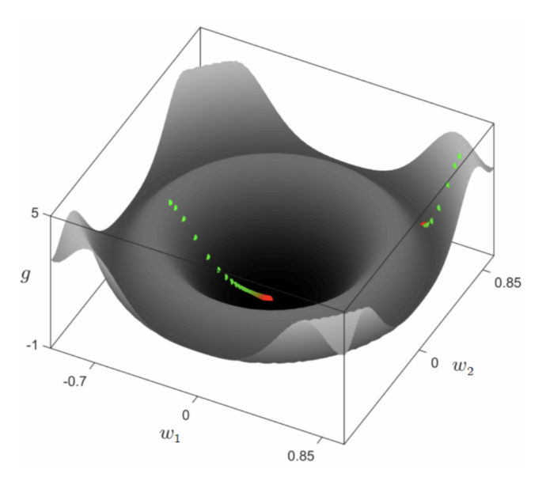

# 7 Marzo

Argomenti: Algoritmo gradient descent, Derivata direzionale, Derivate parziali di funzioni di più variabili, Funzione convessa, Gradiente, Insieme convesso
.: Yes

## Insieme convesso

Un insieme $C$ in uno spazio vettoriale è `convesso` se presi 2 punti $v$  e $w$ arbitrari appartenenti a $C$, il segmento che unisce i due punti appartiene a $C$

$$
\lambda v+(1-\lambda)w\in C
$$

## Funzione convessa

Sia $C$ un insieme convesso; una funzione $g:C\to\mathbb{R}$ si dice convessa se per ogni $v$ e $w$ appartenenti al suo dominio di definizione vale la seguente proprietà:

$$
g(\lambda v+(1-\lambda)w)\le \lambda g(v)+(1-\lambda)g(w)
$$

 Per una funzione convessa $g(w)$ differenziabile,  il “piano” tangente giace sempre al di sotto del grafico della funzione cioè $g(w)\ge g(v)+\nabla g(v)^T(w-v)$

## Derivate parziali di funzioni di più variabili

Se esiste determinato e finito il seguente limite:

$$
\lim_{\Delta w_0 \to 0}{\dfrac{g(\overline{w_0}+\Delta w_0,\overline{w_1})-g(\overline{w_0},\overline{w_1})}{\Delta w_0}} 
$$

la funzione $g$ si dice `parzialmente derivabile` rispetto a $w_0$ nel punto $(\overline{w_0},\overline{w_1})$.

## Gradiente

Il `gradiente` di una funzione è una diretta generalizzazione della nozione di derivata per una funzione a più variabili. Data la funzione $g(w_0,w_1,...,w_n)=g(\bold{w})$ si definisce `gradiente` di $g$ il vettore le cui componenti sono le derivate parziali della funzione $g(\bold w)$

Si può immaginare il gradiente come una "freccia" che punta verso l'alto su una superficie tridimensionale, con la lunghezza della freccia che rappresenta la pendenza della superficie in quella direzione.

Il gradiente può essere interpretato anche come la direzione in cui la funzione decresce più rapidamente se si considera il gradiente con segno negativo.

Il gradiente è uguale $0$ quando si sta in un minimo locale, in particolare per funzioni convesse il gradiente è in un minimo globale

## Derivata Direzionale

La `derivata direzionale` secondo $n$ è il prodotto scalare dei 2 vettori: $\nabla g\cdot \bold n$

$$
\dfrac{\partial g}{\partial n}=\alpha\dfrac{\partial g}{\partial w_0}+\beta\dfrac{\partial g}{\partial w_1}
$$

Questo significa che la derivata direzionale della funzione $g$ è massima secondo la direzione e verso del vettore gradiente

In pratica rappresenta la componente del gradiente sulla retta orientata $n$

## Algoritmo Gradient Descent

La proprietà del vettore gradiente cioè quella che fornisce la direzione della pendenza più ripida è alla base di algoritmi di ricerca locale che operano in spazi continui. 

Questa è l’andamento dell’algoritmo su una funzione non convessa a due variabili