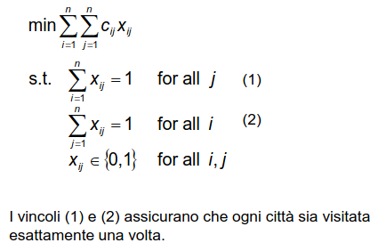

# 7 Novembre

Argomenti: Problema TSP
.: Yes

## Problema del commesso viaggiatore

Questo problema è anche conosciuto come problema del `ciclo Hamiltoniano` di lunghezza minima. Il problema chiede di trovare il percorso di lunghezza minore, in una rete di città connesse tramite delle strade, che un commesso viaggiatore deve seguire per visitare tutte le città una e una sola volta.

## Formulazione PLI

