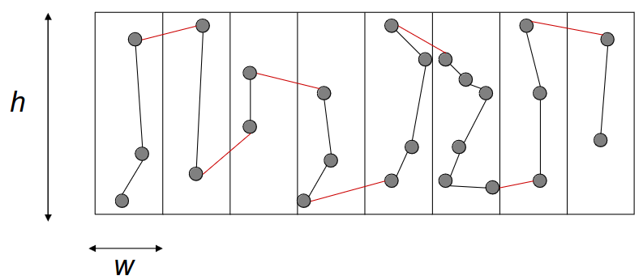
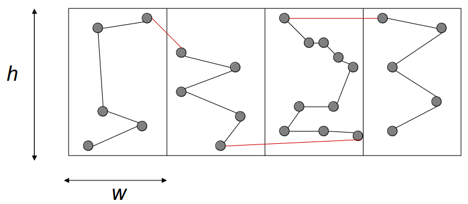

# 8-14 Novembre

Argomenti: Euristici Costruttivi, Euristici Enumerativi, Metodi Euristici
.: Yes

## Metodi Euristici

Gli algoritmi euristici sono algoritmi che non forniscono alcuna garanzia sulla bontà della soluzione trovata, e nel caso peggiore potrebbero comportarsi molto male in termini di soluzione molto lontana dall’ottimo e/o per tempi di calcolo esponenziali.

Questi metodi si suddividono in due classi:

- `Costruttivi`: offrono poche soluzioni e sfruttano le proprietà strutturali delle soluzioni ammissibili, al fine di generare una soluzione ad hoc del problema a partire da 0. Dipendono dal problema considerato e richiedono un tempo di calcolo polinomiale.
- `Enumerativi`: si esaminano diverse soluzioni generate rapidamente e successivamente si sceglie la migliore.

## Metodi Euristici Enumerativi

Gli `enumerativi` sono approcci generati per la creazione di nuove soluzioni, adattati al problema considerato e potrebbero richiedere un tempo di calcolo esponenziale. Possono essere suddivisi in due macro-classi:

- Le nuove soluzioni si ricavano modificando la struttura delle soluzioni già note (`Ricerca Locale`)
- Le nuove soluzioni provengono dalla soluzione di problemi parziali di dimensioni più piccole (`Tecniche basate sulla PL`)

L’analisi di un algoritmo euristico può essere:

- `teorica`: consiste nel valutare alcune proprietà formali dell’algoritmo come la sua complessità temporale e il suo rapporto di approssimazione
- `sperimentale`: consiste nel descrivere il funzionamento dell’algoritmo nella pratica, quindi si studia il tempo di calcolo, la qualità delle soluzioni, ecc. Il suo dataset dovrà essere composto da istanze di dimensioni e caratteristiche diverse.

Gli indicatori più comuni per l’analisi sono:

- `valore medio` dell’errore relativo
- `varianza` dell’errore relativo

Gli svantaggi sono che i risultati vengono influenzati anche da pochi risultati “cattivi” e che l’errore relativo può essere solo stimato quando non si conosce il valore ottimo

## Metodi Euristici Costruttivi

I `costruttivi` sono considerati metodi semplici, associati talvolta al tipo `greedy`, perché si inizia con una parte di soluzione e poi, iterativamente, si aggiungono altre parti fino a che non si ottiene una soluzione ammissibile. Questo approccio viene usato con i problemi noti come:

- problema dello zaino: si hanno $n$ oggetti e uno zaino con una capacità limitata $B$, ogni oggetto ha il suo peso corrispettivo e un profitto. Si vuole individuare il sottoinsieme di oggetti di profitto $MAX$ totale in cui il peso non superi la capacità.
    - si ordinano gli oggetti per profitti `non crescenti` e poi si inseriscono gli oggetti nel contenitore fino a che vi è capienza. La soluzione restituita è cosi ottenuta.
    - si ordinano gli oggetti per densità ($p_i/w_i$) non crescente, poi si inseriscono gli oggetti fino a che vi è capienza. La soluzione è cosi ottenuta.
- problema del commesso viaggiatore (TSP): si ha un corriere che deve percorrere tutte le città note una e una sola volta facendo il percorso a costo minimo. Esistono ben 4 metodi per risolvere il problema:
    - `insertion heuristic`: l’idea di base sta nell’iniziare da un cammino costituito da un solo nodo e si aggiungono iterativamente i nodi, seguendo un criterio. Il criterio consiste nel definire una funzione euristica che permette di selezionare il nodo successivo e come e dove inserire il nuovo nodo nel cammino corrente T. Esistono molteplici metodi ma le più note sono:
        - `nearest neighbor`: ad ogni passo l’algoritmo seleziona il nodo più vicino all’ultimo nodo inserito nel cammino T, e questo nodo va alla fine di T
        - `neasert insertion`: si seleziona il nodo con distanza minima da un qualsiasi nodo inserito nel cammino T, il nodo scelto deve creare un incremento minimo nella funzione obiettivo all’inserimento
        - `farthest insertion`: ad ogni passo viene scelto il nodo la cui distanza dal nodo più vicino è massima (fra tutte le distanze minime, si sceglie la massima), si vuole che il nodo che viene inserito nel cammino $T$ fa crescere di meno la funzione obiettivo
        - `cheapest insertion`: si sceglie il nodo il cui inserimento nel cammino T induce il minimo incremento nella lunghezza di T
        - `random insertion`: si sceglie a caso il nodo successivo da inserire, tale nodo viene inserito dove fa crescere di meno la lunghezza del cammino
        - `smallest sum insertion`: si sceglie il nodo $j$ tale che la sua distanza da tutti i nodi in T è minima, questo nodo viene inserito alla fine di $T$
    - `savings methods`: l’idea di base sta nell’iniziare con un insieme di semplici cicli parziali, che vengono poi iterativamente uniti fino a che non si ottiene un unico ciclo che tocca tutti i nodi del grafo. Si deve scegliere poi con quale criterio vengono definiti i cicli iniziali, come si selezionano le coppie di cicli da unire e come si uniscono tali coppie.
    - `euristiche basate su alberi ricoprenti`: qui le euristiche si dividono in 2 macro-classi:
        - `algoritmo albero`: si calcola l’albero ricoprente $T$ di peso minimo, poi si raddoppiano gli archi di $T$ ottenendo il multigrafo euleriano $T^E$. Dato un ciclo euleriano $C_E$ su $T^E$, si calcola un ciclo hamiltoniano cancellando poi tutti i nodi ripetuti
        - `algoritmo di christofides`: si calcola l’albero ricoprente di peso minimo T, si calcola il matching perfetto di peso minimo M sul sottografo completo indotto da tutti i nodi che hanno grado dispari in T. Si aggiungono poi gli archi da $M$ a $T$ ottenendo il grafo euleriano $G^E$. Dato un ciclo euleriano $C_E$ su $T^E$, si calcola un ciclo hamiltoniano cancellando poi tutti i nodi ripetuti.
        
        
        
    - `algoritmi per istanze geometriche`: questo metodo costruisce un poligono $P_0$ che contiene tutti i nodi, si semplifica questo poligono sostituendo un lato (arco da un nodo $i$ a $j$) con un altro percorso di costo minimo (che collega sempre $i$ e $j$)
        - `algoritmi a generazione di inviluppo`: inizialmente si costruisce un poligono $P_0$ contenente l’insieme $V=\{ v_1, v_2,..v_n\}$ dei punti. $P_0$ poi diventerà la figura piana
        - `algoritmo a sezione`: Ciascun problema viene scomposto in sottoproblemi corrispondenti a sezioni della regione di spazio interessata. Per ogni sezione viene risolto un problema di cammino hamiltoniano di peso minimo. I cammini cosi ottenuti vengono poi uniti per ottenere un unico cammmino hamiltoniano per il problema globale
        
        
        
        - `algoritmo sweep`: l’idea è dividere in settori l’area in cui sono presenti i nodi e visitarli nell’ordine. Più precisamente si fissa un punto centrale nell’area e da esso si trae un raggio che scorre l’area stessa, in verso orario o antiorario. I percorso viene costruito collegando via via, nell’ordine, i nodi toccati dal raggio