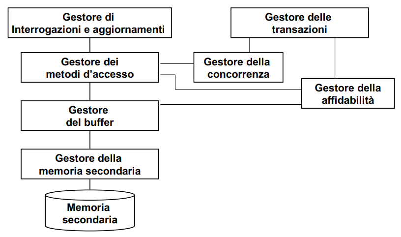
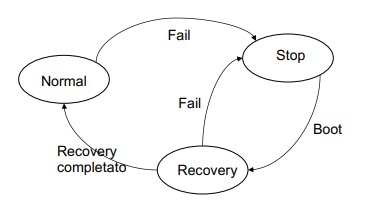

# 8 Aprile

Argomenti: ACID, Controllo della concorrenza, Gestione delle transazioni, Gestore dell'affidabilità, Guasti, Persistenza delle memorie
.: No

## Gestione delle transazioni

Le basi di dati devono essere `affidabili`, per questo è necessario il supporto alla gestione di transizioni che sono:

- `atomiche`: tutte le operazioni che avvengono all’interno di una transazione devono essere eseguite in caso contrario nessuna é eseguita
- `definitive`: il loro effetto è persistente nella basi di dati

L’affidabilità è impegnativa per via degli aggiornamenti frequenti e della necessità di gestire il buffer.

Una basi di dati è `condivisa` quindi si hanno le seguenti conseguenze:

- si ha bisogno di meccanismi di autorizzazione
- si ha bisogno di controllo della `concorrenza`

## Controllo della concorrenza

Intuitivamente, le operazioni sono corrette se `seriali`, cioè le transazioni devono essere eseguite sequenzialmente. Questo però porta a una penalizzazione della efficienza, quindi quello che si fa è fare un `controllo della concorrenza` che da un ragionevole compromesso.

## Transazione

Una transazione è un processo atomico con un inizio (indicata con `begin-transaction`) e una fine (indicata con `end-transaction`). All’interno di una transazione vengono eseguite una e una sola volta i seguenti comandi: `commit`(per terminare correttamente) e `roll-back`(per abortire la transazione).

## Proprietà di una transazione

La transazione per funzionare correttamente deve godere delle seguenti proprietà:

- `A`tomicità: una transazione è una unità atomica, se viene eseguito il commit allora tutte le azioni hanno effetto altrimenti nessuna azione ha effetto. L’abort è richiesto dell’applicazione o dal sistema a causa di crash o cause della stessa categoria. Possono essere necessari annullamenti o ripetizioni di azioni per ottenere la situazione desiderata.
- `C`onsistenza: la transazione rispetta i vincoli di integrità, che però possono essere violati durante la transazione
- `I`solamento: la transazione non risente degli effetti delle altre transazioni concorrenti, in pratica il risultato dell’esecuzione concorrente deve essere uguale al risultato della stessa esecuzione in modalità sequenziale. I risultati intermedi quindi non devono essere visibili
- `D`urabilità: Gli effetti di una transazione andata in commit non vanno perduti anche in presenza di guasti

## Persistenza delle memorie

Per garantire la proprietà di `durabilità` si usa la memoria stabile cioè una memoria che non può danneggiarsi. Questa memoria però non esiste ma viene approssimata tramite l’utilizzo di dischi replicati, nastri, etc.

L’uso della memoria centrale non è consigliato perché non è persistente mentre la memoria di massa è persistente ma  può danneggiarsi

## Guasti

Esistono guasti che sono classificati in 3 categorie:

- `soft`: errori di programma, crash di sistema, caduta di tensione. In pratica si perde la memoria centrale ma non la secondaria
- `hard`: sui dispositivi di memoria secondaria, in pratica si perde anche la memoria secondaria ma non quella stabile
- `catastrofe`: si perde la memoria stabile (si suppone che non si può verificare)

Questo è il modello `fail-stop` che si usa per la gestione dei guasti

## Gestore dell’affidabilità

Il gestore dell’affidabilità per assicurare atomicità e affidabilità usa 2 componenti:

- `log`: sarebbe un archivio permanente, in memoria stabile, che registra le operazioni svolte
- `dump`: sarebbe una copia di riserva della base di dati (pure in memoria stabile)