# 8 Marzo

Argomenti: Gradiente della funzione RSS, Minimizzazione del gradiente nel caso multivariato, Minimizzazione del gradiente nel caso univariato, Regressione Multipla, Regressione lineare univariata
.: Yes

## Introduzione alla regressione

Questi modelli a `regressione` vengono utilizzati per prevedere variabili obiettivo su scala continua, risolvono questioni in ambito di trovare relazioni fra variabili, valutare tendenze ed effettuare previsioni. 

## Apprendimento induttivo

Si vuole trovare una funzione $f(x)$ detta `ipotesi` che approssima meglio le osservazioni disponibili. 

## Simple Linear Regression Model

Sarebbe semplicemente un modello a regressione `univariata`, consiste nell’individuare le relazioni esistenti tra un’unica caratteristica che sarebbe la variabile descrittiva $x$ e una risposta continua che sarebbe la variabile target $y$

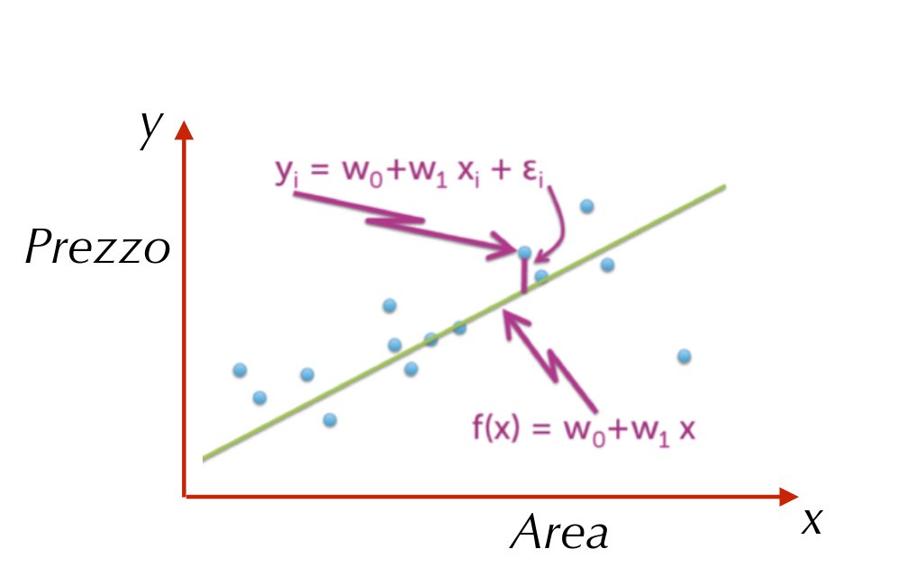

In figura è rappresentato un modello lineare per $f(x)$ dove il peso $w_0$ rappresenta l’intercetta e il peso $w_1$ rappresenta la pendenza della retta.

- $\widehat{y_i}=f(x_i)=w_0+w_1x_i$
- $y_i=w_0+w_1x_i+\epsilon_i$

I punti $(x,y)$ rappresentano il dataset

Si vuole avere un criterio che definisce la $f(x)$ “migliore”, una soluzione può essere quello di minimizzare gli errori che si hanno sulle osservazioni.

Una delle funzioni utilizzate a tal fine è la `Residual Sum of Squares (RSS)`, definita come segue a partire da $N$ osservazioni disponibili:

$$
RSS(w_0,w_1)=\sum_{i=1}^{N}(y_i-\widehat{y_i})^2=\sum_{i=1}^{N}[y_i-(\widehat{w_0}+\widehat{w_1}\cdot x_i)]^2
$$

Il problema di addestrare il modello è dunque quello di trovare i valori dei 2 pesi $\widehat{w_0}$ e $\widehat{w_1}$ che minimizzano la funzione $RSS$, in pratica è una ricerca di ottimizzazione nello spazio dei pesi. A tal fine si può sfruttare il `gradiente` di $RSS$. Si può dimostrare che la $RSS$ è una funzione convessa.

## Gradiente della funzione RSS

$$
\nabla
RSS(w_0,w_1)=
\begin{bmatrix}
\dfrac{\partial RSS}{\partial w_0}\\
\\
\dfrac{\partial RSS}{\partial w_1}
\end{bmatrix}
$$

Il gradiente della funzione $RSS$ è definito come segue, quindi come la derivata parziale per ogni componente

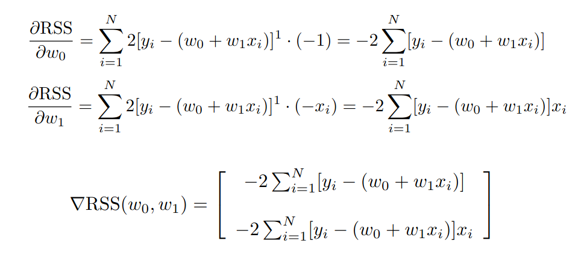

Si fa la derivata della sommatoria utilizzando qualche proprietà

Una volta calcolato il gradiente della funzione $RSS$ ci sono 2 possibili approcci per minimizzare la funzione di costo:

- `forma chiusa`: si uguaglia il gradiente a zero e si risolvono le equazioni ma è computazionalmente oneroso
- `gradient descent`: richiede la definizione del criterio di convergenza e dello “step size”

## Minimizzazione costo - Forma chiusa (univariato)

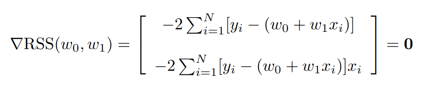

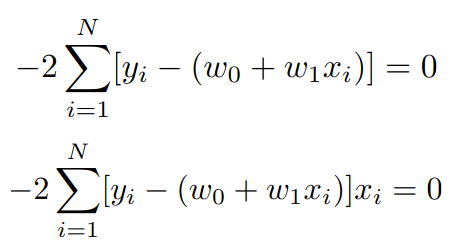

La prima cosa che si fa è porre il gradiente uguale al vettore nullo

Da cui si ottengono le 2 equazioni

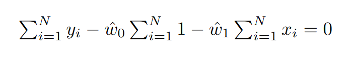

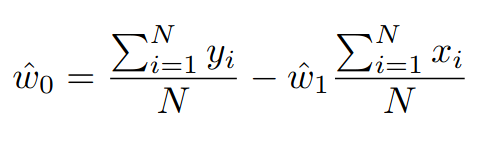

dalla prima equazione si sfrutta la proprietà associativa della sommatoria

Da cui si ottiene questa relazione per $\widehat{w}_0$

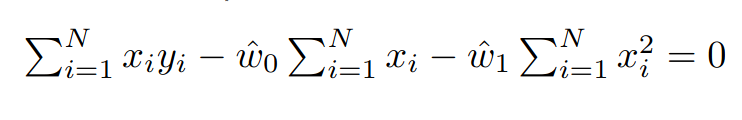

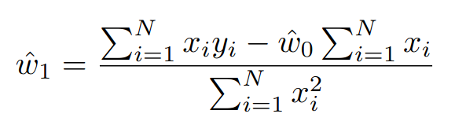

dalla seconda equazione si sfrutta la proprietà associativa della sommatoria

Da cui si ottiene questa relazione per $\widehat{w_1}$

Adesso si deve solamente sostituire il termine $\widehat{w}_0$ presente in $\widehat{w}
_1$ per poi calcolare con vari passaggi il valore dei 2 pesi che minimizzano la funzione $RSS$

## Minimizzazione costo - Gradient descent (univariato)

$$
\bold{w}^{(t+1)}\gets \bold{w}^{(t)}-\alpha\cdot\nabla RSS(\bold w^{(t)})
$$

Con questo approccio si devono aggiornare i pesi in modo tale da spostarci nella direzione opposta al gradiente

$$
w_0^{(t+1)}\gets w_0^{(t)}-\alpha\cdot\frac{\partial RSS(\bold w^{(t)})}{\partial w_0}
\\ \space\\
w_1^{(t+1)}\gets w_1^{(t)}-\alpha\cdot\frac{\partial RSS(\bold w^{(t)})}{\partial w_1}
$$

I nuovi valori dei pesi vengono aggiornati contemporaneamente dove:

$$
\bold w=
\begin{bmatrix}
w_0\\
w_1
\end{bmatrix}
$$

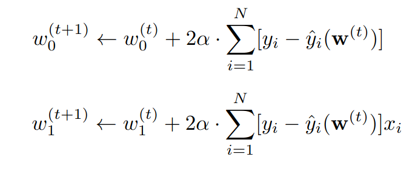

Rivedendo l’espressione del gradiente di $RSS$ l’aggiornamento dei 2 pesi può dunque essere effettuato come segue scegliendo un opportuno `step-size` espresso con $\alpha$

$$
||\nabla RSS(\bold w^{(t)})||_2\le\epsilon
$$

Quello che resta da fare è definire un `criterio di convergenza`; visto che per funzioni convesse si ha un minimo globale quando il gradiente è uguale a $0$ allora l’aggiornamento dei pesi termina quando è soddisfatta la seguente condizione

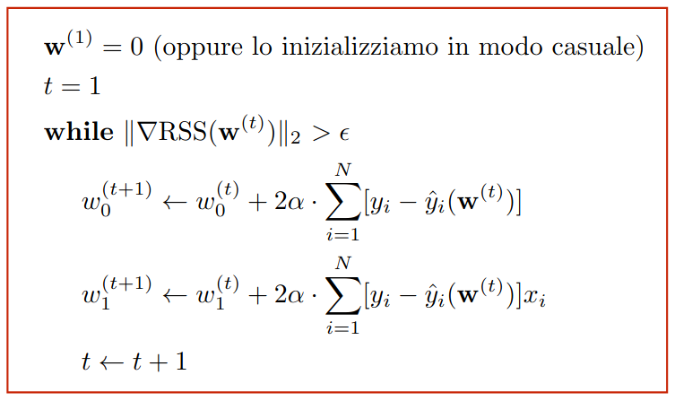

Qui è riassunto il gradient descent

Il valore $\epsilon$ rappresenta in pratica l’errore, finché la norma euclidea è maggiore di questa soglia, si continuano a cercare i valori opportuni dei pesi

---

## Multiple Regression

In pratica sarebbe il caso di regressione lineare ma con più `features` quindi con più variabili. Quindi si avrà una `polinomial regression` il cui modello è il seguente:

$$
y_i=w_0+w_1x_i+w_2x_i^2+...+w_px_i^P+\epsilon_i
$$

Il caso generale con un solo input $x_i$ oppure un vettore $\bold x_i$ è il seguente:

$$
y_i=w_0\cdot \phi_0(x_i)+w_1\cdot \phi_1(x_i)+...+w_D\cdot \phi_D(x_i)+\epsilon_i=\left(\sum_{j=0}^{D}w_j\cdot \phi_j(x_i)\right)+\epsilon_i
$$

Anche in questo caso si può utilizzare come funzione di costo da minimizzare, la $RSS$ definita come segue a partire da $N$ osservazioni possibili:

$$
RSS(\bold w)=\sum_{i=1}^{N}(y_i-\widehat{y_i})^2=\sum_{i=1}^{N}\left[y_i-(w_0\cdot \phi_0(\bold x_i)+...+w_D\cdot \phi_D(\bold x_i))\right]^2
$$

Il problema in questo caso è quella di trovare i valori dei pesi $\widehat{\bold{w}}_0$,$\widehat{\bold{w}}_1$,..,$\widehat{\bold{w}}_D$ che minimizzano la funzione $RSS$ che è convessa anche in questo caso.

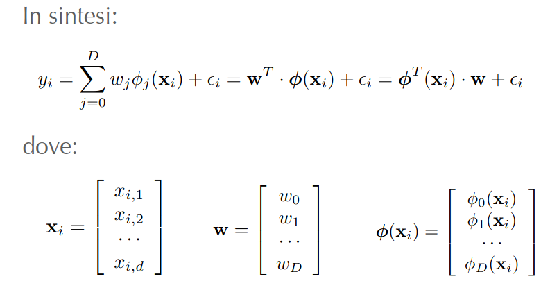

In molti casi può essere conveniente usare una notazione matriciale

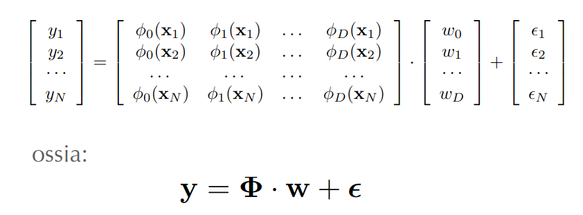

Si possono infine rappresentare le osservazioni $y$ in modo compatto come mostrato.

Ci si riscrive la funzione $RSS$ in una forma equivalente come mostrato di seguito, di cui la prima è solo una semplificazione di un’espressione precedente, mentre la seconda mette in risalto il significato teorico.

$$
RSS(\bold w)
=\sum_{i=1}^{N}(y_i-\widehat{y_i})^2=\sum_{i=1}^{N}\left[y_i-\bold\phi^T(\bold x_i)\bold w\right]^2=\sum_{i=1}^{N}\epsilon^2=\bold \epsilon^T\cdot \bold\epsilon
$$

$$
\bold y=\bold\Phi\bold w+\bold \epsilon\Rightarrow \bold\epsilon=\bold y-\bold\Phi\bold w
$$

Dalla forma matriciale si ricava il vettore $\epsilon$

$$
RSS(\bold w)=(\bold y-\bold\Phi\bold w)^T
(\bold y-\bold\Phi\bold w)
$$

La funzione $RSS$ assume pertanto la seguente forma in notazione matriciale

$$
\begin{align*}
  \nabla RSS(\bold w) &= \nabla\left[(\bold y-\bold\Phi\bold w)^T
(\bold y-\bold\Phi\bold w)\right] \\
  &= -2\bold\Phi^T(\bold y-\bold\Phi \bold w) \\
\end{align*}
$$

Si calcola adesso il gradiente della funzione $RSS$, partendo dalla precedente espressione matriciale applicando una regola di calcolo differenziale matriciale

Anche in questo caso, una volta calcolato il gradiente della funzione $RSS$, ci sono 2 possibili approcci per minimizzare la funzione di costo:

- `forma chiusa`: si uguaglia il gradiente a zero e si risolvono le equazioni (non sempre è possibile o conveniente dal punto di vista computazionale)
- `gradient descent`: richiede la definizione del criterio di convergenza e dello step size

## Minimizzazione costo - Forma chiusa (multivariato)

$$
-2\bold\Phi^T(\bold y-\bold\Phi \bold w)=0
$$

Si pone il gradiente al vettore nullo

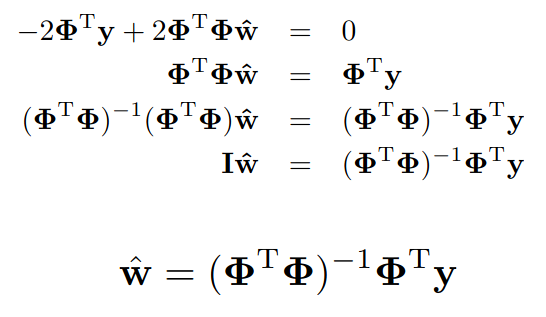

Attraverso semplici procedimenti matematici si ottiene che per calcolare i pesi $\widehat{\bold w}$ che minimizzano la funzione costo si deve fare il prodotto mostrato come da risultato

## Minimizzazione costo - Gradient descent (multivariato)

$$
\bold w^{(t+1)}\gets \bold w^{(t)}-\alpha \cdot \nabla RSS(\bold w^{(t)})
$$

Come nel caso univariato bisogna aggiornare i pesi in modo tale da spostarsi nella direzione opposta al gradiente

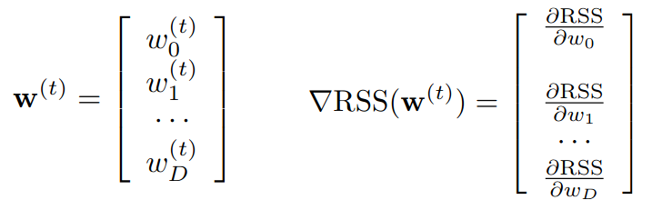

Ricordandosi che $\bold w^{(t+1)}$ e $\nabla RSS(\bold w^{(t)})$ sono definiti in questo modo

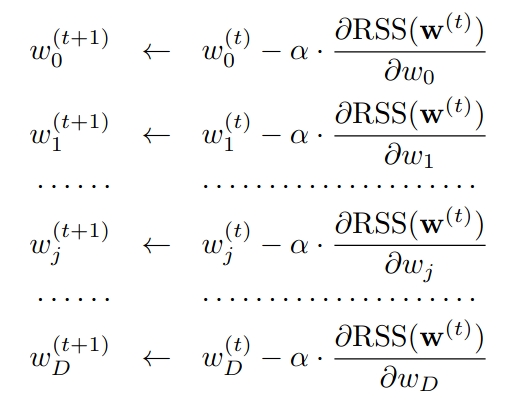

I singoli pesi devono dunque essere aggiornati come mostrato nella figura

$$
\begin{align*}
  \frac{\partial RSS(\bold w^{(t)})}{\partial w_j} &= \sum_{i=1}^{N}2\left[ y_i+\widehat{y}_i(\bold w^{(t)})\right] \cdot
\left[-\frac{\partial \widehat{y}_i(\bold w^{(t)})}{\partial w_j} \right]
\\
  &= \sum_{i=1}^{N}2\left[ y_i+\widehat{y}_i(\bold w^{(t)})\right] \cdot
\left[-\phi_j(x_i) \right]
\\
  &= -2\sum_{i=1}^{N}\phi_j(\bold x_i)\left[y_i-\widehat{y}_i(\bold w^{(t)})\right]
\end{align*}
$$

Per comprendere gli aggiornamenti da fare per i singoli pesi ci si calcola la derivata parziale di $RSS$ rispetto al generico peso j-esimo:

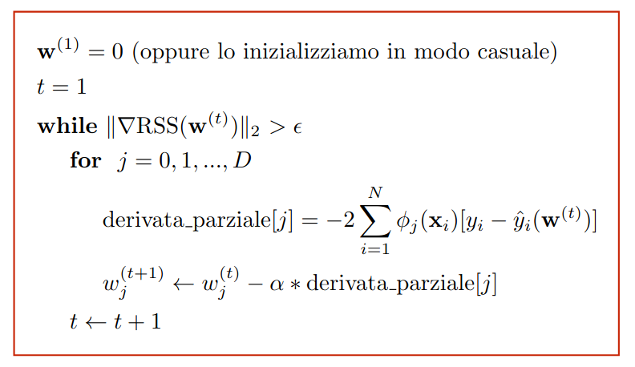

Visto che $RSS$ anche in questo caso è una funzione convessa allora il criterio di convergenza è uguale al caso univariato , di conseguenza l’algoritmo ha la stessa struttura tenendo conto di fare più derivate parziali per aggiornare i vari pesi.