# 8 Novembre

Tags: Addestramento di una RNN, Predizioni di più dati
.: Yes

## RNN: Addestramento

Per addestrare una rete `RNN` si usa una tecnica chiamata `backpropagation-through-time` (BPTT), in sostanza si fa finta che la rete sia una feed forward tradizionale con l’unica accortezza che si hanno i pesi condivisi.

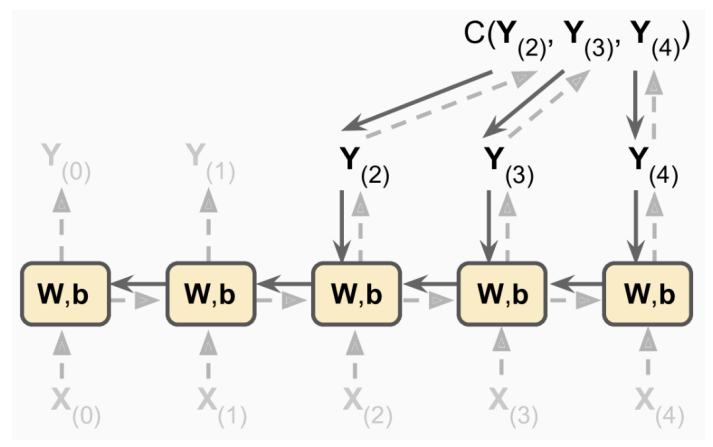

Quello che si fa è propagare l’output non nei layer ma nel tempo, l’output è valutato con una funzione di costo $C(Y_{(0)}, Y_{(1)},..,Y_{(t)})$

Il gradiente della funzione di costo è propagato `backward` e i parametri aggiornati di conseguenza.

## Time series: Predizione

- Le time series sono `univariate` quando si valutano temporalmente una singola metrica
- Le time series sono `multivariate` quando si valutano più metriche temporalmente

La predizione di un valore futuro nel tempo si chiama `forecasting`, mentre la predizione mancante all’interno di una time series è chiamato `imputation`.

## Predizione di più dati con una RNN

Si usano le time series fino a $t$ come input, e l’output all’istante $t+1$ sarà proposto al successivo step.

Ogni iterazione genera un valore alla volta

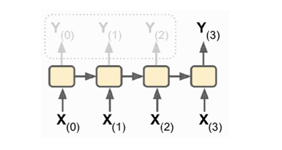

Simile al precedente ma in output si stimano contemporaneamente più valori in formato vettoriale, così ché si possa considerare una unica loss per l’output generato.

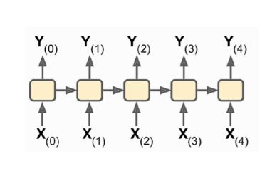

Simile al precedente ma si genera una sequenza con una loss associata al valore per ogni valore predetto.

Per addestrare una rete ricorrente su sequenze molto lunghe bisogna creare reti molto profonde ma si presentano i seguenti problemi:

- aumentare la profondità della rete porta a instabilità del gradiente
- più l’informazione è distante e più la rete RNN ha difficoltà a ricordare tale informazioni

Gli stessi iperparametri vengono ripetutamente usati per molte elaborazioni, quindi possono facilmente crescere e diventare instabili, quindi una funzione di attivazione come una `ReLU` che non satura non può prevenire questo tipo di fenomeno

Nelle `CNN` viene usata la `batch-normalization`, in questo caso non si ha la stessa efficacia perché la scala di valori e l’offset degli input e dell’hidden state attuale non vengono considerati quindi quello che si fa è usare una tecnica chiamata `layer-normalization` dove si normalizza rispetto alla dimensione delle caratteristiche e non rispetto al batch. 

## Problematiche della RNN

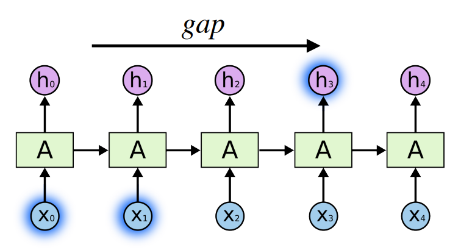

Le RNN fanno fatica a considerare legami significativi con campioni con gap elevato.

Per tale motivo sono state introdotte ulteriori `memory-cells` che mantengono lo stato memorizzato e lo propagano alle celle successive evitando che svanisca a causa dei valori dei gradienti non ottimali.

Le `LSTM` sono memory-cells introdotte per migliorare la rappresentazione dello stato in modo da riconoscere pattern temporali sempre più estesi e complessi. 

All’interno delle memory-cells oltre allo stato esistono una serie di `gate-controllers` che decidono quali informazioni propagare nelle celle successive. Perciò nelle `LSTM` esistono meccanismi dedicati per aggiornare lo stato, oltre al confronto diretto con l’output atteso.

## Celle LSTM

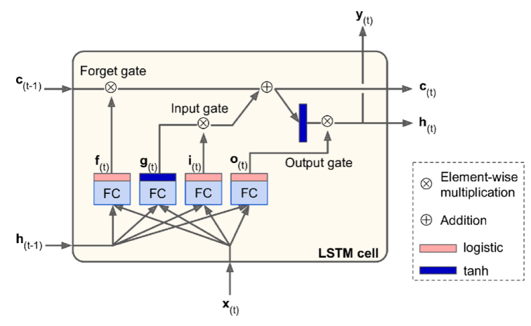

Una cella LSTM è rappresentata in questa immagine, al suo interno le informazioni transitano in percorsi distinti, soggetto a 4 gate ed ogni gate con parametri distinti.

Per generalità si suppone che $\bold x_{(t)}$ e $\bold y_{(t)}$ e tutti gli altri valori siano rappresentati con vettori.

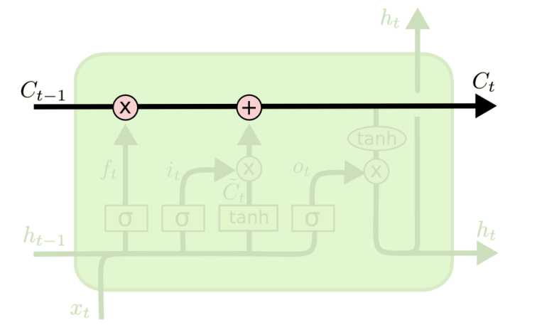

Lo stato $c_{(t)}$ si propaga ad ogni iterazione.

I `gate` governano le modifiche da apportare, consistono in una rete neurale con attivazione `sigmoid` ad eccezione del output-gate che usa `tanh`.

Le `LSTM` hanno 3 gate: `forget` gate, `input` gate e `output` gate.

## Forget gate

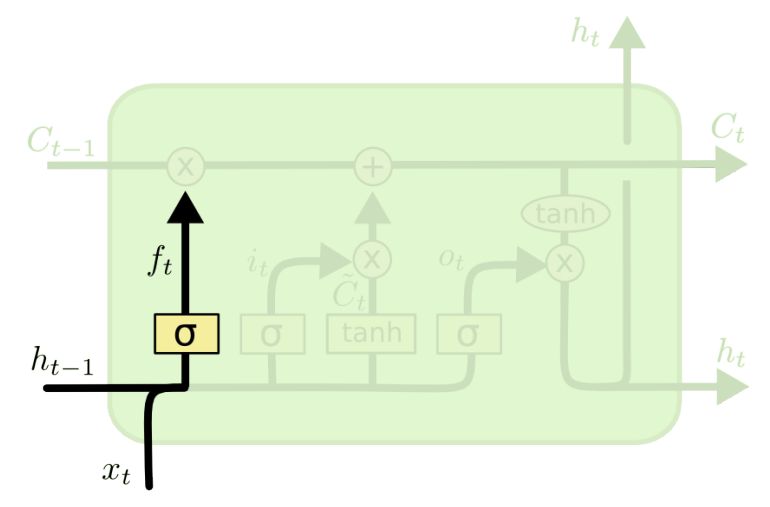

Questo gate determina l’informazione da rimuovere dallo stato corrente, nella figura vengono mostrati i valori utilizzati per fare la decisione di forget.

$$
f_t=\sigma(W_f\cdot\left[h_{t-1},x_t\right]+b_f)
$$

## Input gate

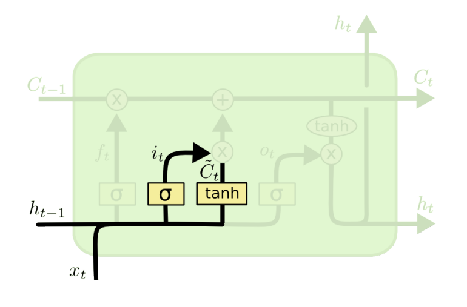

Questo gate decide se aggiungere l’informazione allo stato corrente. L’`input-node` che sarebbe un layer con attivazione tanh genera un set di valori candidati $\widetilde{C}$.

L’input gate deciderà quali valori di $\widetilde{C}$ addizionare e quali no.

$$
i_t=\sigma(W_i\cdot \left[h_{t-1},x_t\right]+b_i)
$$

Formula dell’input gate

$$
\widetilde{C}=tanh(W_C\cdot[h_{t-1},x_t]+b_C)
$$

Formula dell’input node che genera i valori candidati $\widetilde{C}$. 

La funzione di attivazione è una `tanh` e mappa i valori in un intervallo $\left[-1, 1\right]$, si usa perché cosi è possibile modulare l’influenza dei nuovi dati in base al contesto. Se l’informazione è rilevante allora si produrrà un contributo positivo (negativo viceversa). 

## Aggiornamento dell’input e forget gate

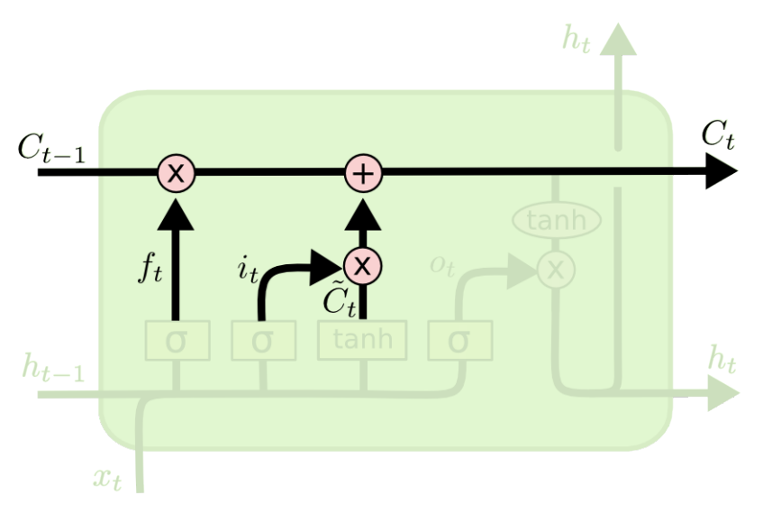

Il vecchio stato $c_{(t-1)}$ viene aggiornato moltiplicando element-wise l’output del `forget-gate` $f_t$, per poi aggiungerci il contributo dei valori candidati.

$$
C_t=f_t\otimes C_{t-1}+i_t\otimes \widetilde{C}_t
$$

## Output gate

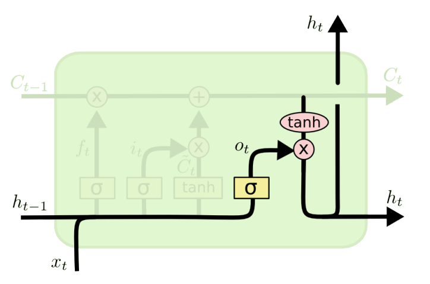

Il gate di output, che ha attivazione sigmoid, determina le informazioni di $c_{(t)}$ considerate per l’output.

## Peephole connections

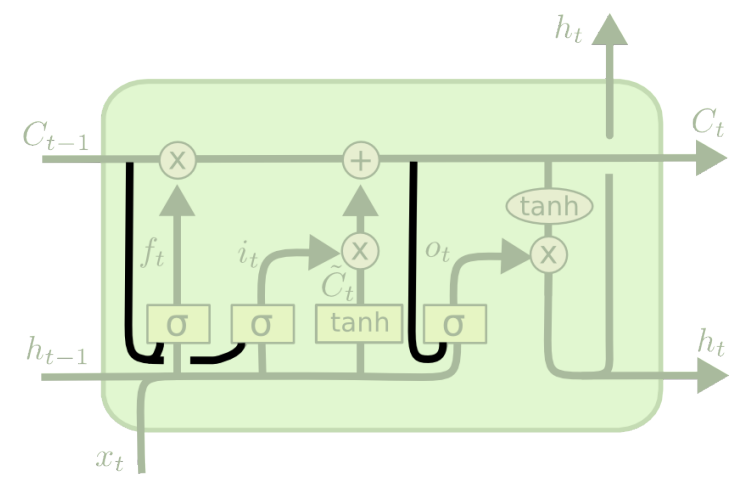

In una cella `LSTM` tradizionale i gate sono controllati tramite $x_t$ e $h_{t-1}$, può essere utile però aggiungere l’informazione dalla memoria a lungo termine.

Per fare ciò si usano le `peephole-connection` il quale fornisce $c_{(t-1)}$ ai gate forget e input.