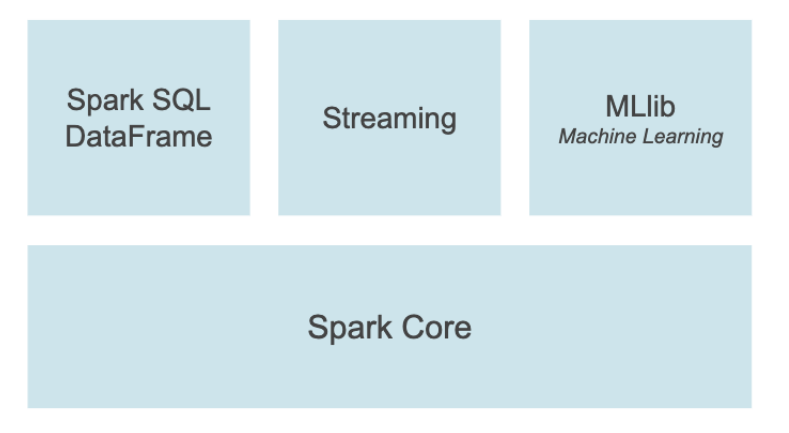
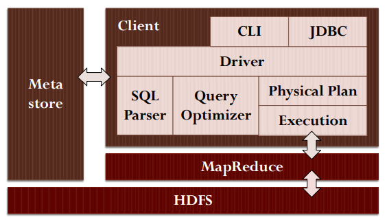
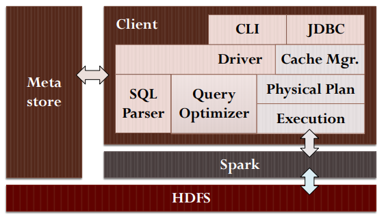
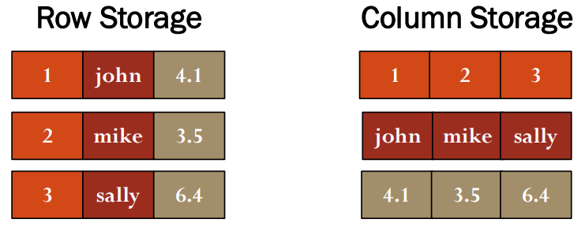
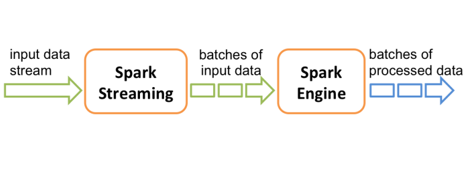
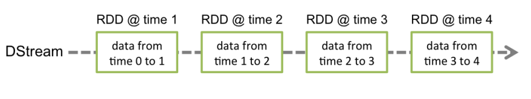
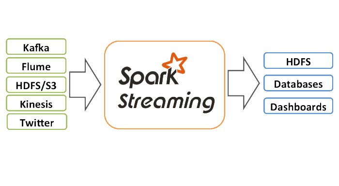
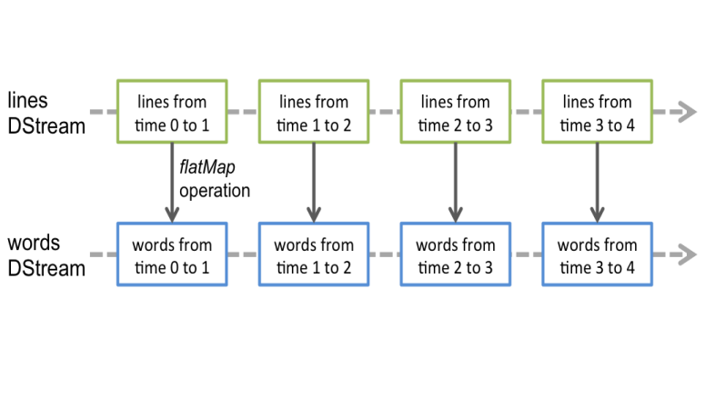
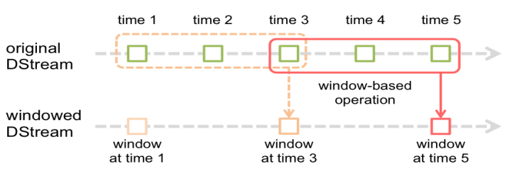
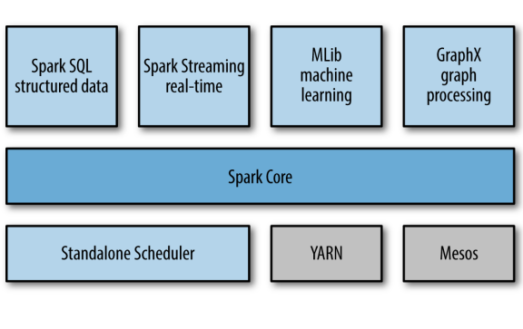

# 9 Aprile

Tags: Spark SQL, Spark Streaming
.: Yes

## Spark Extensions

Tutto quello che si è detto prima fa parte di `spark-core`; su questa infrastruttura di base sono state costruite delle estensioni che vanno in direzioni diverse. 

- `spark-sql`: offre un’interfaccia SQL come HIVE solo che invece di farlo girare con map-reduce lo fa girare su spark. In sostanza si è esteso HIVE per essere eseguito su spark.

Architettura HIVE

Architettura Spark-SQL

## Spark SQL

Utilizza un formato di memorizzazione chiamato `parquet` perché introduce un sistema di memorizzazione basato non su righe ma su colonne

Si è osservato che nel contesto del big-data ( in cui i dati non hanno un formato molto stringente cioè molti record possono essere molto lunghi oppure alcune colonne sono molto più importanti degli altri oppure dei campi che possono essere opzionali e quindi nulli) gli spazi vuoti occupano spazio di memorizzazione. Quindi si memorizzano prima i dati della prima colonna, poi della seconda e cosi via.

Le strutture dati di riferimento per `spark` sono i `dataframe` e i `dataset`. Viene più utilizzato il dataframe.

## Spark streaming

`Spark-Streaming` è una soluzione nata dalla necessità di gestire dati che arrivano in formato stream.

In sostanza i dati stream, che arrivano in input, vengono spezzati in batch di dimensioni che dipendono dall’intervallo temporale creando cosi un set di dati che verranno elaborati da `spark-engine`.

Il sistema più diffuso che è produttore di dati di stream è `apache-kafka`.

La sorgente può anche essere una connessione TCP

Qui viene mostrato l’esempio di `word-count`, quindi dei dati testuali che arrivano sotto forma di stream.

Oltre a costruire i mini-batch è possibile costruire anche delle finestre che sono insieme di mini-batch e su queste finestre applicare delle funzioni spark.

## Spark Software Stack

Riassumendo `spark-core` ha operazioni base di trasformazione, azione e persistenza. 

- `spark-sql`: introduce un’interfaccia SQL
- `spark-streaming`: per gestire stream
- `mllib`: offre algoritmi ML più efficienti di map-reduce
- `graphx`: offre API di processamento parallelo di grafi