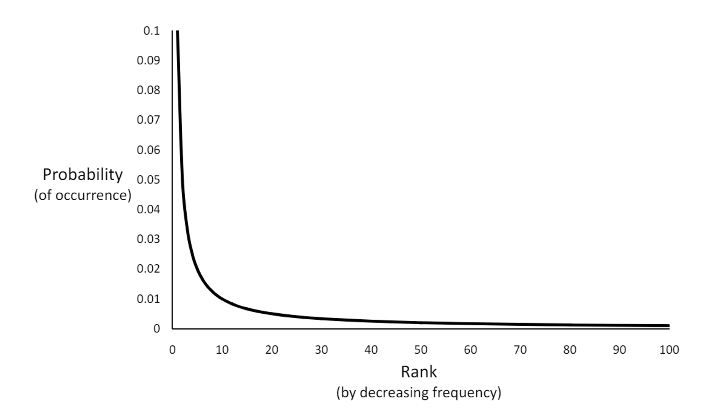

# 9 Aprile

Argomenti: Statistiche sul testo, Stopping, Tokenizzazione
.: Yes
Description: Text transformation 1

## Elaborazione del testo

Le elaborazione delle query devono corrispondere alle elaborazioni fatte sulla base di conoscenza, altrimenti si crea un disallineamento dello spazio di ricerca.

Se la ricerca viene fatta sulla base della presenza o meno di alcuni termini in un documento piccolo si ottengono risultati soddisfacenti. In generale non tutte le parole sono di egual valore nella ricerca

## Statistiche sul testo

Si basa sul fatto che i linguaggi contengono un’enorme varietà di parole presenti nel testo. Tuttavia i linguaggi sono estremamente prevedibili, molte caratteristiche statistiche possono essere predette analizzando le occorrenze e le co-occorrenze delle parole, ovvero, quando compare un termine è molto probabile che ne compaia subito anche un altro. I modelli di `Retrieval` e di `Ranking` (come IF-IDF) dipendono fortemente dalle proprietà statistiche delle parole. Le parole importanti occorrono spesso in documenti ma non sono frequenti nell’intera collezione. 

In questo contesto, i `Large Language Model`, nel document retrieval, forniscono la probabilità che la query sia generata da un determinato documento, basandosi sulla distribuzione delle parole, in quanto la distribuzione delle parole è altamente `distorta` *(skewed)*. 

Ci sono poche parole che hanno frequenze molto alte e molte parole che hanno frequenze basse. Questa distribuzione è descritta dalla `legge di zipf`

$$
r\cdot f=k
$$

la frequenza della *$r$*-esima parola più comune è inversamente proporzionale a $r$ o, in alternativa, il rank **di una parola moltiplicato per la sua frequenza *$f$* è all’incirca pari a una costante $k$

## Tokenizzazione

Tramite la `tokenizzazione`, per ogni occorrenza di una parola in un documento viene restituito uno stream di token. Questa operazione può essere estremamente complessa in inglese e può esserlo ancora di più in altre lingue.

Questa tecnica viene utilizzata per diminuire lo spazio di indicizzazione, perché gli indici devono essere una struttura in grado di individuare in maniera efficace i contenuti e allo stesso tempo deve farlo in maniera efficiente. 

## Problemi della tokenizzazione

- Parole brevi di uno o due caratteri possono essere imporanti in molte query. Accade spesso nelle combinazioni con altre parole (xp, ma, pm, ben e king, el paso, master p, gm, j lo, world war II).
- Molte parole possiedono un trattino come parte integrante della parola stessa, a volte il trattino può essere omesso (e-bay, wal-mart, active-x, cd-rom, t-shirts), in altri casi deve essere considerato come parte integrante della parola o come separatore (winston-salem, mazda rx-7, e-cards, pre-diabetes, t-mobile, spanish-speaking)
- I caratteri speciali possono essere importanti nei tag, URL, frammenti di codice nei documenti. Apostrofi possono essere una parte di una parola (can’t, don’t, 80’s, 1890’s, men’s straw hats, master’s degree)
- Le parole maiuscole possono avere differenti significati dalle minuscole, in questo modo si possono perdere informazioni sulla distinzione tra parole comuni e non (apple frutto, Apple azienda).
- I numeri, inclusi i decimali, possono essere importanti (nokia 3250, top 10 courses, united 93, quicktime 6.5, 92.3 the beat, 288358 (quest’ultimo è un patent number)
- I punti possono comparire in numeri, abbreviazioni, URL, al termine di una frase (I.B.M., Ph.D., cs.umass.edu, F.E.A.R.)

Da questi esempi si intuisce come la tokenizzazione possa essere ben più complicata di quanto appaia. I passi per tokenizzare la query e i documenti devono essere identici altrimenti ci sarebbe un disallineamento tra lo spazio di ricerca della query e lo spazio di ricerca di documenti.

## Processo di tokenizzazione

Il processo di `tokenizzazione` comporta prima l’identificazione della struttura del documento e quindi l’identificazione delle parole nel testo come una qualsiasi sequenza di caratteri alfanumerici, terminata da uno spazio o da un carattere speciale, tutta convertita in minuscolo.

## Stopping

Alcuni termini non costituiscono alcuna informazione se presi singolarmente. In genere la loro frequenza è alta nei documenti e quindi non apportano alcun contributo informativo. Per questo motivo possono essere rimossi. Si riduce quindi lo spazio di `indicizzazione`, si migliorano i tempi di risposta del sistema, si migliora anche l’efficacia del retrieval. A volte possono però essere importanti in particolari combinazioni.

La lista delle parole da eliminare è chiamata `stopword-list`, può essere generata da quella delle parole ad alta frequenza oppure si può usare una lista standard. Le liste sono personalizzate per specifiche applicazioni, domini e anche parti di documenti.

Se lo storage lo permette, la politica migliore è quella di indicizzare tutte le parole nei documenti e prendere le decisioni su quali siano le parole da utilizzare nel momento della sottomissione della query.
