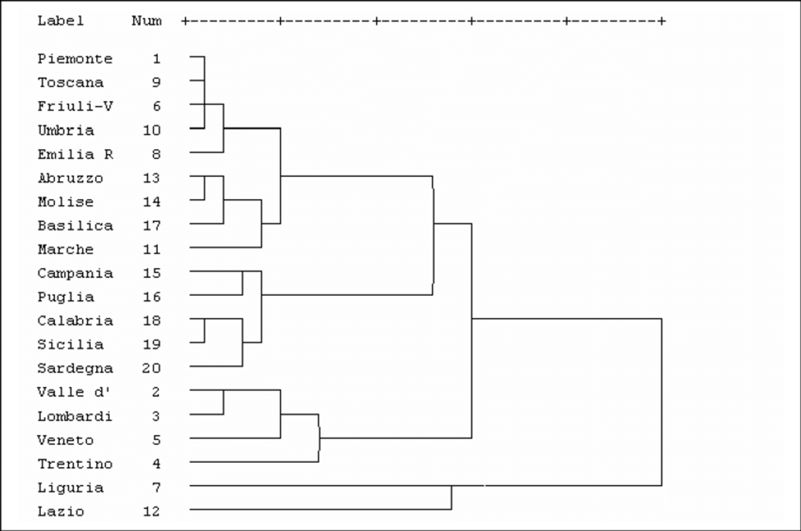

# 9 Maggio

Argomenti: Community, Community Based Question Answering
.: Yes

## Ricerca all’interno di Comunità

Analizzando i tag che gli utenti assegnano o ricercano è possibile scoprire gruppi di utenti con interessi collegati. Quando si parla di `comunità-online` si intendono gruppi di entità che interagiscono in un ambiente online e condividono obiettivi comuni, caratteristiche o interessi. Le web community sono collezioni di pagine web che trattano tutte uno stesso argomento, e identificare automaticamente le web community può essere utile per migliorare la search.

Ci sono molti modi in cui un utente può partecipare in una comunità e lo stesso utente può avere più interessi e quindi essere membro di una o più comunità online. Quindi per migliorare l’esperienza complessiva di un utente, può essere utile per i `motori di ricerca` e altri siti online determinare automaticamente le comunità associate.

La maggior parte degli algoritmi usati per individuare comunità prende in input un set di entità, informazioni su ciascuna entità e dettagli su come le entità interagiscono o sono correlate fra loro. E’ possibile rappresentare sotto forma di un grafo le interazioni fra un set di entità

- I `nodi` sono le entità
- gli `archi` diretti o indiretti indicano interazioni fra le entità
    - gli archi `diretti` sono utili per rappresentare relazioni non simmetriche o causali fra 2 entità
    - gli archi `indiretti` sono utili per rappresentare relazioni simmetriche o per indicare solo che 2 entità sono correlate in qualche modo

La ricerca di comunità online può essere fatto anche tramite algoritmi di `clustering`, in particolare si usa o il clusteting gerarchico agglomerativo oppure il `k-means` al grafo delle entità. 

Gli algoritmi `gerarchici` consentono di costruire una gerarchia di cluster, ne esistono di 2 tipi:

- `agglomerativi`: questo tipo prevede un approccio di tipo bottom-up, ovvero ogni nodo appartiene ad un cluster e si accorporano 2 a 2 secondo una misura di similarità
- `divisivi`: è un approccio top-down, si considerano tutti i nodi come appartenenti allo stesso cluster e successivamente diviso iterativamente 2 a 2 in modo da creare i cluster finali.

Alla fine dell’algoritmo ogni cluster rappresenta una comunità. In entrambi i casi il risultato dell’algoritmo è il dendogramma

Gli algoritmi di clustering operano trovando misure di similarità tra le entità, la più semplice utilizzabile è la distanza euclidea.

## Community-Based Question Answering - CQA

I sistemi `CQA` sfruttano le potenzialità della conoscenza di una moltitudine di individui (`wisdom-of-crowds`) allo scopo di soddisfare un ampio range in information need. Il principio sui cui si basano i `CQA` è il `wisdom-of-crowds`, una teoria sociologica secondo la quale se si ha la possibilità di fare una domanda a un gruppo consistente di utenti esperti e non esperti si ha maggiore probabilità di ottenere una risposta soddisfacente, piuttosto che fare la stessa domanda a un gruppo ridotto di esperti.

Di seguito sono elencati gli aspetti positivi e negativi di questo sistema:

- aspetti `positivi`: è possibile trovare risposte a infromation need complessi, si possono ricevere molteplici pareri su un topic e si può interagire con altri utenti che possono condividere interessi, problemi e obiettivi
- aspetti `negativi`: è possibile non ricevere alcuna risposta a una domanda e dover aspettare molto tempo per una risposta. Le risposte possono essere di bassa qualità (di solito domande di bassa qualità implicano risposte di bassa qualità)

Fare domande e risposte non è l’unica funzionalità di questi sistemi, è possibile anche consentire agli utenti di cercare all’interno dell’archivio di domande poste in precedenza e relative risposte. I motori di ricerca possono sfruttare quindi tali informazioni per migliorare la `search-result` con le risposte `CQA`, perciò data una query è importante poter trovare automaticamente possibili risposte nel database di domande-risposte.

Le migliori prestazioni si ottengono confrontando le query con le sole domande, si sfruttano perciò modelli di `information-retrieval` come i `language-model`, che catturano informazioni relative alla frequenza di occorrenza di una parola nel testo e informazioni contestuali come la probabilità di osservare una parola una volta che ne sia già stata osservata un’altra

Un `language-model` è uno strumento statistico in grado di assegnare un valore di probabilità a una porzione di testo in input basandosi sulle informazioni ricevute in fase di training. La differenza tra gli strumenti statistici di oggi, come GPT, e quelli presenti diversi anni fa è la quantità di dati sul quale vengono addestrati. Si realizza un sistema statistico così potente da individuare nei dati di pattern che normalmente non verrebbero individuati da un umano.

Nei language model si sfrutta il fatto che il linguaggio è prevedibile, a partire da una porzione di testo, è possibile prevedere con una certa probabilità cosa verrà dopo. i LM offrono quindi la **distribuzione di probabilità** sulle possibili sequenze di termini. In altri termini, data una query, il language model fornisce la probabilità che quella query sia generata a partire dai documenti di training. Pertanto è presente una forte dipendenza del language model dai documenti di training usati.

Nel contesto dei Language Model si è formalizzato il problema della previsione delle parole descrivendolo come la capacità di predire una parola $w_n$ date le n-1 parole precedenti.

In particolare, si possono usare i modelli di **cross-language retrieval**, in cui l’utente pone la domanda in un linguaggi (*source*) e i documenti sono recuperati in un altro linguaggio (*target*).

In tali modelli si introduce il concetto di **probabilità di traduzione**, che restituisce la probabilità che vi sia una parola una parola nel linguaggio source e nel linguaggio target, nella forma P(s/t), dove s è una parola nel linguaggio source e t una parola nel linguaggio target. Tali modelli possono essere estesi all’interno dello stesso linguaggio, si parla quindi di **intra-language retrieval**, s e t quindi sono nello stesso linguaggio (si indicano con t e t’), il tutto per risolvere il problema del *vocabulary mismatch problem* (esprimere stessi concetti con diverse parole). Tale probabilità può essere interpretata come la probabilità che la parola t sia utilizzata al posto di t’.
