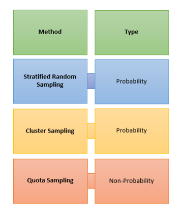

# 9 Maggio

Argomenti: Data Augmentation, Non-Probability Sampling, Probability Sampling
.: Yes

## Sampling

Quando si lavora con dati di grandi dimensioni e si volesse studiare una specifica feature, usare tutti i dati sarebbe computazionalmente oneroso, quello che si fa è selezionare una parte dei dati e considerare come `rappresentativa` della popolazione.

Le tecniche di `sampling` possono essere suddivisi in 2 famiglie e, a sua volta, in più tecniche ciascuna; sono quindi la `probability sampling`,`non-probability sampling`.

## Probability Sampling

Questa tecnica associa a ogni elemento dei dati un valore di probabilità di essere selezionato o meno. Esistono 3 tecniche di `probability sampling`:

- `simple-random`: ogni elemento della popolazione ha la stessa probabilità di essere selezionato.
- `sampling-stratified-random`:  La popolazione contiene più sottogruppi, chiamati `strata` dove ognuno di essi è formato in base a una condizione predefinita che definisce certe caratteristiche della popolazione. Il samping viene applicato su tutti gli strata (è fondamentale includere campioni estratti da ogni sottogruppo) ottenendo gruppi di campioni che saranno fusi in un unico insieme di campioni finale. Questo tipo di sampling è adatto a dati sbilanciati.
    - Questo metodo ha 2 approcci `proportionate` e `disproportionate`.
- `sampling-cluster-sampling`: La popolazione viene raggruppata in diversi sottogruppi, chiamati `clusters` che mantengono la rappresentatività della popolazione. Dopodiché si possono selezionare tutti i cluster o solo alcuni per lo studio. All’interno di ogni cluster, si considereranno tutti gli esempi o solo un sottoinsieme utilizzando il `sampling-stratified`, ottenendo un `cluster-sampling` a 2 strati.

## Non-Probability Sampling

Questa tecnica si basa principalmente sul giudizio di un esperto che analizza il dataset. Le tecniche più comuni sono:

- `accidental-sampling`: tipicamente si prendono i campioni che risultano più facili da prendere, si chiama accidentale poiché non si ha il controllo sull’individuo che si sceglie. A differenza del simple random sampling non è necessario conoscere l’intera popolazione. I risultati che si ottengono possono essere generalizzati all’intera popolazione a causa del potenziale bias della tecnica, questi svantaggi si riducono all’aumentare del numero di campioni.
- `quota-sampling`: l’obiettivo è rappresentare nei campioni selezionati ogni sotto-gruppo che si può individuare in una popolazione e mantenere le co-rispettive proporzioni.

## Utilizzo delle varie tecniche di sampling

- Lo stratified random sampling viene utilizzato quando la popolazione è eterogena, ci sono diversi gruppi distinti. Alcuni gruppi sono correlati con il topic di studio.
- Il cluster sampling viene utilizzato quando la popolazione rappresentata come cluster invece che come individui.
- Il quota sampling viene utilizzata se sono presenti i strata, ma non è possibile usare lo stratified random sampling a causa di vincoli da soddisfare

---

## Dati sbilanciati

Se si hanno 2 classi e se si suppone che più del 50% di istanze di addestramento appartengono a una sola di queste classi, durante l’addestramento di un modello questo sarà orientato verso la classe più numerosa. Esistono alcune tecniche che si applicano spesso per evitare questo scenario: `random-under-sampling`, `random-over-sampling`, `synthetic-over-sampling`, `data-augmentation`.

## Random under sampling

Questo è l’approccio più semplice soprattutto se ci sono molti dati disponibili, quello che si fa è eliminare in modo casuale i campioni della classe più numerosa fino a quando le classi sono pressoché bilanciate. Come effetto collaterale si ha la riduzione della complessità del modello, l’eliminazione di alcune informazioni utili e i modelli potrebbero non generalizzare su futuri dati.

## Random over sampling

In questo caso si incrementano le istanze della classe con meno campioni replicando in modo casuale i campioni già presenti. Il problema è che questo approccio può generare overfitting, perché aumentare il numero di campioni, viene ridotto il beneficio di aggiungere dati sintetici. 

## Synthetic over sampling - SMOTE

In questo caso si prende un sottonsieme della classe minoritaria e su di esso vengono generati nuovi dati sintetici, che saranno successivamente aggiunti al training set. Visto che i dati non vengono replicati non c’è problema di overfitting, questa tecnica però non è adatta a spazi con numerose features.

## Data augmentation

Genera nuove istanze a partire da quelle esistenti con operazioni di alterazione del relativo contenuto, allo scopo di incrementare la dimensione e la varietà delle istanze nel training e, come effetto collaterale, rendere il modello  “più robusto” a tali interazioni.