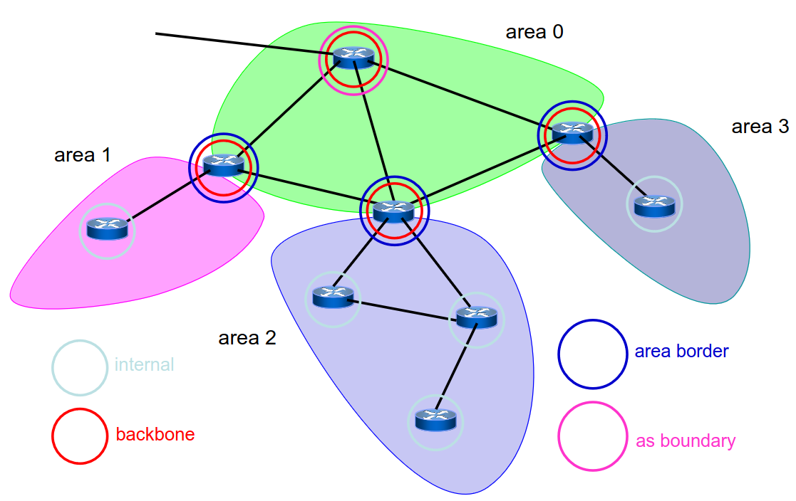

# 9 Ottobre

Argomenti: EGP, IGP, Open Shortest Path First, Routing Information Protocol
.: Yes

## Protocolli di routing

- I protocolli utilizzati all’interno di un dominio amministrativo (cioè all’interno di un singolo internet service provider) (per esempio la rete di un singolo provider) vengono chiamati Interior Gateway Protocol `IGP`
- I protocolli usati per trasferire le informazioni routing tra due diversi domini amministrativi vengono chiamati Exterior Gateway Protocol `EGP`

---

## RIP - Routing Information Protocol

Questo protocollo è un `IGP` introdotto in TCP, implementa l’algoritmo `distance vector` con invio dei distance vector ogni 30 secondi, il che è lento a convergere ma facile da configurare.

Usa una sola metrica basata sugli `hop` (quindi conta solo i salti), settando il valore massimo di hop permessi a 15 (quindi la lunghezza infinita coincide con 16). Utile usare quando la rete è piccola.

### RIP - Pacchetti

I distance vector sono spediti dalle interfacce di ciascun router in 2 modi:

- `RIPv1`: broadcast
- `RIPv2`: multicast

Un pacchetto contiene:

| Comando | Richiesta/risposta |
| --- | --- |
| Versione | RIPv1, RIPv2 |
| Lista di subnet | [(IP address,subnet mask),..] |

| I pacchetti di `richiesta` chiedono ai vicini i rispettivi distance vector |
| --- |
| I pacchetti di `risposta` trasferiscono i distance vector richiesti, vengono spediti anche senza richiesta |
| I pacchetti sono inviati ogni 30 secondi, ai quali viene aggiunto o sottratto un piccolo `offset random` per evitare che la rete si sincronizzi globalmente e che ogni 30 secondi i router calcolino solo la tabella di instradamento.
Se un prefisso su cui non arrivano informazioni aggiornate entro un certo tempo, sono considerate non più raggiungibili |

---

## OSPF - Open Shortest Path First

Protocollo `IGP` per TCP/IP, è basata sull’algoritmo `link-state packet` e la rete viene rappresentata con un grafo

### OSPF - Aree

- Questo protocollo struttura la rete (il grafo) in aree. Il pezzo più importante si chiama `backbone` ed è la regione di rete dove “passa” il traffico; le altre aree di cui è composto la rete sono tutte attaccate alla rete di backbone. Quindi è organizzato gerarchicamente
- Il routing può essere `inter-` o `intra-` area cioè può rimanere all’interno dell’area da cui nasce oppure può passare attraverso altre aree.
- Si fa questa strutturazione con l’obiettivo di scalare, in pratica la topologia interna a un’area è invisibile alle altre aree. Questo vuol dire che quando si fa il calcolo dei cammini più brevi oppure si fanno gli aggiornamenti delle mappe della rete non si ha la necessità di farlo ovunque ma queste operazioni rimangono localizzate nelle diverse aree.

### OSPF - Tipi di Router

In OSPF ci sono vari tipi di router con la invariante che ogni interfaccia è assegnata ad una sola area:

- `internal`: tutte le interfacce del router sono interne alla stessa area non di backbone
- `backbone`: il router ha almeno un’interfaccia sul backbone
- `area border`: il router ha almeno 2 interfacce su 2 diverse aree
- `AS boundary`: il router ha almeno un’interfaccia verso l’esterno (verso altri domini amministrativi), in pratica questo tipo di router viene utilizzato per scambiare traffico con altri provider (con il resto del mondo). (AS → autonomous system)

