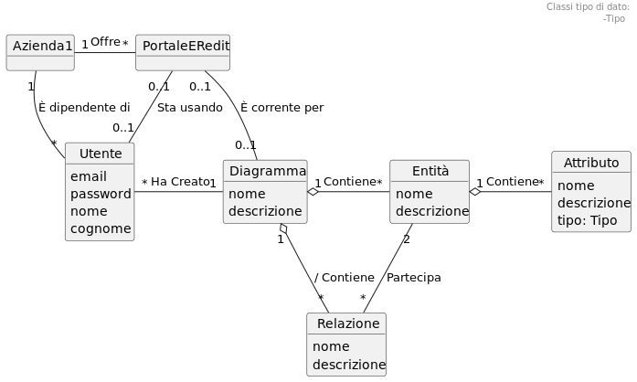

---
author:
- "*Giacomo Sturm*"
date: |
  *Dipartimento di Ingegneria Civile, Informatica e delle Tecnologie Aeronautiche  
  Università degli Studi “Roma Tre"*
title: |
  **Analisi e Progettazione del Software**  
  Esercizi Svolti di Analisi e Progettazione del Software  
  *Anno Accademico: 2024/25*
---

\providecommand{\labelText}[2]{#1}

# Correzione Homework

## Homework 1

Il modo migliore di procedere è partire da un caso d’uso, realizzare il modello di dominio limitatamente a questo caso d’uso e poi espanderlo. Si comincia stendendo una lista di classi candidate relative al primo caso d’uso:

- Acme Pizza

- Titolare

- Pizza

- Menù

- Pizzeria

- Pizza Delivery

- Città

- Portale Acme Pizza

- Descrizione Pizza

- Descrizione Prodotto Aggiuntivo

- Prodotto Aggiuntivo

- Elenco 12 Pizzerie Più Recenti

- Azienda

Il singolo concetto principale del primo caso d’uso è pizzeria, prima dell’esecuzione del caso d’uso non è registrata, dopo è registrata. Serve una classe singleton che gestisce l’intero sistema. In seguito serve una classe per modellare il punto di accesso, “Portale Acme Pizza”. Si usa la classe Pizza Delivery invece di azienda per modellare questa classe singleton. Titolare è l’attore primario del caso d’uso, quindi probabilmente si vuole, inoltre il sistema deve registrate informazioni sul titolare. L’elenco delle pizzerie più recenti si realizza tramite associazione quindi non si rappresenta come classe concettuale. Il termine menù è un termine di interesse per il dominio, quindi va rappresentato. La seconda coppia di classi da considerare sono pizza e descrizione pizza. Nel primo caso d’uso non sono presenti istanze di “Pizza”, mentre sicuramente sono presenti istanze di “Descrizione Pizza”. Serve una classe descrizione, ma nel testo dei requisiti non si utilizza questo termine nei requisiti, si utilizza invece il termine “Pizza del Menù”, ma più adatto è “Tipo di Pizza”. La classe città potrebbe essere una attributo, potrebbe essere una classe tipo di dato o classe semplice, non sembra abbastanza significativo modellarla come classe.

Le associazioni pià importanti sono tra pizzeria ed il titolare che la gestisce. Pizzeria è associata anche con Pizza Delivery, di cui è partner, ed ogni pizzeria offre un singolo menù. Rappresenta uno dei casi dove un’associazione uno ad uno è utile. Il menù è composto da descrizioni di pizze e prodotti aggiuntivi. Le descrizioni sono uniche per ogni pizzeria.

In generale mettere composizioni accanto al singleton non è preferibile. Un modello di dominio genera un grafo di istanze che deve essere sempre connesso. Prima di potere registrare le pizzeria, bisogna registrare il titolare, quindi per un periodo di tempo bisogna ricordarsi del titolare, senza ricordarsi delle pizzerie, quindi è necessaria l’associazione tra Pizza Delivery e Titolare, e non è derivata. Nel caso d’uso è richiesto ricordarsi le dodici pizzerie più recenti, in UML le associazioni possono avere delle proprietà e quindi ha senso dire che un’associazione è ordinata, e si descrive tra parentesi graffe.

Ora si passa al secondo caso d’uso, si considerano le classi candidate:

- cliente

- Ordine

- Pizza Ordinata

- Voce Ordine

- Voce Ordine Pizza

- Pizza

- Prodotto Aggiuntivo Richiesto

- Riga

- Riga Prodotto Aggiuntivo

- Prodotto Aggiuntivo

Le classi evidenti sono cliente di Pizza Delivery e gli ordini che ha effettuato. Questi sono collegati alle pizzerie. I concetti Pizza Ordinata e Voce Ordine rappresentano lo stesso concetto, quindi potrebbe essere sufficiente una sola di queste. Si inserisce Voce Ordine, e nel glossario dei termini si indica che i due termini sono sinonimi. Per le voci dell’ordine non viene richiesto di salvare il numero progressivo dell’ordine. Una voce ordine si riferisce alla descrizione di una pizza, mentre può riferirsi a molti prodotti aggiuntivi, quindi si utilizza un’associazione molti a molti. In un’ordine serve un attributo per la data ed ora, e l’indirizzo di consegna, realizzato con una classe tipo di dato.

Inoltre la classe ordine e voce hanno due attributi totale e totale parziale entrambi derivati.

Inoltre in uno dei casi d’uso compare l’attore gestore, che lavora per l’azienda.

## Homework 2

Si comincia dal diagramma di sequenza del sistema, il passo 7 comincia da una risposa ed oltre ad un frame di interazione indica la presenza di un loop, quindi deve essere terminato dall’attore. Analogamente per il passo 8. La conferma finale e l’inserimento delle informazioni relative all’ordine sono raggruppati nella stessa operazione. Non sono di interesse le estensioni.

La prima operazione di autenticazione si può chiamare `loginCliente` o `autenticaCliente`. La risposta del sistema sono i dati del cliente e l’elenco delle pizzerie recenti.

Il cliente al passo tre sceglie di creare un nuovo ordine, l’intero caso d’uso è riguardo l’inserimento dell’ordine, quindi si può chiamare `inizioInserimentoOrdine()`.

L’utente seleziona l’identificatore di una pizzeria poiché vuole scegliere la pizzeria da cui effettuare l’ordine `selezionaPizzeria`. Mentre al passo 7, non si vuole semplicemente selezionare una pizza, ma aggiungerla all’ordine, quindi non può essere chiamata allo stesso modo, viene quindi chiamato `aggiungiPizzaAllOrdine`, analogamente per i prodotti aggiuntivi, che vanno aggiunti all’ultima pizza ordinata.

Per terminare l’inserimento non si indica con fine, che non è un verbo, ma con `terminaInserimento`, che può essere di prodotti aggiuntivi o pizze.

Per questo caso d’uso bisogna creare un oggetto ordine, e le voci ordine relative alle pizze ordinata, e non vanno creati altri oggetti. Inoltre vanno formati i collegamenti tra l’ordine ed un cliente, collegare un ordine a tutte le voci d’ordine, collegare tutte le voci ordine ad una descrizione pizza ed eventualmente collegare le voci ordine a descrizione prodotti aggiuntivi.

La creazione di una voce d’ordine avviene all’interno del ciclo, per crearne tante quante sono necessarie. La formazione del collegamento tra ordine, cliente e pizzeria avviene o prima o dopo il ciclo. Il collegamento tra le voci ordine e l’ordine e le descrizioni di pizze o prodotti aggiuntivi avviene nei cicli annidati.

Sii vuole determinare quale di queste operazioni è opportuno scrivere che va creato l’ordine. Se si crea l’oggetto ordine all’inizio bisogna ricordare che si tratta di un tentativo di ordine, solo se viene confermato diventerà un vero e proprio ordine. Se viene creato alla conferma, allora sicuramente si tratta di un ordine confermato. In realtà è più importante nella progettazione capire se è più opportuno crearlo all’inizio o alla fine. Ci sono due strategie estreme che sono creare oggetti e formare collegamenti il prima possibile, oppure il più tardi possibile. Se non si creasse l’oggetto ordine, le voci d’ordine sarebbero collegate al portale, ma i collegamenti con il portale sono solamente uno ad uno, quindi non è giusto questo approccio.

> `loginCliente(username, password)`  
> Pre-condizioni: nessuna  
> Post-condizioni: è stato formato un collegamento tra Portale Acme Pizza e Cliente `c`, sulla base di `username` e `password`.

Nel modello di dominio semplificato quest’associazione tra il portale ed il cliente non è presente, quindi va aggiunta, dato che nella modellazione precedente non si erano considerati i dati transienti. Questa associazione può essere chiamata “Sta usando”. Si sa solamente che il cliente sta usando il sistema, quindi il contratto successivo sarà:

> `iniziaInserimentoOrdine`  
> Pre-condizioni: il Cliente `c` sta usando il Sistema  
> Post-condizioni:
>
> - è stato creato il nuovo Ordine `o`
>
> - è stato formato il collegamento tra Ordine `o` ed il Portale Acme Pizza

La formazione del collegamento tra il cliente e l’ordine avviene solamente quando quest’ultimo è stato completato, quindi va inserito nell’operazione `confermaOrdine`.

`selezionaCittà` è probabilmente un’interrogazione, ha lo scopo di mostrare le pizzerie della città.

> `selezionaCittà(nomeCittà)`  
> Pre-condizioni:
>
> - il Cliente `c` sta usando il Sistema
>
> - il Cliente `c` sta effettuando un Ordine `o`
>
> Post-condizioni: nessuna

Nella scelta della pizzeria, a seconda dei casi si potrebbe evitare di formare il collegamento subito, poiché la pizzeria sarebbe in grado di vedere l’ordine, anche se non è confermato. Considerando la progettazione, si potrebbe creare prima un collegamento unidirezionale ed in seguito renderlo bidirezionale. Questi due approcci sono analoghi, bisogna solo ricordarsi di collegare la pizzeria all’ordine quando viene confermato.

> `selezionaPizzeria(idPizzeria)`  
> Pre-condizioni:
>
> - il Cliente `c` sta usando il Sistema
>
> - il Cliente `c` sta effettuando un Ordine `o`
>
> Post-condizioni:
>
> - è stato formato il collegamento tra l’Ordine `o` e la Pizzeria `pzr`, sulla base di `idPizzeria`

> `aggiungiPizzaAllOrdine(idPizza)`  
> Pre-condizioni:
>
> - il Cliente `c` sta usando il Sistema
>
> - il Cliente `c` sta effettuando un Ordine `o`
>
> Post-condizione:
>
> - è stata creata una Voce Ordine `v`
>
> - è stato formato un collegamento tra la Voce Ordine `v` e l’Ordine `o`
>
> - è stato formato un collegamento tra la Voce Ordine `v` e la Descrizione Pizza `dp`, sulla base di `idPizza`

Invece di aggiungere un’associazione tra il portale e la voce ordine corrente, si può utilizzare la nozione che il collegamento è ordinato tra l’ordine e le voci ordine per determinare le ultime pizze ordinate.

> `aggiungiProdottoAggiuntivoAllUltimaPizzaOrdinata(idPA)`  
> Pre-condizioni:
>
> - il Cliente `c` sta usando il Sistema
>
> - il Cliente `c` sta effettuando un Ordine `o`
>
> Post-condizione: è stato formato un collegamento tra l’ultima Voce Ordine corrente `v` dell’Ordine `o` e la Descrizione Prodotto Aggiuntivo `dpa`

Le due operazioni che terminano gli inserimenti sono analoghe:

> `terminaInserimentoProdottiAggiuntivi`  
> Pre-condizioni: il Cliente `c` sta effettuando l’Ordine `o`  
> Post-condizioni: nessuna

> `terminaInserimentoPizze`  
> Pre-condizioni: il Cliente `c` sta effettuando l’Ordine `o`  
> Post-condizioni: nessuna

L’ultima operazione rimasta è quella di conferma. Se il collegamento con l’ordine è stato creato alla creazione del nuovo ordine, bisognerebbe cancellare la post-condizione da questo contratto, ma questo sarebbe paradossale, poiché non avrebbe alcuna post-condizione. Si potrebbe effettuare un ragionamento analogo per la pizzeria relativa all’ordine, creando il collegamento solamente in questa operazione.

> `confermaOrdine(indirizzo, data orario)`  
> Pre-condizioni: il Cliente `c` sta effettuando l’Ordine `o`  
> Post-condizioni:
>
> - è stato formato un collegamento tra il Cliente `c` e l’Ordine `o`
>
> - Attributi di `o` aggiornati

L’operazione di annullamento dell’ordine, consiste nel distruggere tutti gli oggetti relativi al nuovo ordine, e rompere tutti i collegamenti:

> `annullaOrdine`  
> Pre-condizioni:  
> Post-condizioni:
>
> - è stato distrutto l’Ordine `o` e tutte le Voci Ordine associate ad `o`
>
> - sono stati distrutti tutti i collegamenti verso questo Ordine `o` e queste Voci Ordine

## Homework 3

Del caso d’uso UC1 non si sono realizzati né i diagrammi di sistema ed i contratti. Quindi prima di svolgere l’esercizio si realizza un SSD e si pensa almeno ai contratti.

Le operazioni scelte sono `loginTitolare` che prende come parametro il codice e la password del titolare. Si considerano le altre operazioni `iniziaInserimentoOrdine` e `inserisciDatiPizzeria`. Le operazioni ripetute per aggiungere gli elementi al menù sono `inserisciPizzaNelMenu`, e `inserisciProdottoAggiuntivoNelMenu`, e le relative operazioni per terminare il ciclo `terminaAggiungiNuovaPizza` e `terminaAggiuntiNuovoProdottoAggiuntivo`. Inoltre il titolare alla fine del caso d’uso conferma l’inserimento con `confermaInserimentoNuovaPizzeria` e l’operazione relativa all’estensione in cui il titolare annulla l’inserimento della pizzeria `annullaInserimentoNuovaPizzeria`.

In una di queste operazioni bisogna creare la nuova pizzeria e menù, ed i relativi collegamenti. Inoltre per inserisce nuove descrizioni al menù bisogna crearle e formare i collegamenti. Per le operazioni di termina del ciclo si trova solamente un’operazione che arriva al controller, senza effettuare nient’altro.

Dopo aver effettuato l’analisi il primo passo è realizzare il diagramma delle classi di progetto. Partendo dal dominio semplificato. Tutte le informazioni sugli ordini non sono necessarie per questo caso d’uso quindi possono essere cancellate

Dato che è possibile cercare un titolare in base al nome, si considera una mappa dei titolari, analogamente per il menù sono presenti delle collezioni di descrizione pizza e di prodotti aggiuntivi, navigabili da pizzeria al menù, e poi a queste collezioni. Dato che bisogna effettuare la ricerca della pizza a partire dal codice.

Quando comincia il caso d’uso UC1 vengono mostrate tutte le pizzerie gestite dal titolare corrente, quindi serve un collegamento navigabile a molti tra il titolare e la pizzeria, inoltre nel caso d’uso UC2 viene mostrato il nome e cognome del titolare della pizzeria selezionata, quindi dalla pizzeria deve essere facilmente ottenibile il titolare. Inoltre bisogna poter effettuare una ricerca per città, l’oggetto che può conoscere tutte le pizzerie è l’oggetto radice Pizza Delivery, questa è un’associazione derivata nel modello di dominio, ma nel software è utile. Inoltre bisogna conoscere le pizzerie più recenti. Normalmente servono le visibilità ad entrambi i versi tra il portale e l’aziende, ma quella che si userà è tra il portale e la pizza. Inoltre servono delle associazioni correnti, che si vedranno in seguito.

Dopo che è stato eseguito il caso d’uso UC1, si possono considerare i test di accettazione proposti. Indica che è possibile trovare un modo semplice di trovare le pizzerie inserite più di recente nel sistema, questo viene realizzato dalla lista contenenti pizzerie in Pizza Delivery.

Si comincia dall’operazione `loginTitolare`, che prende come parametri il codice e la password del titolare. Il titolare viene ottenuto dall’azienda Pizza Delivery, con `getTitolare`, che a sua volta lo cerca nella sua mappa. Dopo aver ottenuto questo riferimento si verifica chiamando un’operazione interna del titolare. È necessario un collegamento tra il portale ed il titolare corrente.

Per inserire una nuova pizzeria bisogna creare nuovi oggetti pizzeria, menù e descrizioni, inoltre servono collegamenti con gli oggetti esistenti, con titolare e pizzeria, pizzeria ed azienda e portale e titolare.

Si vuole evitare che quando si annulla l’inserimento di una pizzeria si effettua troppo lavoro. Quindi l’annullamento deve essere semplice, per raggiungere questo obiettivo, in Java questo viene effettuato cancellando i collegamenti entranti agli oggetti. Durante il caso d’uso fino a prima della conferma, si tiene un unico riferimento transiente verso la pizzeria, e se viene rotto allora l’inserimento viene cancellato. Solo al momento della conferma si realizzano gli altri collegamenti con titolare e l’azienda.

Nel caso d’uso iniziale per l’inserimento bisogna creare la pizzeria, il menù, ed i collegamenti transienti. Il creatore della pizzeria è il controller, e dopo la creazione si crea il collegamento. Per formare il collegamento con il titolare corrente, bisogna passarlo dal controller alla nuova pizzeria, questo si crea con un parametro del costruttore. Tutti i collegamenti uscenti si creano il prima possibile, mentre quelli entranti si creano il più tardi possibile. La pizzeria crea il menù e questo crea le due mappe vuote per le descrizioni. In questo caso numerare le operazioni non è sostanzialmente utile, dato che due oggetti non si scambiano mai due messaggi.

Si passa ora a `inserisciDatiPizzeria`, che prende il nome, la descrizione e la città della pizzeria corrente, semplicemente passa questi parametri alla pizzeria corrente.

La prossima operazione è `inserisciPizzaNelMenu`, che prende come argomento il nome, la descrizione ed il prezzo della pizza. Il menù crea la nuova descrizione pizza, ed in seguito la aggiunge alla sua mappa di descrizioni pizze. Queste operazioni vengono richieste dal portale, attraverso la pizzeria corrente. Se nel menù ci fossero dieci tipi di elementi, seguendo questo progetto, nella classe pizzeria ci sarebbero 10 metodi che invocano solamente quelli presenti nel menù. Quindi per semplificare bisogna avere un collegamento transiente tra il portale ed il menù corrente. Nell’operazione di inizio del caso d’uso ci sarà un’operazione che crea questo collegamento con un’operazione `getMenù`.

Per l’operazione di annullamento bisogna sovrascrivere i collegamenti transienti con la nuova pizzeria e menù.

Per confermare l’inserimento bisogna aggiungere la nuova pizzeria alle collezioni contenute nell’azienda, per la lista bisogna prima eliminare l’ultimo elemento aggiunto, se sono presenti dodici pizzerie, per mantenere le pizzerie più recenti. Inoltre questa operazione deve anche invocare l’aggiunta da parte del titolare della nuova pizzeria alla sua mappa delle pizzerie gestite. Nella situazione più generale dovrebbe essere la pizzeria creata a richiedere al titolare di aggiungere sé stessa alla collezione di pizzerie, dal punto di vista di low coupling. Se fossero creati più collegamenti con altri oggetti, noti alla pizzeria, allora sarebbe più opportuno questo approccio.

Per l’ultimo esercizio bisogna scrivere il codice relativo all’operazione di sistema `inserisciPizzaNelMenu`, considerando solo le variabili d’istanza, metodi e costruttori di tutte le classi relative a questa operazione. Quest’operazione ha come parametri il nome, la descrizione ed il prezzo unitario della pizza. Si inizia dal controller, e si sposta verso gli oggetti e le classi più interne:

``` java
    public class PortaleAcmePizza{
        private Menu menuCorrente;

        public void inserisciPizzaNelMenu(nome, descrizione, prezzo){
            this.menuCorrente.creaDescrizionePizza(...)
        }
    }

    public class Menu{
        private Map<long,DescrizionePizza> pizze;

        public void creaDescrizionePizza(nome, descrizione, prezzo){
            DescrizionePizza p = new DescrizionePizza(...);
            this.pizze.put(p.getId, id);
        }
    }

    public class DescrizionePizza{
        private long id;
        private String nome;
        private String descrizione;
        private float prezzo;

        public DescrizionePizza(nome, descrizione, prezzo){
            this.id = UUID.randomUUID();
            this.nome = nome;
            this.descrizione = descrizione;
            this.prezzo = prezzo;
        }

        public long getId(){
            return this.id;
        }
    }
```

# Esercitazione ERedit

## 25/3/25

Bisogna realizzare una modellazione di domino di una piattaforma ERedit che permette di editare schemi ER, ma rappresenta solo un sottoinsieme poiché contiene solo semplici elementi.

Dovrebbe essere chiaro l’uso dle sistema anche se le operazioni di sistema ancora non sono state trattate.

L’utente vuole editare un diagramma, lo crea o lo apre, e poi effettua una di tante operazioni possibili e poi chiude il diagramma. Questo rappresenta il caso d’uso principale. Può aggiungere entità, relazione, un attributo e cancellare una relazione o entità. Non ci sono aspetti grafici come la posizione degli oggetti sullo schermo. Una caratteristica importante è che queste sono le uniche operazioni che può svolgere l’utente, limitatamente all’iterazione corrente.

Bisogna trovare i concetti, e decidere se rappresentarli come classi associazioni ed attributi. Il punto d’inizio è partire da un elenco di classi concettuali candidate:

- Utente

- Azienda ACME Software Co.

- Diagramma ER

- Entità

- Relazione

- Attributo

- Diagramma ER Corrente

- Editor

- ERedit

- Server

- Elenco Diagrammi ER

- “Autenticatore”

- Sessione Corrente

- …

Essendo un editor di diagrammi, il concetto più importante è il diagramma ER. Si può indicare sia come diagramma ER che come diagramma, inserendo nel glossario che si tratta di un diagramma Entità Relazione. Nel diagramma sono presenti entità, relazione ed attributo. L’utente che lavora sul diagramma, e l’azienda ACME Software Co., l’azienda di riferimento è una sola e viene rappresentata da una singola istanza. A questo oggetto radice sono connessi direttamente o indirettamente tutti gli elementi nel dominio. Il diagramma corrente anche se è un concetto del domino, forse non va modellato con una classe. Essendo un sistema client-server deve essere presente un elemento che rappresenta il punto d’accesso al sistema, può essere virtuale in caso rappresenti un’applicazione da eseguire. In questo caso quindi tra editor ed ERedit la classe da usare per rappresentare il punto d’accesso per non confonderla con il sistema ERedit, si può chiamare portale ERedit, trattato in modo più dettagliato successivamente. Nella modellazione di dominio, pensare in termini di software è scorretto, il portale è una virtualizzazione, quindi elementi come server, autenticatore sessione corrente che rappresentano elementi software non vanno inclusi nel dominio. Per l’azienda è di interesse un insieme di diagrammi, ma per rappresentare un insieme si utilizza un’associazione se l’insieme ha un suo nome.

Non si sa quante associazioni sono presenti, ma intuitivamente vanno inseriti al centro i concetti più importanti, e vanno inseriti vicini concetti vicini. Nella vita quando si fa modellazione ci sono istanze con delle intere pareti di lavagna bianca, normalmente si creano in orizzontale.

Il concetto centrale è il diagramma e si inserisce al centro, non sapendo quanti attributi sono presenti si utilizza la notazione effe, ricordando di chiuderla. I concetti collegati sono gli elementi del diagramma, e l’utente, l’azienda ed il portale. Per indicare che l’azienda ha una sola istanza si inserisce un uno in alto a destra.

A questo punto si cercano le associazioni, tra gli elementi del diagramma ed in seguito si analizzano gli altri elementi del dominio e le loro associazioni con diagramma.

Dal testo è scritto che un diagramma contiene un’entità, quindi si realizza un’associazione chiamata “Contiene”. Possono esserci molte entità su un unico diagramma, mentre può contenere anche zero entità, poiché nella descrizione si specifica che vengono aggiunte ad un diagramma vuoto, quindi il minimo è zero. Mentre un’entità può stare in un solo diagramma al massimo, anche se due entita hanno lo stesso nome non sono la stessa entità, il nome è un solo simbolo. Un’entità è definita da simbolo, definizione ed’estensione.

Nei sistemi veri che devono gestire molte entità, è comodo lavorare su sotto-diagrammi, viste su una porzione del diagramma, dove può comparire più volte la stessa entità. Un diagramma contiene le relazioni, allo stesso modo delle entità.

Prima i diagrammi ER venivano chiamati ERA, Entità Relazione Attributo, quindi conteneva esplicitamente attributi, ma essendosi evoluto non è necessario un’associazione tra attributo e diagramma. Un’entità partecipa ad una relazione, quindi si realizza un’associazione chiamata ‘Partecipa’ legata ad entità. L’editor consente di realizzare un’entità senza attributi e relazioni, mentre non consente di realizzare relazioni senza specificare le entità che partecipano alla relazione, quindi se permette di realizzare relazioni ricorsive la molteplicità è esattamente due, poiché una relazione ha necessità di due partecipazioni, una sola entità può partecipare due volte. È presente un’associazione tra entità ed attributo, ma nel testo non è presente alcune nome specifico, si continua ad usare “Contiene”. Per ogni attributo è presente un collegamento all’entità, quindi la molteplicità è uno a molti.

Delle associazioni una caratteristica importante è capire se si tratta di composizioni o no. Sulla base della logica intero-parte, e tendenzialmente chiamate “Contiene”, quindi le tre associazioni presenti tra diagramma ed entità e relazione, e tra entità ed attributo sono delle composizioni. Una relazione non è composta da entità, nel senso che non c’è una dipendenza di vita tra le due. Le composizioni tendenzialmente sono pochi a molti, e vicine all’uno, mentre da entità a relazione la vita delle relazioni è vincolata da quelle dell’entità, ma neanche ha senso dire che un’entità è composta da relazioni. Allo stesso modo non ha senso chiedere a quale intero appartiene una relazione, ovvero a quale delle due entità appartiene come parte.

È presente un ciclo di associazioni, quindi è possibile che una delle tre associazioni tra diagramma, entità e relazione sono derivate. L’informazione che una relazione è contenuta in un diagramma, può essere derivato dalla nozione che il diagramma contiene esattamente le entità a cui partecipano le relazioni del diagramma. Il criterio per cancellare è se non rappresenta qualcosa di significativo nel domino che cancellandola non mostrerebbe. La composizione in senso matematico composta con un’associazione semplice, non è in generale un’associazione. Quindi bisogna mantenere nel diagramma la nozione che l’associazione tra relazione e diagramma sia uan composizione.

È necessaria un’associazione tra utente e diagramma; un utente può modificare solamente i suoi diagrammi, solo quelli che ha creato, quindi bisogna ricordare che un utente ha creato un diagramma. Il nome dell’associazione deve ricordare quest’informazione. Il presente è normalmente ambiguo, spesso si usa e si può usare nel senso del gerundio, come se in quel momento sta creando un diagramma. Dovendolo ricordare per sempre si utilizza “Ha Creato”, il participio passato per indicare che il collegamento si mantiene da quel momento in poi, senza ambiguità. Un utente può aver creato molti diagrammi, ed ogni diagramma può essere creato da un solo utente.

Ogni utente è dipendete dell’azienda e l’azienda offre il portale ERedit.

Ogni utente ha una email, password, nome e cognome. Un diagramma, entità e relazione hanno nome e descrizione. Nella relazione non vanno inseriti come attributi i nomi delle entità cui partecipano. Il tipo dell’attributo va modellato come una struttura e quindi è modellabile come una classe, si può usare una classe tipo di dato.

<figure>

</figure>

I diagrammi di oggetti di dominio è un grafo dove i nodi sono oggetti ed i collegamenti sono archi, e non necessariamente vanno mostrati. Si inseriscono a sinistra gli oggetti del grafo, e si rappresentano i nodi del grafo come un pallino, senza dover disegnare un rettangolo. Si rappresenta multi-grafo, poiché è possibile che siano presenti più collegamenti tra due nodi, a differenza di diagrammi ER che sono grafi.

## 7-8/4/25

Dal testo dei requisiti, bisogna analizzare le operazioni di sistema, e mancano concetti di dati transienti, richiesti da alcune operazioni di sistema. In ogni modello di dominio è sempre presente un punto di accesso al sistema, reale o virtuale, inoltre le informazioni transienti di tipo corrente vengono modellate sempre da un’associazione verso l’oggetto o la classe che rappresenta il punto di accesso al sistema. Si modella ipotizzando ne esista solo uno di punto di accesso,

In questo modo si ha un modo di avere informazioni sull’utente corrente e sul diagramma corrente. Poiché quest’associazione è transiente si usa un nome al presente o al gerundio per indicarla.

<figure>

</figure>

Per individuare le operazioni di sistema, bisogna determinare il nome ed i parametri. La prima operazione è quella in cui l’utente entra nel sistema. Immette la sua email e password per autenticarsi, quindi il nome di questa operazione è “autentica” o “login”. Bisogna determinare se l’autenticazione di diversi utenti avviene mediante la stessa operazione di sistema, o da altre operazioni. In questo caso c’è un solo tipo di attore, in caso fossero presenti diversi tipi sarebbe necessaria un’altra operazione di login. Per cui per sicurezza si chiama “login Utente”. La notazione per le operazioni è Camel, dove solo la prima parola comincia per minuscola:

``` java
    loginUtente(email, password)
```

La seconda operazione crea un nuovo diagramma vuoto, considerato diagramma corrente, con parametri li nome e la descrizione del diagramma:

``` java
    creaDiagramma(nomeD, descrizione)
```

La terza operazione apre un diagramma esistente, e prende come parametro il suo nome:

``` java
    apriDiagramma(nomeD)
```

La quarta operazione crea un entità e la aggiunge al diagramma corrente e prende come parametro il nome e la descrizione dell’entità. La scelta dei nomi è importante per comunicare, quindi bisogna determinare cosa effettua veramente quest’operazione. L’entità aggiunta non è già presente, ma viene creata e poi aggiunta al diagramma, quindi è più opportuno chiamarla “crea Entità”:

``` java
    creaEntità(nomeE, descrizione)
```

La quinta operazione crea una relazione tra due entità già presenti nel diagramma, sono necessari oltre al nome e la descrizione della relazione, i nomi delle entità coinvolte nella relazione:

``` java
    creaRelazione(nomeR, descrizione, nomeE1, nomeE2)
```

La sesta operazione crea un nuovo attributo per un’entità:

``` java
    creaAttributo(nomeA, descrizione, tipo, nomeE)
```

La settima e l’ottava relazione cancellano un’entità ed una relazione:

``` java
    cancellaRelazione(nomeR)
    cancellaEntità(nomeE)
```

La nona operazione chiude il diagramma, che non ha parametri:

``` java
    chiudiDiagramma
```

Tutte le operazioni precedenti hanno un effetto persistente ed immediato, non essendo specificata un’operazione per salvare il diagramma. Dopo aver individuato le operazioni, bisogna scrivere i contratti delle operazioni, per l’operazione di login non si hanno precondizioni.

Nelle post condizioni vanno inseriti solo i cambiamenti di stato di questa operazione, di soli tre possibili tipi. Sicuramente non va inserito che l’utente è stato autenticato,

Dal punto di vista del Portale ERedit, non può creare un utente, poiché il sistema doveva conoscerlo prima di poter effettuare l’operazione. Bisogna formare il collegamento transiente tra Utente e Portale ERedit. Tra tutti i portali, ne è presente uno preferenziale, quello da cui si stanno analizzando le operazioni quindi non serve indicare di quale si tratta, mentre bisogna specificare quale utente sta venendo associato. Si utilizza la email per cercare l’utente, e si utilizza la password per verificare di poter formare il collegamento. Se fossero presenti più associazioni nel modello di dominio bisognerebbe specificare quale di queste si sta formando, indicano di che tipo si tratta questo collegamento, in questo caso non è ambiguo essendo presente una sola associazione tra i due.

> `loginUtente(nome, password)`  
> Pre-condizione: nessuna  
> Post-condizione: è stato formato un collegamento fra il Portale ERedit e l’Utente `u`, sulla base di `email` e `password`

Si considera l’operazione di apertura del diagramma. Si può citare per nome un oggetto nelle post-condizioni solo se viene citato nelle pre-condizioni, e può essere citato nelle precondizioni solo se può essere trovato univocamente, quindi l’utente U, necessario ad individuare il diagramma, deve essere citato nelle pre-condizioni. Si può dire che sta usando il sistema sulla base del collegamento formato dall’operazione precedente, per l’utente corrente.

> `apriDiagramma(nomeD)`  
> Pre-condizioni: l’Utente `u` sta usando il sistema.  
> Post-condizioni: è stato formato un collegamento fra il Portale ERedit ed un Diagramma `d` sulla base di `nomeD` e dell’Utente corrente `u`

L’altra operazione è crea diagramma, le pre-condizioni sono esattamente le stesse dell’operazione precedente, bisogna creare un’istanza di diagramma. Si indica che è stata creata una nuova istanza D di Diagramma. Quando si crea un oggetto che si deve collegare ad un altro oggetto si può effettuare il più presto o il più tardi possibile. Se fosse presente un’operazione “salva” il collegamento tra utente e diagramma sarà formato da questa operazione. Non essendoci alcuna operazione di salvataggio gni operazione dell’utente viene considerata subito confermata.

> `creaDiagramma(nomeD, descrizione)`  
> Pre-condizioni: l’Utente `u` sta usando il sistema  
> Post-condizioni:
>
> - È stato creato un nuovo Diagramma `d`
>
> - È stato formato un collegamento tra il Portale ERedit ed il diagramma `d`
>
> - È stato formato un collegamento tra l’Utente corrente `u` ed il Diagramma `d`
>
> - Attributi di `d` inizializzati

Dopo aver aperto o creato un diagramma si vuole editare il diagramma, le prossime operazioni da analizzare sono la creazione di un’entità e di una relazione. Le pre-condizioni delle operazioni successive dipendono dalle post-condizioni delle operazioni precedenti, quindi la pre-condizione di queste operazioni è che l’utente sta modificando il diagramma corrente. Nelle pre-condizioni si citano molti o tutti gli elementi transienti presenti collegati al portale. Per l’operazione di creazione di un’entità bisogna creare un oggetto Entità, formando il collegamento tra Entità e Diagramma.

> `creaEntità(nomeE, descrizione)`  
> Pre-condizioni: l’Utente `u` sta editando il Diagramma `d`  
> Post-condizioni:
>
> - È stata creata un’Entità `e`
>
> - È stato formato un collegamento tra l’Entità `e` ed il Diagramma corrente `d`.
>
> - Attributi di `e` inizializzati.

Il contratto per la creazione di un attributo:

> `creaAttributo(nomeA, descrizione, tipo, nomeE)`  
> Pre-condizioni: l’Utente `u` sta editando il Diagramma `d`  
> Post-condizioni:
>
> - È stata creato un Attributo `a`
>
> - È stato formato un collegamento tra l’Entità `e`, del Diagramma corrente `d` sulla base di `nomeE`, e l’Attributo `a`.
>
> - Attributi di `a` inizializzati.

Operazione più complessa è la creazione di una relazione che prende come parametri il nome della relazione e la sua descrizione, ed i nomi delle due entità da collegare. Per definire la relazione bisogna chiedersi quali oggetti ed associazioni servono, bisogna creare un oggetto Relazione per la nuova relazione e formare collegamenti verso il Diagramma corrente e due collegamenti verso le due entità.

> `creaRelazione(nomeR, descrizione, nomeE1, nomeE2)`  
> Pre-condizioni: l’Utente `u` sta editando il Diagramma `d`  
> Post-condizioni:
>
> - È stato creata una Relazione `r`
>
> - È stato formato un collegamento tra la Relazione `r` e il Diagramma corrente `d`
>
> - È stato formato un collegamento tra la relazione `r` e l’Entità `e1`, del Diagramma corrente `d` sulla base di `nomeE1`
>
> - È stato formato un collegamento tra la relazione `r` e l’Entità `e2`, del Diagramma corrente `d` sulla base di `nomeE2`
>
> - Attributi di `r` inizializzati

L’operazione per chiudere il diagramma corrente non prende parametri, e rompe il legame che indica il diagramma corrente.

> `chiudiDiagramma()`  
> Pre-condizioni: l’Utente `U` sta editando il Diagramma `d`  
> Post-condizioni: è stato rotto il collegamento tra il Portale ERedit ed il Diagramma `d`

Quando si deve cancellare una relazione, oltre a distruggere l’oggetto, è utile dire quali sono i collegamenti da rompere. Il modo di scrivere è simile all’operazione di creazione di relazione, ignorando la parte sugli attributi, scrivendo le post-condizioni in ordine inverso:

> `cancellaRelazione(nomeR)`  
> Pre-condizioni: l’Utente `u` sta editando il Diagramma `d`  
> Post-condizioni:
>
> - È stato rotto il collegamento tra la Relazione `r`, sulla base di `nomeR`, e il Diagramma corrente `d`
>
> - È stato rotto il collegamento tra la relazione `r`, sulla base di `nomeR`, e l’Entità `e1`, del Diagramma corrente `d` a cui partecipa `r`
>
> - È stato rotto il collegamento tra la relazione `r`, sulla base di `nomeR`, e l’Entità `e2`, del Diagramma corrente `d` a cui partecipa `r`
>
> - È stato distrutto l’oggetto Relazione `r`, del Diagramma corrente `d` sulla base di `nomeR`

Quando si cancella un’Entità bisogna cancellare anche gli oggetti Attributo, il collegamento con le Relazioni a cui partecipa, gli oggetti Relazione stessi ed i collegamenti all’altra Entità a cui partecipa. Nella pratica è spesso sufficiente indicare nel diagramma degli oggetti di dominio quali collegamenti vengono rotti ed oggetti vengono distrutti, invece di elencarli completamente nelle post-condizioni.

## 12-13/5/25: Progettazione

Si parte da un modello di dominio semplificato per per realizzare il diagramma delle classi di progetto, semplificato. Si suppone un salto rappresentazionale basso, limitatamente alle classi, si potrebbero usare classi software utente, diagramma, entità, relazione ed attributo. Probabilmente è necessaria una classe software per l’azienda, questa è la classe radice delle informazioni quindi serve. Inoltre si ha bisogno di un controller, si può usare facade controller e per i sistemi client-server questo è il punto d’accesso virtuale o reale del sistema, quindi si utilizza la classe portale. Invece di chiamarlo “Portale ERedit”, ora viene chiamato semplicemente ERedit. Se la modellazione di dominio non è corretta quest’approccio non sarebbe adeguato. Alcune delle associazioni vanno implementate come unidirezionali. Per ragionare sulle associazioni si considerano le interrogazioni, a priori. Si considera l’associazione navigabile dall’utente al diagramma, altrimenti bisognerebbe cercare tra tutti i diagrammi quelli collegati all’utente corrente. Quando si conosce il diagramma bisogna visualizzare le sue entità e le sue relazioni, quindi le associazioni dal diagramma verso entità e relazioni servono navigabili dal diagramma. Solo per l’estremità navigabile si associa il nome e la molteplicità. Per le collezioni bisogna anche capire il tipo, nel sistema POS il controller deve conoscere il negozio, in questo caso il controller ERedit deve conoscere l’azienda. Inoltre quando l’utente si autentica bisogna conoscere il suo nome per trovarlo, quindi l’associazione tra azienda ed utente deve essere navigabile verso l’utente. Il controller deve conoscere l’utente corrente ed il diagramma corrente. Per l’associazione tra entità e relazione potrebbero essere utili entrambe le navigabilità, si utilizza un’associazione bidirezionale, nel codice queste non esistono, quindi si utilizzano due associazioni unidirezionali e bisogna garantire nel software che queste siano inverse l’una dell’altra. In classi diverse possono esserci variabili d’istanza con lo stesso nome.

Nel software è presente anche un oggetto collezione che rappresenta tutti i diagrammi di quell’utente, ed è questa collezione che referenzia i diagrammi. La classe utente ha un attributo di questo tipo collezione di diagrammi. Quando ci sono collegamenti uno a molti c’è sempre di mezzo un oggetto collezione, quindi bisogna garantire che siano presenti questi oggetti collezioni. Le associazioni derivate nel modello di dominio nel DCD si rappresentano realizzate.

Considerando le operazioni di sistema individuate si effettuano i diagrammi di interazione per la prima operazione di sistema `loginUtente`. Quando si disegna a mano si usano solo diagrammi di comunicazione. Si assegna l’utente corrente del controller ERedit, per individuare questo utente bisogna cercarlo e la responsabilità viene assegnata all’azienda, si usa quindi una mappa. La mappa si chiama utenti che è di tipo `Map<Utente>`, e si assegna la variabile utente `u` con `find` per specificare che si tratta di una ricerca che prende come parametro l’email. Qualche messaggio arriverà all’azienda per richiedere di cercare l’utente, essendo un’operazione comune si chiama `getUtente`. ERedit conosce l’azienda quindi invia questo messaggio direttamente. Dopo aver individuato l’utente bisogna verificare la password, si prova ad applicare information expert, per convalidare la password serve quella passata come parametro e quella vera dell’utente. Si hanno due informazioni che servono e due esperti parziali che contengono queste informazioni, il controller e l’utente. L’utente deve verificare la password e non il controller per motivi di sicurezza, non bisogna mai scrivere metodi che richiedono la password o informazioni sensibili private ad oggetti. Il controller quindi invoca il metodo `checkPwd` dell’utente passando la password ricevuta dall’operazione di login. Se questa operazione restituisce un booleano bisogna anche considerare che la password potrebbe essere sbagliata, quindi l’utente potrebbe non essere esistente ed in caso non bisogna richiedere la verifica. Un modo più semplice di ragionare non è tramite istruzioni condizionali ma tramite eccezioni, si considera che il corpo di ERedit sia scritto in un corpo try-catch, e se succedesse qualcosa di sbagliato questo collegamento con l’utente corrente non verrebbe formato. Quindi il metodo di verifica dell’utente se la password non è corretta solleva un’eccezione.

L’operazione successiva è `apriDiagramma`, ed il controller è sempre ERedit, nel contratto di quest’operazione c’è una sola post-condizione, di aver formato un collegamento tra il portale ed il diagramma corrente. Quando si utilizza il pattern information expert, non si scrive il suo utilizzo poiché è sottinteso di default. Si potrebbe pensare che ci siano due possibilità, o qualcuno conosce tutti i diagrammi, l’unico candidato è l’azienda, e potrebbe servire quest’associazione, ma dato solo l’utente che ha creato un diagramma può aprire il proprio diagramma, solo l’utente corrente conosce questo diagramma. Quindi ci sarebbero due esperti delle informazioni, ma se fosse l’azienda non potrebbe essere una mappa semplice, poiché in questo sistema i nomi dei diagrammai possono essere utilizzati da utenti diversi. Siccome si è sicuri che l’utente corrente lo conosce, è preferibile effettuare una ricerca su una porzione più piccola, quindi si assegna la responsabilità all’utente. Questa associazione con diagramma è una mappa, se fosse richiesto anche di sapere i diagrammi per data di creazione allora bisognerebbe utilizzare un’altra associazione. L’oggetto che richiede questa ricerca deve conoscere l’utente corrente, e quindi si tratta del controller ERedit.

L’operazione successiva è `creaDiagramma` che crea un nuovo diagramma dato un nome ed una descrizione. Nel contratto concettuale le post-condizioni indicano che è stato creato un nuovo diagramma e che è stato formato un collegamento tra il nuovo diagramma e l’utente, ed un collegamento tra il portale ed il nuovo diagramma, essendo corrente. Per il pattern creator gli oggetti che devono registrare i diagrammi sono sia l’utente corrente sia il controller che deve registrarlo come diagramma corrente. L’oggetto che conosce il nome del nuovo diagramma è il controller, non l’utente. Il comportamento dell’utente ce l’ha la classe software controller, poiché ha solo i dati dell’utente, quindi è il controller a dover creare il nuovo diagramma. Bisogna creare il diagramma, e la creazione del diagramma si realizza tramite un commento con `new`, questo messaggio si chiama “create” ed ha come parametri il nome diagramma e la descrizione. A questo punto l’utente corrente deve aggiungere questo nuovo diagramma alla mappa. Poiché si vuole essere generici si usa l’operazione `add`, il messaggio verso l’utente verrà chiamato `addDiagramma`. Dal punto di vista software bisogna inizializzare le proprietà strutturali del diagramma, ovvero creare le collezioni per le relazioni e le entità.

Si inseriscono le operazioni in modo sufficiente nel diagramma delle classi di progetto, indicando quale delle classi possono effettuare quali operazioni. ERedit ha `loginUtente`, l’azienda ha `getUtente`, utente ha `checkPwd`, `getDiagramma` e `addDiagramma`.

Si considera l’operazione `creaEntità`, il controller è sempre ERedit. Le responsabilità della creazione dell’entità sono la creazione dell’entità, la formazione del collegamento con il diagramma e l’inizializzazione delle proprietà strutturali del diagramma. Si parte sempre dalla responsabilità di creazione, quindi si applica il pattern creator. Il primo candidato ed il principale è il diagramma, le relazioni anche se devono registrare le entità, vengono creste dopo le entità quindi non è un candidato, l’utente nella creazione dell’entità non è presente, non è accoppiato con il diagramma e tutte le classi ed operazioni da questa derivate. Il controller conosce il diagramma corrente, quindi è lui che chiede al diagramma corrente di creare l’entità, con un messaggio “creaEntità” con gli stessi parametri del primo messaggio, quindi si possono scrivere `...` poiché sono esattamente gli stessi. Soddisfatta la prima responsabilità bisogna formare il collegamento tra l’entità ed il diagramma, per un’associazione uno a molti si utilizza una collezione ed il metodo `add`, bisogna formarlo dall’oggetto da cui parte, quindi dal diagramma. Bisogna ora inizializzare le proprietà strutturali a molti, ovvero le collezioni inizialmente vuote per gli attributi e le relazioni. Queste vanno creata da entità essendo variabili di istanza private.

Ora l’operazione `creaAttributo` per creare un’attributo di un’entità. I due candidati per il pattern creator sono l’entità ed il controller. Entità crea l’attributo ed il messaggio per invocare questa operazione si chiama `creaAttributo`, invocato da un oggetto che conosce l’entità, ovvero il diagramma corrente. Prima di poter chiedere all’entità di creare l’attributo deve effettuare una ricerca nella sua collezione di entità sulla base del nome dell’entità. Questa operazione viene invocata per messaggio dal controller, invece per migliorare coesione ed accoppiamento. L’entità deve aggiungere l’attributo appena creato alla sua collezione di attributi. Si indica inoltre che sono state effettuata delle scelte tramite low coupling.

``` java
    public class ERedit{
        private Diagramma diagrammaCorrente;

        public void creaAttributo(nomeA, desc, tipo, nomeE){
            diagrammaCorrente.creaAttributo(|$\cdots$|);
        }
    }

    public class Diagramma{
        private Map<String,Entità> entità;

        public void creaAttributo(nomeA, desc, tipo, nomeE){
            Entità e = entità.get(nomeE);
            e.creaAttributo(nomeA, desc, tipo);
        }
    }
    
    public class Entità{
        private Collection<Attributo> attributi;

        public void creaAttributo(nomeA, desc, tipo){
            Attributo a = new Attributo(|$\cdots$|);
            attributi.add(a);
        }
    }

    public class Attributo{
        private String nome;
        private String desc;
        private Tipo tipo;

        public Attributo(nome, desc, tipo){
            this.nome = nome;
            this.desc = desc;
            this.tipo = tipo;
        }
    }
```

Si considera ora l’operazione `creaRelazione`, la più complessa tra quelle presenti, viene creata una relazione e cinque collegamenti. I candidati per la creazione sono il controller, il diagramma e l’entità. Il controller si scarta per ragionamento analogo ai precedenti. Si suppone che la decisione sia di inserire questo metodo nella classe entità, ma bisogna determinare a quale delle due entità della relazione formano questo oggetto, ma se ci sono più istanze che potrebbero creare l’oggetto e nessuna delle due è un candidato più forte del’altro, quindi si cercano dei candidati migliori. Poiché c’è una composizione con diagramma, questo rappresenta un candidato più promettente. Quindi il candidato corrente crea la relazione. Il diagramma deve aggiungere questa nuova relazione alla collezione delle relazioni, probabilmente anche questa è una mappa, poiché ci saranno operazioni di cancellazione per nome, ma ora non è importante. Dopo aver ottenuto i riferimenti alle entità partecipanti, cercando nella mappa delle entità del diagramma corrente, bisogna invocare una qualche operazione nella relazione per salvare questi riferimenti. Per low coupling è migliore il progetto dove la relazione non deve parlare al diagramma, quindi bisogna passargli direttamente i riferimenti come parametri per il metodo `create`. Per salvare questi riferimenti si possono usare due variabili di istanza oppure una collezione di entità. Con questi requisiti le due soluzioni sono di per sé equivalenti. Se si volessero realizzare relazioni $n$-arie, allora bisognerebbe una variabile di istanza nuova per ogni entità che partecipa, mentre utilizzando una collezione è facile aggiungere nuovi elementi, non si può usare un insieme poiché due entità potrebbero essere uguali. Quindi bisogna creare al momento della creazione della relazione la lista di entità, e bisogna aggiungere i riferimenti alle due entità. Inoltre le due entità sono responsabili di formare il collegamento con la relazione appena creata. L’oggetto che conosce le informazioni necessarie per mandare questo messaggio, ovvero che conosca sia il riferimento alla relazione che all’entità è il diagramma oppure la relazione. Si considera il pattern low coupling ed high coesion, sembrerebbe che sia al livello di coesione che accoppiamento siano equivalenti. La conoscenza del legame bidirezionale tra la relazione e l’entità è conosciuto solamente a queste due, quindi se si utilizzasse il diagramma, questo sarebbe accoppiato alla conoscenza di questa relazione che non lo riguarda, quindi la responsabilità cade alla relazione. Per low coupling si sceglie quindi la relazione. Si prova a generalizzare considerando invece di due nomi delle entità, una collezione di nomi passata come argomento `nomiE[]`, per cui si effettuano operazioni iterative con messaggi ripetuti nella ricerca delle entità. Viene passato come argomento a `create` della relazione una collezione di riferimenti e vengono effettuate le operazioni `addRelazione` con messaggi ripetuti.

Per le operazioni di cancellazione dipende dal linguaggio di programmazione usato, in alcuni come C++ oltre al costruttore esiste anche un distruttore. Mentre in Java per distruggere un oggetto bisogna solo eliminare i riferimenti all’oggetto. Oltre a distruggere un oggetto bisogna anche rompere i collegamenti di quell’oggetto con altri. Per cancellare una relazione, questa deve iterare su tutte le entità a cui è collegata. Nella cancellazione di un’entità tutte le relazioni a cui è collegata bisogna invocare a cascata la cancellazione di tutte queste relazioni.
