---
author:
- "*Giacomo Sturm*"
date: |
  *Dipartimento di Ingegneria Civile, Informatica e delle Tecnologie Aeronautiche  
  Università degli Studi “Roma Tre"*
title: |
  **Basi di Dati**  
  Esercizi Svolti di Basi di Dati  
  *Anno Accademico: 2024/25*
---

\providecommand{\labelText}[2]{#1}

# Modello Relazionale

Esercizi relativi all’algebra relazionale ed interrogazioni su RelaX ed SQL.

## Esercizio 1[^1]

Si considerano le seguenti relazioni, senza valori nulli:

- $R_1(%
      \uline{\phantom{A}}%
      \llap{\contour{white}{A}}%
  ,B)$ con vincolo di integrità referenziale, tra $B$ e la chiave $D$ di $R_2$. Con cardinalità $M_1=500$;

- $R_2(%
      \uline{\phantom{D}}%
      \llap{\contour{white}{D}}%
  ,E,F,G)$, con vincolo di integrità referenziale, tra $F$ e $G$ e la chiave $H,P$ di $R_3$. Con cardinalità $M_2=1000$;

- $R_3(%
      \uline{\phantom{H}}%
      \llap{\contour{white}{H}}%
  ,%
      \uline{\phantom{P}}%
      \llap{\contour{white}{P}}%
  ,Q)$, con cardinalità $M_3=200$.

Determinare la cardinalità (numero di ennuple) massima e minima delle seguenti relazioni derivate:

### Domanda 1

L’equi-join tra $R_3$ e $R_1$ sulla condizione $Q=A$: $$R_3\Join_{Q=A}R_1$$ Non comprendendo alcun vincolo di integrità referenziale tra le dure relazioni, potrebbe non contenere alcuna ennupla, quindi avere una cardinalità minima pari a zero. Invece potrebbe contenere al massimo un numero di ennuple pari al numero di attributi $Q$ non nulli, quindi pari alla cardinalità di $R_3$, $M_3$.

$$M_{D_1}\in[0,M_3]$$

### Domanda 2

La proiezione sulla chiave $H,P$ di $R_3$: $$\pi_{H,P}(R_3)$$

Poiché coinvolge una chiave della relazione, questa relazione derivata conterra esattamente tutte le ennuple presenti nella relazione di partenza, quindi avrà una cardinalità sempre pari alla cardinalità di $R_3$, $M_3$:

$$M_{D_2}=M_3$$

### Domanda 3

La proiezione sugli attributi $H$ e $Q$ di $R_3$: $$\pi_{H,Q}(R_3)$$

Questi due attributi insieme non formano una superchiave, quindi potrebbero i valori potrebbero fra loro collassare, quindi produrre una singola ennupla di attributi distinti. Invece è possibile che questa relazione contenga tutte le ennuple distinte della relazione $R_3$, e quindi abbia una cardinalità massima pari a $M_3$: $$M_{D_3}\in[1,M_3]$$

In generale quando una proiezione non coinvolge una superchiave dell’operando, è possibile, ma non garantito, che abbia lo stesso numero di ennuple dell’operando. L’unico discriminante in una proiezione è la presenza o meno della chiave, o superchiave, negli attributi considerati.

### Domanda 4

L’equi-join tra $R_1$ ed $R_2$ sulla condizione $B=D$: $$R_1\Join_{B=D}R_2$$ Gli attributi $B$ e la chiave $D$ rappresentano un vincolo di integrità referenziale tra $R_1$ ed $R_2$. Ciascuna ennupla di $R_1$ può essere estesa con una singola ennupla distanza di $R_2$, poiché si effettua il join sulla sua chiave. La cardinalità di questa relazione è quindi $M_1$. $$M_{D_4}=M_1$$

### Domanda 5

$$(R_1\Join_{B=D}R_2)\Join_{(F=H)\land(G=P)}R_3$$

Analogamente alla domanda precedente, poiché si effettua un join tra $R_3$ e la relazione precedente, su una chiave di $R_3$ ed un vincolo di integrità referenziale, allora la cardinalità corrisponde alla cardinalità dell’altro operando, calcolata nella domanda precedente pari a $M_1$: $$M_{D_5}=M_1$$

### Domanda 6

L’equi-join tra $R_1$ ed $R_3$ su $B=H$: $$R_1\Join_{B=H}R_3$$

Non sono presenti vincoli di integrità referenziale, o chiavi delle relazioni, quindi è possibile che non siano presenti ennuple, oppure che ogni ennupla della prima relazione, sia operata con ogni ennupla della seconda per un massimo di $M_1\cdot M_3$. Bisogna considerare che l’attributo $H$ non rappresenta una chiave primaria, quindi non si può effettuare lo stesso ragionamento della domanda 5. $$M_{D_6}\in[0,M_1\cdot M_2]$$

### Domanda 7

$$(R_1\Join_{B=D}R_2)\Join_{F=H}R_3$$

Il primo join interno ha cardinalità $M_1$, mentre nel secondo join, è presente solo una parte del vincolo di integrità referenziale. Quindi ogni ennupla del primo join può al minimo trovare una sua controparte in $R_3$, avendo una cardinalità minima di $M_1$. Mentre al massimo, non essendo completo il vincolo, è possibile che tutte le ennuple di $R_1$ siano combinate con tutte le ennuple di $R_3$: $$M_{D_7}\in[M_1,M_1\cdot M_3]$$

## Esercizio 2[^2]

Si considera la seguente [base di dati](https://dbis-uibk.github.io/relax/calc/gist/b7a8eac38317e0d6a7f0b904a9a10bd3) su RelaX.

### Domanda 1

Trovare matricola, nome, età e stipendio degli impiegati che guadagnano più di 40. Si utilizza una semplice selezione sulla relazione impiegati, specificando la condizione di selezione, e non è necessario effettuare una proiezione, poiché si utilizzano tutti gli attributi:

``` sql
    |$\sigma$| Stipendio>40 (Impiegati)
```

### Domanda 2

Trovare matricola, nome ed età degli impiegati che guadagnano più di 40. In questa interrogazione è necessario effettuare una proiezione sulla lista di attributi di interesse, dato il risultato alla precedente domanda:

``` sql
    |$\pi$| Matricola, Nome, Eta (|$\sigma$| Stipendio>40 (Impiegati))
```

### Domanda 3

Trovare le matricole dei capi che guadagnano più di 40. Si può effettuare prima sia il join che la selezione, ma discussione in termini di efficienza non vengono trattate in questo corso. Si effettua una selezione sullo stipendio, come per le prime due domande. Si effettua un join tra questa relazione e supervisione sulla condizione matricola, di impiegati, ed impiegato, di supervisione. Per ottenere solamente l’attributo richiesto si effettua una proiezione su capo:

``` sql
    |$\pi$| Capo ( (Supervisione)
        |$\Join$| Matricola=Impiegato
        (|$\sigma$| Stipendio>40 (Impiegati))
    )
```

Ovviamente quest’interrogazione produce un risultato solamente sui dati noti, in questa base di dati non sono presenti informazioni sui capi di alcuni impiegati, quindi non è possibile creare informazioni su di loro.

### Domanda 4

Trovare nome e stipendio dei capi degli impiegati che guadagnano più di 40. Considerando i capi come impiegati, nella relazione impiegati sono presenti queste informazioni. Quindi dalla relazione precedente è possibile effettuare un join ulteriore con la relazione impiegati su `Capo = Impiegato`, ed in seguito una selezione per identificare le informazioni di interesse:

``` sql
    |$\pi$| Nome, Stipendio ( (Impiegati)
        |$\Join$| Impiegato=Capo 
            (|$\pi$| Capo ( (Supervisione)
                |$\Join$| Matricola=Impiegato
                (|$\sigma$| Stipendio>40 (Impiegati)))))
```

### Domanda 5

Trovare gli impiegati che guadagnano più del proprio capo, mostrando matricola, nome e stipendio dell’impiegato e del capo. Per trovare questo risultato bisognerebbe utilizzare due copie della stessa relazione impiegati per confrontare gli stipendi del capo, e dell’impiegato. Ma per poter confrontare questi attributi bisognerebbe rinominare gli attributi di una delle due, prima del join tra di loro, per correlare le informazioni necessarie. Il join si effettua prima tra le matricole dei capi e supervisione e poi nuovamente con la relazione impiegati, per correlare per ogni impiegato, le informazioni del suo capo. A questo punto si può effettuare una selezione per rimuovere le ennuple dove il capo guadagna di più del proprio impiegato, ed una proiezione finale sugli attributi di interesse:

``` sql
    |$\pi$| Matricola, Nome, Stipendio, MatricolaCapo, NomeCapo, StipendioCapo (
        |$\sigma$| Stipendio > StipendioCapo (
            (|$\rho$| MatricolaCapo |$\leftarrow$| Matricola, NomeCapo |$\leftarrow$| Nome, 
               StipendioCapo |$\leftarrow$| Stipendio, EtaCapo |$\leftarrow$| Eta (Impiegati))
            |$\Join$| MatricolaCapo=Capo
            ((Supervisione) |$\Join$| Matricola=Impiegato (Impiegati))))
```

Questo processo è molto verboso, ed è possibile semplificarlo mediante l’utilizzo di viste. Utilizzano le viste si può rinominare la relazione impiegati a `Capi`, per poter utilizzare la notazione puntate per riferirsi ai suoi attributi:

``` sql
    Capi = |$\rho$| Capi (Impiegati) 

    |$\pi$| Impiegato.Matricola, Impiegato.Nome, Impiegato.Stipendio, 
      Capi.Matricola, Capi.Nome, Capi.Stipendio (
        |$\sigma$| Stipendio > Capi.Stipendio ((Capi)
            |$\Join$| Capi.Matricola=Capo
            ((Supervisione) |$\Join$| Matricola=Impiegato (Impiegati))))
```

### Domanda 6

Trovare matricola, nome e stipendio dei capi degli impiegati che guadagnano più di 40; per ciascuno, mostrare, matricola, nome e stipendio anche dell’impiegato. Questa rappresenta una versione semplificata della domanda precedente, quindi invece di effettuare una selezione dopo il join tra capi ed impiegati, si effettua la selezione come per le domande precedenti:

``` sql
    |$\pi$| Impiegato.Matricola, Impiegato.Nome, Impiegato.Stipendio, 
      Capi.Matricola, Capi.Nome, Capi.Stipendio (
        ((Capi) |$\Join$| Capi.Matricola=Capo
        ((Supervisione) |$\Join$| Matricola=Impiegato (|$\sigma$| Stipendio>40 (Impiegati)))))
```

### Domanda 7

Trovare le matricole dei capi i cui impiegati guadagnano tutti più di 40. Quest’interrogazione è semplice, poiché è sufficiente individuare tutti i capi con almeno un impiegato che guadagna meno di 40, da togliere poi tramite una differenza tra insiemi alla vista capi. Rimangono sicuramente tutti i capi con impiegati che guadagnano più di 40:

``` sql
    |$\pi$| Capo (Supervisione) -
    |$\pi$| Capo ((Supervisione) |$\Join$| Matricola=Impiegato
    (|$\sigma$| Stipendio|$\leq$|40 (Impiegati)))
```

## Esercizio 3[^3]

Si considera la seguente base di dati:

``` sql
CREATE TABLE Compositori (codice integer NOT NULL PRIMARY KEY,
                        cognome text ,
                        nome text);
                        
CREATE TABLE Concerti (codice integer NOT NULL PRIMARY KEY,
                        titolo text ,
                        descrizione text);

CREATE TABLE Pezzi (codice  integer NOT NULL PRIMARY KEY,
                        titolo text,
                        autore integer NOT NULL REFERENCES Compositori,
                        durata integer);

CREATE TABLE Programmazione ( pezzo integer NOT NULL REFERENCES Pezzi,
                        concerto integer NOT NULL REFERENCES Concerti, 
                        posizione integer,
                        PRIMARY KEY(pezzo, concerto));
```

Popolato dai seguenti valori:

``` sql
insert into compositori values(1, 'Mozart', 'Wolfgang Amadeus');
insert into compositori values(2, 'Bach', 'Johann Sebastian');
insert into compositori values(3, 'Beethoven', 'Ludwig van');

insert into concerti values(1, 'Concerto di Febbraio', 'Selezione di musica Barocca');
insert into concerti values(2, 'Concerto di Marzo', 'Estratti di belle sinfonie');
insert into concerti values(3, 'Concerto di Giugno', 'Concerto a Villa Ada');

insert into pezzi values(1, 'Variazioni Goldberg', 2, 32);
insert into pezzi values(2, 'L''arte della fuga', 2, 38);
insert into pezzi values(3, 'Il clavicembalo ben temperato', 2, 85);
insert into pezzi values(4, 'Il flauto magico', 1, 95);
insert into pezzi values(5, 'Serenata in do minore k 388', 1, 45);
insert into pezzi values(6, 'Requiem', 1, 87);
insert into pezzi values(7, 'Sinfonia n. 6 in fa maggiore op. 68', 3, 91);
insert into pezzi values(8, 'Sinfonia n. 9 in re minore', 3, 91);
insert into pezzi values(9, 'Trio d''archi in mi bemolle maggiore op. 3', 3, 52);

insert into programmazione values(1, 1,1);
insert into programmazione values(2, 1,2);
insert into programmazione values(3, 2,2);
insert into programmazione values(4, 3,1);
insert into programmazione values(5, 2,3);
insert into programmazione values(5, 3,2);
insert into programmazione values(7, 2,1);
```

Vengono proposti una serie di esercizi su questo database.

### Domanda 1

Determinare il titolo dei pezzi che hanno durata compresa tra 40 e 60 minuti. Per effettuare quest’operazione è sufficiente operare sulla singola tabella `Pezzi`:

``` sql
    SELECT titolo FROM Pezzi
    WHERE durata>40 AND durata<60
```

### Domanda 2

Determinare il titolo, nome e cognome dell’autore dei pezzi che hanno durata compresa tra 40 e 60 minuti. Oltre alla tabella `Pezzi`, è necessario ottenere i campi `nome` e `cognome` della tabella `Compositori`. Si effettua mediante un join, specificando come vengono associate le due relazioni, infatti il campo `autore` di `Pezzi` si riferisce alla chiave primaria della relazione `Compositori`:

``` sql
    SELECT titolo, nome, cognome  
    FROM Pezzi JOIN Compositori ON Pezzi.autore=Compositori.codice
    WHERE durata>40 and durata<60
```

### Domanda 3

Determinare il nome e cognome dei compositori dei pezzi presenti nel “Concerto di Giugno”. Per ottenere questo si utilizza una vista. Nei database industriali la vista p contenuta nella cache. La vista può essere utilizzata come fosse un’altra tabella nel database, ed è possibile utilizzarla per effettuare altre interrogazioni nella stessa query. Si crea quindi una vista di tutti i pezzi presenti nel concerto di Giugno:

``` sql
    CREATE VIEW pezzi_giugno AS Select *
    FROM Concerti JOIN Programmazione ON Concerti.codice=Programmazione.concerto
    WHERE Concerti.titolo='Concerto di Giugno'
```

Per ottenere il nome ed il cognome dei compositori si effettua una join su questa vista, prima con i pezzi, e poi con la relazione compositori, selezionando solo gli attributi richiesti:

``` sql
    SELECT DISTINCT nome, cognome
    FROM pezzi_giugno JOIN Pezzi ON pezzi_giugno.pezzo=Pezzi.codice
    JOIN Compositori ON Compositori.codice=autore
```

### Domanda 4

Determinare il nome e cognome dei compositori che non hanno pezzi nel “Concerto di Giugno”. Utilizzando la stessa vista `pezzi_giugno`, è possibile utilizzare una semplice `EXCEPT` sulla relazione dei compositori per rimuovere quelli presenti nel concerto di Giugno:

``` sql
    SELECT DISTINCT nome, cognome
    FROM Compositori EXCEPT
    SELECT DISTINCT nome, cognome
    FROM pezzi_giugno JOIN pezzi ON pezzo=pezzi.codice 
    JOIN Compositori ON autore=Compositori.codice
```

### Domanda 5

Determinare il titolo e descrizione dei concerti in cui sono presenti pezzi di Mozart. Per ottenere questi risultati è sufficiente effettuare un’operazione di join tra tutte le relazioni del database, considerando solo le ennuple di valore specificato per l’attributo `cognome`:

``` sql
    SELECT DISTINCT Concerti.titolo, descrizione 
    FROM Concerti JOIN Programmazione ON Concerti.codice=Programmazione.concerto
    JOIN pezzi ON pezzi.codice=pezzo
    JOIN Compositori ON autore=Compositori.codice
    WHERE cognome='Mozart'
```

### Domanda 6

Determinare il titolo e descrizione dei concerti in cui non sono presenti pezzi di Beethoven. Per effettuare quest’operazione è sufficiente trovare tutti i concerti dove sono presenti pezzi di Beethoven, come nella domanda precedente, ed in seguito rimuoverli dalla lista di tutti i concerti con un `EXCEPT` iniziale:

``` sql
    SELECT DISTINCT concerti.titolo, descrizione
    FROM Concerti EXCEPT
    -- concerti contenenti pezzi di Beethoven
    SELECT DISTINCT Concerti.titolo, descrizione 
    FROM Concerti join Programmazione ON Concerti.codice=Programmazione.concerto
    JOIN pezzi ON pezzi.codice=pezzo
    JOIN Compositori ON autore=Compositori.codice
    WHERE cognome='Beethoven'
```

### Domanda 7

Determinare il codice ed il titolo dei pezzi che non sono presenti in nessun concerto. Ordinare per codice. Si può effettuare in modo analogo alla precedente domanda, si ottengono i pezzi contenuti in tutti i concerti tramite un join tra le relazioni `Programmazione` e `Pezzi`. Si rimuove quindi questo risultato dalla relazione `Pezzi`, tenendo conto di selezionare solamente gli attributi in comune, ed in seguito ordinando in base al codice con il comando `ORDER BY`, seguito dall’attributo su cui si vuole effettuare l’ordinamento:

``` sql
    SELECT DISTINCT Pezzi.codice, titolo
    FROM Pezzi EXCEPT
    SELECT DISTINCT Pezzi.codice, titolo
    FROM Programmazione JOIN Pezzi ON Programmazione.pezzo=codice
    ORDER BY Pezzi.codice 
```

### Domanda 8

Determinare i pezzi che compaiono in ultima posizione in almeno un concerto. Mostrare codice, titolo, cognome dell’autore e durata del pezzo. Ordinare per codice. Si può utilizzare una vista `ultimi_pezzi`, dove vengono salvati i pezzi in ultima posizione nei concerti con il comando `MAX(posizione)`, raggruppandoli rispetto all’attributo `concerto`.

``` sql
    CREATE VIEW ultimi_pezzi AS
    SELECT DISTINCT MAX(posizione), pezzo
    FROM Programmazione 
    GROUP BY Programmazione.concerto
```

Da questa vista si possono ottenere le informazioni richieste con i singoli pezzi effettuando una join con le relazioni `Pezzi` e `Compositori`, ed ordinando con `ORDER BY` rispetto al codice dei pezzi:

``` sql
    SELECT DISTINCT Pezzi.codice, Pezzi.titolo, cognome, durata
    FROM Pezzi JOIN Compositori ON Compositori.codice=autore
    JOIN ultimi_pezzi ON Pezzi.codice=pezzo
    ORDER BY Pezzi.codice
```

### Domanda 9

Determinare i pezzi che compaiono in ultima posizione in tutti i concerti. Mostrare codice, titolo, cognome dell’autore e durata del pezzo. Ordinare per codice. Si può utilizzare la stessa vista realizzata alla domanda precedente, e si utilizza la stessa interrogazione alla domanda precedente, inserendo una condizione nel `WHERE` dove viene controllato che la vista `ultimi_pezzi` contenga solo un’ennupla, ovvero il pezzo che compare in ultima posizione in tutti i concerti:

``` sql
    SELECT DISTINCT Pezzi.codice, Pezzi.titolo, cognome, durata
    FROM Pezzi JOIN Compositori ON Compositori.codice=autore
    JOIN ultimi_pezzi ON Pezzi.codice=pezzo
    WHERE (SELECT COUNT(pezzo) FROM ultimi_pezzi)=1
    ORDER BY pezzi.codice
```

### Domanda 10

Determinare coppie di pezzi con lo stesso titolo. Mostrare il titolo e i due codici (ordinando il risultato sul titolo). Nota bene: ogni coppia va mostrata una sola volta (ad esempio, se i pezzi 3 e 5 hanno stesso titolo, va mostrata solo la coppia 3,5 e non la coppia 5,3). Effettuando un’operazione di join sulla relazione `Pezzi` con sé stessa si ottiene una relazione dove sono presenti due volte le stesse coppie. Per ovviare a questo problema, si può utilizzare una `GROUP BY` rispetto al titolo dei pezzi, anche se questo tipo di operazioni vengono sconsigliate poiché mostrano un’ennupla casualmente tra le due, senza poter scegliere quale:

``` sql
    SELECT p1.titolo, p1.codice pezzo1, p2.codice pezzo2
    FROM Pezzi p1 JOIN Pezzi p2 ON p1.titolo=p2.titolo
    WHERE p1.codice!=p2.codice
    GROUP BY p1.titolo, p1.codice
```

Per dare priorità ad una delle due coppie, ottenendo un risultato deterministico, si può utilizzare invece del costrutto `GROUP BY` una disuguaglianza nella `WHERE`, in questo modo si privilegia solo una delle due coppie, in modo deterministico:

``` sql
    SELECT p1.titolo, p1.codice pezzo1, p2.codice pezzo2
    FROM Pezzi p1 JOIN Pezzi p2 ON p1.titolo=p2.titolo
    WHERE p1.codice>p2.codice
```

### Domanda 11

Determinare per ogni concerto, la durata totale (somma delle durate dei pezzi). Supporre che per tutti i concerti ci sia almeno un pezzo. Mostrare codice e titolo del concerto e durata totale. Ordinare per codice. Per ottenere le informazioni necessarie si usa una join tra le relazioni `Programmazione`, `Pezzi` e `Concerti`. Si utilizza il comando `SUM(durata)` per sommare tutte le durate dei pezzi, nello stesso concerto tramite `GROUP BY concerto`

``` sql
    SELECT Concerti.codice, Concerti.titolo, SUM(durata) AS durata_concerto
    FROM Programmazione JOIN Pezzi ON Programmazione.pezzo=Pezzi.codice
    JOIN Concerti ON Concerti.codice=concerto
    GROUP BY concerto
    ORDER BY Concerti.codice
```

### Domanda 12

Determinare i concerti che hanno durata totale minore di 90 minuti; per ogni concerto, mostrare codice e durata totale. Ordinare per codice. Questa domanda è essenzialmente identica alla precedente, è sufficiente inserire la nuova condizione tramite il comando `HAVING`, che opera su tutte le ennuple della relazione:

``` sql
    SELECT Concerti.codice, Concerti.titolo, SUM(durata) AS durata_concerto
    FROM Programmazione JOIN Pezzi ON Programmazione.pezzo=Pezzi.codice
    JOIN Concerti ON Concerti.codice=concerto
    GROUP BY concerto HAVING durata_concerto < 90
    ORDER by Concerti.codice
```

Poiché è sostanzialmente uguale alla domanda precedente, si potrebbe realizzare una vista per rispondere alla domanda 11, utilizzata anche dalla 12:

``` sql
    CREATE VIEW concerti_con_durata AS
    SELECT Concerti.codice, Concerti.titolo, SUM(durata) AS durata_concerto
    FROM Programmazione JOIN Pezzi ON Programmazione.pezzo=Pezzi.codice
    JOIN Concerti ON Concerti.codice=concerto
    GROUP BY concerto
    ORDER BY Concerti.codice

    -- domanda 11:
    SELECT * FROM concerti_con_durata

    --domanda 12:
    SELECT * FROM concerti_con_durata WHERE durata_concerto < 90
```

### Domanda 13

Determinare codice, nome e cognome dei compositori che sono presenti in tutti i concerti. Ordinare per codice. Si può realizzare in modo poco elegante tramite una serie di `EXCEPT`. Si ottiene la relazione dei compositori per concerto effettuando una join tra `Programmazione`, `Pezzi` e `Compositori`, si ottiene il suo complementare effettuando una `EXCEPT` tra la join di `Programmazione` e `Compositori` per la relazione appena calcolata. Se un compositore è presente in tutti i concerti, non sarà presente in questa tabella. Quindi essenzialmente raggruppando per concerto, senza `GROUP BY`, si considerano solo le ennuple distinte senza l’attributo `concerto`, per cui si ottiene la tabella dei compositori non presenti in tutti i concerti. La sua relazione complementare conterrà quindi tutti i compositori presenti in tutti i concerti, ottenuta mediante un’altra `EXCEPT`:

``` sql
    -- compositori presenti in tutti i concerti:
    SELECT DISTINCT codice, nome, cognome FROM Compositori EXCEPT
        
        -- compositori non presenti in tutti i concerti:
        SELECT DISTINCT codice, nome, cognome FROM(

            -- ogni compositore per ogni concerto:
            SELECT DISTINCT Compositori.codice, nome, cognome, concerto
            FROM Compositori JOIN Programmazione 
            JOIN Concerti ON concerto=Concerti.codice EXCEPT

                -- compositori per ogni concerto:
                SELECT DISTINCT Compositori.codice, nome, cognome, concerto
                FROM Programmazione JOIN Pezzi ON Programmazione.pezzo=Pezzi.codice
                JOIN Compositori ON Pezzi.autore=Compositori.codice)
    ORDER BY Compositori.codice
```

## Esercizio 4[^4]

Sulla base del seguente schema di una base di dati:

``` sql
CREATE TABLE IF NOT EXISTS volo_reale (
    id_volo_reale integer PRIMARY KEY NOT NULL,
    data_partenza_programmata date,
    numero_volo text REFERENCES volo(numero_volo),
    codice_tipo_aeromobile character(3) REFERENCES tipo_aeromobile(codice_tipo_aeromobile),
    data_partenza_reale date,
    data_arrivo_reale date,
    orario_arrivo_reale time ,
    orario_partenza_reale time ,
    UNIQUE (numero_volo, data_partenza_programmata))

CREATE TABLE IF NOT EXISTS volo (
    numero_volo text PRIMARY KEY NOT NULL,
    aeroporto_partenza character(3) REFERENCES aeroporto(codice_aeroporto),
    aeroporto_arrivo character(3) REFERENCES aeroporto(codice_aeroporto),
    orario_partenza_previsto time ,
    orario_arrivo_previsto time)
```

### Domanda 1

Determinare per ogni aeroporto il volo di durata massima in partenza il giorno ‘2023-07-04’, mostrare codice aeroporto di partenza, codice aeroporto di arrivo, numero volo, durata prevista ordinati per codice aeroporto di partenza e numero volo. Si crea una vista con tutti i voli con durata, per ogni aeroporto, in partenza il giorno specificato. In seguito su questa vista si considerano tutti i voli con durata uguale alla durata massima per ogni aeroporto. In seguito si ordina rispetto al numero del volo, e per ogni aeroporto:

``` sql
    CREATE VIEW voli_con_durata AS
    SELECT aeroporto_partenza, aeroporto_arrivo, volo.numero_volo, 
            orario_arrivo_previsto-orario_partenza_previsto AS durata
    FROM volo_reale JOIN volo ON volo_reale.numero_volo=volo.numero_volo
    WHERE data_partenza_programmata='2023-07-04';

    SELECT * FROM voli_con_durata AS v 
    WHERE durata = (SELECT MAX(durata)
                    FROM voli_con_durata
                    WHERE aeroporto_partenza=v.aeroporto_partenza)
    ORDER BY aeroporto_partenza, numero_volo
```

### Domanda 2

Trovare il codice degli aeroporti con più di un volo con data partenza programmata il giorno “2023-07-06”. Mostrare il codice dell’aeroporto e il numero di voli programmati in partenza il “2023-07-06”, ordinati per codice dell’aeroporto. Sulla relazione ottenuta dalla join delle due relazioni, si considerano i voli nella data specificata tramite una `WHERE`, si raggruppa per il codice di aeroporto e si conta quanti voli sono presenti per ognuno tramite una `COUNT`. Per includere solamente aeroporti con più di un volo, si specifica con una `HAVING` solo gli aeroporti con più di un volo:

``` sql
    SELECT aeroporto_partenza, COUNT(*) AS numero_voli
    FROM volo join volo_reale USING(numero_volo)
    WHERE data_partenza_programmata='2023-07-06'
    GROUP BY aeroporto_partenza HAVING numero_voli>1
    ORDER BY aeroporto_partenza
```

Si utilizza la `USING` per evitare di scrivere eccessivamente.

# Modello Concettuale

Esercizi relativi alla progettazione di schemi concettuali, traduzione da/a schema logico ed analisi di ridondanze.

## Esercizio 1[^5]

Definire uno schema E-R per una biblioteca con le seguenti specifiche:

- Oggetto dei prestiti son esemplari, detti anche copie, di singoli volumi, identificati attraverso un numero di inventario: ogni volume è relativo ad una specifica edizione, che può essere articolata in più volumi, anche in modo diverso dalle altre edizioni, di un’opera;

- Un volume può essere presente in più copie;

- Un edizione è caratterizzata dall’opera, dalla collana e dall’anno;

- Ogni collana ha un nome, un codice ed un editore;

- Ogni editore ha un nome e un codice;

- Ogni opera ha un titolo, una autore e un anno di prima pubblicazione;

- Per ogni prestito in corso, non si considerano quelli conclusi, sono rilevanti la data prevista di restituzione e l’utente, che può avere più volumi in prestito contemporaneamente, con codice identificativo, nome, cognome e recapito telefonico.

Questo modello si riferisce genericamente a libri, ma per libri si intende una copia fisica, caratterizzato dal suo contenuto, dal titolo, dall’autore, dall’editore, etc. Questo è diverso dal concetto di libro come opera letteraria, correlati, ma non coincidenti. In questo modello si ha il concetto di opera, di edizione, di copia e di volume relativo ad un libro, si hanno quindi quattro entità diverse, poiché rappresentano quattro concetti diversi.

Se fosse presente la data di nascita di un autore, questo non sarebbe più un attributo ma un’altra entità a sé. Non è indispensabile definire gli identificatori all’inizio della scrittura dello schema. La prima entità da rappresentare è l’opera, con i suoi attributi, in seguito si potrebbe definire l’entità opera, edizione o volume. Bisogna capire quale è più direttamente legato all’opera, in modo da definirlo prima. La risposta che permette di rappresentare meglio la realtà è l’edizione, poiché un volume si riferisce ad una specifica edizione, così come la copia si riferisce ad uno specifico volume, per cui è necessario prima definire l’entità edizione. Queste sono legate da una relationship, di cui non viene definito il nome, dove un’opera può avere nessuna edizione o più edizioni.

Per ogni edizione si ha l’anno, il numero di volumi e la collana, si rappresenta come entità a sé. Per ogni edizione può esserci un volume, identificato dal suo numero, il numero di pagine e la sua edizione, analogamente ogni volume può avere una o più copie, caratterizzate dal numero di copia e numero di inventario.

Un utente avendo molte proprietà si rappresenta sicuramente come entità, mentre un prestito si rappresenta come unica relationship, poiché un utente deve essere collegato al concetto libro una sola volta, quindi per evitare errori nella rappresentazione si utilizza questa singola relationship per definire un prestito. Questo prestito ha un attributo data di restituzione, prevista. Se si dovessero rappresentare anche i prestiti conclusi, sarebbe necessaria un’altra entità, poiché una relationship tra copia ed utente potrebbe produrre più copie, quindi si promuoverebbe la relationship prestito ad entità.

Ogni edizione potrebbe essere identificata dall’opera l’anno e la collana, ma per semplificare è possibile inserire un altro attributo codice all’edizione per identificarla, un codice ISBN. Per ogni collana ci deve essere almeno un editore, identificato da un codice, con un attributo nome.

<figure>
<p> 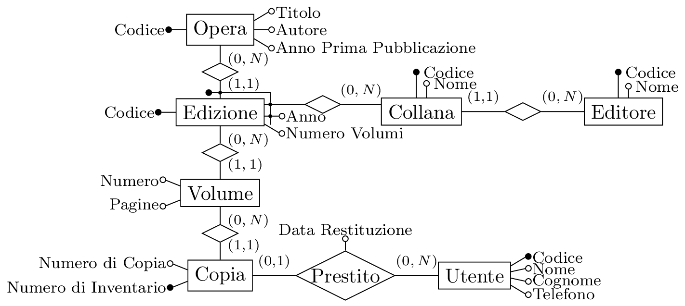</p>
</figure>

## Esercizio 2[^6]

Data la schematizzazione delle informazioni sulle automobili mostrate:

``` c
FIAT
    Corso Giovanni Agnelli 200-Torino
    www.fiat.it
    Modelli
        Panda
            Segmento: B
            Posti: 4
            Versioni:
                1.1 Cilindrata 1098 Prezzo 8.900
                1.2 4x4 Cilindrata 1250 Prezzo 13.000
                |\dots|        
        Punto
            Segmento: C
            Posti: 5
            Versioni:
                1.2 base Cilindrata 1212 Prezzo 11.100
                1.3 JT Cilindrata 1250 Prezzo 13.100
                |\dots|
        |\dots|
|\dots|
----------------------------------------------------
Segmenti
    A: super-compatte
    B: compatte
    C: medie
    D: grandi
    E: SW
```

### Domanda 1

Definire uno schema concettuale (nel modello ER) che descriva la realtà di interesse; limitarsi agli aspetti che vengono espressamente mostrati, introducendo tutt’al più, ove lo si ritenga necessario, opportuni codici identificativi; mostrare le cardinalità delle relationship e gli identificatori delle entità:

Sono necessarie tre entità per la casa produttrice, per il modello prodotto e per la versione di un certo modello. Per ogni casa produttrice può non esistere un modello oppure un numero arbitrario di modelli. Analogamente per le versioni di un modello. Una casa produttrice può essere identificata sia dal codice e sia dal loro nome. Molti anni fa i modelli non erano registrati, mentre oggi i modelli hanno un nome registrato, quindi il loro nome è sufficiente per poterli identificare.

Il segmento viene rappresentato tramite un’entità identificato da un codice, ed un attributo descrizione. Ogni modello deve essere legato ad un unico segmento tramite una relationship, e si può inserire un attributo posti.

Le versioni hanno un nome, un prezzo, una cilindrata e possono essere identificati dal modello e dal nome, quindi si utilizza un identificatore esterno.

<figure>
<p> 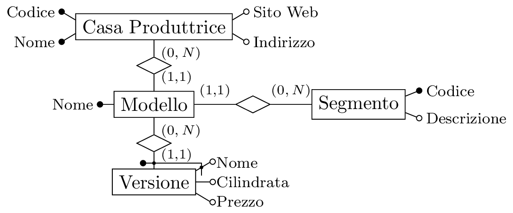</p>
</figure>

### Domanda 2

Considerare le seguenti specifiche aggiuntive:

- Per ogni versione è importante rappresentare le informazioni sui motori; ogni motore ha numero cilindri, cilindrata e potenza e uno stesso motore può essere utilizzato da più versioni (di uno stesso modello o anche di modelli diversi, ma dello stesso costruttore);

- É di interesse la storia dei prezzi: per ogni versione si deve riportare il prezzo attuale (con indicazione della data di ultimo aggiornamento) e i prezzi precedenti (ognuno con data di inizio e fine validità).

Si aggiunge una nuova entità motore associata a modello con una relationship, identificato da un codice, con attributi numero di cilindrata cilindrata, da rimuovere dall’entità modello, e la potenza. Uno stesso motore può essere utilizzato da versioni diverse anche dello stesso modello, ma dello stesso costruttore, questo non si può rappresentare semplicemente quindi si inserisce come vincolo aggiuntivo a parole.

Per rappresentare la storia dei prezzi si inserisce una cronologia delle versioni, ognuna associata ad un prezzo, si inserisce quindi un’entità chiamata “versione con prezzo”, identificata dall’attributo data e la versione associata tramite relationship. Ha un attributo prezzo ed un attributo fine, con una cardinalità massima pari ad uno, che deve essere maggiore dell’attributo data. Quindi si deve togliere l’attributo prezzo dall’entità versione.

<figure>
<p> 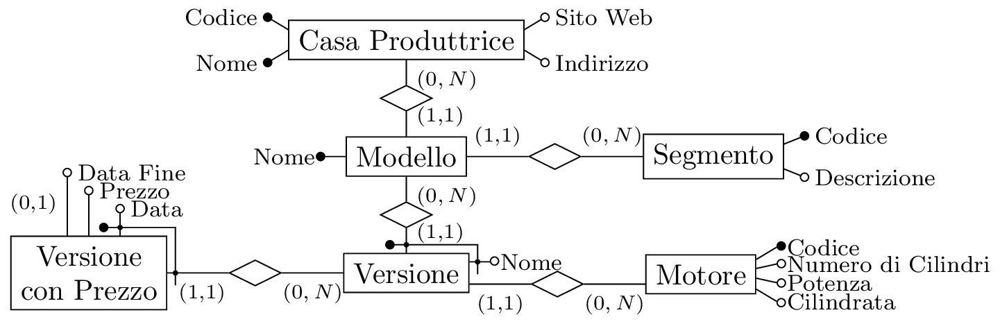</p>
</figure>

## Esercizio 3[^7]

### Domanda 1

Mostrare lo schema concettuale per una base di dati per il programma di una stazione presso un teatro, secondo le seguenti specifiche:

- Ogni concerto ha un codice, un titolo ed una descrizione, ed è costituito da un insieme di pezzi musicali.

- Ogni pezzo ha un codice, un titolo ed un autore (con codice e nome); uno stesso pezzo può essere rappresentato in diversi concerti.

- Ogni concerto è eseguito da un’orchestra; ogni orchestra ha un nome, un direttore (del quale interessano solo nome e cognome) e un insieme di orchestrali.

- Ogni orchestrale ha una matricola (univoca nell’ambito della base di dati), nome e cognome, e può partecipare a più orchestre, in ciascuna delle quali suona un solo strumento, ma in orchestre diverse può suonare strumenti diversi.

- Ogni concerto è tenuto più volte, in giorni diversi, ma sempre nella stessa sala.

Si può cominciare sia dall’entità concerto, ogni concerto è costituito da un insieme di pezzi musicali, per cui si ha una relazione con l’entità pezzo. Ogni concerto viene eseguito da un’orchestra quindi si inserisce un’entità orchestra. Ogni concerto ha un attributo codice e nome. Serve un’entità che identifica l’autore, ma è presente anche la persona orchestrale, si vuole rappresentare generalmente con l’entità musicista. Questa entità viene connessa all’entità pezzo con una relazione “Autore”. Si può inserire un’entità direttore, in relazione ad orchestra, ma potrebbe essere identificato da un attributo, poiché non vengono specificate altre proprietà significative. L’entità orchestra viene connessa all’entità orchestrale. Ogni pezzo ha un singolo autore, ed ogni autore può scrivere più pezzi, quindi si ha una cardinalità uno a molti, quindi non può essere inserito come attributo. Ogni pezzo potrebbe avere più di un autore, ma in questo contesto viene specificato un singolo autore. La relazione tra pezzi e concerti è molti a molti, poiché ogni concerto è un insieme di pezzi, anche uguali tra di loro. Ogni orchestro viene eseguito da una singola orchestra, quindi si ha una cardinalità uno a molti, così come con direttore. Ogni orchestrale ha una matricola univoca nella base di dati, l’identificatore della relazione. Si può inserire lo strumento come l’attributo della relazione tra orchestra ed orchestrale. Se si volessero rappresentare caratteristiche dello strumento, non basterebbe come attributo, e bisognerebbe promuovere la relazione tra orchestrale ed orchestra ad entità partecipazione. A questa entità si può includere l’attributo strumento, ma per ottenere lo stesso effetto della relationship, bisogna includere un identificatore, la doppia identificazione esterna, costituita dalla relazione ad orchestra ed orchestrale. In caso si vuole aggiungere le proprietà dello strumento si può aggiungere queste entità senza problemi.

Si inserisce l’entità sala con attributi codice, nome e capienza. Ma la data di ogni concerto non si può inserire come attributo sulla relazione o sull’entità concerto. Si inserisce quindi un’ulteriore relazione ad un’entità evento, con attributo data all’entità concerto. Questo viene identificato dalla data e dall’entità concerto in relazione.

<figure>
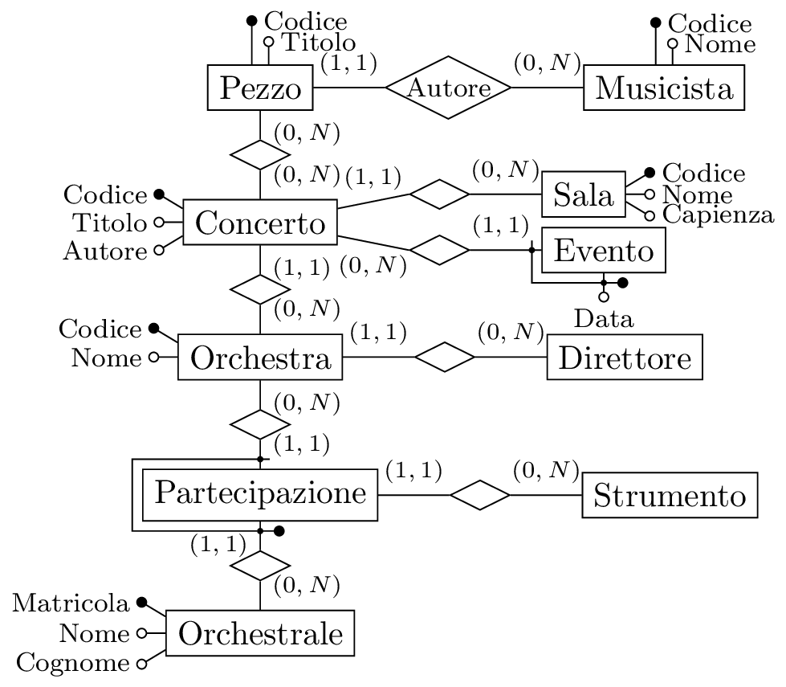
</figure>

### Domanda 2

Modificare lo schema prodotto in risposta alla domanda precedente con riferimento alle seguenti specifiche che modificano le precedenti (mostrare l’intero schema modificato):

- Interessa il programma di concerti di diversi teatri (e non di un solo teatro come nella domanda precedente); per ogni teatro sono rilevanti un codice, il nome e l’indirizzo.

- Per ogni concerto, interessa anche l’ordine dei pezzi ed è anche possibile che un pezzo venga ripetuto più volte nello stesso concerto.

- I direttori (che dirigono ciascuno al massimo una orchestra) possono essere anche orchestrali (nella stessa orchestra che dirigono o in altre).

- Ogni orchestrale suona un solo strumento, lo stesso in tutte le orchestre cui partecipa.

- Ogni concerto è tenuto più volte, in giorni diversi, non necessariamente sempre nella stessa sala.

Se il concerto può avvenire in sale diverse allora bisogna legare l’entità sala all’entità evento. E per indicare che ogni orchestrale suona un unico strumento bisogna legare strumento direttamente ad orchestrale. Si può generalizzare orchestrale e direttore come sottoinsieme di un’altra entità artista con matricola, nome e cognome, mantenendo le relazioni invariate.

Per inserire una posizione ai pezzi, non si può inserire un attributo alla relazione poiché potrebbe avere più posizioni in un concerto, si promuove quindi ad entità questa relazione chiamata “Pezzo in Scaletta”. Questo ha un attributo posizione, con un identificatore esterno con posizione e la relazione concerto.

Inoltre bisogna inserire un’entità teatro in relazione con concerto. Questa tuttavia deve essere legata a sala e deve essere comunque legata agli eventi. Si crea in questo modo un ciclo e bisogna inserire un ulteriore vincolo non rappresentabile nello schema ER. Altrimenti non bisogna legare teatro e concerto tramite una relationship.

<figure>
<p> 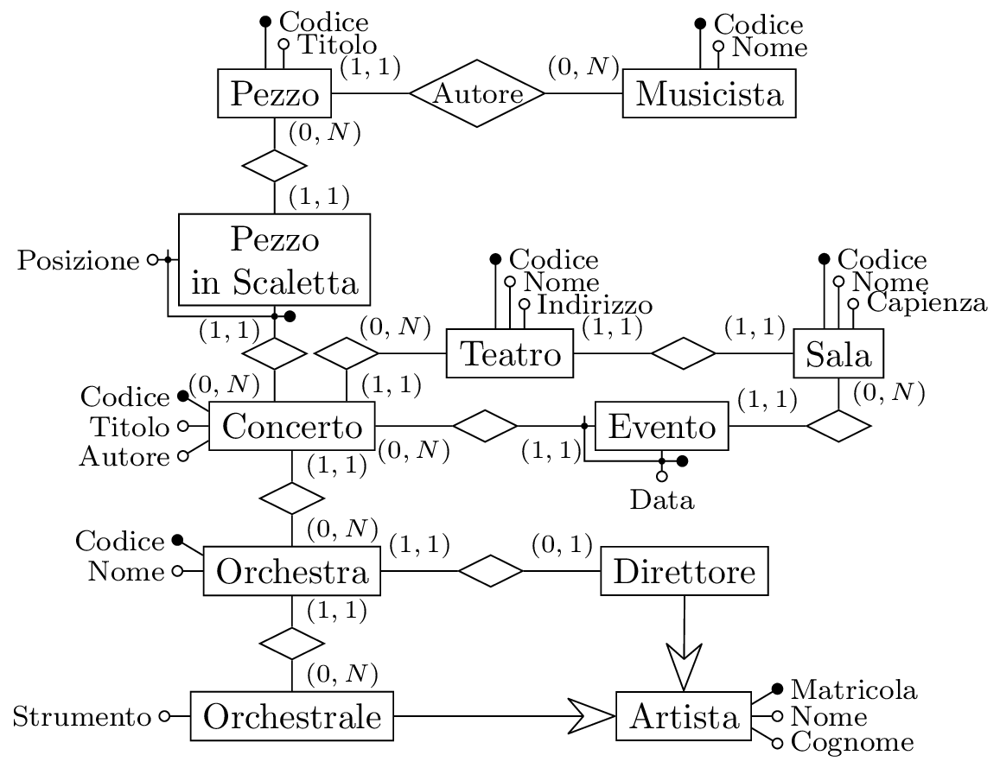</p>
</figure>

## Esercizio 4[^8]

Si considera il modello ER seguente:

<figure>
<p> 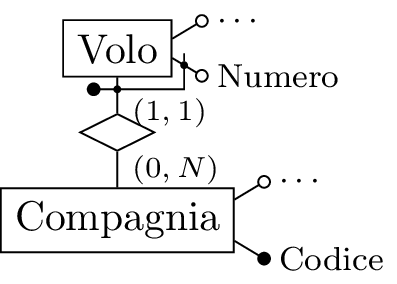</p>
</figure>

Rappresentare un modello logico corrispondente.  
Si considera l’entità compagnia per prima, dato che non ha identificatori esterni, come una relazione con chiave codice e diversi attributi. Mentre l’entità volo si realizza come una relazione, dove la chiave è composta dal numero di volo e la compagnia di appartenenza del volo, con un vincolo di integrità referenziale tra l’attributo codice e la relazione compagnia.

- Compagnia( <u></u> , $\cdots$)

- Volo( <u></u> , <u></u> , $\cdots$)

## Esercizio 5[^9]

Analogamente per questo schema ER:

<figure>
<p> 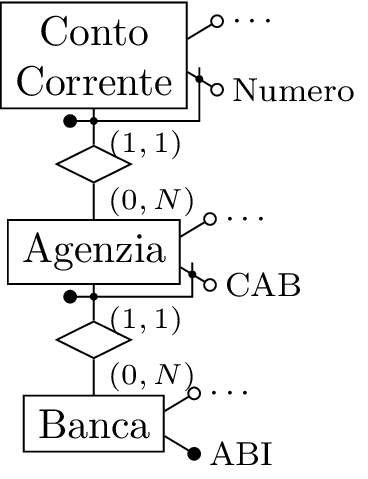</p>
</figure>

Si rappresenta con una relazione banca, con chiave ABI; una relazione agenzia con chiave ABI e CAB con vincolo di integrità referenziale tra il suo attributo ABI e la relazione banca; una relazione conto corrente con chiave ABI, CAB e numero di conto, con un vincolo di integrità referenziale tra ABI e banca e CAB e agenzia

- Banca( <u></u> , $\cdots$)

- Agenzia( <u></u> , <u></u> , $\cdots$)

- CC( <u></u> , <u></u> , <u></u> , $\cdots$)

Ci sono alcuni casi nei quali l’identificazione esterna ha un significato particolare e necessario.

## Esercizio 6[^10]

Si considera questo schema concettuale:

<figure>
<p> 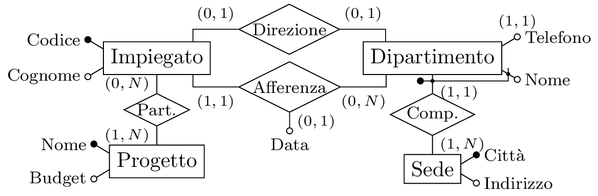</p>
</figure>

Si comincia dalle entità senza identificazione esterna. Partendo dall’entità impiegato, si crea una relazione impiegato con una chiave codice, ed un attributo cognome. Analogamente per le entità progetto e sede. L’entità dipartimento ha un identificatore esterno composto dal nome del dipartimento e la partecipazione alla relationship composizione, la sua chiave è composta dall’attributo nome e la chiave dell’entità sede. Si deve utilizzare una tabella per rappresentare la relationship partecipazione, con una chiave data dalla chiave delle due relazioni che identificano le due entità. Su questi due attributo c’è un vincolo di integrità referenziale con le relazioni impiegato e progetto. Inoltre è presente un vincolo di integrità referenziale tra dipartimento e sede sull’attributo città. Per rappresentare la relationship uno a molti tra impiegato e dipartimento si inserisce l’attributo nome dipartimento e città, con un vincolo di integrità referenziale con la chiave di dipartimento. Si inseriscono questi attributo all’0interno della relazione impiegato, poiché se fossero presenti dentro dipartimento, sarebbero presenti più valori di impiegato, mentre un impiegato afferisce ad un singolo dipartimento, ed è possibile rappresentarlo senza tabelle aggiuntive. La relationship afferenza ha anche un attributo data con una cardinalità minima zero, quindi dovrà poter ammettere valori nulli, al contrario degli altri attributi descritti, nella relazione impiegato. Poiché la relationship direzione ha una cardinalità massima pari ad uno, si potrete inserire come attributo all’interno di impiegato e dipartimento. Conviene scegliere l’opzione più intuitivamente sensata, quindi si inserisce dentro la relazione dipartimento, poiché è più corretto dato che rappresenta una proprietà di dipartimento più di una proprietà di impiegato.

- Impiegato( <u></u> , Cognome, Data Afferenza\*)

- Progetto( <u></u> , Budget)

- Sede( <u></u> , Indirizzo)

- Dipartimento( <u></u> , <u></u> , Telefono, Direttore\*)

- Partecipazione( <u></u> , <u></u> )

## Esercizio 7[^11]

Si considera questo schema simile al precedente, ma con un identificatore esterno sull’entità sede, invece che sull’entità dipartimento.

<figure>
<p> 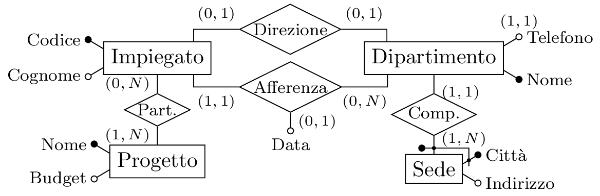</p>
</figure>

In questo caso la relazione dipartimento viene identificata solamente da nome. Mentre per quanto riguarda sede, ha il nome del dipartimento e città come chiave, con un vincolo di integrità referenziale sull’attributo nome del dipartimento con la relazione. Inoltre l’attributo impiegato ha solo l’attributo dipartimento con un vincolo di integrità referenziale con la relazione dipartimento. In caso ogni impiegato possa essere direttore di un unico dipartimento non sarebbe un vincolo esprimibile, ma si potrebbe rappresentare questo attributo come chiave per la relazione dipartimento, ma in caso fossero presenti due dipartimenti con lo stesso direttore questo non funzionerebbe.

- Impiegato( <u></u> , Cognome, Data Afferenza\*)

- Progetto( <u></u> , Budget )

- Sede( <u></u> , <u></u> , Indirizzo )

- Dipartimento( <u></u> , Telefono, Direttore)

- Partecipazione( <u></u> , <u></u> )

## Esercizio 8[^12]

Con riferimento a ciascuno dei seguenti schemi concettuali mostrare una base di dati relazionale ottenuta per traduzione del modello ER, che evidenzi le caratteristiche dello schema. Per ciascuna relazione, mostrare anche solo poche ennuple, che evidenzino appunto le caratteristiche interessanti. Indicare in qualunque modo, purché comprensibile, anche i vincoli di chiave e di integrità referenziale.

<figure>
<p> 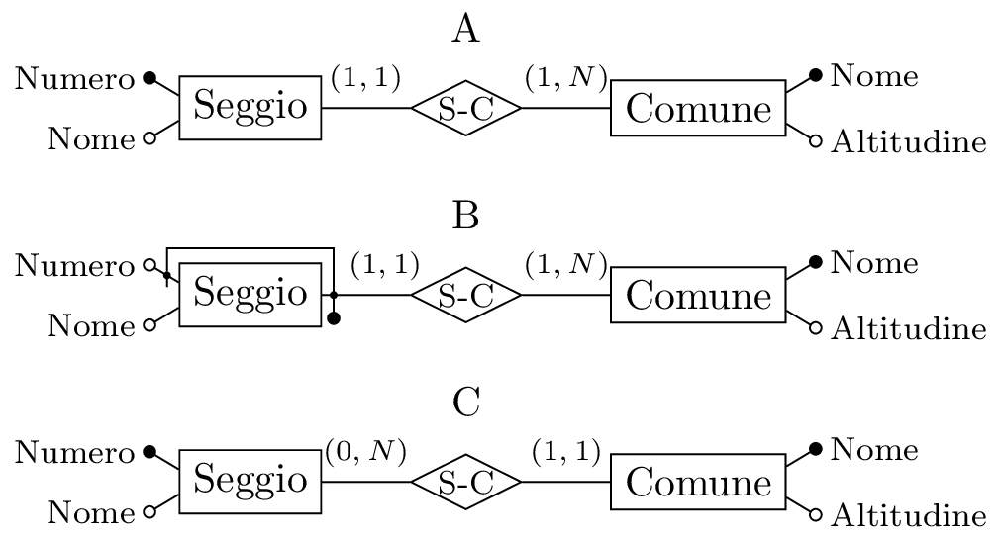</p>
</figure>

Per lo schema A si ha una relazione seggio con chiave numero, attributo nome e comune con un vincolo di integrità referenziale con la chiave nome della relazione comune, con un altro attributo altitudine.

<div class="center">

| <u></u>  | Nome |  Comune  |
|:--------:|:----:|:--------:|
|    1     |  x   | Castello |
|    2     |  y   |   Riva   |
|    3     |  z   |   Riva   |

| <u></u>  | Altitudine |
|:--------:|:----------:|
| Castello |    300     |
|   Riva   |    200     |

</div>

Il caso B a differenza del caso A ha la chiave primaria di seggio composta da numero e comune, mentre i vincoli e la struttura della relatone comune sono invariati.

<div class="center">

| <u></u>  | Nome | <u></u>  |
|:--------:|:----:|:--------:|
|    1     |  x   | Castello |
|    2     |  y   |   Riva   |
|    1     |  z   |   Riva   |

| <u></u>  | Altitudine |
|:--------:|:----------:|
| Castello |    300     |
|   Riva   |    200     |

</div>

In questo caso nei dati si inserisce un seggio con lo stesso numero, ma in un comune differente per mostrare che si identificano seggi per lo stesso numero, nello stesso comune.

Nel caso C la relationship è invertita, e la relazione seggio contiene solamente la chiave numero ed il suo nome, mentre la relazione comune contiene anche un attribuito seggio con un vincolo di integrità referenziale con la chiave della relazione seggio.

<div class="center">

| <u></u>  | Nome |
|:--------:|:----:|
|    1     |  x   |
|    2     |  y   |
|    3     |  z   |

| <u></u>  | Altitudine | Seggio |
|:--------:|:----------:|:------:|
| Castello |    300     |   1    |
|   Riva   |    200     |   2    |

</div>

## Esercizio 9[^13]

Mostrare uno schema concettuale per una realtà i cui dati siano organizzati per mezzo del seguente schema relazionale:

- Nazioni( <u></u> , Nome);

- Compagnie( <u></u> , Nome, Nazione), con un vincolo di integrità referenziale fra l’attributo nazione e la relazione nazioni;

- Aeroporti( <u></u> , Nome, Città), con un vincolo di integrità referenziale fra città e la relazione città;

- Città( <u></u> , Nome);

- Voli( <u></u> , <u></u> , Aeroporto Partenza, Aeroporto Arrivo, Ora Partenza Prevista, Ora Arrivo Previsto, Tipo Aeromobile), con vincoli di integrità referenziale tra compagnia e la relazione compagnie, aeroporto partenza e aeroporti, aeroporto arrivo e aeroporti, e tipo aeromobile con tipo aeromobili;

- VoliEffettivi( <u></u> , <u></u> , <u></u> , Ora Partenza Effettiva, Ora Arrivo Effettivo), un vincolo di integrità referenziale fra compagnia e numero e la relazione voli;

- TipoAeroMobile( <u></u> , Nome).

Si comincia dalle entità senza vincoli di integrità referenziale. Si comincia dal’entità nazioni, in relazione con compagnie. Analogamente l’entità città in relazione con aeroporto, ed i relativi attributi per queste entità. Si inserisce l’entità tipo aeromobile con i relativi attributi non ancora legata con relationship. Un relazione rappresenta una relationship quando contiene due attributi come chiavi, in vincoli di integrità referenziale con due relazioni diverse, poiché le uniche relationship che generano una tabella separata sono quelle molti a molti. Si hanno due relazioni tra volo ed aeroporto per gli aeroporti di partenza e di arrivo. Inoltre si ha una relationship tra l’entità volo e compagnie con un identificatore esterno sulla compagnia e l’attributo numero del volo.

<figure>
<p> 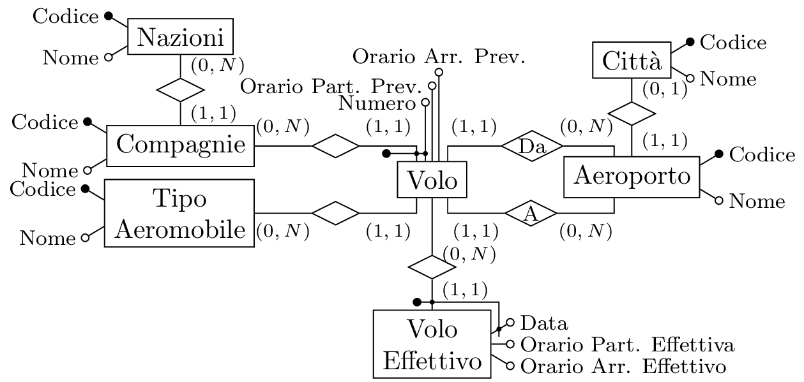</p>
</figure>

## Esercizio 10[^14]

Considerare lo schema concettuale seguente:

<figure>

</figure>

Vallare la convenienza dell’introduzione di una relationship C-B fra Cliente e Banca. Tale relationship è ridondante in quanto derivabile dalla concatenazione delle relationship esistenti. Considerare un carico applicativo che includa come operazioni principali le leggenti:

- Ricerca delle Banche di un Cliente, di uci è dato il codice, con frequenza $f_!=200$;

- Inserimento di una nuova occorrenza della relationship C-A, dati i codici identificativi di Cliente e Agenzia, assumendo per semplicità che le occorrenze di Cliente e Agenzia siano già nella base di dati, e che il Cliente non abbia ancora legami né con l’Agenzia n\* con la relativa Banca, con frequenza $f_2=10000$.

Considerare i costi delle letture e scritture delle entità e della relationship molti a molti, ignorando quelli della relationship uno a molti e considerare il costo delle scritture doppio di quello delle letture. Assumere che ogni Cliente abbia rapporti, relationship C-A, mediamente con $k=10$ Agenzie.

In generale la ridondanze aumenta le prestazioni in lettura, ma la peggiore in scrittura.

Il costo complessivo è dato da $c_1f_2+c_2f_2$, dove il costo della prima operazione si ottiene con la ridondanza pari ad una singola lettura di costo $k=10$, mentre senza ridondanza bisogna effettuare tre letture con un costo $3k=30$. Mentre per la seconda operazione con la ridondanza bisogna effettuare una lettura per verificare l’occorrenza ed in caso inserirla con due scritture di costo $5$, mentre senza ridondanza è sufficiente una singola scrittura con costo $2$. Si ha quindi: $$\begin{gathered}
    c_{\mathrm{r}}=10\cdot200+5\cdot10000=52000\\
    c_{\mathrm{s}}=30\cdot200+2\cdot10000=26000\\
    c_{\mathrm{r}}>c_{\mathrm{s}}\tag{\stepcounter{equation}\theequation}
\end{gathered}$$ Quindi non è conveniente avere ridondanza.

## Esercizio 11[^15]

Progettare lo schema della base di dati relazionale per gestire i dati della realtà descritta dallo schema concettuale in figura:

<figure>
<p> 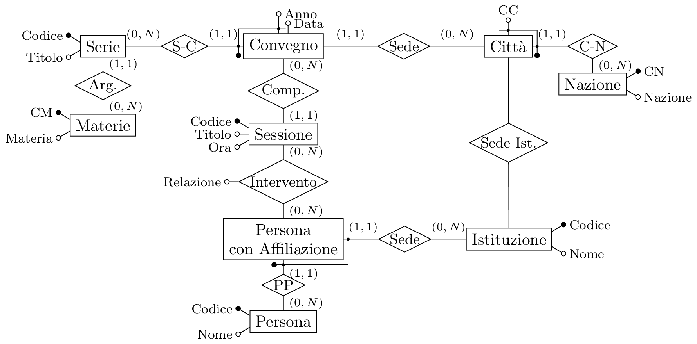</p>
</figure>

Si comincia dall’entità nazione senza identificatori esterni, come relazione con con gli stessi attributi e chiave CN. L’entità città rappresenta una relazione con chiave CC e CN con un vincolo di integrità referenziale con nazione. La relationship C-N è già implicitamente descritta da queste due relazioni. Si segue con l’entità istituzione, con una relationship uno a molti con città, ogni istituzione ha una sola sede per ogni città, quindi si ha un vincolo di integrità referenziale tra la chiave di città e gli attributi CC e CN di istituzione. Si passa all’entità persona con affiliazione, senza attributi, ma un identificatore esterno sia con istituzione che con città. Si inserisce quindi la relazione persona, con un codice chiave ed un nome, la relazione persona con affiliazione ha come chiave persona ed istituzione, con un vincolo di integrità referenziale alle chiavi di persona ed istituzione. Questo schema rappresenta una ristrutturazione, per permettere questa traduzione, infatti quest’entità persona con affiliazione poteva essere una generalizzazione di persona. Si procede con l’entità sessione, questa è collegata da una relazione molti a molti con persona con affiliazione, quindi è necessaria un’altra relazione chiamata intervento. Si ha un’entità convegno con un’identificatore esterno con l’entità serie tramite la relazione S-C, quindi si inserisce prima quest’ultima relazione. Dentro la relazione sessione va inserita anche la chiave di convegno. La relazione convegno ha attributi data, chiave anno e codice serie, ed attributi codice città e codice nazione, con un vincolo di integrità referenziale con la città e nazione. La relazione serie ha una chiave codice, un titolo, ed un attributo materia, vincolo di integrità referenziale con la relazione materia. Questa relazione ha chiave codice e attributo materia.

- Nazione( <u></u> , Nazione);

- Città( <u></u> , <u></u> );

- Istituzione( <u></u> , Nome, Città, Nazione);

- Persona( <u></u> , Nome);

- Persona Con Affiliazione( <u></u> , <u></u> )

- Sessione( <u></u> , Titolo, Ora);

- Intervento( <u></u> , <u></u> , <u></u> );

- Convegno(Data, <u></u> , <u></u> , CC, CN)

- Serie( <u></u> , Titolo, CM)

- Materia( <u></u> , Materia)

## Esercizio 12[^16]

Con riferimento all’esercizio precedente, per le due porzioni di schema in figura mostrare le tabelle risultati dalla progettazione logica con alcune istanze(ennuple):

<figure>
<p> </p>
</figure>

Per il primo schema si hanno:

<div class="center">

|  Serie   |        |     |
|:--------:|:------:|:---:|
| <u></u>  | Titolo | CM  |
|    1     |   A    | 00  |
|    2     |   A    | 00  |
|    3     |   A    | 01  |
|    4     |   B    | 01  |
|    5     |   C    | 02  |

| Materia  |         |
|:--------:|:-------:|
| <u></u>  | Materia |
|    00    |    a    |
|    01    |    b    |
|    02    |    c    |
|    03    |    d    |

</div>

Si considerano le tabelle corrispondenti alla relazioni del secondo schema:

<div class="center">

| Istituzione |      |
|:-----------:|:----:|
|   <u></u>   | Nome |
|      1      |  A   |
|      2      |  B   |
|      3      |  C   |

| Persona  |      |
|:--------:|:----:|
| <u></u>  | Nome |
|    00    | Anna |
|    01    | Lino |
|    02    | Bob  |
|    03    | Eric |
|    04    | Sam  |

| Persona con Aff. |          |
|:----------------:|:--------:|
|     <u></u>      | <u></u>  |
|        00        |    1     |
|        01        |    1     |
|        02        |    2     |
|        00        |    2     |

</div>

## Esercizio 13[^17]

Lo schema concettuale seguente rappresenta un insieme di corsi ed un insieme di iscrizioni a tali cosi. ello schema l’attributo ricavo è ridondante, poiché può essere ottenuto moltiplicando il costo del corso per il numero di iscritti, cioè il prodotto del valore dell’attributo costo di ogni occorrenza dell’entità corso per il numero di occorrenze dell’entità persona a cui essa è correlata tramite la relationship iscrizione:

<figure>
<p> </p>
</figure>

Valutare se convenga o meno mantenere la ridondanza, assumendo corso abbia $C_c=1000$ occorrenze, persona ne abbia $C_p=3000$ ed iscrizione $C_i=30000$, e quindi che ogni corso abbia mediamente $C_{ci}=30$ iscritti, e che il carico applicativo includa le operazioni principali seguenti:

- Calcolo del ricavo di un corso, dato il codice, con frequenza $f_1=50$;

- Iscrizione di una persona, già nella base di dati e di cui è dato il codice fiscale, ad un corso, di cui è dato il codice, con frequenza $f_2=20000$, in sostanza, questa operazione richiede l’inserimento di un’occorrenza di iscrizione.

Considerando i costi delle letture e scritture delle occorrenze e considerare il costo delle scrittura pari a quello delle letture.

La prima operazione con ridondanza consiste in una singola lettura sulla relazione corso, la seconda operazione consiste in una lettura e scrittura su corso ed una scrittura su iscrizione. Il costo totale delle operazioni con ridondanza è quindi: $$C=c_1\cdot f_1+c_2\cdot f_2=1_{\mathrm{r}}\cdot50+(1_{\mathrm{r}}+2_{\mathrm{w}})\cdot20000=60050$$ Senza ridondanza è necessario oltre alla lettura su corso per conoscere il costo, leggere tutte le 30 occorrenze di iscrizione. Nella seconda operazione, è sufficiente inserire l’occorrenza in iscrizione: $$C=c_1\cdot f_1+c_2\cdot f_2=(1_{\mathrm{r}}+30_\mathrm{r})\cdot50+1_\mathrm{w}\cdot20000=21550$$

Quindi non è conveniente avere ridondanza.

## Esercizio 14[^18]

Mostrare uno schema concettuale per una realtà i cui dati siano organizzati per mezzo del seguente schema relazionale. Si utilizza l’asterisco per indicare la ammissibilità dei valori nulli.

- Dipendente( <u></u> , Cognome, Nome);

- Professore( <u></u> , Qualifica, Anzianità, Dipartimento\*), con vincolo di integrità referenziale fra Codice Fiscale e la relazione Dipendente e fra Dipartimento e la relazione Dipartimento;

- Dipartimento( <u></u> , Nome, Indirizzo);

- Corso di Studio( <u></u> , Nome, Dipartimento, Coordinatore), con vincolo di integrità referenziale fra Dipartimento e la relazione Dipartimento e fra Coordinatore e la relazione Professore;

- Collaborazione( <u></u> , <u></u> , <u></u> , Tipo), con vincolo di integrità referenziale fra Corso di Studio, Dipartimento e la relazione Corso di Studio e fra Professore e la relazione Professore;

- Corso( <u></u> , Materia, Docente), con vincolo di integrità referenziale fra Materia e la relazione Materia e fra Docente e la relazione Professore;

- Materia( <u></u> , Nome, Semestre);

Partendo dalla relazione materia, si rappresenta un’entità con tre attributi di sigla, nome e semestre, di cui sigla è chiave. Si mette in relazione con l’entità corso, di attributi codice, con cardinalità molti ad uno, obbligatoria, poiché non viene specificato che l’attributo materia possa contenere valori nulli. Analogamente per l’entità docente da creare, si considerano docente e professore sinonimi, di attributi codice fiscale, qualifica ed anzianità, l’attributo dipartimento nel modello relazionale verrà realizzato in seguito con una relationship con l’entità dipartimento. L’entità professore condivide la chiave con l’entità dipendente, che non è legata a nessun’altra entità del modello, questi inoltre rappresentano due concetti di cui uno è sottoinsieme dell’altro, poiché ogni professore è un dipendente, ma non ogni dipendente è professore. Questo si pul implementare utilizzando una generalizzazione. Alternativamente si potrebbe utilizzare una relazione tra queste due entità con un identificatore esterno tra professore e dipendente. Si inserisce l’entità dipartimento, in relazione con professore con una cardinalità molti ad uno. Si può rappresentare l’entità corso di studio legata da una relationship uno a molti, obbligatoria con l’entità dipartimento. L’attributo coordinatore si rappresenta come una relationship tra corso di studio e professore, con cardinalità uno a molti, obbligatoria, poiché non ammette valori nulli. La relazione collaborazione si può rappresentare facilmente come relationship molti a molti per permettere di avere possibili ennuple diverse, tra professore e corso di studio, con una attributo tipo.

<figure>
<p> 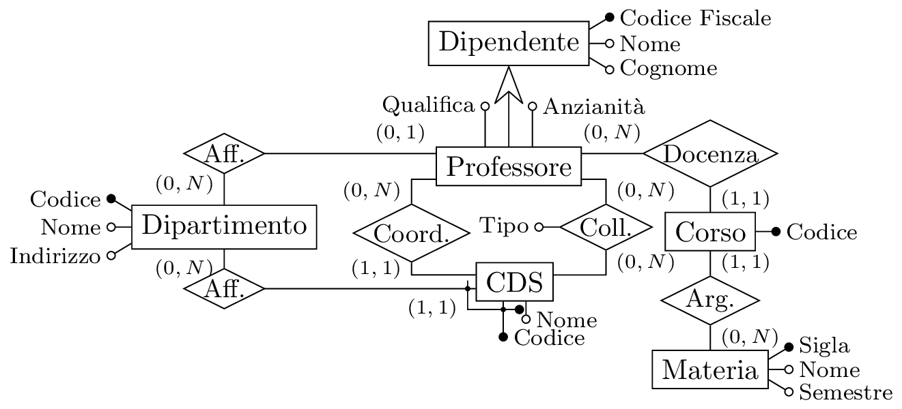</p>
</figure>

## Esercizio 15[^19]

Considerare i quattro schemi seguenti:

<figure>
<p> 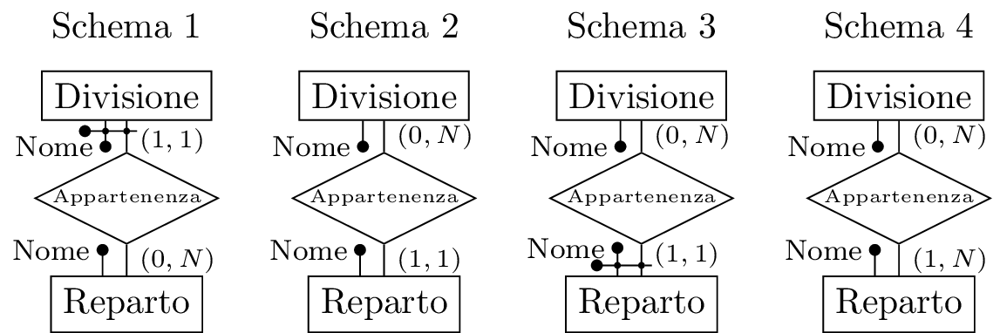</p>
</figure>

Rispondere alle domande seguenti con un sì o un no nella casella:

<div class="center">

|                                                                        | S. 1 | S. 2 | S. 3 | S. 4 |
|:----------------------------------------------------------------------:|:----:|:----:|:----:|:----:|
| Possono esistere due divisioni con lo stesso nome, in reparti diversi? |  Sì  |  No  |  No  |  No  |
| Possono esistere due reparti con lo stesso nome, in divisioni diverse? |  No  |  No  |  Sì  |  No  |
|        Possono due divisioni appartenere ad uno stesso reparto?        |  Sì  |  No  |  No  |  Sì  |
|         Possono due reparti appartenere alla stessa divisione?         |  No  |  Sì  |  Sì  |  Sì  |

</div>

1.  Negli ultimi tre schemi la divisione viene identificata univocamente dal nome, quindi non è possibile. Al contrario per il primo schema dove una divisione viene identificata dal proprio nome e dall’appartenenza ad un reparto.

2.  Per il terzo schema, un reparto viene identificato sia dal nome che dall’appartenenza ad una certa divisione quindi è possibile. Per tutti gli altri schemi invece ciò non è possibile poiché sono identificati unicamente dal loro nome.

3.  Per gli schemi due e tre questo non è possibile poiché la cardinalità della relationship non permette l’appartenenza di più di una divisione ad un reparto. Negli schemi uno e quattro invece è possibile poiché la cardinalità è uno a molti, la prima, e molti a molti, la seconda.

4.  Per gli ultimi tre schemi questo è possibile poiché la cardinalità è sempre molti ad uno o a molti, per l’entità “Divisione”. Mentre nel primo schema può avere solo un’appartenenza a reparto.

## Esercizio 16[^20]

In relazione agli schemi precedenti, realizzare un modello relazionale:

1.  Divisione( <u></u> , <u></u> ), Reparto( <u></u> );

2.  Divisione( <u></u> ), Reparto( <u></u> , Divisione);

3.  Divisione( <u></u> ), Reparto( <u></u> , <u></u> );

4.  Divisione( <u></u> ), Reparto( <u></u> ), Appartenenza( <u></u> , <u></u> )

Nel primo schema si utilizza una relazione divisione con chiave nome ed il reparto di appartenenza con cui ha un vincolo di integrità referenziale, mentre la relazione reparto contiene solo la chiave nome. Nel secondo schema si ha una relazione divisione con chiave nome, ed una relazione reparto con chiave nome, ed un vincolo di integrità referenziale divisione con la relazione divisione. Il terzo schema produce una relazione identica, ma con l’attributo divisione della relazione reparto anch’esso chiave. Nell’ultimo schema sono necessarie tre relazioni poiché la relationship ha cardinalità molti a molti, e bisogna rappresentarla mediante un’ulteriore relazione appartenenza, con chiave divisione e reparto, con un vincolo di integrità referenziale con le rispettive relazioni. Non si inserisce l’attributo divisione in reparto, poiché essendo una relazione molti a molti, rappresenterebbe una sola delle divisioni in relazione.

## Esercizio 17[^21]

Nello schema seguente l’attributo ricavo è ridondante, poiché può essere calcolato dalle relative prenotazioni:

<figure>

</figure>

Valutare se convenga o meno mantenere la ridondanza, assumendo che ogni occorrenza di Spettacolo partecipi mediamente a $N=10$ occorrenze di Prenotazione e che il carico applicativo includa come operazioni principali le seguenti:

1.  Calcolo del ricavo di uno spettacolo, dato il codice, con frequenza $f_1 = 10$;

2.  Inserimento di una prenotazione, per una persona già nella base di dati e di cui è dato il codice fiscale, per uno spettacolo di cui è dato il codice, con frequenza $f_2 = 10000$. In sostanza, questa operazione richiede l’inserimento di una occorrenza di Prenotazione.

Considerare i costi delle letture e scritture delle occorrenze di entità e relationship e considerare il costo delle scritture pari a quello delle letture.

La prima operazione con ridondanza consiste nella singola lettura dell’attributo ricavo dell’entità spettacolo, la seconda operazione consiste in una lettura di spettacolo ed una scrittura su prenotazione ed una su spettacolo. Il costo complessivo delle operazione con ridondanza è quindi: $$C=c_1f_1+c_2f_2=1_\mathrm{r}\cdot10+(1_\mathrm{r}+2_\mathrm{w})\cdot10000=30010$$

Senza ridondanza la prima operazione necessita di leggere il prezzo, e le dieci occorrenze di prenotazione per leggerne il numero dei biglietti acquistati. Mentre la seconda operazione richiede solamente una scrittura dell’occorrenza di prenotazione: $$C=c_1f_1+c_2f_2=(1_\mathrm{r}+10\cdot1_\mathrm{r})\cdot10+1_\mathrm{w}\cdot10000=10110$$

Quindi è più conveniente rimuovere la ridondanza.

## Esercizio 18[^22]

Considerare lo schema concettuale seguente:

<figure>
<p> </p>
</figure>

Valutare la convenienza dell’introduzione di una relationship C-F fra Cliente e Filiale oppure di una relationship C-B fra Cliente e Banca oppure di entrambe:

<figure>
<p> 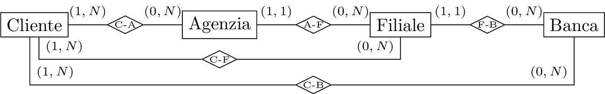</p>
</figure>

Tali relationship sono ridondanti in quanto derivabili dalla concatenazione delle relationship esistenti. Considerare un carico applicativo che includa come operazioni principali le seguenti:

1.  Inserimento di un nuovo rapporto fra cliente e agenzia, cioè di una occorrenza della relationship C-A, dati il codice del cliente e quello dell’agenzia, assumendo per semplicità che il cliente sia già presente e il rapporto sia con una agenzia di una filiale e di una banca con cui il cliente non ha ancora rapporti (cliente, agenzia, filiale e banca sono invece già nella base di dati), con frequenza $f_1 = 100$;

2.  Ricerca delle filiali con cui un cliente (di cui è dato il codice) ha rapporti, con frequenza $f_2 = 10000$;

3.  Ricerca delle banche con cui un cliente (di cui è dato il codice) ha rapporti, con frequenza $f_3 = 10000$

Supporre che, mediamente, un cliente abbia rapporti con $N = 10$ agenzie, di filiali diverse di banche diverse. Considerare i costi delle letture e scritture delle entità e delle relationship molti a molti, ignorando quelli delle relationship uno a molti, e considerare il costo delle scritture doppio di quello delle letture.

Senza ridondanza per la prima operazione, noto il cliente e l’agenzia, bisogna inserire solamente una nuova occorrenza di C-A, quindi si ha una sola scrittura. Per la seconda operazione bisogna leggere ognuna delle $N$ occorrenze di agenzia in relazione con cliente, e le loro rispettive filiali, quindi bisogna effettuare due letture $N$ volte. Per la terza operazione bisogna effettuare un processo analogo al precedente, quindi si effettuano tre letture $N$ volte: $$\begin{gathered}
    c_1=1_\text{w}=2\\
    c_2=2_\text{r}\cdot10=20\\
    c_3=3_\text{r}\cdot10=30\\
    C=c_1\cdot f_1+c_2\cdot f_2+c_3\cdot f_3=2\cdot100+20\cdot10000+30\cdot10000=500200
\end{gathered}$$

Per la prima operazione con ridondanza C-F bisogna effettuare due scritture ed una lettura, per la seconda operazione se è sufficiente il codice, si suppone sia sufficiente se non viene specificato, sono necessarie $N$ letture, poiché mediamente ogni cliente ha rapporti con 10 filiali. Per la terza operazione bisogna cercare per ogni filiale quale banche sono associate quindi bisogna effettuare 20 letture:

$$\begin{gathered}
    c_1=2_\text{w}+1_\text{r}=5\\
    c_2=1_\text{r}\cdot10=10\\
    c_3=2_\text{r}\cdot10=20\\
    C=c_1\cdot f_1+c_2\cdot f_2+c_3\cdot f_3=5\cdot100+10\cdot10000+20\cdot10000=300500
\end{gathered}$$

Si calcolano gli stessi per la ridondanza C-B, per la prima operazione bisogna scrivere l’occorrenza di C-A, e leggere la filiale corrispondente, e la banca corrispondente per poi scrivere l’occorrenza di C-B, quindi due letture e due scritture. Per la seconda operazione bisogna leggere le agenzie corrispondenti per un cliente e poi leggere le filiali, in media sono entrambe 10. Nell’ultimo caso bisogna effettuare solamente 10 letture sulla relazione C-B.

$$\begin{gathered}
    c_1=2_\text{w}+2_\text{r}=6\\
    c_2=2_\text{r}\cdot10=20\\
    c_3=1_\text{r}\cdot10=10\\
    C=c_1\cdot f_1+c_2\cdot f_2+c_3\cdot f_3=6\cdot100+20\cdot10000+10\cdot10000=300600
\end{gathered}$$

Con entrambe le relationship ridondanti C-F e C-B, per la prima operazione bisogna inserire l’occorrenza di C-A, leggere la filiale corrispondente e la banca corrispondente, per inserire l’occorrenza di C-F e di C-B. Per la seconda operazione è sufficiente leggere le 10 occorrenze di C-F, mentre per la terza le 10 occorrenze di C-B: $$\begin{gathered}
    c_1=2_\text{w}+3_\text{r}=8\\
    c_2=1_\text{r}\cdot10=10\\
    c_3=1_\text{r}\cdot10=10\\
    C=c_1\cdot f_1+c_2\cdot f_2+c_3\cdot f_3=8\cdot100+10\cdot10000+10\cdot10000=200800
\end{gathered}$$

Quindi è più conveniente utilizzare entrambe le ridondanze.

## Esercizio 19[^23]

Considerare la relazione seguente:

<div class="center">

| Cod |  Titolo   | CC  | Città  | CN  | Nazione  | CM  |   Materia    | CA  | Area |
|:---:|:---------:|:---:|:------:|:---:|:--------:|:---:|:------------:|:---:|:----:|
|  1  |   Art.    | C1  | Milano | N1  |  Italia  | M1  |     Ort.     | A1  | Med. |
|  2  | Fratture  | C2  |  Roma  | N1  |  Italia  | M1  |     Ort.     | A1  | Med. |
|  3  | Cuore2018 | C1  | Milano | N1  |  Italia  | M2  |    Card.     | A1  | Med. |
|  4  |  DB2018   | C1  | Monaco | N2  | Germania | M3  | Basi di Dati | A2  | Inf. |

</div>

La relazione mostra (in forma non normalizzata) i dati di interesse in un certo anno per un insieme di convegni scientifici, secondo le seguenti specifiche:

- Ogni convegno ha un codice (Cod) e un titolo e si tiene una città;

- Ogni città ha un nome, si trova in una nazione e ha un codice che la identifica nell’ambito della nazione (CC);

- Ogni nazione ha un codice (CN) e un nome;

- Ogni convegno è relativo ad una materia specifica (ad esempio l’ortopedia) che a sua volta appartiene ad un’area scientifica (ad esempio la medicina);

- Ogni materia ha un nome e un codice che la identifica univocamente (CM);

- Ogni area scientifica ha un codice (CA) e un nome.

Con riferimento alle specifiche e ai dati nell’esempio:

1.  Mostrare uno schema concettuale per la realtà di interesse (rispettando le specifiche per i vari codici);

2.  Mostrare una buona decomposizione della relazione originaria che soddisfi la BCNF (mostrare le tabelle, indicando la chiave di ciascuna con la sottolineatura)

### Domanda 1

<figure>
<p> 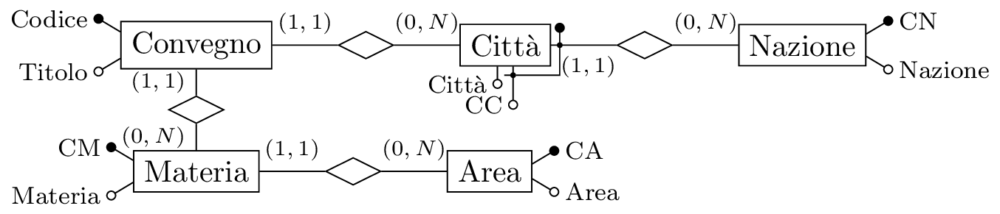</p>
</figure>

### Domanda 2

La chiave sembra essere il codice, si considerano quindi le dipendenze funzionali presenti:

- Codice $\to$ Titolo;

- Codice Area $\to$ Area;

- Codice Città, Codice Nazione $\to$ Città;

- Codice Nazione $\to$ Nazione;

- Codice Materia $\to$ Materia.

<div class="center">

| Convegni |           |     |     |     |
|:--------:|:---------:|:---:|:---:|:---:|
| <u></u>  |  Titolo   | CC  | CN  | CM  |
|    1     |   Art.    | C1  | N1  | M1  |
|    2     | Fratture  | C2  | N1  | M1  |
|    3     | Cuore2018 | C3  | N1  | M1  |
|    4     |  DB2018   | C4  | N2  | M2  |

|  Città   |          |        |
|:--------:|:--------:|:------:|
| <u></u>  | <u></u>  | Città  |
|    C1    |    N1    | Milano |
|    C2    |    N1    |  Roma  |
|    C1    |    N2    | Monaco |

| Materie  |         |     |
|:--------:|:-------:|:---:|
| <u></u>  | Materia | CA  |
|    M1    |  Ort.   | A1  |
|    M2    |  Card.  | A1  |
|    M3    |   BD    | A2  |

| Nazioni  |          |
|:--------:|:--------:|
| <u></u>  | Nazioni  |
|    N1    |  Italia  |
|    N2    | Germania |

|   Aree   |      |
|:--------:|:----:|
| <u></u>  | Area |
|    A1    | Med. |
|    A2    | Inf. |

</div>

## Esercizio 20[^24]

Considerare la relazione seguente:

<figure>
<p> 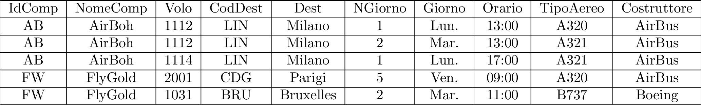</p>
</figure>

La relazione mostra (in forma non normalizzata) i dati relativi ad un insieme di voli in partenza da un aeroporto. Su di essa sono definite le seguenti dipendenze funzionali (ce ne sono anche altre, ma possono essere ignorate):

- IdComp $\to$ NomeComp;

- IdComp, Volo $\to$ CodDest, Orario;

- IdComp, Volo, NGiorno $\to$ TipoAereo;

- CodDest $\to$ Dest;

- NGiorno $\to$ Giorno;

- TipoAero $\to$ Costruttore.

Con riferimento alle specifiche e ai dati nell’esempio:

1.  Mostrare la chiave o le chiavi della relazione (sulla base delle dipendenze sopra mostrate);

2.  Mostrare uno schema concettuale per la realtà di interesse (senza aggiungere attributi);

3.  Mostrare una buona decomposizione della relazione originaria che soddisfi la BCNF (mostrare le tabelle, con i dati, indicando la chiave di ciascuna con la sottolineatura).

### Domanda 1

La chiave si suppone sia composta da IdComp, Volo e NGiorno, poiché si suppone che uno stesso numero di volo possa essere associato a due compagnie diverse, ed uno stesso volo si differenzia in base al giorno in cui viene effettuato:

<div class="center">

$R$( <u></u> , NomeComp, <u></u> , CodDest, Dest, <u></u> , Giorno, Orario, TipoAereo, Costruttore)

</div>

### Domanda 2

Per realizzare lo schema concettuale si divide in due entità il volo ed il volo effettivo, poiché uno stesso volo può essere effettuato in più date diverse, per cui la prima entità volo avrà come chiave il numero di volo e la compagnia, e sarà in relazione con la destinazione. Mentre la seconda entità volo effettivo avrà come chiave il giorno in cui viene effettuato ed il volo a cui corrisponde. Poiché uno stesso volo può essere effettuato da aerei diversi in giorni diversi, l’entità tipo aeromobile deve essere messa in relazione con l’entità volo effettivo:

<figure>
<p> 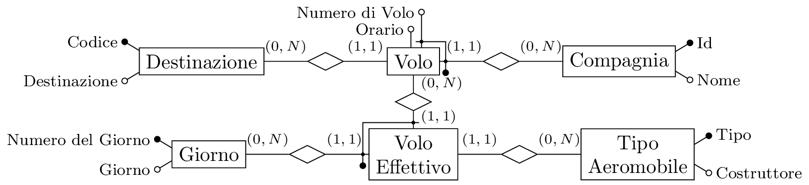</p>
</figure>

### Domanda 3

Dalle dipendenze funzionali si possono costruire le seguenti relazioni:

- $R_1$( <u></u> , NomeComp);

- $R_2$( <u></u> , <u></u> , CodDest, Orario);

- $R_3$( <u></u> , <u></u> , <u></u> , TipoAereo);

- $R_4$( <u></u> , Dest);

- $R_5$( <u></u> , Costruttore);

- $R_6$( <u></u> , Giorno).

<div class="center">

|  $R_1$   |          |
|:--------:|:--------:|
| <u></u>  | NomeComp |
|    AB    |  AirBoh  |
|    FW    | FlyGold  |

|  $R_2$   |          |         |        |
|:--------:|:--------:|:-------:|:------:|
| <u></u>  | <u></u>  | CodDest | Orario |
|    AB    |   1112   |   LIN   | 13:00  |
|    AB    |   1114   |   LIN   | 17:00  |
|    FW    |   2001   |   CDG   | 09:00  |
|    FW    |   1031   |   BRU   | 11:00  |

|  $R_4$   |           |
|:--------:|:---------:|
| <u></u>  |   Dest    |
|   LIN    |  Milano   |
|   CDG    |  Parigi   |
|   BRU    | Bruxelles |

|  $R_3$   |          |          |           |
|:--------:|:--------:|:--------:|:---------:|
| <u></u>  | <u></u>  | <u></u>  | TipoAereo |
|    AB    |   1112   |    1     |   A320    |
|    AB    |   1112   |    2     |   A321    |
|    AB    |   1114   |    1     |   A321    |
|    FW    |   2001   |    5     |   A320    |
|    FW    |   1031   |    2     |   B737    |

|  $R_5$   |             |
|:--------:|:-----------:|
| <u></u>  | Costruttore |
|   A320   |   AirBus    |
|   A321   |   AirBus    |
|   B737   |   Boeing    |

|  $R_6$   |         |
|:--------:|:-------:|
| <u></u>  | Giorno  |
|    1     | Lunedì  |
|    2     | Martedì |
|    5     | Venerdì |

</div>

## Esercizio 21[^25]

Considerare la relazione seguente:

<figure>
<p> 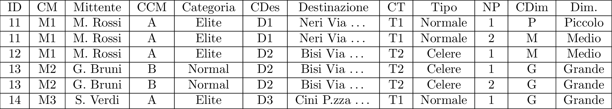</p>
</figure>

La relazione mostra, in forma non normalizzata, i dati relativi ad un insieme di spedizioni, secondo le seguenti specifiche:

- Ogni spedizione ha un codice (ID), un mittente, una destinazione e un tipo;

- Ogni mittente ha un codice (CM), un nome (attributo Mittente) e una categoria, con codice (CCM) e descrizione (Categoria);

- Ogni destinazione ha un codice (CDes) e una descrizione (attributo Destinazione);

- Ogni tipo di spedizione ha un codice (CT) e una descrizione (attributo Tipo);

- Ogni spedizione comprende uno o più pacchi;

- Ogni pacco ha un numero progressivo (NP) che lo identifica nell’ambito della spedizione e ha una dimensione, con codice (CDim) e descrizione (attributo Dim.).

Con riferimento alle specifiche e ai dati nell’esempio:

1.  Mostrare le dipendenze funzionali rilevate (limitarsi a quelle che hanno a primo membro ID, codici e numeri) e la chiave della relazione;

2.  Mostrare uno schema concettuale per la realtà di interesse (rispettando le specifiche per i vari codici e senza aggiungere altri attributi);

3.  Mostrare una buona decomposizione della relazione originaria che soddisfi la BCNF (mostrare le tabelle, con i dati, indicando la chiave di ciascuna con la sottolineatura).

### Domanda 1

La chiave della relazione è composta dagli attributi ID e NP. Considerando solo i codici si possono individuare le seguenti dipendenze funzionali:

- ID $\to$ CM, CDes, CT;

- CM $\to$ Mittente, CCM;

- CCM $\to$ Categoria;

- CDes $\to$ Destinazione;

- CT $\to$ Tipo;

- ID, NP $\to$ CDim;

- CDim $\to$ Dimensione.

### Domanda 2

Per rappresentare la possibilità di avere più pacchi nella stessa spedizione, si realizza un’entità pacco, associata ad un’unica spedizione, identificata univocamente dalla posizione in quella spedizione. L’entità spedizione viene identificata dal suo ID, ed è collegata alle altre entità destinazione, tipo e mittente.

<figure>
<p> 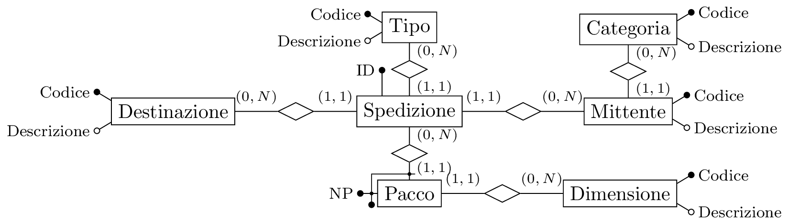</p>
</figure>

### Domanda 3

Dalle dipendenze funzionali individuate alla prima domanda si possono realizzare le seguenti tabelle:

<div class="center">

| <u></u>  | CM  | CDes | CT  |
|:--------:|:---:|:----:|:---:|
|    11    | M1  |  D1  | T1  |
|    12    | M1  |  D2  | T2  |
|    13    | M2  |  D2  | T2  |
|    14    | M3  |  D3  | T1  |

| <u></u>  | Mittente | CCM |
|:--------:|:--------:|:---:|
|    M1    | M. Rossi |  A  |
|    M2    | G. Bruno |  B  |
|    M3    | S. Verdi |  A  |

| <u></u>  | Categoria |
|:--------:|:---------:|
|    A     |   Elite   |
|    B     |  Normal   |

| <u></u>  | Destinazione |
|:--------:|:------------:|
|    D1    |  Neri Via …  |
|    D2    |  Bisi Via …  |
|    D3    | Cini P.zza … |

| <u></u>  |  Tipo   |
|:--------:|:-------:|
|    T1    | Normale |
|    T2    | Celere  |

| <u></u>  | <u></u>  | CDim |
|:--------:|:--------:|:----:|
|    11    |    1     |  P   |
|    11    |    2     |  M   |
|    12    |    1     |  M   |
|    13    |    1     |  G   |
|    13    |    2     |  G   |
|    14    |    1     |  G   |

</div>

## Esercizio 22[^26]

La differenza tra i vari compiti consiste nella presenza in alcuni dell’entità Sport, mentre in altri dell’entità Continente, nelle prime domanda, e nella seconda le manifestazioni sono in una nazione oppure in una città in base ai compiti.

### Domanda 1

Mostrare uno schema concettuale per una realtà i cui dati siano organizzati per mezzo del seguente schema relazionale:

- Nazioni( <u></u> , Nome);

- Città( <u></u> , Nome, Nazione): con vincolo di integrità referenziale fra Nazione e la relazione Nazioni;

- Atleti( <u></u> , Cognome, Nome, LuogoNascita, Cittadinanza): con vincoli di integrità referenziale fra LuogoNascita e la relazione Città e fra Cittadinanza e la relazione Nazioni;

- DisciplinePraticate( <u></u> , <u></u> , OriOlimpici): con vincoli di integrità referenziale fra Atleta e la relazione Atleti e fra Disciplina e la relazione Discipline, dove OriOlimpici indica il numero di medaglie d’oro olimpiche vinte dall’atleta nella disciplina;

- Discipline( <u></u> , Nome, Sport): con vincolo di integrità referenziale fra Sport e la relazione Sport, un esempio di disciplina sono i 100 metri piani;

- Sport( <u></u> , Nome), un esempio di sport è l’atletica leggera.

Partendo dall’entità Atleta, si introducono le relationship luogo di nascita e cittadinanza con le entità Città e Nazione. Inoltre si mette in relazione Città con Nazione. Si crea un altra entità Disciplina in relazione con l’entità Sport. La relazione Discipline Praticate si può realizzare sia tramite una relationship che tramite un’entità con una doppia identificazione, poiché sono forme sempre equivalenti, con il suo attributo Ori Olimpici.

<figure>
<p> 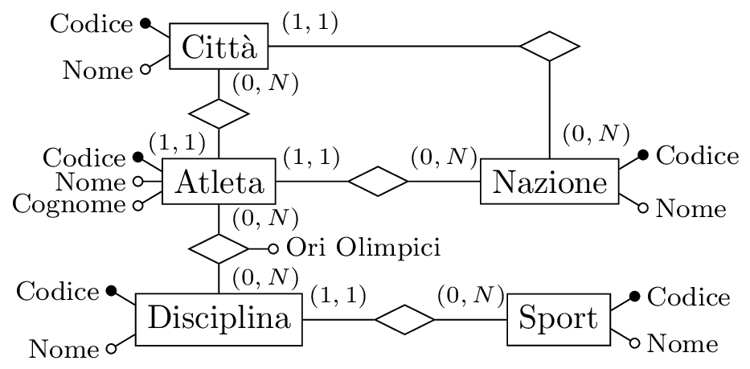</p>
</figure>

Non si uniscono le relationship cittadinanza e luogo di nascita, poiché la cittadinanza potrebbe differire dalla nazione relativa al luogo di nascita.

### Domanda 2

Modificare lo schema fornito in risposta alla domanda precedente, tenendo conto delle seguenti specifiche aggiuntive, mostrare tutto lo schema:

- Interessano le singole gare cui l’atleta ha partecipato, con il relativo risultato (ad esempio, Jacobs è arrivato primo nei 100 metri alle Olimpiadi del 2020 e quinto in quelle del 2024 ed è stato eliminato in semifinale ai mondiali del 2022). Per il risultato esistono una serie di valori predefiniti, ciascuno con un codice associato (ad esempio, il codice 1 potrebbe significare primo, 2 secondo, 10 eliminato in semifinale e così via);

- Ogni gara si svolge nell’ambito di una manifestazione e ogni manifestazione è nell’ambito di una serie (le Olimpiadi o i Campionati Mondiali di atletica sono serie di manifestazioni mentre le Olimpiadi del 2024 sono una manifestazione);

- Per ogni manifestazione sono di interesse la nazione in cui si svolge (supponiamo una sola) e l’anno (che identifica la manifestazione nell’ambito della serie). Ogni serie di manifestazioni ha un codice e un nome.

Indicare discorsivamente eventuali vincoli aggiuntivi, non esprimibili con il modello Entity Relationship.

Per la prima modifica si elimina la relationship Discipline Praticate, poiché è ridondante dato che le olimpiadi sono delle manifestazioni, e dal loro risultato è possibile ottenere la stessa informazione, se viene mantenuta bisogna specificare che rappresenta una ridondanza. Bisogna distinguere la gara dalla partecipazione di una atleta ad una specifica gara, sono due concetti diversi e quindi si rappresentano con due entità distinte. Un’occorrenza dell’entità Gara si identifica dalla sua disciplina e manifestazione, quindi con una chiave esterna. Anche per l’entità Partecipazione si ha un’identificazione esterna, tra Atleta e Gara. Ogni partecipazione ha un suo risultato, e poiché questo ha una sua descrizione si promuove ad entità Risultato.

L’entità Manifestazione viene identificata dall’anno in cui viene svolta e dall’occorrenza dell’entità Serie a cui appartiene, inoltre si inserisce la relationship sede con l’entità Nazione.

<figure>
<p> 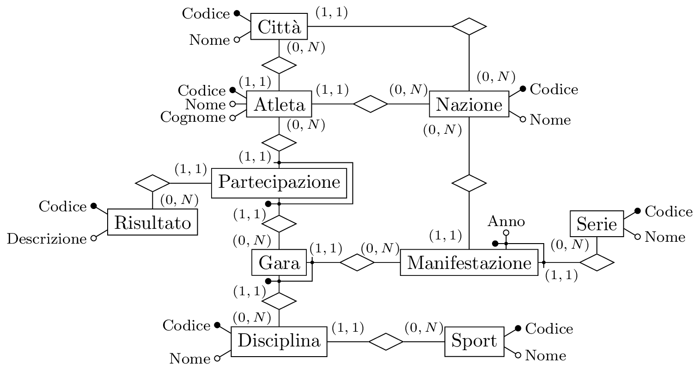</p>
</figure>

### Domanda 3

Considerare i tre schemi seguenti:

<figure>
<p> 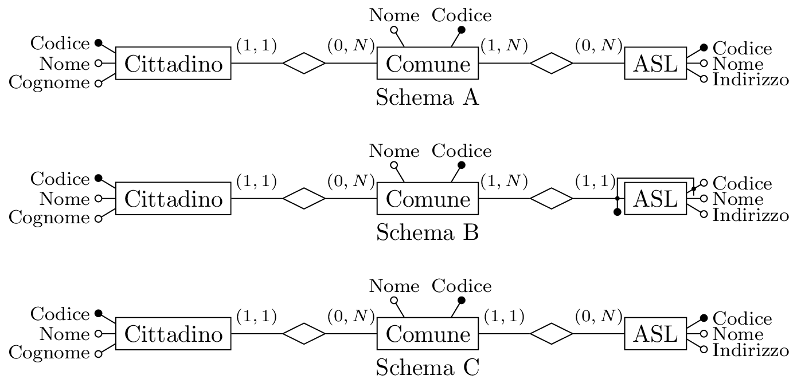</p>
</figure>

Con riferimento a ciascuno di essi, rispondere alle seguenti domande, con un sì o un no negli spazi della tabella:

<div class="center">

|                                                                   |  A  |  B  |  C  |
|:-----------------------------------------------------------------:|:---:|:---:|:---:|
| Possono esistere due ASL con lo stesso codice, in comuni diversi? | No  | Sì  | No  |
|     Per ciascun cittadino, si individua univocamente una ASL?     | No  | No  | Sì  |
|          Possono esistere due ASl per lo stesso comune?           | Sì  | Sì  | No  |
|          Possono esistere due comuni con una stessa ASL?          | No  | No  | Sì  |

</div>

### Domanda 4

Con riferimento a ciascuno dei tre schemi ER nella domanda precedente, mostrare una base di dati che mostri le caratteristiche principali. Bastano poche ennuple per ciascuna tabella, che debbono però illustrare le differenze. Nelle intestazioni delle tabelle, indicare le chiavi sottolineando i nomi degli attributi.

Schema A:

<div class="center">

| Cittadino |         |      |        |
|:---------:|:-------:|:----:|:------:|
|  <u></u>  | Cognome | Nome | Comune |
|     1     |    …    |  …   |   C1   |
|     2     |    …    |  …   |   C1   |
|     3     |    …    |  …   |   C2   |

|  Comune  |        |
|:--------:|:------:|
| <u></u>  |  Nome  |
|    C1    |  Roma  |
|    C2    | Milano |
|    C3    |  Como  |

|   ASL    |      |           |        |
|:--------:|:----:|:---------:|:------:|
| <u></u>  | Nome | Indirizzo | Comune |
|    A1    |  …   |     …     |   C1   |
|    A2    |  …   |     …     |   C3   |
|    A3    |  …   |     …     |   C3   |

</div>

Schema B:

<div class="center">

| Cittadino |         |      |        |
|:---------:|:-------:|:----:|:------:|
|  <u></u>  | Cognome | Nome | Comune |
|     1     |    …    |  …   |   C1   |
|     2     |    …    |  …   |   C1   |
|     3     |    …    |  …   |   C2   |

|  Comune  |        |
|:--------:|:------:|
| <u></u>  |  Nome  |
|    C1    |  Roma  |
|    C2    | Milano |
|    C3    |  Como  |

|   ASL    |      |           |          |
|:--------:|:----:|:---------:|:--------:|
| <u></u>  | Nome | Indirizzo | <u></u>  |
|    A1    |  …   |     …     |    C1    |
|    A2    |  …   |     …     |    C1    |
|    A1    |  …   |     …     |    C1    |

</div>

Schema C:

<div class="center">

| Cittadino |         |      |        |
|:---------:|:-------:|:----:|:------:|
|  <u></u>  | Cognome | Nome | Comune |
|     1     |    …    |  …   |   C1   |
|     2     |    …    |  …   |   C1   |
|     3     |    …    |  …   |   C2   |

|  Comune  |        |     |
|:--------:|:------:|:---:|
| <u></u>  |  Nome  | ASL |
|    C1    |  Roma  | A1  |
|    C2    | Milano | A2  |
|    C3    |  Como  | A2  |

|   ASL    |      |           |
|:--------:|:----:|:---------:|
| <u></u>  | Nome | Indirizzo |
|    A1    |  …   |     …     |
|    A2    |  …   |     …     |

</div>

## Esercizio 23[^27]

A seguito di una prima, superficiale analisi di una porzione della realtà di interesse per una azienda (con dirigenti, assistenti, reparti e sedi), è stato prodotto lo schema ER in figura:

<figure>
<p> 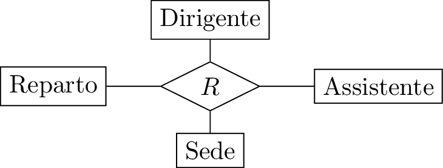</p>
</figure>

Modificare lo schema E-R (decomponendo la relationship e senza introdurre ulteriori entità) tenendo conto delle seguenti specifiche:

- Ogni dirigente opera presso uno e un solo reparto e collabora con uno o più assistenti. Gli assistenti che collaborano con un dirigente sono tutti e soli quelli che afferiscono allo specifico reparto presso cui il dirigente opera;

- Ogni reparto ha una e una sola sede, presso un reparto operano uno o più dirigenti e ad esso afferiscono uno o più assistenti;

- Presso una sede ci possono essere più reparti;

- Ogni assistente afferisce ad uno e un solo reparto e ha una sede che è quella del proprio reparto.

Si noti che certamente ognuna delle entità ha attributi, che non sono mostrati e non vanno inseriti nella soluzione. Vanno invece indicate le cardinalità delle relationship.

In questo caso il legame tra assistente e dirigente non è diretto, ma è mediato dal reparto. Per cui Dirigente è in relazione con Reparto e non direttamente con Assistente, con una cardinalità obbligatoria poiché ogni dirigente opera presso uno e un solo reparto. Analogamente il secondo ed il terzo punto indicano che l’entità Sede è legata separatamente all’entità Reparto.

<figure>
<p> 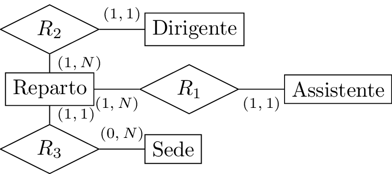</p>
</figure>

## Esercizio 24[^28]

Procedere come per la domanda precedente, con riferimento alle seguenti specifiche:

- Ogni dirigente opera presso uno o più reparti e collabora con uno o più assistenti;

- Se un dirigente X collabora con un assistente Y presso un reparto Z e con un altro assistente V presso un altro reparto W, allora X collabora con Y anche presso W e collabora con V presso Z;

- Presso ogni reparto operano uno o più dirigenti e ad esso afferiscono gli assistenti che collaborano con tali dirigenti;

- Ogni assistente collabora con uno o più dirigenti e afferisce ai reparti presso cui tali dirigenti operano;

- Ogni reparto ha una e una sola sede e ogni sede ha più reparti;

- Dirigenti e assistenti hanno legami con le sedi solo attraverso i reparti.

La differenza consiste che un dirigente opera su più reparti e con più assistenti, quindi si utilizzano due relationship molti a molti. Il secondo punto indica che non è necessaria una relationship ternaria, poiché specifica che i legami sono tra Dirigente e Reparto e separatamente tra Dirigente ed Assistente.

Il legame tra Assistente e Reparto non c’è ed è presente attraverso Dirigente. Il secondo punto inoltre specifica che Sede ha legame solamente con l’entità Reparto. Per cui lo schema finale risulta essere:

<figure>
<p> 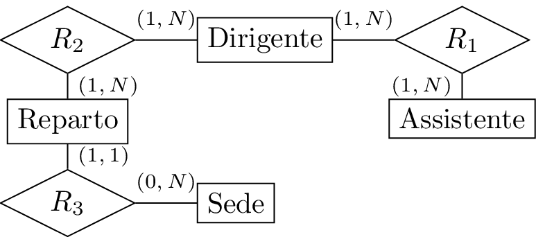</p>
</figure>

Se invece fosse stato specificato che se un dirigente X collabora con un assistente Y presso Z, e con V presso W, allora non è garantito che collabori con X presso W o viceversa, sarebbe stata necessaria implementare una relationship ternaria per specificare che solamente alcune terne Dirigente, Assistente e Reparto sono vere.

## Esercizio 25[^29]

Considerare la seguente relazione, che contiene dati relativi ad un insieme di moduli per il pagamento di imposte. Le abbreviazioni CF, CT e CB indicano rispettivamente Codice Fiscale, Codice Tributo e Codice Banca. Per tutti e tre si usano valori semplificati rispetto a quelli reali.

<figure>
<p> 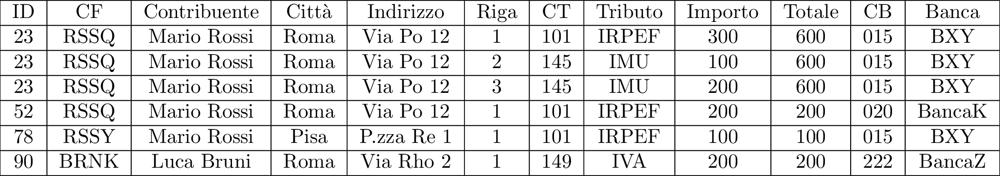</p>
</figure>

Con riferimento a tale relazione, ed al suo schema, basandosi sui valori mostrati quanto sulla comprensione del contesto applicativo, che, sia pure con qualche variante, è quello visto nell’esercitazione realizzativa, specificare quanto segue:

1.  Indicare la chiave, o le chiavi, della relazione;

2.  Indicare le dipendenze funzionali definite su di essa e, per ciascuna, se causa una violazione della BCNF;

3.  Mostrare una buona decomposizione della relazione originaria che soddisfi la BCNF, mostrare le tabelle, indicando la chiave di ciascuna con la sottolineatura;

4.  Mostrare uno schema concettuale che descriva la realtà di interesse considerata nei quesiti precedenti di questa domanda.

### Domanda 1

Poiché si tratta di moduli, si suppone che questa relazione individui moduli, quindi la chiave dovrebbe essere costituita dagli attributi che li identificano. Probabilmente i moduli del pagamento sono articolati in righe, per ogni modulo di un certo ID si possono avere diverse righe, con tutti i dettagli di ciascuna riga. L’importo cambia da riga a riga, ma il totale è sempre lo stesso per un ID. Quindi la chiave potrebbe essere composta dai seguenti attributi: $$\text{ID, Riga}$$

### Domanda 2

Per le dipendenze funzionali, si può partire da tutte quelle che associano un codice ad un valore, come CT e tributo, CB e banca, mentre il codice fiscale CF individua il contribuente, la città ed il suo indirizzo. Per ogni modulo si ha lo stesso totale, lo stesso contribuente e banca. Mentre gli attributi identificati dalla chiave sono il tributo, dal CT, e l’importo totale del modulo. L’unica dipendenza che non viola la BCNF è quella contenente la chiave.

- ID $\to$ CF, Totale, CB;

- ID, Riga $\to$ CT, Importo;

- CF $\to$ Contribuente, Città, Indirizzo;

- CT $\to$ Tributo;

- CB $\to$ Banca;

Generalmente è consigliato partire dalle dipendenze più semplici e piccole, aumentando di complessità fino ad arrivare alla chiave, a cui vengono assegnati gli attributi rimanenti, non presenti in nessuna dipendenza già precedentemente individuata.

### Domanda 3

Si decompone sulla base delle dipendenze funzionali identificate alla domanda precedente:

<div class="center">

| <u></u>  |  CF  | Totale | CB  |
|:--------:|:----:|:------:|:---:|
|    23    | RSSQ |  600   | 015 |
|    52    | RSSQ |  200   | 020 |
|    78    | RSSY |  100   | 015 |
|    90    | BRNK |  200   | 222 |

| <u></u>  | <u></u>  | CT  | Importo |
|:--------:|:--------:|:---:|:-------:|
|    23    |    1     | 101 |   300   |
|    23    |    2     | 145 |   100   |
|    23    |    3     | 145 |   200   |
|    52    |    1     | 101 |   200   |
|    78    |    1     | 101 |   100   |
|    90    |    1     | 149 |   200   |

| <u></u>  | Contribuente | Città | Indirizzo  |
|:--------:|:------------:|:-----:|:----------:|
|   RSSQ   | Mario Rossi  | Roma  | Via Po 12  |
|   RSSY   | Mario Rossi  | Pisa  | P.zza Re 1 |
|   BRNK   |  Luca Bruni  | Roma  | Via Rho 2  |

| <u></u>  | Tributo |
|:--------:|:-------:|
|   101    |  IRPEF  |
|   145    |   IMU   |
|   149    |   IVA   |

| <u></u>  | Banca  |
|:--------:|:------:|
|   015    |  BXY   |
|   020    | BancaK |
|   222    | BancaZ |

</div>

### Domanda 4

Da questo schema relazionale si possono individuare diversi concetti, la banca, il tributo ed il contribuente, che possono essere realizzati come delle entità. La relazione di chiave ID rappresenta il modulo, in relazione con l’entità contribuente e banca. Per l’ultima relazione si realizza un’entità riga, con un identificatore esterno sulla relationship con modulo. Attributi come CF e CB per l’entità Modulo ed ID e CT per Riga non sono attributi di queste due entità, ma vengono ottenuti tramite relationship con cardinalità obbligatoria alle rispettive entità; è infatti errore comune inserirli all’interno delle stesse entità Modulo e Riga.

<figure>
<p> </p>
</figure>

## Esercizio 26[^30]

Considerare la seguente relazione, che contiene dati relativi ad un insieme di negozi:

<div class="center">

| CN  |   Nome   |  Indirizzo   | Piano | CM  |    Marca     | CC  |   Categoria   |
|:---:|:--------:|:------------:|:-----:|:---:|:------------:|:---:|:-------------:|
| 342 | Mariella | Via Larga 32 | Terra | 101 |  BeiVestiti  |  A  | Abbigliamento |
| 342 | Mariella | Via Larga 32 | Terra | 102 | BelleScarpe  |  C  |   Calzature   |
| 343 |  Franca  | Vic. Corto 1 | Primo | 101 |  BeiVestiti  |  A  | Abbigliamento |
| 343 |  Franca  | Vic. Corto 1 | Primo | 103 |   BelCuoio   |  B  |     Borse     |
| 343 |  Franca  | Vic. Corto 1 | Primo | 104 | VestitiBelli |  A  | Abbigliamento |

</div>

Assumere che siano definite sulla relazione le seguente dipendenze funzionali:

- CN $\to$ Nome, Indirizzo, Piano;

- CM $\to$ Marca, CC;

- CC $\to$ Categoria

Con riferimento a tale relazione, ed al suo schema:

1.  Indicare la chiave, e fra le dipendenze funzionali sopra elencate, quali sono quelle che causano violazioni della BCNF;

2.  Mostrare lo schema di una buona decomposizione che soddisfi la BCNF;

3.  Mostrare uno schema concettuale che descriva la realtà di interesse illustrata nella domanda precedente.

### Domanda 1

La chiave della relazione si suppone essere CN, CM, gli attributi del codice del negozio e della marca. Tutte e tre le dipendenze funzionali mostrare quindi violano la BCNF.

### Domanda 2

Nella decomposizione sono necessarie quattro relazioni, tre relative alle dipendenze funzionali, ed una per mantenere il legame tra CN e CM, la chiave effettiva della relazione:

<div class="center">

| <u></u>  | <u></u>  |
|:--------:|:--------:|
|   342    |   101    |
|   342    |   102    |
|   343    |   101    |
|   343    |   103    |
|   343    |   104    |

| <u></u>  |   Nome   |  Indirizzo   | Piano |
|:--------:|:--------:|:------------:|:-----:|
|   342    | Mariella | Via Largo 32 | Terra |
|   343    |  Franca  | Vic. Corto 1 | Primo |

| <u></u>  |    Marca     | CC  |
|:--------:|:------------:|:---:|
|   101    |  BeiVestiti  |  A  |
|   102    | BelleScarpe  |  C  |
|   103    |   BelCuoio   |  B  |
|   104    | VestitiBelli |  A  |

| <u></u>  |   Categoria   |
|:--------:|:-------------:|
|    A     | Abbigliamento |
|    B     |     Borse     |
|    C     |   Calzature   |

</div>

### Domanda 3

La relazione contenente solamente la chiave corrisponde ad una relationship molti a molti nello schema concettuale, che lega le entità Negozio e Marca. All’entità marca è legata con cardinalità uno a molti l’entità Categoria:

<figure>
<p> 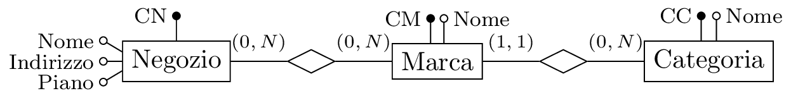</p>
</figure>

[^1]: *Dall’esercitazione in aula del 7 Ottobre 2024*

[^2]: *Dall’esercitazione in aula del 7 Ottobre 2024*

[^3]: *Dall’esercitazione in aula del 18 e 25 Ottobre 2024*

[^4]: *Dall’esercitazione in aula del 28 Ottobre 2024*

[^5]: *Dall’esercitazione in aula del 11 Novembre 2024*

[^6]: *Dall’esercitazione in aula del 11 Novembre 2024*

[^7]: *Dall’esercitazione in aula del 18 Novembre 2024*

[^8]: *Dall’esercitazione in aula del 25 Novembre 2024*

[^9]: *Dall’esercitazione in aula del 25 Novembre 2024*

[^10]: *Dall’esercitazione in aula del 25 Novembre 2024*

[^11]: *Dall’esercitazione in aula del 25 Novembre 2024*

[^12]: *Dall’esercitazione in aula del 25 Novembre 2024*

[^13]: *Dall’esercitazione in aula del 25 Novembre 2024*

[^14]: *Dall’esercitazione in aula del 25 Novembre 2024*

[^15]: *Dall’esercitazione in aula del 29 Novembre 2024*

[^16]: *Dall’esercitazione in aula del 29 Novembre 2024*

[^17]: *Dall’esercitazione in aula del 29 Novembre 2024*

[^18]: *Dall’esercitazione in aula del 29 Novembre 2024*

[^19]: *Dall’esercitazione in aula del 8 Novembre e 2 Dicembre 2024*

[^20]: *Dall’esercitazione in aula del 8 Novembre e 2 Dicembre 2024*

[^21]: *Dall’esercitazione in aula del 8 Novembre e 2 Dicembre 2024*

[^22]: *Dall’esercitazione in aula del 13 Dicembre 2024*

[^23]: *Dall’esercitazione in aula del 13 Dicembre 2024*

[^24]: *Dall’esercitazione in aula del 13 Dicembre 2024*

[^25]: *Dall’esercitazione in aula del 13 Dicembre 2024*

[^26]: *Dall’esonero del 6 Dicembre 2024, Compito A; corretto in aula il 16 Dicembre 2024*

[^27]: *Dall’esercitazione in aula del 16 Dicembre 2024*

[^28]: *Dall’esercitazione in aula del 16 Dicembre 2024*

[^29]: *Dall’esercitazione in aula del 20 Dicembre 2024*

[^30]: *Dall’esercitazione in aula del 20 Dicembre 2024*
