---
author:
- "*Giacomo Sturm*"
date: |
  *Dipartimento di Ingegneria Civile, Informatica e delle Tecnologie Aeronautiche  
  Università degli Studi “Roma Tre"*
title: |
  **Basi di Dati**  
  Appunti delle Lezioni di Basi di Dati  
  *Anno Accademico: 2024/25*
---

\providecommand{\labelText}[2]{#1}

# Introduzione

Per definire cosa sono i dati, si utilizza la definizione del Data Governance Act; per “Data” si intende una qualsiasi rappresentazione di informazione. Una base di dati in generale, invece, rappresenta un insieme organizzato di dati utilizzati per il supporto dello svolgimento delle attività. La maggior parte delle attività moderne si basano su una qualche base di dati. Si possono analizzare dal punto di vista metodologico e tecnologico. La definizione dell’Informatica dall’Accademia di Francia si può notare la presenza di queste due anime. L’informatica viene definita come la scienza del trattamento razionale, specialmente per mezzo di macchine, dell’informazione considerata come supporto alla conoscenza umana e della comunicazione.

I dati quindi nei sistemi informatici, e non solo, sono mezzi per poter gestire dell’informazione, rappresentati in modo essenziale. Molto spesso vengono rappresentati in forma di codice numerico. Sono necessari quindi meccanismi di codifica e decodifica dei dati per poterli rappresentare in forma essenziale e quindi in modo da ottenere informazioni. Un dato può essere considerato quindi un elemento di informazione che deve essere ancora elaborato.

Nello specifico una base di dati rappresenta un insieme organizzato di dati, gestiti da un DBMS. Un “DataBase Management System” rappresenta un sistema che gestisce collezioni di dati, grandi, persistenti e condivise. Si tratta di insiemi grandi, molto di più della memoria fisica dei dispositivi centrali di calcolo, rappresentano il loro limite fisico, e poiché la richiesta di immagazzinare dati è sempre maggiore, si vuole aumentare la disponibilità di memorizzare più dati. I DBMS sono persistenti, poiché le informazioni salvate al loro interno non svaniscono nel tempo, sono importanti vengono salvati su memorie secondarie non volatili. Sono accessibili perché sono condivise e permettono accessi in remoto, essendo generalmente salvati nel cloud.

I DBMS garantiscono privatezza, affidabilità, efficienza ed efficacia. I DBMS sono privati, poiché devono garantire che i dati salvati al loro interno siano privati, e siano accessibili solamente quando vengono richiesti. Devono comprendere meccanismi di autorizzazione per mantenere la privacy. Sono affidabili poiché devono poter resistere a malfunzionamenti o attacchi, di tipo hardware o software. I dati sono risorse pregiate e devono poter essere conservati a lungo termine. Per interfacciarsi con un DBMS una tecnica fondamentale consiste nelle transazioni. Queste sono un insieme di operazioni da considerare indivisibili o atomiche, anche concorrenti e di effetto definitivo. Poiché sono operazioni atomiche, possono essere eseguite solo per intero, quando vengono eseguite. Devono essere concorrenti, poiché accedendo allo stesso DB da remote bisogna che l’effetto delle due transizioni concorrenti sia coerente sul DB, senza recare danni o perdita di informazioni da nessuna delle due. I risultati delle transazioni devono essere permanenti ed il loro termine viene identificato da un “commit”, un impegno che segna una conclusione positiva. Una serie di commit quindi mantiene traccia dei risultati in modo definitivo, anche in presenza di guasti o esecuzioni concorrenti. L’efficacia e l’efficienza del DBMS dipende da sistema a sistema. I progettisti e realizzatori di un DBMS compiono un ruolo diverso dai futuri utilizzatori del DBMS. I primi creano un sistema di gestione, mentre la creazione della base di dati è affidati ad altri progettisti. Questa base di dati verrà utilizzata da altri programmatori per realizzare un’applicazione o programma con cui si potranno interfacciare gli utenti. Gli utenti finali si distinguono in utenti finali, per cui è stata realizzata quella specifica applicazione ed eseguono operazioni predefinite. Mentre utenti casuali eseguono operazioni non previste dal sistema, e possono provocare errori.

# Modello Relazionale

Per organizzare i dati all’interno di una base di dati si possono utilizzare diversi modelli o astrazioni dei dati. Il modello dei dati rappresenta un insieme di costrutti attraverso i quali i dati di interesse vengono organizzati ed utilizzati. Il modello relazionale prevede la costruzione di una tabella, ovvero una relazione, che permette di definire insiemi di record o n-uple composte da unità atomiche, chiamate attributi, omogenee.

Questo rappresenta un modello logico dei dati tradizionale, mentre altri modelli più recenti ad oggetti, XML e “NoSQL”. Il modello relazionale è stato proposto da E. F. Codd nel 1970 per favorire l’indipendenza dei dati. Questo modello fu implementato in DBMS già nel 1981, poiché non è facile implementare l’indipendenza dei dati con efficienza ed affidabilità. Si basa sul concetto matematico di relazione che trova una naturale rappresentazione per mezzo di tabelle.

## Relazione

Una relazione $\rho$ rappresenta un sottoinsieme del prodotto cartesiano tra due o più domini $D_1$ e $D_2$: $$\rho\subseteq D_1\times D_2$$ Dati $n$ insiemi $D_i$, il loro prodotto cartesiano $D_1\times\cdots\times D_n$ rappresenta l’insieme di tutte le n-uple $(d_1,\cdots,d_n)$ tali che per ogni $i=1,\cdots n$ si ha $d_i\in D_i$. Poiché è un insieme non sono presenti ennuple uguali. Una relazione $\rho$ su questi $n$ insiemi, chiamati domini, rappresenta un sottoinsieme di questo prodotto cartesiano: $$\rho\subseteq D_1\times\cdots\times D_2$$

La struttura così definita non è posizionale, poiché a ciascun dominio si associa un nome, attributo o colonna, nell’intestazione della tabella. Le tabelle che rappresentano una relazione l’ordinamento tra le righe è irrilevante, così come l’ordinamento tra le colonne. Una tabella rappresenta una relazione se tutte le righe sono diverse fra di loro e rappresentano una ennupla distinta, le intestazioni delle colonne sono diverse fra di loro, ed i valori di ogni colonna sono omogenei fra di loro. Nelle tabelle ci sono solo valori, si indica anche come modello basato sui valori. I riferimenti fra dati in relazioni diverse sono rappresentati tramite i valori dei domini nelle ennuple.

Una base di dati rappresenta un’insieme di relazioni, dove il suo schema è costituito da tutte le intestazioni, mentre i valori contenuti quindi tutte le righe contenute nelle tabelle rappresentano un’istanza della base di dati.

Per gestire le relazioni useremo il linguaggio SQL, inizialmente acronimo per “Structured English Query Language”, ma poi estesa a “Structured Query Language”, senza appoggiarsi principalmente sul linguaggio inglese. Rappresenta una lingua di alto livello, che tratteremo approfonditamente in sezioni successive.

Lo schema di una relazione è composto da un nome $R$ ed un insieme $X$ di $n$ attributi $A_i$: $$R(A_1,\cdots,A_n)$$ Lo schema di una base di dati $R$ è costituito da uno schema di relazioni $R_i$: $$R=\left\{R_1(X_1),\cdots R_k(X_k)\right\}$$

Un’ennupla su un insieme di attributi $X$ viene definita come una funzione che associa a ciascun attributo $A$ in $X$ un valore del dominio di $A$. Il valore di una singola ennupla $t$ su un attributo $A$ si indica con $t[A]$. Un’istanza di una relazione $\rho$ su uno schema $R(X)$ rappresenta un insieme di ennuple su $X$. Un’istanza di una base di dati su uno schema $R(X)=\left\{R_1(X_1),\cdots R_k(X_k)\right\}$ si definisce come un insieme di relazioni $\rho=\left\{\rho_i,\cdots,\rho_k\right\}$, dove ogni $\rho_i$ rappresenta un’istanza di una relazione sullo schema di una relazione $R_i(X_i)$.

## Valore Nullo

Questo modello impone ai dati una struttura rigida, solo alcuni formati sono infatti ammessi, ed esclusivamente rappresentati come ennuple che appartengono un certo schema di relazione. Ma la realtà potrebbe non corrispondere alla struttura attesa, quindi i dati ottenuti dalla realtà potrebbero non rappresentare un’ennupla intera. Per cui quando un’ennupla contiene informazioni incomplete, il valore dell’ennupla per quell’attributo è vuoto nella relazione. Per ovviare a questo problema nel modello relazionale, si utilizza un valore convenzionale per rappresentare questo valore vuoto nell’ennupla, si utilizza un valore diverso dai valori del dominio $A$, chiamato $null$. L’introduzione di questo altro valore è una soluzione semplice, ma efficace ai fini della base di dati. Tutti i domini $A$ sono in grado di accettare un valore $null$ per indicare la mancanza del valore nell’ennupla. Per cui data un’ennupla $t$ il suo valore su di un attributo $A$ può essere: $$t[A]=\begin{cases}
        \mathrm{dom}(A)\\
        null
    \end{cases}$$

Nonostante la semplicità non è una tecnica perfetta, poiché la perdita di informazioni impedisce di effettuare riferimenti per valori tra le relazioni. Su SQL si può utilizzare il comando `NOT NULL` alla creazione di uno schema di relazione.

## Vincoli

Oltre all’assenza di informazioni, è possibile riscontrare errori interni alla base di dati, delle scorrettezze legate all’integrità dei dati. Si possono introdurre vincoli di integrità per rappresentare istanze ammissibili. I vincoli sono delle funzioni booleane, dei predicati, che associa ad ogni istanza un valore vero o falso.

Solo alcuni tipi di vincoli sono integrati nei DBMS, e questi li verificano e ne impediscono la violazione. Per i vincoli supportati invece la verifica spetta all’utente o al programmatore. Questi vincoli possono essere intra-relazionali o inter-relazionali. I vincoli intra-relazionali coinvolgono solamente i valori di una singola relazione, e possono essere sul valore o di dominio, di ennupla, o di chiave.

### Intra-Relazionali

I vincoli di dominio impongono condizioni sull’ammissibilità dei valori di un singolo attributo. Possono utilizzare operatori booleani come AND, OR e NOT, ed operazioni di confronto matematiche con una costante.

In SQL data uno schema, si può aggiungere un vincolo con la sintassi `ADD CONSTRAINT`, seguita dalla funzione boolean che definisce il vincolo. Si possono aggiungere ad uno schema di relazione tramite il comando `ALTER TABLE`. Se il vincolo che si prova a definire è violato, non si può definirlo. Convenzionalmente prima viene definito lo schema con i vincoli poi questi vengono verificati ad ogni modifica, ed in caso rifiutata.

I vincoli possono essere di ennupla, quando controllano più valori, appartenenti a più attributi, della stessa ennupla. Il vincolo di dominio quindi rappresenta un caso particolare del vincolo di ennupla. Rappresenta una combinazione booleana di condizioni semplici sui singoli valori di attributi, due attributi o più valori di essi.

Se un insieme $K$, dominio della relazione, è una chiave, allora per il vincolo di chiave si impone che non possano esistere due ennuple uguali su $K$. Una chiave essendo univoca permette di identificare le ennuple, ed è minimale rispetto a questa proprietà. Ovvero è l’insieme più piccolo possibile per poter identificare univocamente tutte le ennuple della relazione. Se una chiave è formata da più di un insieme allora si chiama superchiave. Su SQL si indica che un attributo è una chiave attraverso il comando `UNIQUE`. Alcune chiavi possono essere definite su più attributi, ma devono essere univoche. Una chiave è una superchiave minimale.

Ogni relazione è un insieme, quindi non può contenere due ennuple uguali, e ha come superchiave almeno l’insieme degli attributi su cui è stata definita. Ogni relazione ha almeno una chiave. L’esistenza delle chiavi garantisce la possibilità di accedere ad ogni ennupla della base di dati e permettono di correlare relazioni diverse. Se nella chiave sono presenti valori nulli, questo non permette di identificare le ennuple e di realizzare facilmente riferimenti ad altre relazioni. Per cui la loro presenza nelle chiavi deve essere limitata o almeno controllata.

Una chiave si dice primaria se su di essa non sono ammessi valori nulli, indicata nell’intestazione sottolineando l’attributo corrispondente.

In SQL dopo aver definito lo schema della relazione, si inserisce la parola chiave `KEY` o `PRIMARY` `KEY`, in seguito all’attributo considerato come chiave oppure si inseriscono tra parentesi questi attributi.

### Inter-Relazionali

Un vincolo di integrità referenziale, utilizza delle chiavi esterne “foreign key” $X$ per collegare due relazioni $R_1$ e $R_2$. Questo vincolo impone ai valori su $X$ in $R_1$ di comparire come valori della chiave primaria in $R_2$.

In SQL si definiscono dopo le colonne degli attribuiti tramite la parola chiave `FOREIGN KEY` specificando tra parentesi gli attributi da considerare. Si inserisce in seguito `REFERENCES` seguito dal nome della relazione $R_1$ e tra parentesi gli attributi di questa relazione da utilizzare.

Quando questi vincoli sono su attributi multipli il loro ordine è rilevante, poiché le chiavi devono riferire agli attributi corretti, altrimenti non sarebbe presente un riscontro tra i domini. La struttura è in notazione posizionale.

Spesso è richiesto che un singolo attributo sia legato ad una relazione, ma all’interno di una tabella, e relazione, è possibile utilizzare solamente valori semplici, non relazioni. Per risolvere questa richiesta si utilizzano altre relazioni esterne, connesse utilizzando vincoli referenziali, per realizzare strutture simili a strutture nidificate, in più relazioni. I dati di interesse infatti hanno una struttura generalmente nidificata, e per poter essere rappresentati in relazioni hanno bisogno di essere trasformati attraverso vari livelli di astrazione, che rappresentano un diverso livello di dettaglio dello stesso fenomeno reale. Questo meccanismo verrà trattato dettagliatamente nella sezione dedicata alla progettazione di basi di dati. In molti casi non vengono rappresentati ad una prima analisi tutti gli aspetti significativi di un dato reale, e quindi si tende a modificare le relazioni ottenute all’aumentare delle informazioni ottenute dagli stessi dati.

Ogni modello presenta un suo livello di astrazione, utili per un ristretto contesto, e perde di utilità se viene utilizzato in contesti diversi. Questo vale per ogni modello, le cui informazioni di interesse potrebbero o non potrebbero essere utili in base al tipo di analisi ed operazioni da effettuare.

# Algebra Relazionale

Esistono due diversi tipi di linguaggi per basi di dati, rispetto alla loro funzione. Si può operare sullo schema della base di dati tramite DDL “Data Definition Language”, oppure sui dati memorizzati, tramite DML “Data Manipulation Language”. Con la DML è possibile effettuare interrogazioni o “query” sul database ed operazioni di aggiornamento.

I linguaggi DML, interrogativi, per basi di dati relazionali possono essere dichiarativi, ovvero esprimono le proprietà del risultato che si cerca, oppure possono essere procedurali ed indicano il modo in cui si ottiene il risultato di interesse.

Alcuni di questi linguaggi sono:

- Algebra Relazionale: procedurale;

- Calcolo Relazionale: dichiarativo, e teorico;

- SQL: parzialmente dichiarativo, di uso reale;

- QBE: dichiarativo, di uso reale.

L’algebra relazionale fornisce un linguaggio tramite il cui è possibile effettuare interrogazioni su basi di dati, è quindi un linguaggio di tipo DML. Contiene un insieme di operatori su relazioni, che producono una relazione. Quindi questi operatori possono essere composti l’uno sull’altro. In questo corso verrà utilizzato il servizio online RelaX per utilizzare l’algebra relazionale. Questo sistema fornisce una struttura ad albero dell’interrogazione, dove le foglie sono gli operandi ed i nodi interni gli operatori. Per effettuare un’interrogazione dato il suo albero, si parte dalle foglie, e si sale al loro genitore e si effettua questa operazione, salendo di un solo nodo alla volta, arrivando fino alla radice dove sarà presente la relazione risultato dell’interrogazione.

L’algebra relazionale definisce i seguenti operatori:

- Unione, Intersezione e Differenza;

- Ridenominazione;

- Selezione;

- Proiezione;

- Aggregazione;

- Join.

## Operatori Insiemistici

Sono disponibili operatori essenziali per insiemi, poiché le relazioni corrispondono a degli insiemi. Poiché i risultati devono essere relazioni, si possono applicare solamente su relazioni aventi gli stessi attributi. Questa condizione però è mitigabile. Queste operazioni sono l’unione tra due relazioni, l’intersezione e la differenza. La relazione risultante presenta gli stessi attributi, nello stesso ordine degli operandi, con un numero di ennuple che dipende dal tipo di operazione. Ogni ennupla presente nel risultato deve quindi essere presente in almeno uno degli operandi.

Su RelaX queste operazioni vengono identificate dai caratteri $\cap$: intersezione, $\cup$: unione e $\setminus$: differenza.

L’unione tra relazioni aventi attributi diversi non è scorretta logicamente, ma utilizzando l’operatore insiemistico è impossibile. Bisogna gestire in modo corretto i nomi degli attributi che si vuole, ed esiste un operatore specifico per effettuarlo. Su RelaX produce un risultato diverso da quello aspettato.

## Ridenominazione

Questo operatore permette di rinominare i nomi degli attributi in una relazione, passati come argomento. Può essere utilizzato per generare un risultato intermedio con attributi omonimi, tra due relazioni diverse, per effettuare un’unione. In questo modo la relazione rimane uguale, ma cambiano solamente i nomi, in questo modo l’unione produce risultati comprensibili.

Questo operatore si indica con $\rho$, REN o RHO. Prende tra parentesi il nome della relazione di cui si vuole modificare il nome, e come pedice indica il vecchio nome e come cambiarlo:

```
REN\textsubscript{\texttt{ListaNuoviNomi}$\leftarrow$\texttt{ListaVecchiNomi}}($R$)
```

Si possono rinominare più di un attributo alla volta, specificando come pedici la lista degli attributi. Entrambe le liste nei pedici devono essere ordinate correttamente per poter agire sugli attributi specificati.

## Selezione

Questo operatore selezione da una relazione, le ennuple che soddisfano una certa condizione, sui loro attributi. Questo operatore si indica con $\sigma$ o `SEL`, e si rappresenta la condizione tramite una funzione booleana sul pedice, applicata su tutte le ennuple della relazione passata come argomento. Se questa condizione è verificata per una certa ennupla, questa viene selezionata ed appartiene al risultato, altrimenti non viene considerata. Effettivamente realizza tagli orizzontali della tabella associata alla relazione. Si utilizza la seguente sintassi:

```
SEL\textsubscript{\texttt{Condizione}}($R$)
    $\sigma$\textsubscript{\texttt{Condizione}}($R$)
```

Nella condizione booleana si possono effettuare confronti matematici tra attributi e costanti, e si possono utilizzare operatori booleani come `AND`, `OR` e `NOT`. Quando su un attributo sono possibili valori nulli, le condizioni producono risultati un risultato non desiderabile, poiché le condizioni atomiche vengono valutate separatamente. In generale nei linguaggi per basi di dati sono necessarie operazioni aggiuntive per gestire valori nulli, come `IS NULL` e `IS NOT NULL`. Senza queste operazioni si dovrebbe utilizzare la relazione senza considerare gli attributi dove possono essere presenti attributi nulli. Si potrebbe ulteriormente utilizzare una logica a tre stati, con uno stato sconosciuto per condizioni su attributi nulli. In RelaX si usa la sintassi:

```
NomeAttributo = NULL
```

## Proiezione

La proiezione è un’operazione che seziona verticalmente una relazione, agisce su tutte le ennuple, e solo sugli attributi specificati. Si indica con $\pi$ o `PROJ`, e prende come argomento tra parentesi la relazione su cui agisce, e come pedice una lista di attributi:

```
PROJ\textsubscript{\texttt{ListaAttributi}}($R$)
    $\pi$\textsubscript{\texttt{ListaAttributi}}($R$)
```

Il risultato è una relazione contenente tutte le ennuple ottenute dalla relazione di partenza ristrette agli attributi specificati nella lista. Rappresenta quindi un’operazione ortogonale rispetto alla selezione. Poiché rimuove gli attributi non presenti nella lista, è possibile siano presenti ennuple identiche nel risultato.

La cardinalità di una proiezione indica il numero di ennuple del risultato dell’operazione. Può contenere un numero minore di ennuple rispetto all’operando. Se la lista di attributi coincide, o contiene una superchiave $X$ della relazione $R$ allora l’operazione:

```
$\pi_X$($R$)
```

Contiene esattamente lo stesso numero di ennuple della relazione $R$, e non sono presenti ennuple duplicate.

La selezione e la proiezione sono operatori che permettono di estrarre informazioni da una relazione, restringendo le ennuple, e gli attributi. Effettuando una decomposizione orizzontale e verticale. Non è possibile invece calcolare calcolare informazioni derivate, oppure correlare fra di loro informazioni presenti in relazioni diverse.

## Join

L’operatore join è l’operatore più interessante fornito dall’algebra relazionale. Permette di correlare informazioni presenti su più relazioni, tra di loro. Effettua quest’operazione congiungendo ennuple di relazioni diverse su attributi dello stesso nome.

Il join è quindi un operatore binario, generalizzabile, e produce un risultato sull’unione degli attributi degli operandi. Le ennuple del risultato sono costruite a partire da ciascuna ennupla degli operandi.

Si definisce l’operatore join naturale $\Join$ tra due relazioni $R_1$ e $R_2$ su insiemi di attributi rispettivamente $X_1$ e $X_2$: $$R_1(X_1)\Join R_2(X_2)=\left\{t\,\mbox{su}\,X_1X_2\,\mbox{t.c.}\,\exists \,t_1\in R_1\land t_2\in R_2\implies t[X_1]=t_1\land t[X_2]=t_2\right\}$$

Un join si dice completo, se ogni ennupla contribuisce al risultato, mentre un join vuoto produce una relazione vuota, poiché non è possibile combinare tra di loro le ennuple delle due relazioni di partenza. Ha una cardinalità massima data dalla cardinalità delle due relazioni $R_1$ e $R_2$, nel caso di un join completo, mentre ha una cardinalità minima pari a zero, nel caso di un join vuoto: $$0\leq |R_1\Join R_2|\leq |R_1|\cdot|R_2|$$

Se il join coinvolge una chiave di $R_2$ allora, produrrà al massimo $|R_1|$ ennuple differenti, poiché la relazione considera al massimo tutte le ennuple di $R_2$, associandole con le ennuple di $R_1$: $$0\leq |R_1\Join R_2|\leq |R_1|$$

Invece se il join coinvolge una chiave di integrità referenziale tra le due relazioni $R_1$ e $R_2$, allora conterrà esattamente un numero $|R_1|$ di ennuple, senza contenere duplicati: $$|R_1\Join R_2|=|R_1|$$

In generale la cardinalità di un join è intermedia a questi valori di cardinalità, dove una parte delle ennuple non contribuisce al risultato finale, vengono tagliate fuori. Se si vuole considerare anche queste ennuple, allora si può utilizzare il join esterno, che che estende il join, utilizzando valori nulli. Si indica dove aggiungere queste ennuple tagliate fuori, ed il resto degli attributi, non presenti in una delle due relazioni vengono attribuiti pari a null.

Esiste in tre versioni: sinistro, destro e completo. Il tipo di join esterno si indica al pedice del comando `JOIN`. Il join esterno sinistro, considera solo le ennuple della relazione $R_1$ e le aggiunge al risultato, quello esterno analogamente solo $R_2$, mentre quello completo da entrambe.

Un join naturale su una relazione senza attributi in comune si definisce prodotto cartesiano, contiene sempre un numero di ennuple pari al prodotto delle cardinalità delle due relazioni. Si suppone che le ennuple sono tutte combinabili tra di loro. Il risultato contiene ogni possibile combinazione tra tutte le ennuple degli operandi. Viene utilizzato in genere sempre se seguito da una condizione booleana, tramite una selezione:

```
SEL\textsubscript{\texttt{Condizione}}($R_1\Join R_2$)
    $\sigma$\textsubscript{\texttt{Condizione}}($R_1\Join R_2$)
```

Quest’operazione viene chiamata “theta-join”, e può essere espressa specificando la condizione al pedice del join. Se la condizione nel theta-join comprende sempre l’uguaglianza, allora questo si chiama “equi-join”. Si utilizzano sopratutto equi-join e non theta-join. L’equi-join è definito quindi come il prodotto cartesiano tra due relazioni, seguito da una selezione all’uguaglianza, tra due liste di attributi di entrambe le relazioni. Viene utilizzato per correlare due attributi di nome diverso, ma di stesso valore. Nelle interrogazioni pratiche si userà solamente l’equi-join, mentre il join naturale viene descritto esclusivamente ad uso didattico.

Due espressioni si dicono equivalenti se producono risultati uguali in ogni istanza della base di dati, è rilevante poiché i DBMS utilizzano forme equivalenti per ridurre la complessità e rendere le interrogazioni più efficienti. Una di queste forme equivalenti è la “push selection”, una selezione all’uguaglianza di un attributo con una costante su una join tra due relazioni. Questa forma è equivalente ad eseguire la selezione prima della join, sulla relazione contenente l’attributo di interesse.

Tuttavia l’obiettivo di questo corso non è l’efficienza delle interrogazioni, ma la loro correttezza, dato che sono i DBMS a decidere quale sia la scelta più efficiente, e ad eseguirla.

## Viste

Date questi operatori è possibile realizzare altre relazioni, non contenute nella base di dati operando su di esse, e correlando le informazioni contenute al loro interno. Le relazioni appartenenti all’istanza della base di dati si chiamano relazioni di base. Le relazioni definite attraverso interrogazioni vengono chiamate relazioni derivate, queste possono essere definite su altre relazioni derivate. Ma questo processo di realizzare interrogazioni nidificate o annidate può rendere meno comprensibile l’interrogazione.

L’uso delle viste non influisce sull’efficienza dell’interrogazione. Nelle interrogazioni ci si riferisce alle viste come fosse una relazione appartenente alla base di dati. Rappresentano uno strumento di programmazione per diminuire il codice ripetuto e semplificare la scrittura di interrogazioni.

Inoltre questa distinzione permette agli utenti di poter interagire solamente con ciò che gli interessa, o che sono autorizzati a vedere. Permette inoltre l’utilizzo di programmi esistenti su schemi ristrutturati.

## RelaX

RelaX è uno strumento online per effettuare interrogazioni in algebra relazionale.

La sintassi è molto simile a quella descritta nel libro di testo, anche se presenta piccole differenze. L’editor permette di cliccare su un’operazione ed inserirla, in una barra sopra la zona di interrogazione. L’editor è “case sensitive”, quindi bisogna prestare attenzione alle maiuscole. A volte le espressioni perdono di leggibilità, poiché non è possibile inserire le condizione al pedice, vanno infatti inserite tutte su una singola linea. A volte lo strumento si confonde sugli spazi, ed è consigliabile utilizzarne di più oppure utilizzare parentesi ampiamente.

Fornisce anche una rappresentazione grafica ad albero delle espressioni, di facile comprensione.

Accedendo al servizio si possono effettuare interrogazioni su basi di dati, caricate dall’utente, oppure preesistenti sul servizio. Per caricare una base di dati, si può specificare nel link URL per accedere al servizio, oppure caricandola nel group editor. La sintassi per descrivere una relazione è la seguente: prima si specifica il nome della relazione, assegnando con un uguale la sua istanza tra parentesi graffe. All’interno delle parentesi graffe la prima riga indica i nomi degli attributi della relazione, divisi da spazi. Accanto al nome si può specificare il tipo di dato accettato da quell’attributo, dopo dei due punti. Se non viene specificato sarà possibile utilizzare qualunque tipo. Nelle righe seguenti si popola la base di dati specificando per ogni riga un’ennupla diversa, con i valori separati da spazi.

Nelle interrogazioni è consigliabile inserire nei confronti per primo l’attributo del primo operando e per secondo l’attributo del secondo operando.

Quando vengono effettuate operazioni di join tra due relazioni con attributi di nome uguale, si comporta essenzialmente come SQL. Viene ignorato il join naturale, e per riconoscere gli attributi viene utilizzato in notazione puntata il nome della relazione di appartenenza. Per rinominare relazioni si utilizzano viste, poiché rinominare attributi singoli è molto verboso ed è strettamente necessario solamente quando bisogna effettuare delle unioni, o per dare nomi significativi nel risultato. In RelaX è necessaria una ridenominazione esplicita prima dell’assegnazione alla vista, tramite l’operatore $\rho$.

# Il Linguaggio SQL

Esistono diversi tipi di linguaggi per accedere alle basi di dati. Già si è analizzata l’algebra relazionale, un linguaggio procedurale, per costruire gradualmente il risultato tramite le relazioni della base di dati.

Il linguaggio SQL “Structured Query Language”, si basa in parte sull’algebra relazionale, mentre su altri aspetti è un linguaggio dichiarativo, spesso permette di specificare nelle interrogazioni la struttura e le proprietà del risultato, a partire delle relazioni della base di dati. Ora SQL non rappresenta più un acronimo, ma solo un nome arbitrario. Il linguaggio tende ad essere sintetico ed abbastanza intuitivo per certi aspetti.

Ne esistono varie versioni, standard fino ad un certo punto, ed è un linguaggio molto grande, e ne verranno analizzate solo funzioni generali. Si può definire la componente di costruzione dei dati, e la componente di manipolazioni dei dati nello stesso SQL.

Ogni versione di SQL presenta dei piccoli dettagli diversi, ma che impediscono la completa esecuzione di una interrogazione arbitraria per un altro sistema. Il sistema utilizzato durante il corso è un servizio online chiamato [SQLiteonline](https://sqliteonline.com/), con una base di dati sul cloud. Su questo servizio è possibile utilizzare diverse DBMS SQL, oltre alla versione SQLite, si utilizzerà anche PostgreSQL, poiché fornisce un linguaggio più completo. Poiché è un servizio web, le basi di dati analizzate vengono salvate nella cache e quindi dovranno essere inizializzate ogni volte che vi si accede.

Nel servizio web, alla sinistra sono presenti, oltre a vari DBMS, la basi di dati corrente, alla destra è presente la storia delle precedenti interrogazioni. Al centro è presente l’interfaccia dove si possono scrivere le interrogazioni. Il risultato apparirò a schermo sotto questo editor, ma non verrà inserito all’interno della base di dati.

SQL è indifferente tra maiuscolo e minuscolo per i suoi comandi, ma è preferibile essere coerente con le scelte di sintassi effettuate. Inoltre è indifferente dall’indentazione, ma si preferisce inserire parentesi oppure si va a capo per aumentare la leggibilità dell’interrogazione. Il linguaggio lo interpreta cercando il nome della parola chiave, e gli argomenti dell’interrogazione.

## DDL

Per creare uno schema di qualsiasi tipo si utilizza la parola chiave `CREATE`, seguito dal tipo di oggetto da creare. Nella maggior parte dei casi si realizzeranno solamente relazioni, o tabelle, di tipo `TABLE`. In seguito viene inserito il nome della relazione, e tra parentesi tonde si inserisce ad ogni riga il nome dell’attributo della relazione e le sue proprietà:

``` sql
CREATE TABLE NomeRelazione (
    NomeAttributo1 TipoAttributo1 VincoliAttributo1, 
    -- lista di attributi
    NomeAttributoN TipoAttributoN VincoliAttributoN,
    -- definizioni opzionali di superchiavi della relazione
);
    
-- creazione degli altri schemi della base di dati
```

Tra i tipi possibili si hanno numeri specificati dalla parola chiave `number`, date da `date`, stringe di caratteri di una certa lunghezza `character(n)`, etc. Tra i vincoli di un attributo si può specificare se non deve essere nullo tramite il costrutto `NOT NULL`, di default quindi un attributo può assumere come valore `NULL`. Se esiste una chiave primaria, si può specificare direttamente nel campo proprietà di un attributo, invece che alla fine delle dichiarazioni di attributi. Si può specificare un vincolo di integrità referenziale tramite la parola chiave `REFERENCES`, seguito dal nome dell’attributo, se univoco, oppure dal nome della relazione che lo contiene, seguito tra parentesi tonde il suo nome, se non univoco.

In molti sistemi si possono utilizzare strumenti diversi da SQL per realizzare schemi di relazioni, il sistema PgAdmin offre un’interfaccia grafica. Ma è preferibile utilizzare il linguaggio SQL in modo da essere riutilizzabile, e di implementazione più veloce. In alcuni DBMS, se non viene specificato che la chiave primaria sia diversa da `NULL`, questi sistemi utilizzano un valore progressivo di default, quando non viene inserito esplicitamente dall’utente.

Per i nomi delle relazioni o degli attributi si utilizzano solo lettere minuscole, senza accenti. Invece dello spazio, se necessario, si può utilizzare il carattere `_` nei nomi.

Con la parola chiave `SELECT` si effettuano delle interrogazioni sui dati, mentre si possono modificare i dati con `INSERT`, `DELETE` e `UPDATE`. Con `INSERT` è possibile inserire una nuova riga in una relazione si utilizza la sintassi:

``` sql
    INSERT INTO NomeRelazione (ListaAttributi) -- omessa se coinvolge tutti gli 
    -- attributi, o nello stesso ordine
    VALUES (ListaValori) -- specificati tra singoli apici e divisi da una virgola
```

Invece di specificare i valori tramite `VALUES`, è possibile utilizzare `SELECT`, ma verrà discusso più avanti. Se un attributo non è presente nella lista, il suo valore in quell’ennupla inserita sarà `NULL`.

In SQL si possono scrivere operazioni di aggiornamento del database, tramite il comando `INSERT INTO`, allo stesso modo si possono eliminare dei valori con `REMOVE FROM`. Per modificare una tabella già creata, si può utilizzare il comando `ALTER TABLE`. Si possono rimuovere relazioni, o altri oggetti, specificando il loro nome nella clausola `DROP TABLE`.

In SQLiteonline l’inserimento di una ennupla in una tabella non controlla se gli attributi con cui hanno un vincolo di integrità referenziale che si vogliono aggiungere sono presenti nella relazione a cui si riferiscono, altrimenti potrebbe causare dei danni all’intera base di dati. Questa reference dovrebbe essere controllata ad ogni inserimento. Su SQLite si può attivare il controllo della chiave esterna con il comando:

``` sql
    PRAGMA foreign_keys=on
```

## DML

In SQL si possono effettuare le stesse operazioni disponibili nell’algebra relazionale, utilizzando una sintassi diversa:

### Proiezione

Per visualizzare alcuni attributi da una relazione, si può utilizzare una proiezione, introdotta dalla parola chiave `SELECT`, seguita dalla lista di attributi di interesse. Anche se si vuole visualizzare l’intera relazione bisogna usare una proiezione, specificando come parametro `*`, per indicare di visualizzare tutti gli attributi. Per specificare a quale relazione si vuole effettuare la proiezione, si utilizza la parola chiave `FROM`, seguita dal nome della relazione:

``` sql
    SELECT ListaAttributi -- oppure '*'
    FROM NomeRelazione
```

La lista di attributi si indica anche come “target list”, su cui devono operare condizioni, clausole, o funzioni più complesse, trattate in seguito.

### Operatori Insiemistici e Ridenominazione

Nell’algebra queste operazioni devono essere effettuate sugli stessi schemi, ma il loro comportamento è leggermente diverso tra RelaX e SQL. L’unione si effettua tramite la parola chiave `UNION`, tramite due interrogazioni, dove si richiedono gli stessi attributi:

``` sql
    SELECT ListaAttributi
    FROM Relazione1
    UNION
    SELECT ListaAttributi
    FROM Relazione2
```

Il risultato è una nuova tabella con tutte le righe di entrambe le tabelle. Se nelle due relazioni gli attributi sono differenti è possibile realizzare un’unione forzata, mentre nell’algebra solamente se i due insiemi sono uguali. In base al DBMS utilizzato è possibile effettuare unioni tra relazioni con numero di attributi differente, gestiti in maniera automatica. Questo però richiede ennuple compatibili tra di loro. Si utilizza l’approccio posizionale, nella lista degli attributi della proiezione. In questo modo si può specificare quali attributi unire tra di loro nell’unione. Inserisce prima tutte le ennuple della prima relazione, ed in seguito concatena, se sono compatibili, tutte le ennuple nell’ordine di attributi specificato della seconda relazione. Quindi in molti sistemi quest’operazione non è commutativa, il risultato prodotto sarà differente in base a quale relazione viene inserita per prima. Poiché il nome degli attributi nella relazione finale dipende solo dalla prima relazione. La maggior parte dei DBMS non vengono controllai se i nomi degli attributi combaciano, quindi bisogna prestare attenzione sopratutto all’ordine in cui sono inseriti nell’interrogazione ed al loro nome.

Per rinominare degli attributi si utilizza la parola chiave `AS` nella lista degli attributi della proiezione. Questo può essere omesso, inserendo solamente il nome dell’attributo ed il nome del suo alias:

``` sql
    SELECT NomeAttributo1 AS NomeAlias1, |$\cdots$|, NomeAttributoN NomeAliasN
    FROM Relazione
```

Come nell’algebra relazionale, rinominando gli attributi è possibile realizzare l’unione, anche se in algebra relazionale è possibile solamente dopo una ridenominazione. L’ordine rimane comunque importante, nonostante la ridenominazione. Si può quindi realizzare una proiezione con ridenominazione, nella stessa interrogazione.

Quando in un’interrogazione non si è sicure del risultato, l’ambiguità deve essere risolta a monte.

Nell’unione, poiché si tratta di insiemi, le ennuple identiche verranno eliminate nella relazione risultante. Si può specificare con `UNION ALL` di mantenere tutti i duplicati tra le due relazioni su cui viene effettuata l’unione.

La differenza viene realizzata tramite il comando `EXCEPT`:

``` sql
    SELECT ListaAttributi
    FROM Relazione1
    EXCEPT
    SELECT ListaAttributi
    FROM Relazione2
```

Produce una relazione contenente tutte le ennuple della prima relazione, eccetto le ennuple contenute anche nella seconda relazione. Come per l’intersezione il comportamento di SQL è analogo all’algebra relazionale. Si specifica l’intersezione tra due relazioni con la parola chiave `INTERSECT`:

``` sql
    SELECT ListaAttributi
    FROM Relazione1
    INTERSECT
    SELECT ListaAttributi
    FROM Relazione2
```

### Selezione

Per specificare una condizione su un’interrogazione si inserisce una riga al termine dell’interrogazione introdotta dalla parola chiave `WHERE`, seguita dalla funzione booleana che si deve verificare:

``` SQL
    SELECT ListaAttributi
    FROM Relazione
    WHERE Condizione
```

Questa interrogazione una selezione ed una proiezione, per la lista di attributi passata come argomento alla `SELECT`.

### Join

Il join essenzialmente realizza un prodotto cartesiano delle relazioni specificate nella clausola `FROM`:

``` sql
    SELECT *
    FROM Relazione1 JOIN Relazione2
```

Può essere specificata una condizione dalla parola chiave `WHERE`, se si cercano solo certi attributi, si può effettuare una proiezione specificando la lista di attributi dopo la parola chiave `SELECT`. In SQL bisogna specificare con la parola chiave `DISTINCT` se si vuole avere solo ennuple diverse tra di loro:

``` sql
    SELECT DISTINCT ListaAttributi
    FROM Relazione1 JOIN Relazione2
    WHERE Condizione
```

In algebra relazionale è possibile scrivere interrogazioni equivalenti in modi diversi, in cui ci sono variazioni di efficienza, l’algebra è procedurale. In SQL invece il sistema si preoccupa dell’efficienza delle operazioni, è almeno in parte dichiarativo dove le interrogazioni possono essere scritte in modi diversi, ma alcune differenze presenti in algebra non emergono.

Il sistema esegue selezione join ed un ulteriore proiezione, nella versione base di SQL. QUalche anno dopo venne introdotto il join esplicito, introducendo la possibilità di specificare i join nella clausola `FROM` specificando l’argomento al posto di una lista di attributi, una lista di join effettuati su attributi, specificando la condizione di join dopo la clausola `ON`.

Date due relazioni contenente un attributo in comune, per realizzare una relazione di join su questo attributo in comune si specifica nella clausola `SELECT` l’attributo in notazione puntata, altrimenti solleverebbe un errore poiché rappresenta un nome ambiguo. Anche nella condizione di join nella clausola `FROM` bisogna specificare a chi appartiene l’attributo indicato, utilizzando la notazione puntata:

``` SQL
    SELECT Attributo1, Attributo2, Lista1.AttributoComune 
    --oppure anche Lista2.AttributoComune
    FROM Lista1 JOIN Lista2 ON Lista1.AttributoComune = Lista2.AttributoComune
```

In SQL esiste il modo per effettuare join naturali specificando il nome dell’attributo non in notazione puntata, utilizzando la clausola `USING`, ma è preferibile non usarlo per favorire la comprensione:

``` SQL
    SELECT AttributoComune, Attributo1, Attributo2
    FROM Lista1 JOIN Lista2 USING AttributoComune
```

Alternativamente è possibile utilizzare più volte la stessa relazione in un’interrogazione, applicando una ridenominazione dei suoi attributi. In questo modo è possibile eliminare le ambiguità generate effettuando diversi join sulle stesse relazioni.

Questo è utile per visualizzare campi dallo stesso nome, ridenominando gli attributi del risultato, oppure per facilitare la scrittura evitando nomi di relazioni molto lunghi.

Esiste in SQL il join esterno, dove alcuni degli operandi partecipano solamente in parte, tramite la clausola `LEFT`, `RIGHT` o `FULL` seguito da `JOIN`. Inoltre è possibile inserire `OUTER` per realizzare join equivalenti, ma queste funzioni non sono presenti nel servizio web SQLite, dove è possibile utilizzare solamente `LEFT JOIN`.

### Condizioni “Like”

L’ordinamento del risultato è un altro fattore determinante, in base a cui si distinguono due ennuple o soluzioni tra di loro. Si può effettuare operazioni sulla target list e si può utilizzare la condizione `LIKE` per identificare espressioni regolari, dove `_` identifica un qualsiasi carattere e `%` per qualsiasi sequenza di carattere, inseriti tra doppi apici `" ... "`.

### Aggregazione ed Operatori Aggregati

Il contenuto delle basi di dati viene spesso aggregato, ma questo non è possibile in algebra relazionale. SQL prevede la possibilità di calcolare piccole elaborazioni a partire da insiemi di ennuple, di conteggio, minimo, massimo, media o totale.

Queste operazioni vengono svolte da operatori aggregati quali `COUNT` per contare tutti le righe in una relazione. Le funzioni aggregative lavorano anche con valori nulli. Bisogna specificare l’attributo di cui contare tutte le righe nella relazione tra parentesi tonde:

``` SQL
    COUNT(Attributo)
```

Altri operatori aggregati sono `SUM`, `AVG`, `MAX` e `MIN`. Si nota un’ulteriore utilità del valore nullo, poiché il sistema li riconosce come un valore non reale e non lo utilizza nel calcolo, al contrario di un sistema dove i valori nulli vengono codificati con 0 o -1.

Si utilizza un’altra clausola `GROUP BY` per dividere le ennuple di una relazione sulla base dell’attributo specificato e su questi raggruppamenti viene eseguita la funzione aggregata specificata. Quando si raggruppa su un attributo, e per lo stesso valore sono presenti più di un valore, è presente un’ambiguita su quale valore da visualizzare. Su SQLite viene mostrato uno scelto casualmente tra questi attributi. Questa rappresenta una delle scorrettezze di SQLite, ed il motivo per cui utilizzare spesso raggruppamenti viene sconsigliato. Questo può sollevare un problema quando è richiesto individuare un massimo su un attributo in una relazione, se si utilizza questo costrutto, e sono presenti più di un attributo con lo stesso valore massimo, allora sarà mostrato solo uno, riportando un risultato errato rispetto ai dati di partenza. Su altri DBMS questo problema può essere risolto restituendo un insieme delle ennuple che soddisfano l’interrogazione specificata.

Per ordinare una relazione si può utilizzare la clausola `ORDER BY`, seguita dall’attributo su cui si deve effettuare l’ordinamento.

Esiste un altra clausola `HAVING` per definire una condizione su raggruppamenti, mentre la `WHERE` si usa sulle singole ennuple.

### Interrogazioni Nidificate e Viste

La funzioni di aggregazione effettuano l’operazione sulla target list, raggruppando i campi, quindi in alcuni casi non permettono di scegliere di quale ennupla mostrare l’attributo. Si applicano al gruppo di ennuple che soddisfano la condizione imposta dal `GROUP BY`. Per risolvere questo problema e non perdere informazioni sulle relazioni utilizzati, si può utilizzare una vista, oppure interrogazioni nidificate. Le viste sono interrogazioni, calcolata per mezzo di un’espressione, utilizzabile come fosse una relazione. Prima di creare una vista è consigliabile effettuare l’interrogazione per osservare il suo risultato. In SQL non esistono valori, ma relazioni di singolo attributi su una singola ennupla.

All’interno di un’interrogazione è possibile scrivere altre interrogazioni, in molti modi diversi nella versioni recenti di SQL. Si può inserire nei comandi `WHERE`, `FROM`, `SELECT`, etc. Esiste anche con i tipi, per esempio con valori booleani con `EXISTS`.

Se nel `WHERE`, invece di restituire una ennupla con un singolo valore dalla sotto-interrogazione, vengono restituite diverse ennupla, in SQLite questo non genera un errore, ma rappresenta un comportamento errato della piattaforma. Su PostgreSQL infatti questo solleva un errore, poiché non può utilizzare le ennuple fornite nel confronto. In questo modo è come se l’interrogazione interna nella `WHERE`, utilizzando attributi dell’interrogazione esterna, venga eseguita ogni volta per ogni ennupla della interrogazione esterna.

Le interrogazioni nidificate erano nella versione base di SQL, fin dalla sua nascita, poiché non si credeva di poter utilizzare la join. Quindi ogni interrogazioni veniva realizzata con valori distinti, ma si capì molto presto la necessità di introdurre la join per effettuare interrogazioni più semplicemente.

# Progettazione di Basi di Dati

La progettazione di un’applicazione consiste nel definire lo schema logico della base di dati. Questo schema può essere definito direttamente se la base di dati è semplice, ma quando comincia ad essere complessa è facile perdersi nei dettagli senza averne un quadro di insieme. Il modello relazionale è anche abbastanza rigido, quindi quest’operazione richiede passaggi anche molto complessi.

A seconda del livello del dettaglio si possono rappresentare più o meno aspetti dello stesso fenomeno, introducendo più attributi in una stessa relazione, oppure utilizzando più relazioni. Inoltre è necessario fin da subito conoscere come relazionare le varie tabelle tra di loro.

La progettazione di una basi di dati rappresenta un’attività ragionevolmente organizzata in cui si segue un metodo per costruire in modo solido, sapendo quello che si costruisce. È una delle attività del processo di sviluppo dei sistemi informativi. Un sistema informativo è un insieme di attività, realizzazioni informatiche ed organizzative per supportare certe attività. La realizzazione di questi sistemi comporta molte attività complesse tra di loro interconnesse, non nettamente separate. Le fasi di realizzazione trattate in questo corso sono la raccolta ed analisi dei requisiti e la progettazione e le problematiche relative a queste attività.

La progettazione di un sistema informativo riguarda gli aspetti di progettazione dei dati e delle applicazioni, su cui è possibile interagire con questi dati. I dati hanno spesso un ruolo centrale in queste applicazioni, sono stabili.

La progettazione viene divisa in quattro fasi, una prima fase di progettazione concettuale per determinare le caratteristiche dei dati che si vuole andare a memorizzare e gestire nella base di dati. Questa prima fase viene chiamata analisi. Nelle fasi successive di progettazione concettuale si determina come vengono effettivamente modellati e gestiti i dati all’interno della base di dati.

Prima di determinare i dati bisogna determinare i concetti su cui opera la base di dati, è necessario identificare una realtà di interesse di cui si vuole modellare i dati.

Prima di definire lo schema logico si determina lo schema concettuale per determinare la realtà di interesse da modellare. Nel corso della progettazione si avranno diversi prodotti:

- Schema concettuale;

- Schema logico;

- Schema fisico.

Lo schema fisico non verrà trattato in questo corso. Lo schema logico è già stato trattato precedentemente e rappresenta l’insieme delle relazioni che definiscono la base di dati.

Il modello dei dati è un insieme di costrutti utilizzati per memorizzare i dati. Lo schema relazionale consiste in una serie di relazioni, rappresentate come tabelle. Esistono due tipi principali di modelli dei dati, uno logico, comprende il modello relazionale, reticolare, a oggetti, etc; ed uno concettuale. Ci sono molti modelli concettuali, e tante varianti, il più noto è il modello “Entity-Relationship”

## Il Modello ER: Schema Concettuale

Il modello ER rappresenta il modello concettuale più diffuso, ne esistono diverse versioni con qualche differenza tra l’una e l’altra. Prevede una serie di costrutti:

- Entità: classi di oggetti della realtà di interesse con proprietà comuni e con esistenza “autonoma”, in modo che i singoli oggetti siano riconoscibili;

- Relationship: un legame logico fra due o più entità, rilevante nell’applicazione di interesse;

- Attributo;

- Identificatore;

- Generalizzazione.

Ad un’entità nel modello ER corrisponde probabilmente una relazione nel modello relazionale. Per il modello ER si utilizza anche una rappresentazione grafica, che sarà utilizzata molto nell’ambito di questo corso. Le entità vengono rappresentate come dei rettangoli, mentre le relationship come dei rombi.

<figure>
<p> 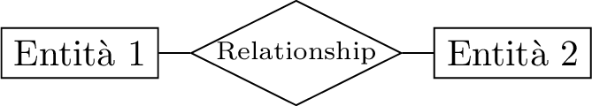</p>
</figure>

Come per le relazioni esiste uno schema ed un’istanza per le entità. Invece di istanza si utilizza il termine occorrenza di un entità per rappresentare un singolo elemento di quella classe, definita dall’entità. Nel modello concettuale si rappresentano le entità, non le singole occorrenze, rappresenta un livello di astrazione. Ogni entità ha un nome che la identifica univocamente nello schema, ha bisogno di nomi espressivi.

Una relationship è un legame logico tra due o più entità, è possible chiamarlo relazione, anche se non coincide con il concetto di relazione nel modello relazionale. Convenzionalmente si utilizza il singolare e sostantivi, non verbi, per identificare le relationship con un nome univoco.

Un’occorrenza di una relationship è una coppia tra un’occorrenza di un’entità ed un’occorrenza di un’altra entità. Ogni relationship ha un insieme di occorrenze, quindi non ci possono essere coppie di entità ripetute sulla stessa relationship. Invece è possibile che le stesse due entità siano connesse da più relationship. Bisogna quindi modellare entità e relationship rispetto alla realtà di interesse per non avere coppie ripetute. Per rappresentare coppie ripetute in un modello ER, si “promuove” la relazione a livello di entità e si collega alle entità precedenti con due nuove relationship.

Il concetto di relationship non è strettamente binario, ma potrebbero esistere relationship n-arie, anche se la maggior parte delle relationship non coinvolge più di tre entità, e già relationship ternarie sono rare. Possono coesistere diverse relationship che coinvolgono le stesse entità. Inoltre possono esistere relationship ricorsive, che coinvolgono più volte la stessa entità, ed in queste viene associato un ruolo ad ognuno di questi due utilizzi dell’entità. Quando si incontrano delle relationship non corrette, generalmente vengono promosse ad entità per rappresentare quella caratteristica della realtà di interesse.

Esiste anche il costrutto di attributo, rappresenta una proprietà elementare di un’entità o di una relationship, di interesse ai fini dell’applicazione. Associa ad ogni occorrenza di un’entità un valore appartenente ad un insieme di dominio. Ma questo non rappresenta lo scopo principale del modello concettuale, quindi è un elemento di secondo livello nella progettazione concettuale.

<figure>
<p> 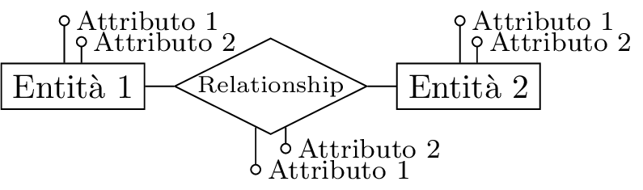</p>
</figure>

Si possono utilizzare attributi composti, definiti come un’insieme di attributi di una stessa entità per rappresentare meglio l’informazione.

<figure>
<p> </p>
</figure>

Altri costrutti per precisare meglio gli schemi concettuali sono la cardinalità, di relationship o entità, una coppia di valori utilizzati per determinare il numero massimo e minimo delle relationship cui ciascuna occorrenza di un’entità può partecipare.

Per semplicità si utilizzano solamente tre simboli: 0, 1 e “N”. Si utilizza 0 ed 1 per la cardinalità minima, con zero si ha una partecipazione opzionale, mentre con 1 si ha una partecipazione obbligatoria. Mentre si usa 1 o N per la massima, con N si indica che non sono presenti limiti superiori al numero di occorrenze.

Rispetto a queste cardinalità massime le relationship possono essere definite:

- Uno a Uno: $(x,1)$-$(x,1)$;

- Uno a Molti: $(x,1)$-$(x,N)$;

- Molti a Molti: $(x, N)$-$(x, N)$.

Se un attributo individua un concetto interessato di cui si vuole rappresentare altre caratteristiche bisogna promuoverlo ad entità, così come altri costrutti del modello ER. Quando un attributo viene promosso ad entità si dice che viene “reificato”, ovvero ci si interessa del concetto individuato dall’attributo.

Le relationship di cardinalità obbligatoria per entrambe le entità sono molto rare. Per le relationship uno a molti esiste un’altra notazione sconsigliata per rappresentare la cardinalità:

<figure>
<p> 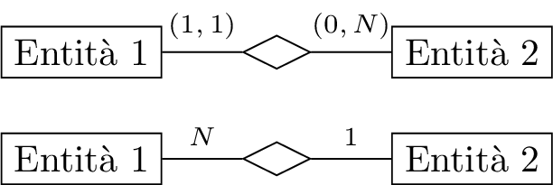</p>
</figure>

Si può inserire la cardinalità anche sugli attributi. Queste rappresentano delle opzionalità, poiché l’informazione potrebbe essere incompleta, oppure per specificare degli attributi multivalore, raramente utilizzati. In questo corso non verranno quasi mai utilizzati attributi multivalore.

<figure>
<p> 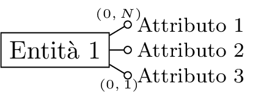</p>
</figure>

Sulle entità si può inserire un identificatore per determinare in maniera univoca le occorrenze dell’entità, può essere costituito da attributo delle entità, identificatore interno, oppure da altre entità tramite relationship, identificatore esterno. Talvolta è necessario utilizzare più di un attributo e si indica come una barra che attraversa tutti gli attributi che sono coinvolti:

<figure>
<p> 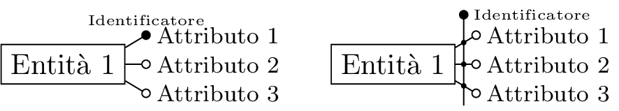</p>
</figure>

A volte non è sufficiente utilizzare un identificatore interno, poiché il concetto dipende da caratteristiche di altri concetti. Un identificatore esterno si rappresenta come un arco che attraversa sia l’attributo interno che la relationship che lega l’entità che permette l’identificazione. Questo è possibile solamente se la relationship a cui è collegato ha una cardinalità minima pari ad uno, inoltre anche la cardinalità massima deve essere pari ad uno per avere una relazione univoca per identificare l’entità:

<figure>
<p> 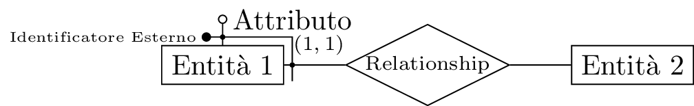</p>
</figure>

È consigliabile utilizzare almeno un identificatore per ogni entità. Possono essere presenti più identificatori su una stessa entità, sia interni che esterni, disgiunti tra di loro. Se sono presenti altri identificatori la cardinalità dell’identificatore esterno può anche essere opzionale e non obbligatoria.

Ci sono casi dove è utile indicare sottoinsiemi di una stessa entità, si utilizza una freccia come notazione grafica, che punta dal sottoinsieme all’entità base. Questo costrutto si chiama generalizzazione, mette in relazione una o più entità, con un entità che le comprende, come casi particolari. Si dice che le entità $E_1,\cdots,E_n$ sono sottotipi o specializzazioni dell’entità $E$. Questo approccio riprende dalla programmazione orientata agli oggetti. Ogni occorrenza dei sottotipi è anche un’occorrenza dell’entità base, tutte le proprietà dell’entità genitore sono valide anche per le entità figlie. Per proprietà si intendono tutti gli attributi e tutte le relazioni.

Talvolta può essere utile distinguere diversi tipi di generalizzazioni. Si dice generalizzazione totale se ogni occorrenza del genitore è occorrenza di almeno una delle entità figlie, altrimenti è parziale:

<figure>
<p> 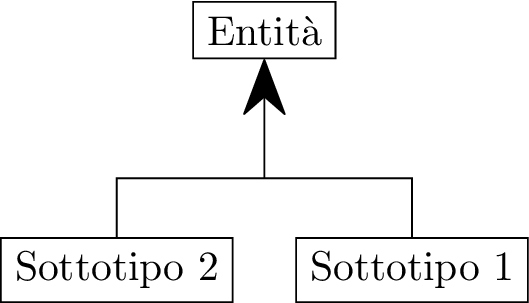</p>
</figure>

Si dice esclusiva se ogni occorrenza del genitore è occorrenza di al più una delle entità figlie, altrimenti si dice sovrapposta:

<figure>
<p> 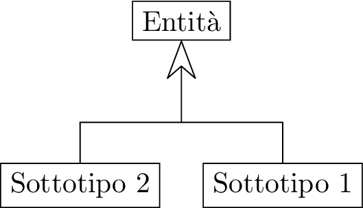</p>
</figure>

Si considerano senza perdita di generalità solo generalizzazioni esclusive e si distingue tra generalizzazioni parziali e totali. Se sono esclusive in termini insiemistici le entità figlie hanno intersezione nulla.

Una generalizzazione può esistere a gerarchie a più livelli, e multiple generalizzazioni allo stesso livello. Una stessa entità può appartenere a più gerarchie come genitore e/o figlia. Una generalizzazione con una singola entità figlia si chiama sottoinsieme.

Per progettare bisogna fornire una documentazione per riuscire ad operare, gestire e manutenere la base di dati. Per definire uno schema ER bisogna fornire un dizionario dei dati, e dei vincoli non esprimibili nello schema, queste sono proprietà non rappresentabili con uno schema ER, ma che appartengono alla realtà di interesse analizzata. Il dizionario dei dati elenca ed anche descrive le proprietà di tutte le entità e relazioni, si riporta il nome, una descrizione testuale, gli attributi e l’identificare. Analogamente alle entità si ha una descrizione delle relazioni, i suoi componenti ed eventuali attributi.

## Progettazione Concettuale

Questa prima fase della progettazione di una base di dati comprende attività interconnesse di acquisizione ed analisi dei requisiti, costruzione dello schema concettuale e costruzione del glossario. Per ottenere le informazioni ed i requisiti si consultano diverse fonti, queste possono essere utenti e committenti della base di dati, attraversi interviste o documentazione apposita. Altrimenti si può consultare la documentazione esistente che siano normative o regolamenti interni, realizzazione preesistenti oppure modulistica e reportistica.

Questa fase di acquisizione ed analisi dei requisiti è difficile, anche difficile da standardizzare e da insegnare. Non è un’operazione che segue passi strettamente tecnici, richiede molta esperienza.

Si effettua una raccolta di dati preliminare. Gli utenti possono fornire informazioni e possono fornire una visione ad alto livello, ma non dettagliata, oppure dettagliata, ma di basso livello, poiché questi utenti possono essere più o meno operativi, avendo a conoscenza dettagliata di un particolare aspetto, ma non una visione d’insieme e viceversa.

Queste interviste portano ad un acquisizione che richiede un ulteriore acquisizione per raffinare i dati ottenuti, quindi è necessario gestire accuratamente quello che si raccoglie da diverse tipologie di utenti. È utile realizzare esempi, ovvero analisi di consuetudine e coerenza, per mettere in evidenza le possibili inconsistenze in ciò che viene descritto e si prova a chiedere al cliente definizioni e classificazioni per disambiguare più concetti, cercando di evidenziare aspetti fondamentali da aspetti marginali. Insieme al cliente si chiede di determinare definizioni e classificazioni, e si prova a determinare aspetti essenziali rispetto a quelli marginali.

Tutto ciò che viene raccolto da queste interrogazioni viene essere inserito in una documentazione descrittiva, scegliendo il giusto livello di astrazione. Standardizzando la struttura delle frasi, suddividendole in frasi semplice. Si separano le frasi sui dati dalle operazioni sui dati. Una volta ottenuti i dati che si vuole gestire ci si preoccupa che i dati siano definiti in maniera corretta.

Vanno organizzati termini e concetti tramite un glossario. Questi rappresentano entità e relazioni nel modello concettuale. Si individuano sinonimi ed omonimi per semplificare ed unificare il linguaggio. Si rende esplicito il riferimento tra i vari termini e si riorganizza tra i concetti.

Per ristruttura in gruppi omogenei la documentazione si individuano frasi di carattere generale, e si cercano di individuare tutte le frasi relative ad uno specifico concetto, e si dividono rispetto a questi concetti.

Sulla base di questo si prova a determinare quale costrutti assegnare in base alle caratteristiche dei concetti. Se hanno proprietà significative e descrive oggetti con esistenza autonoma si rappresentano con entità.

Si strutturano i requisiti in gruppi di frasi omogenee differenziando frasi di carattere generale, cercando tra i requisiti informazioni che si riferiscono allo stesso concetto ed unendole nello stesso gruppo. Si prova quindi a mettere insieme una descrizione per provare ad individuare macro-concetti e proprietà relative. Dopo aver identificato le frasi relative a questi concetti ed averle messe in ordine nei rispettivi gruppi, bisogna definire un modello entità-relationship, realizzando un glossario dei termini per provare a schematizzare questo modello. Per ciascuno di questi si realizza una concisa e precisa descrizione, tenendo conto dei termini usati per identificare il concetto. Si può iniziare ad identificare i collegamenti tra i vari concetti, cominciando a coordinare tra di loro le varie informazioni. Bisogna in seguito determinare quale costrutto del modello ER rispecchia al meglio le specifiche di questi determinati concetti individuati. Si pul rispondere solamente se sono definiti i costrutti e le loro relazioni. Se un costrutto ha proprietà significative e descrive oggetti con esistenza autonoma, viene rappresentato da un’entità. Se è semplice e non ha proprietà è un attributo. Se correla due o più concetti, sarà una relationship. Se un concetto descrive un caso particolare di un altro si rappresenta come generalizzazione.

### Pattern su Schemi Concettuali

A questo punto si comincia a costruire lo schema ER, si può pensare alla presenza di pattern che si ripetono in contesi diversi, soluzioni progettuali a problemi comuni, largamente usati nell’ingegneria software. Permettono di semplificare questo processo, poiché si possono adattare a realtà diverse, se si riesce ad identificare il pattern corretto. Un concetto con un attributo che si rivela essere un’esistenza autonoma può essere reificato realizzando un entità collegata con una relationship a quella di partenza:

<figure>
<p> 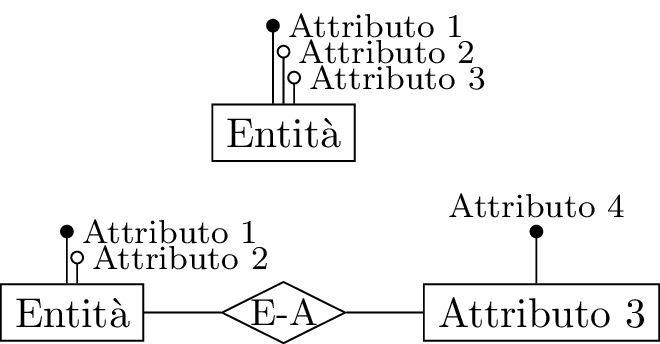</p>
</figure>

Inizialmente senza abbastanza requisiti si può pensare che il concetto non ha proprietà autonome e quindi si realizza come un attributo, mentre in seguito ad ulteriori acquisizioni si considera un’esistenza autonoma quindi si implementa in questo modo, per tenere conto della relazione al concetto di partenza.

Un altro costrutto molto comune è chiamato “part-of”, dove una delle entità è parte dell’altra, la prima entità è composta da più occorrenze della seconda entità:

<figure>
<p> 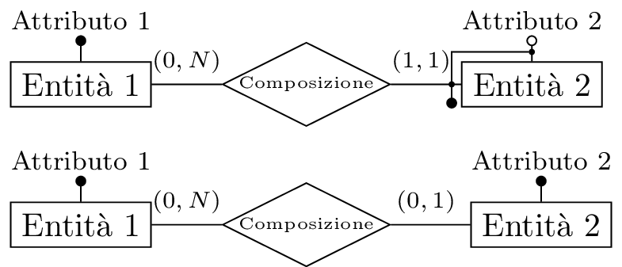</p>
</figure>

La seconda entità può avere un identificatore esterno rappresentato dall’entità di cui è parte, oppure può avere un identificatore interno, e quindi non necessariamente appartenere ad un’occorrenza dell’altra entità, ovvero quando ha un’esistenza autonoma.

L’identificatore esterno ha senso solo se la relazione è obbligatoria, se ha cardinalità $(1,1)$.

Un altro pattern simile si applica quando un concetto astratto viene concretizzato da un altro concetto. Quindi si ha un’entità che rappresenta il concetto astratto ed un altra entità che rappresenta il concetto reale, quest’ultima è un’occorrenza della prima entità. Questo pattern si chiama “istance-of”:

<figure>
<p> 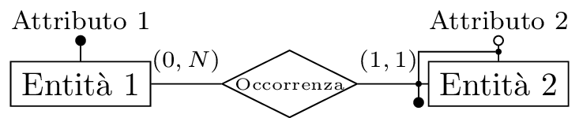</p>
</figure>

In molti casi si comincia ad identificare una relationship binaria, con un certo numeri di attributi, ma è possibile che questa non modelli correttamente la realtà di interesse, poiché è possibile che sia necessaria un’istanza della relationship tra le stesse due occorrenze delle entità, ma con valore di attributi differenti. Questo comporta una reificazione della relationship binaria, in un’entità con un identificatore esterno composto dalle due relazioni alle due entità di partenza, ed all’attributo per cui differiscono. Oppure tramite identificatore interno solamente da un valore univoco inserito, diverso dall’attributo per cui si vogliono differenziare.

<figure>
<p> 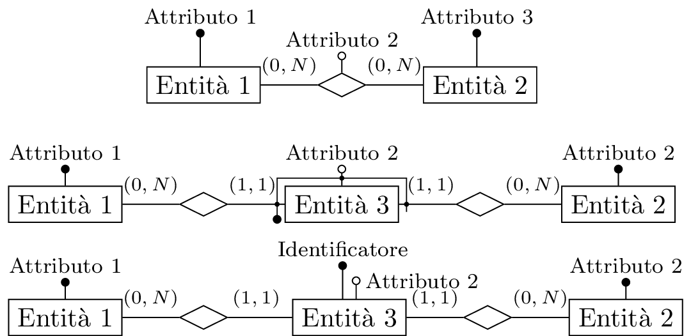</p>
</figure>

Analogamente al caso precedente, se è presente una relationship ricorsiva, non è possibile esistano due istanze della relationship con le stesse due occorrenze dell’entità, questo si può risolvere promuovendo la relationship ad entità ed inserendo due nuove relazioni per i due ruoli che può assumere l’entità di partenza rispetto alla vecchia relationship. La relationship promossa può avere un identificatore esterno oppure interno come nel caso precedente.

<figure>
<p> 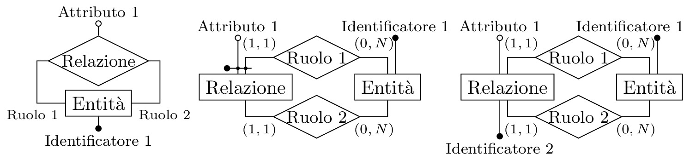</p>
</figure>

Analogamente ad un’entità è possibile reificare un attributo di una relationship, quando per la stessa relazione tra due occorrenze bisogna diversi valori per l’attributo. Si effettua promuovendo la relazione ad un’entità, collegandola all’attributo promosso ad entità tramite un’ulteriore relazione:

<figure>
<p> 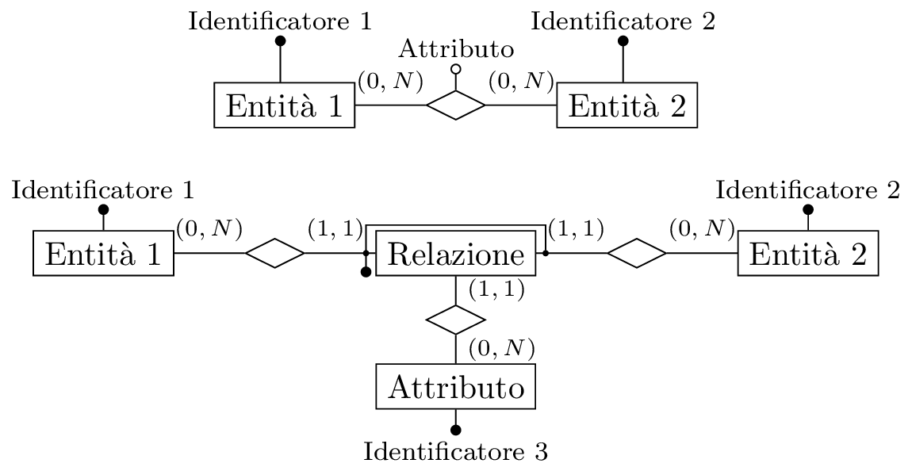</p>
</figure>

Per realizzare un caso particolare di un concetto, si può utilizzare la generalizzazione. La generalizzazione è molto utile per definire la storicizzazione di un concetto, permette di esprimere diverse versioni dello stesso concetto, specificando un campo attributo per le entità storiche la loro data di fine validità:

<figure>
<p> 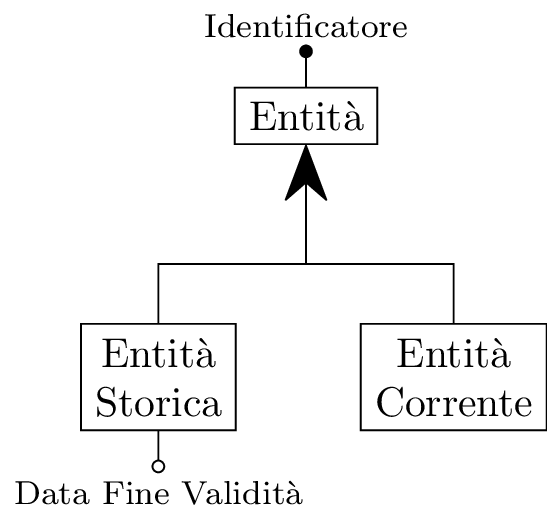</p>
</figure>

Questo può verificarsi anche con due relazioni che rappresentano una un legame corrente, mentre l’altra un legame passato tra le due entità. Per risolvere questo problema con la storicizzazione bisogna prima reificare queste due relazioni ad entità e poi effettuare la generalizzazione. Utilizzare una relazione che tiene conto del legame passato tra queste due entità non è sufficiente poiché è possibile che abbiano avuto un legame più volte in passato, ed una relazione non può rappresentare questo particolare.

<figure>
<p> 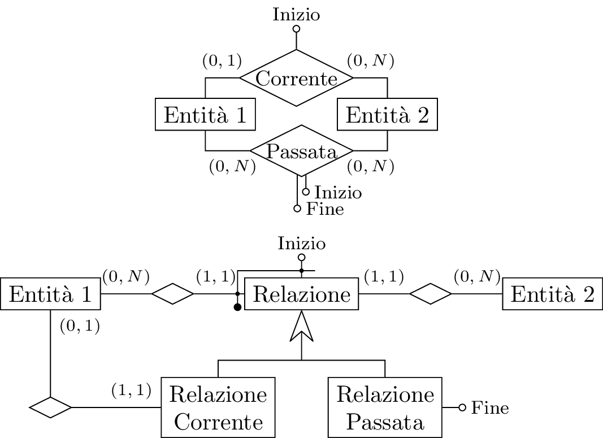</p>
</figure>

Un concetto può evolversi nel tempo e cambiare in modo considerevole da dover essere rappresentato come un concetto a sé. Si può rappresentare come un sottoinsieme del concetto originario, tramite una generalizzazione parziale.

Una relazione ternaria molto probabilmente è un errore del modello, bisogna verificare se la relazione non stia verificando un’entità che ha relazioni con le tre entità della relazione. Oppure se è possibile scomporla in due relazioni tra le tre entità.

<figure>
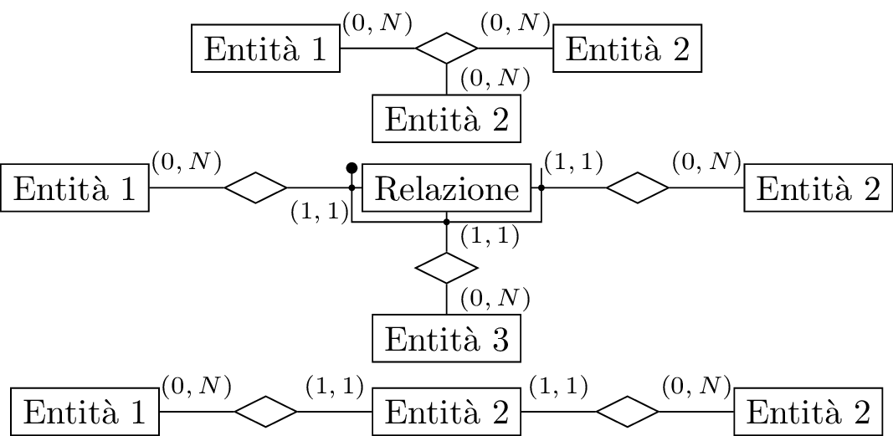
</figure>

### Strategie di Progetto

Avendo a disposizione tutte queste informazioni ottenuto tramite interviste ed approfondimenti, bisogna definire un criterio con il quale si realizza questo schema concettuale. Si possono utilizzare diverse strategie:

- “Top-Down”: dal generale o astratto si espande verso i dettagli;

- “Bottom-Up”: dai dettagli risale per avere una visione d’insieme;

- “Inside-Out”: la strategia più semplice per piccoli progetti. Si comincia dagli elementi centrali per poi espandere verso l’esterno.

Una strategia inside-out è la strategia utilizzata negli esercizi proposti durante il corso. Nella pratica si utilizza una strategia mista, che richiede molta esperienza. Si parte da uno schema scheletro che si decompone, in seguito si raffina e si espande in varie direzioni per espandere tra di loro i veri pezzi. In questo schema scheletro vengono individuati gli elementi pià importanti, definiti dai committenti come concetti cruciali oppure individuati durante le interviste ed ulteriori analisi. Questi sono i concetti più importanti e viene realizzato un semplice schema concettuale con questi elementi generali. Dopo averlo generato si effettuano diversi passi iterativi aggiungendo e raffinando questo schema iniziale sulla base delle specifiche dei concetti, aggiungendoli in caso per descrivere specifiche non rappresentate. Dopo aver generato lo schema bisogna verificarne la qualità ed eventualmente modificarlo. Lo schema deve essere corretto, non ci devono essere elementi paradossali, deve essere completo, in grado di rappresentare tutta la realtà in modo minimale, ovvero con il numero minore di elementi. Inoltre deve essere leggibile poiché è uno strumento di interazione con il committente.

Sono presenti molti requisiti, e può essere utile procedere in maniera procedurale. Si decompongono i requisiti con riferimento nello schema scheletro, ed in seguito integrare i vari sottoschemi realizzati con riferimento a questi diversi requisiti, sempre riferendosi allo schema scheletro, mettendoli in relazione tra di loro. Per ognuno di questi settori bisogna identificare un passo base decomponendo i requisiti e dei successivi passi iterativi per effettuare queste integrazioni.

Spesso dopo aver identificato uno schema scheletro ci si concentra su una sua porzione, identificando a sua volta un ulteriore schema scheletro.

## Progettazione Logica

Dato uno schema concettuale non si hanno informazioni su come questi dati andranno rappresentati in una base di dati, quest’attività viene affidata alla progettazione logica.

L’obiettivo della progettazione logica è tradurre uno schema concettuale in uno schema relazionale in maniera corretta ed efficiente. Molti dei costrutti dello schema E-R sono direttamente associabili ad elementi del modello relazionale. Altri aspetti non hanno una corrispondenza diretta, ma bisogna tenere in considerazione anche le prestazioni.

Gli identificatori rappresentano chiavi nel modello relazionale, dove le entità e le relationship rappresentano le singole relazioni. Ogni entità si può tradurre come una relazione, dove i suoi identificatori sono le chiavi e gli attributi dell’entità corrispondono agli attributi della relazione. Analogamente per una relationship, ma in questo caso la chiave sono le chiavi primarie delle entità che legano. Invece di inserire una relazione per ogni relationship si potrebbe inserire una attributo in una delle relazioni, corrispondenti ad una delle entità della relationship, con un vincolo di integrità referenziale alla chiave dalla relazione corrispondente all’altra entità della relationship. Altrimenti se la cardinalità della relationship non lo permette si deve necessariamente implementare come una relazione, con attributi che legano entrambe le entità della relationship. In questo caso la chiave è costituita dalle chiavi primarie delle entità della relationship, poiché ogni istanza di una relationship deve essere unica. Si realizza in questo modo quando si hanno relationship molti a molti, invece se si hanno relationship uno a molti, non è necessario utilizzare un’ulteriore tabella.

<figure>
<p> 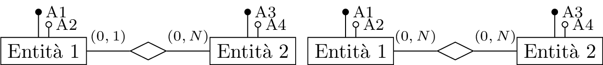 </p>
</figure>

$$\begin{aligned}
    &\begin{matrix}
        E_1(\underline{A_1}, A_2, E_1^*)\\
        E_2(\underline{A_3}, A_4)
    \end{matrix}&\begin{matrix}
        E_1(\underline{A_1}, A_2)\\
        E_2(\underline{A_3}, A_4)\\
        R_1(\underline{E_1}, \underline{E_2})
    \end{matrix}
\end{aligned}$$

Inoltre attributi con una cardinalità massima superiore ad uno si realizzano come relazioni, con un vincolo di integrità referenziale all’entità di appartenenza. Mentre si suppone questi attributi possano ammettere valori nulli, quindi non si hanno problemi sulla cardinalità minima nella traduzione.

<figure>
<p> 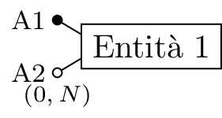</p>
</figure>

$$\begin{gathered}
    E_1(\underline{A_1})\\
    A_2(\underline{A_2}, E_1)
\end{gathered}$$

Nella raccolta dei requisiti potrebbero essere presenti ridondanze nei dati, concettualmente si vogliono poche ripetizioni, ma alcune potrebbero essere utili. Queste ridondanze potrebbero essere caratteristiche direttamente calcolabili dalle relazioni già presenti. Se l’attributo ridondante è poco richiesto, si potrebbe non inserire, mentre se bisogna accedere spesso a questa caratteristica, è conveniente utilizzare un attributo ridondante. Ma in questo modo è necessario aggiornare l’attributo a ogni aggiornamento dei dati su cui si basa su altre relazioni. Se gli aggiornamenti costano meno delle interrogazioni sono convenienti le ridondanze, ma questo suppone di conoscere il carico sulla base di dati. Bisogna conoscere il tipo di operazioni che verranno applicate sulla base di dati, e quindi il modello logico che si vuole utilizzare, in in questo caso il modello relazionale, per stimare il carico effettivo. La progettazione logica si divide in due fasi, dove nella prima conoscendo il carico applicativo si effettua una prima ristrutturazione dello schema concettuale, su questo schema viene effettuata la traduzione descritta precedentemente.

### Ristrutturazione

Si vuole semplificare la traduzione e cominciare a pensare in termini di prestazioni sulla base di dati. Uno schema concettuale ristrutturato non è più uno schema concettuale nel senso stretto del termine, ma questo rappresenta solamente un’osservazione accademica.

Per analizzare le prestazioni si considerano come indicatori lo spazio in memoria, rispetto al numero di occorrenze previste per ciascun costrutto, ed il tempo, in base al numero di occorrenze che vengono visitate durante un’operazione.

Una ridondanza è un’informazione significativa dall’analisi dei requisiti, ma che è calcolabile da altre informazioni già presenti. Si può determinare se questa ridondanza è utile o meno, se sono note le operazioni che verranno svolte su questi dati. Le ridondanze semplificano le interrogazioni, ma complicano gli aggiornamenti. Si appesantisce la base di dati con una maggiore occupazione di spazio, trascurabile in quest’analisi, ma soprattutto si rendono più pesanti gli aggiornamenti.

Ridondanze possono essere attributi di una stessa entità o più entità, ma ci possono essere ridondanze anche nelle relationship. Queste ultime possono essere dovute a cicli presenti nello schema concettuale.

<figure>
<p> 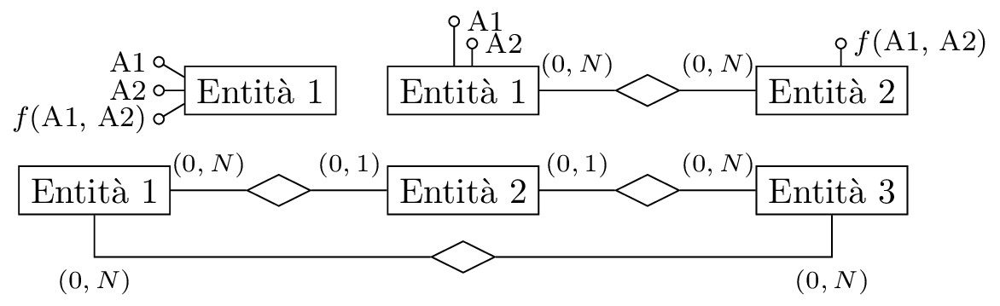</p>
</figure>

Per ogni operazione $i$-esima si considera il suo costo $c_i$ e la sua frequenza $f_i$, il costo di un’operazione $c_i$ dipende dalla media del numero di letture o scritture effettuate. Per calcolare il costo complessivo si moltiplica la frequenza di una singola operazione per il costo di quell’operazione, per ognuna delle singole operazioni previste: $$C=\displaystyle\sum_{i=1}^nc_i\cdot f_i$$ Quindi bisogna fornire la frequenza $f_i$ delle operazioni che si applicano alla base di dati, per la sua progettazione. Considerando queste operazioni ed il suo carico in memoria ed in frequenza si realizzano relazioni diverse, mantenendo o eliminando ridondanze. Confrontando uno schema senza ridondanza con uno con ridondanza, se il costo complessivo senza ridondanza è minore, allora è conveniente mantenerla, altrimenti bisogna eliminarla.

Nel caso in cui ci siano delle generalizzazioni, non sono presenti costrutti che le traducono direttamente in un modello relazionale.

<figure>
<p> 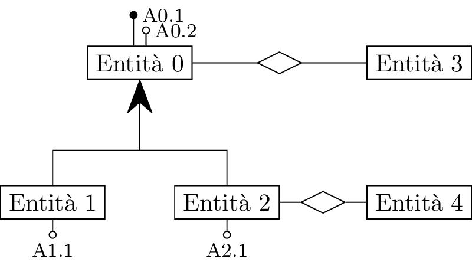</p>
</figure>

Intuitivamente si può decidere di aggregare ciò che viene acceduto insieme e separare ciò che viene acceduto separatamente. In un modello ER ristrutturato vengono eliminate le generalizzazioni sostituendole in entità e relationship. Si può effettuare in tre modi diversi. Si potrebbero accorpare le entità figlie nell’entità genitore poiché si suppone che vengano accedute insieme. Accorpando le entità in questo modo se sono presenti attributi specifici per un certo tipo bisogna indicarli come opzionali con una cardinalità $(0,1)$, ed un ulteriore attributo che specifica il tipo dell’entità

<figure>
<p> 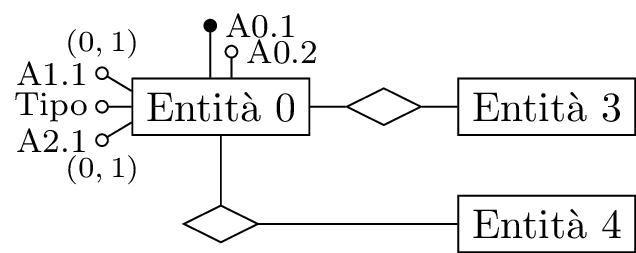</p>
</figure>

Si potrebbe alternativamente accorpare l’entità genitore nelle entità figlie, introducendo una ridondanza, poiché entrambe le entità figlie hanno gli stessi attributi dell’entità genitore.

<figure>
<p> 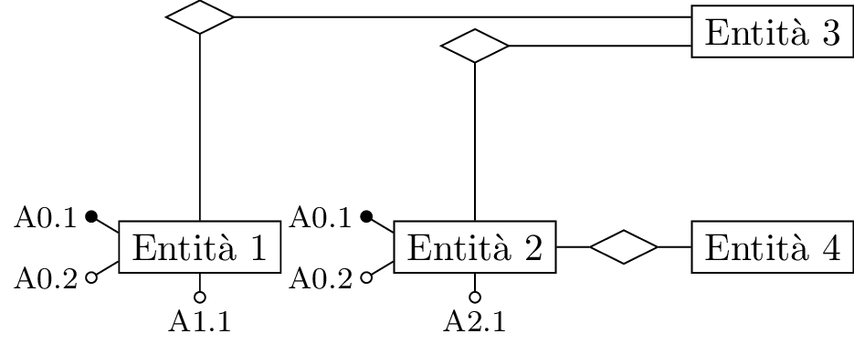</p>
</figure>

Alternativamente si potrebbe sostituire la generalizzazione con delle relationship, aventi un’identificatore esterno nelle entità figlie.

<figure>
<p> 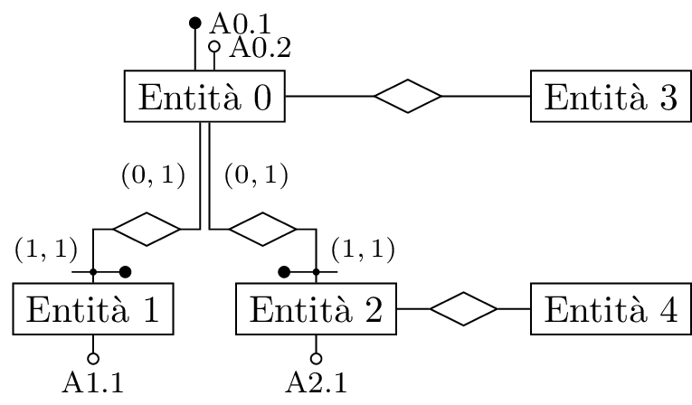</p>
</figure>

La scelta su quale di questi metodi utilizzare può essere effettuata in base a delle semplice condizioni. Se gli accessi all’entità genitore ed alle figlie sono contestuali allora si preferisce il primo metodo. Se gli accessi alle entità figlie sono separati l’uno dall’altro allora è conveniente il secondo metodo. Se gli accessi alle entità figlie sono separati dagli accessi all’entità genitore allora conviene il terzo metodo. Si possono utilizzare soluzioni ibride a seguito di considerazioni di carico, comuni in gerarchie a più livelli.

Durante la ristrutturazione si possono partizionare o accorpare entità o relationship in seguito a medesime esigenze di prestazioni. Potrebbe essere conveniente un partizionamento verticale se un’entità ha molti attributi eterogenei, separando concetti che vengono acceduti separatamente.

<figure>
<p> </p>
</figure>

Si possono accorpare entità o relationship raggruppando attributi di concetti diversi acceduti insieme.

<figure>
<p> 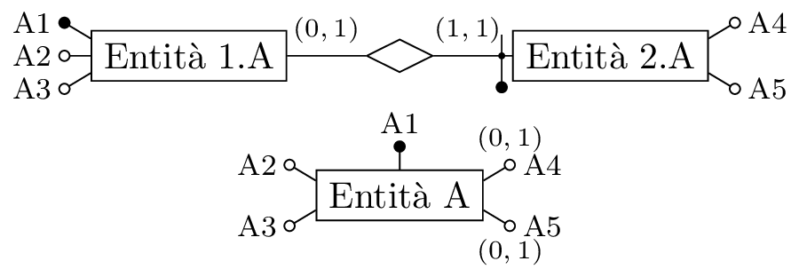</p>
</figure>

Si eliminano attributi multivalore, introducendo nuove entità o relationship.

<figure>
<p> </p>
</figure>

Oppure si partizionano relationship con attributi opzionali.

<figure>
<p> 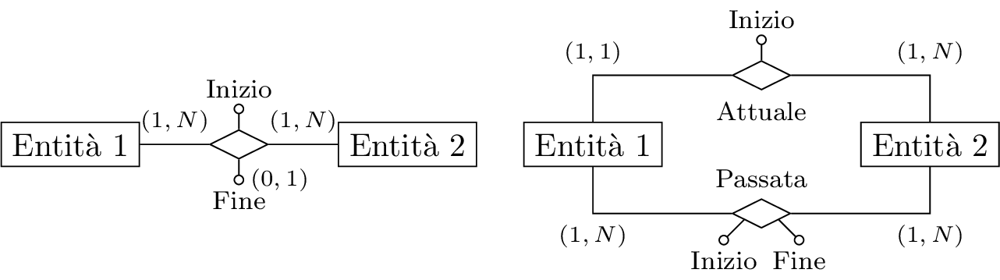</p>
</figure>

Un altro aspetto fondamentale per mantenere la consistenza tra i dati è la scelta degli identificatori principali, operazione necessaria per tradurre nel modello relazionale. Questi devono essere semplici, obbligatori, ed utilizzati nelle operazioni principali. Se non sono presenti identificatori che rispettano questi requisiti è meglio introdurre dei codici, identificatori surrogati, appositi per questo scopo.

### Traduzione

La traduzione rappresenta le tecniche descritte ad inizio sezione. Nella traduzione ogni entità diventa una relazione sugli stessi attributi e le relationship diventano relazioni sugli identificatori delle entità coinvolte, con i relativi vincoli di integrità referenziale.

Come convenzione, sui nomi degli attributi della relazione create da una relationship si utilizzano i nomi delle entità di partenza. Ogni azienda ha le sue convenzioni per definire nomi diversi per gli attributi.

La traduzione non riesce a tener conto delle cardinalità minime, si dovrebbero aggiungere ulteriori vincoli, tramite `CHECK`, non sono molto usati, ma è possibile realizzarli in modo molto preciso e rigoroso. Possono esistere relationship ricorsive, dove la relationship viene tradotta in una relazione, con due nomi diversi per entrambe le ricorrenze della stessa relazione. Se la cardinalità minima è zero, l’attributo deve ammettere valori nulli. Se la cardinalità massima della relationship è uno, si può evitare di realizzare un’ulteriore tabella, come mostrato in . Relationship uno ad uno tra due entità si implementano da due sole relazioni, fondendo la relationship ad una o l’altra relazione relativa all’entità, con vincoli di integrità referenziale con valori nulli ammessi o meno in base alla cardinalità minima. Si può inserire questo legame in entrambe le relazioni anche se rappresenta una ridondanza.

Se l’identificatore esterno è anche la relationship, si inserisce come attributo nella relazione l’identificatore delle entità legate dalla relationship.

<figure>
<p> 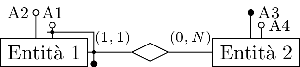</p>
</figure>

$$\begin{gathered}
    E_1(\underline{A_1}, \underline{E_2}(A_3), A_2)\\
    E_2(\underline{A_3}, A_4)
\end{gathered}$$

## Normalizzazione

È possibile definire forme normali per basi di dati relazionali per garantire qualità, o meglio garantiscono l’assenza di certi difetti. Potrebbe essere necessario utilizzare tabelle molto grandi e quindi si utilizzano strumenti di calcolo come fogli Excel. Anche su questi strumenti di calcolo si può incorrere in problemi come per ogni basi di dati. Alcuni tipi di anomalie sono la ridondanza di informazioni, tra varie ennuple che si riferiscono allo stesso concetto. Quando bisogna aggiornare questo attributo su una ennupla, è necessario quindi aggiornare il suo valore in tutte le ennuple in cui compare, poiché è ridondante. Una modifica atomica viene quindi realizzata in più modifiche. Quando si elimina un’ennupla, bisogna esprimere il valore della chiave altrimenti non sarebbe possibile inserirlo, e se si elimina uno di questi valori non è più possibile rappresentare l’ennupla, e quindi non si può descrivere una parte della realtà di interesse. Analogamente non si può inserire un’ennupla senza conoscere i valori delle sue chiavi.

Problemi di questo tipo si generano quando si rappresentano concetti di diverso tipo in una stessa relazione. Le forme normali consentono la separazione dei vari concetti su relazioni diverse. La presenza di problemi deve essere formalizzata.

Data una relazione $r$ su $R(X)$, dove si ha $Y,Z\subseteq X$, si definisce il vincolo di dipendenza funzionale $Y\to Z$ se è soddisfatta per ogni coppia di ennuple $t_1$ e $t_2$ in $r$ tali che se $t_1[Y]=t_2[Y]$ allora sono uguali anche su $Z$: $t_1[Z]=t_2[Z]$. Una dipendenza funzionale è sempre soddisfatta su una chiave poiché i valori sono sempre diversi tra di loro.

In una relazione alcune di queste dipendenze funzionali potrebbero creare problemi, le anomalie su chiavi non generano problemi nella relazione, poiché si possono ripetere una singola volta, poiché appunto sono chiavi. In questo corso si considerano solo relazioni in forma normale di Boyce e Codd, BCNF, ovvero relazioni dove non si verificano anomalie descritte precedentemente, ovvero quando tutte le dipendenze, FD, sono legate alle chiavi.

Per ogni chiave si può pensare che nella relazione c’è una dipendenza funzionale tra la chiave e tutti gli attributi, in alcuni casi per “transitività”. È sufficiente considerare dipendenze non “banali”, dove gli insiemi $Y$ e $Z$ sono disgiunti tra di loro. Si può definire formalmente la forma normale di Boyce e Codd se per ogni dipendenza funzionale non banale $X\to Y$, definita su $r$, l’insieme $X$ contiene una chiave $K$ di $r$.

Ma su relazioni molto grandi non è semplice individuare chiavi o superchiavi della relazione. Questo si può effettuare in due modi, con una verifica o con una ricerca.

Nella verifica si considera un insieme $Y$, e si individua quali attributi dipendono da questo insieme, ovvero su quali attributi le due ennuple hanno gli stessi valori, se hanno gli stessi valori su $Y$.

La ricerca delle chiavi non è sempre semplice, su relazioni complesse algoritmi di ricerca di chiavi si possono dimostrare avere una complessità esponenziale. Normalmente per la ricerca delle chiavi conviene procedere con l’intuizione, sull’ordine degli attributi, oppure da “suggerimenti” che vengono da una comprensione del dominio applicativo.

Per rendere una relazione in forma normale si può sperare sulla base delle forme normali, effettuando una decomposizione per ogni dipendenza funzionale, non banale. Il processo che permette di trasformare schemi relazioni, che presentano certe anomalie, in forme normali si chiama normalizzazione. Queste non rappresenta una metodologia di progettazione, ma come una tecnica di verifica dei risultati di progettazione. Poiché fornisce una chiave di interpretazione delle scelte nella definizione di uno schema concettuale ed anche nella traduzione. Un modo semplice per normalizzare una relazione si tratta di introdurre una nuova relazione per ogni dipendenza funzionale. Più precisamente si può realizzare una nuova relazione per ogni dipendenza funzionale con lo stesso primo membro.

Si conviene partire dalla relazione data ed effettuare operazioni di decomposizione, più complessa di un processo di sintesi di nuove relazioni. Una procedura intuitiva è valida solo in casi semplici, dove per ogni dipendenza $X\to Y$, che viola la BCNF, si definisce una relazione $XY$, e si elimina il secondo membro dalla relazione originaria. Si procede iterativamente su ogni nuova relazione creata fino ad ottenere un insieme di relazioni in forma normale, equivalente alla relazione originaria.

Si considera la relazione con le dipendenze funzionali seguenti:

- $R$(Codice Corso, Anno, Titolo, Crediti, Docente, Nome Docente, Semestre, Dipartimento, Indirizzo);

- Codice Corso $\to$ Titolo, Crediti, Dipartimento;

- Codice Corso, Anno $\to$ Docente, Semestre;

- Docente $\to$ Nome Docente;

- Dipartimento $\to$ Indirizzo.

Se si adottasse la tecnica precedente su questa relazione, si creerebbe una relazione dove si perde il legame fra gli attributi Dipartimento ed Indirizzo, di interesse. Infatti l’attributo Dipartimento viene rimosso dalla relazione originaria e non è più possibile utilizzarlo in altre relazioni aggiuntive. Le relazioni ottenute da questa decomposizione dipendono quindi dall’ordine in cui vengono scomposte dalla relazione originaria. Si può rappresentare tramite uno schema ad albero:

<figure>
<p> 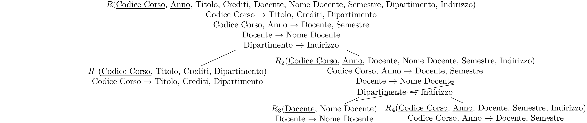</p>
</figure>

Si considera una procedura dove per ogni dipendenza $X\to Y$ che viola la BCNF si genera una relazione $XZ$ dove $Z$ è l’insieme degli attributi che dipendono da $X$, eventualmente per transitività, e si eliminano dalla relazione originaria. Anche il concetto di transitività andrebbe a sua volte definito formalmente, ma in molti casi è intuitivo.

Si decompone la relazione originaria secondo le dipendenze funzionali e si generano quindi le seguenti relazioni:

- $R_1$( <u></u> , Titolo, Crediti, Dipartimento);

- $R_2$( <u></u> , <u></u> , Docente, Semestre);

- $R_3$( <u></u> , Nome Docente);

- $R_4$( <u></u> , Indirizzo).

Si possono rappresentare secondo il seguente schema concettuale:

<figure>
<p> 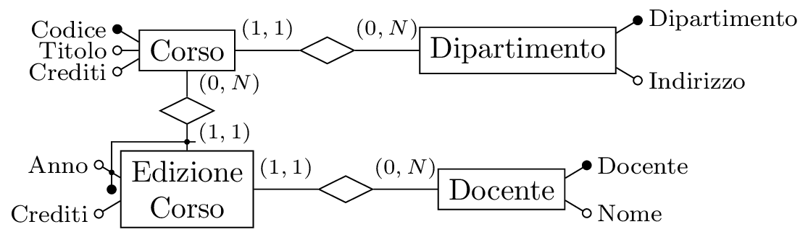</p>
</figure>

Ma questa procedura non conserva le dipendenze, quindi non è una procedura perfetta ed in alcuni casi non funziona. La normalizzatone non funziona sempre. Una decomposizione in BCNF, senza perdita e che conserva le dipendenze non è sempre realizzabile. Ci sono realtà difficili da modellare. Per questo la normalizzazione è uno strumento di verifica e non di progettazione.

Una condizione sufficiente per la decomposizione senza perdita è che gli attributi comuni nelle decomposizione sono chiave per almeno una delle proiezioni. Questa è solo una condizione sufficiente, non necessaria. La seconda condizione sufficiente impone che le componenti delle ennuple siano indipendenti tra di loro.

L’uso della normalizzazione è quindi come strumento di verifica degli schemi prodotti, o come criterio di progettazione da cui si può derivare lo schema logico.

Si possono effettuare analisi analoghe su schemi ER, date entità con attributi eterogenei, allo stesso modo di una relazione con molto attribuiti, è possibile identificare questi attributi come una violazione della normalizzazione delle entità. Quindi si possono identificare dipendenze funzionale tra gli attributi di una stessa entità e reificare questi attributi normalizzando l’entità considerata:

<figure>
<p> 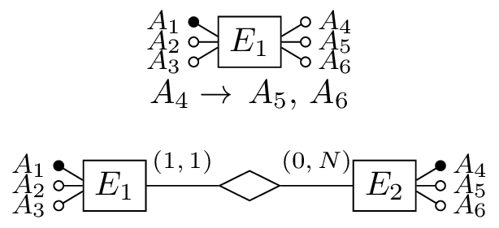</p>
</figure>

Si può effettuare un’analisi di normalizzazione su relationship non binarie, in modo da rappresentarla tramite entità e relationship binarie, ma questo caso è più complesso rispetto a quello descritto precedente.

<figure>
<p> 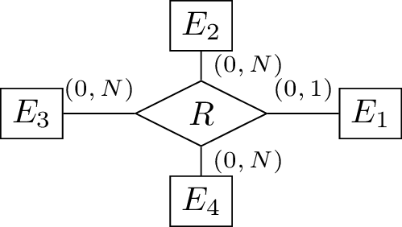</p>
</figure>

$$R(E_1,\,E_2,\,E_3,\,E_4)%$$

Si possono analizzare le dipendenze funzionali della relationship come se fosse una relazione. Partendo dalla realtà di interesse si possono determinare delle ipotesi per verificare la validità delle dipendenze funzionali individuate. Inoltre bisogna individuare la chiave associata alla relationship, per determinare se viola la forma normale BCNF. Intuitivamente la “chiave” di una relationship corrisponde alle entità presenti connesse con con una cardinalità massima pari ad uno: $$R(\text{%
    \uline{\phantom{$E_1$}}%
    \llap{\contour{white}{$E_1$}}%
},\,E_2,\,E_3,\,E_4)$$ Si considerano le seguenti dipendenze funzionali:

- $E_1\to\,E_4$

- $E_1\to\,E_2$

- $E_2\to\,E_3$

Ragionando solo sulla normalizzazione si potrebbe arrivare a relationship non binarie, che rispettano tuttavia la forma normale:

- $R_1(\text{%
      \uline{\phantom{$E_1$}}%
      \llap{\contour{white}{$E_1$}}%
  },\,E_2,\,E_4)$: $E_1\to\,E_2$, $E_1\to\,E_4$

- $R_2(\text{%
      \uline{\phantom{$E_2$}}%
      \llap{\contour{white}{$E_2$}}%
  },\,E_3)$: $E_2\to\,E_3$

<figure>
<p> 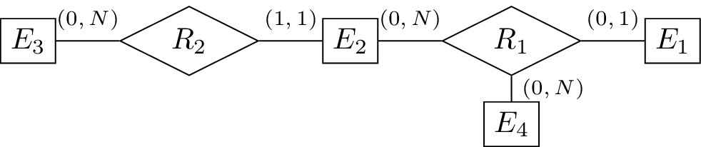</p>
</figure>

Questa rappresentazione di più dipendenze funzionali tra una chiave e diversi concetti non viola la BCNF, ma non è corretta dal punto di vista di uno schema ER. Bisogna quindi effettuare ulteriori analisi, non solo sugli aspetti formali della normalizzazione, ma osservando la realtà di interesse per determinare come rappresentare eventuali relationship a più di due entità. Queste entità si possono dividere poiché rappresentano informazioni eterogenee su una stessa relationship. Questo è indifferente nella BCNF, poiché le due dipendenze funzionali espresse nelle due forme $E_1\to\,E_2,\,E_4$ ed $E_1\to\,E_2$, $E_1\to\,E_4$, sono tra di loro equivalenti. Se tutte le cardinalità della relationship fossero obbligatorie, allora viene mantenuto il legame di tutte le dipendenze funzionali. Ma se anche una non è obbligatoria, allora è possibile che questa relationship non mantenga il legame tra due entità in dipendenza funzionale.

Le due entità e quindi le due proprietà rappresentate sono differenti, e quindi la relationship $R_1$ rappresenta due concetti diversi insieme. Questo non è ammesso in uno schema concettuale corretto. Quindi bisogna rappresentarlo come dei legami diversi attraverso relationship diverse:

- $R_1(\text{%
      \uline{\phantom{$E_1$}}%
      \llap{\contour{white}{$E_1$}}%
  },\,E_2)$: $E_1\to\,E_2$

- $R_2(\text{%
      \uline{\phantom{$E_2$}}%
      \llap{\contour{white}{$E_2$}}%
  },\,E_3)$: $E_2\to\,E_3$

- $R_3(\text{%
      \uline{\phantom{$E_1$}}%
      \llap{\contour{white}{$E_1$}}%
  },\,E_4)$: $E_1\to\,E_4$

Questa ulteriore decomposizione è senza perdita, poiché conserva tutti i legami considerati inizialmente.

<figure>
<p> 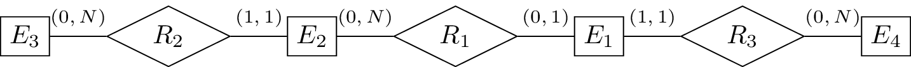</p>
</figure>

Ci possono essere decomposizioni suggerite da motivazioni diverse rispetto alla forma normale, ma comunque corrette, poiché sono decomposizioni senza perdita. Questo caso considerava una relationship con una cardinalità pari ad uno con una entità. Invece può esistere una realtà dove una relationship ha cardinalità molti a molti con più di due entità:

<figure>
<p> 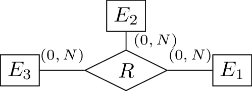</p>
</figure>

Quindi in questi casi la decomposizione non avviene mediante la chiave della relationship, ma analizzando la realtà di interesse ed individuando legami più adatti per descrivere la realtà. Spesso si possono decomporre relationship non binarie molti a molti rappresentando solamente i legami diretti fra i concetti, poiché appartengono a diverse relationship indipendenti:

<figure>
<p> 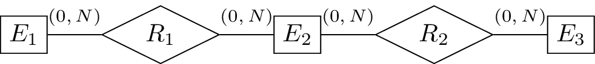</p>
</figure>

Poiché sono indipendenti è possibile ricostruire la relazione originaria data questa decomposizione, quindi rappresenta una scomposizione senza perdita.
